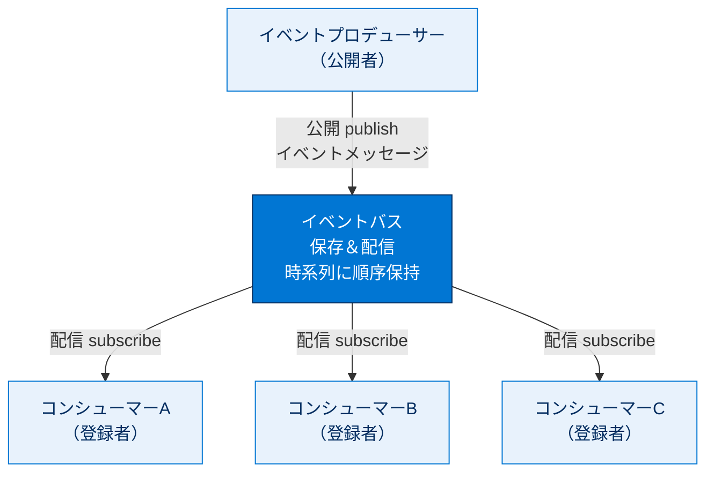
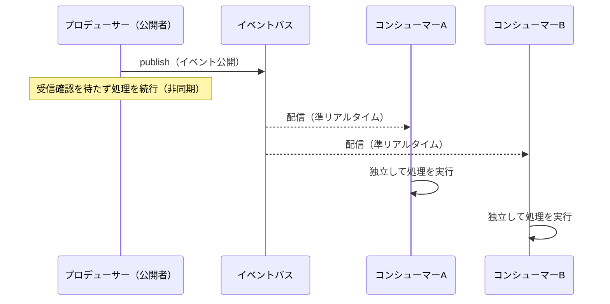
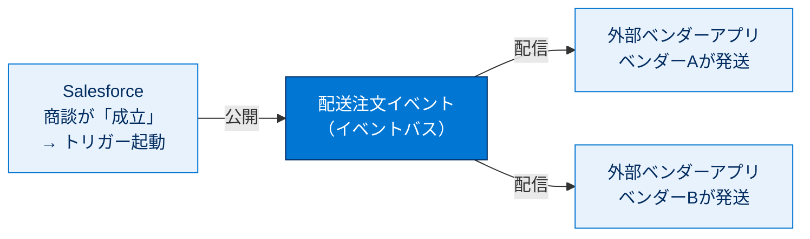
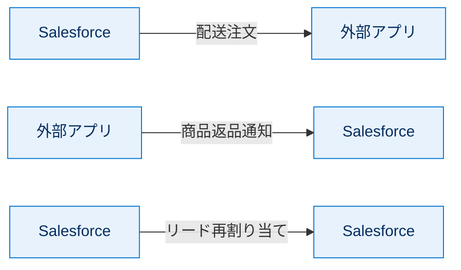
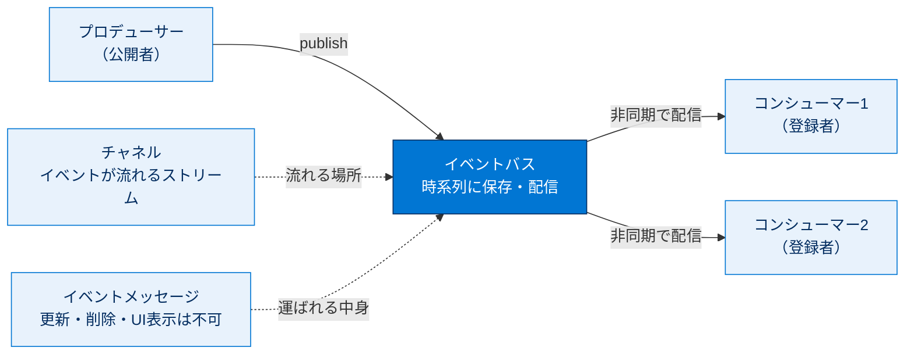

# イベント駆動型ソフトウェアアーキテクチャの理解

## 学習の目的

この単元を完了すると、次のことができるようになります。

- イベント駆動型ソフトウェアアーキテクチャのコンポーネントを挙げる。
- イベント駆動型ソフトウェアアーキテクチャの利点を説明する。
- プラットフォームイベント機能のユースケースを説明する。
- プラットフォームイベントの特徴を説明する。

> [!ポイント] この単元のゴール
>
> 「**システム同士を疎結合でつなぎ、状態変化（イベント）をリアルタイムに伝える仕組み**」がイベント駆動型アーキテクチャ。その Salesforce 実装が **プラットフォームイベント** です。登場人物（プロデューサー・コンシューマー・チャネル・バス）の役割と、「公開者と登録者が互いに依存しない（疎結合）」という最大の利点を押さえればテストは突破できます。

---

## このモジュールを始める前に

このモジュールでは、Apex・REST API・フロー・プロセスでプラットフォームイベントを公開し、Apex トリガーで登録する方法を説明します。これらのうち**少なくとも 1 つに精通**している必要があり、ハンズオン Challenge には **Apex トリガーの知識が必須**です。

- Apex の基礎が必要なら「Apex コーディングスキルの構築」トレイル。
- すでに詳しいなら「Apex の基本とデータベース」「Apex トリガー」「Apex テスト」モジュール。
- Pub/Sub API の概念は必須ではないが、理解の助けになります。

> [!用語] プラットフォームイベント（Platform Event）
>
> Salesforce が提供する**カスタムイベントメッセージ**の仕組み。システム内外の「状態変化」を、決まった形式（スキーマ）のメッセージとして送受信する。カスタムオブジェクトに似た方法で定義し、Apex・フロー・REST API・Pub/Sub API から公開・登録できます。

> [!用語] Apex トリガー（Apex Trigger）
>
> レコードの作成・更新・削除など特定の操作で**自動実行される Apex コード**。プラットフォームイベントでは、メッセージ受信時に `after insert` トリガーが起動し、登録（受信処理）を担います。

---

## イベント駆動型ソフトウェアアーキテクチャの理解

Salesforce のエンタープライズメッセージングプラットフォームでは、安全で拡張性の高いカスタム通知を Salesforce 内と外部ソースから配信できます。プラットフォームイベントは、システムの変更を監視して他のシステムに伝達します。

イベントベース通信は、**公開者-登録者モデル**（送信者がブロードキャストし、1 人以上の受信者が取得する）を中心に進化してきました。送信塔が相手を限定せず電波を送信し、周波数を合わせた聴取者が受信するラジオ放送に似ています。

> [!用語] 公開者-登録者モデル（Pub/Sub：Publish-Subscribe Model）
>
> 公開者がメッセージを「放送」し、登録者がそれを「受信」する通信モデル。送信側は「誰が受信するか」を、受信側は「誰が送ったか」を意識しない。この**お互いを意識しない関係**がイベント駆動型の核心です。

イベントは、受信者がリスンしているかに関係なく**非同期に**送信され、受信者は受信確認をしません。通信は**準リアルタイム**（多少の遅延あり）で行われます。プラットフォームイベントの通信には、変更データキャプチャ（登録者のみで成立）と異なり、**送信者と受信者の 2 つの関係者**がいます。

> [!用語] 同期・非同期（Synchronous / Asynchronous）
>
> **同期**は「相手の応答を待ってから次に進む」処理（電話）。**非同期**は「送ったら応答を待たず次に進む」処理（手紙・メール）。プラットフォームイベントは非同期で、公開した側は登録者の処理完了を待ちません。

---

## イベント駆動型システムのコンポーネント

| コンポーネント | 役割 | 例 |
| --- | --- | --- |
| **イベント（Event）** | ビジネスプロセスにおいて意味のある状態の変化 | 発注が行われた |
| **イベントメッセージ** | イベントに関するデータを含むメッセージ（イベント通知とも） | 注文情報を含む発注通知 |
| **イベントプロデューサー** | イベントメッセージの公開者 | 発注アプリケーション |
| **イベントチャネル** | イベントが流れるストリーム。プロデューサーが送信、コンシューマーが読込 | Cloud_News__e のチャネル |
| **イベントコンシューマー** | チャネルの登録者。チャネルからメッセージを受信する | 注文履行アプリケーション |
| **イベントバス** | イベントを保存・配信するマルチテナント／マルチクラウドのサービス | Salesforce のイベントバス |

> [!用語] 主要コンポーネントの覚え方
>
> - **プロデューサー＝作って送る側**（公開者）。**コンシューマー＝受け取って消費する側**（登録者）。
> - **チャネル**＝イベントが流れるストリーム。1 つのイベント用か、複数をまとめた**カスタムチャネル**。
> - **イベントバス**＝公開-登録モデルに基づくイベントストレージ／配信サービス。時系列イベントログにより、受信順に保存・配信され、保持期間内ならいつでも取得できる。

次の図は、イベントベースのソフトウェアアーキテクチャを示します。

公開と配信の時間的なやり取りを順に追うと次のようになります。送信側は配信完了を待たず、複数の登録者が同じイベントに独立して反応します。

要求-応答モデルと異なり、イベント駆動型は**プロデューサーをコンシューマーから分離（疎結合）**します。状態を取得するためにサーバーへ要求する必要はなく、システムはチャネルに登録し、新しい状態が発生するたびに通知を受け取ります。コンシューマーは何人でも同じイベントを受信して反応でき、送信側と受信側はメッセージ内容のセマンティック以外に連動関係を持ちません。

> [!用語] 要求-応答モデル／疎結合
>
> **要求-応答モデル**：クライアントが要求を送り、サーバーが応答を返す従来型の通信。応答が返るまで待ち、相手のアドレスを知る必要があり、**送信側と受信側が密結合**。
> **疎結合（Loose Coupling）**：システム同士の依存が弱く、片方を変更しても他方に影響しにくい状態。プロデューサーは登録者を、登録者はプロデューサーの実装を知らないため、追加・変更・拡張が容易になります。

プラットフォームイベントにより、変更の伝達・応答プロセスが簡略化され、複雑なロジックが不要になります。1 人以上の登録者が同じイベントをリスンしてアクションを実行できます。

> [!例] Cloud News 通信社のたとえ
>
> 通信社 Cloud News が、登録クライアントに「目的地付近の交通・道路状況のニュース速報」イベントを送信します。内容にはニュース記事だけでなく、**緊急かどうか**や**事故の場所**などの詳細も含まれ、登録者は緊急度に応じてアクションを判断できます。「Cloud News」はこのモジュール全体で使うサンプルです。

---

## プラットフォームイベントを使用するケースの例

プラットフォームイベントの用途は通信社に限りません。次のシナリオでは、Salesforce と外部システムがイベントメッセージ経由で通信します。

> [!例] 3 つの代表的なシナリオ
>
> 1. Salesforce のアプリが、**外部の注文履行アプリ**に商品配送注文の通知を送る（Salesforce → 外部）。
> 2. **外部商品アプリ**が、Salesforce に商品返品の通知を送る（外部 → Salesforce）。
> 3. **Salesforce 内**でトリガーを使ってイベントをやり取りする（Salesforce → Salesforce）。

### プラットフォームから外部アプリへ：ベンダーの注文履行

商談が「成立」すると、商品注文アプリのトリガーが起動してイベントを公開します。各ベンダーアプリがイベントを受信し、自社が担う商品の発送を作成します。

### 外部アプリからプラットフォームへ：商品返品処理

外部システムが返品要求イベントを公開し、Salesforce の**イベントリスナー（トリガー）**が受信してアクションを実行します（営業担当への通知、顧客への確認メール送信など）。

### プラットフォームからプラットフォームへ：リードの再割り当て

リードが割り当てられるとトリガーが起動し、関連する進行中の商談・ケースを確認してイベントを公開します。受信したアプリがリードを再割り当てし、Chatter 投稿を作成します。同じ処理は Flow Builder でも可能ですが、イベントを使うと**イベントベースのプログラミングモデル**と標準的な連携方法の利点が得られます。

次の図は、通信の向きで整理した 3 つのユースケースパターンです。

> [!ポイント] ユースケースの方向で整理する
>
> プラットフォームイベントは通信の向きで 3 パターンに整理できます。
>
> - **Salesforce → 外部**（例：ベンダーへの配送注文）
> - **外部 → Salesforce**（例：商品返品通知）
> - **Salesforce → Salesforce**（例：リード再割り当て）
>
> いずれも目的は「**システムを疎結合でつなぐ**」こと。試験では「フローでも実現できるが、システム間連携・標準化の利点でイベントを選ぶ」判断が問われます。

---

## プラットフォームイベントの特徴

プラットフォームイベントはカスタムオブジェクトと同様、Salesforce で定義します。名前を付け、カスタム項目を追加して定義を作成します。次は Cloud News のニュースイベントのカスタム項目定義です。

| 項目の表示ラベル／名前 | 項目 API 参照名 | データ型 | 補足 |
| --- | --- | --- | --- |
| 場所 | `Location__c` | テキスト | 長さ：100 |
| 緊急 | `Urgent__c` | チェックボックス | ― |
| News Content | `News_Content__c` | テキストエリア（ロング） | ― |

> [!用語] API 参照名と `__c`／`__e` サフィックス
>
> カスタム項目の API 参照名は末尾に `__c`（custom）が付き、コードや API からはこの名前で参照します。後の単元の `__e` はイベント本体（**e**vent）の API 参照名サフィックスです。

### プラットフォームイベントと Salesforce オブジェクト

プラットフォームイベントは特殊な Salesforce エンティティで、多くの点でオブジェクトに似ています。**イベントメッセージはプラットフォームイベントのインスタンス**で、レコードがオブジェクトのインスタンスであるのと同様です。ただしレコードと違い、**更新・削除・UI 表示はできません**。参照および作成権限はプロファイルまたは権限セットで付与できます。

| 比較項目 | オブジェクトのレコード | イベントメッセージ |
| --- | --- | --- |
| 定義方法 | オブジェクト＋カスタム項目 | プラットフォームイベント＋カスタム項目 |
| インスタンス | レコード | イベントメッセージ |
| 参照・作成 | 可能 | 可能 |
| **更新・削除** | 可能 | **不可** |
| **UI での表示** | 可能 | **不可** |
| クエリ（SOQL/SOSL） | 可能 | 不可 |

> [!ポイント] イベントメッセージの特徴（頻出）
>
> 「**Salesforce オブジェクトレコードに似ているが、UI で表示できず、編集も削除もできない**」――この一文がテストでそのまま問われます。作成（公開）はできるが、後から変更・削除はできない、と覚えましょう。

> [!用語] sObject（エスオブジェクト）
>
> Salesforce のオブジェクト（標準・カスタム・プラットフォームイベントなど）を Apex や API から扱うときの総称・データ型。`Cloud_News__e` のようなイベントも sObject の一種として、インスタンスを作成して扱えます。

### ネイティブおよび外部アプリでの使用

プラットフォームイベントは、Salesforce 内および外部アプリとの間でイベントメッセージを流せます。

- **Salesforce Platform 上**：Apex でイベントを公開し、**Apex トリガー**または **Emp API Lightning コンポーネント**で使用。コードの代わりに **Flow Builder** でも公開可能。
- **外部アプリ**：**Pub/Sub API** で公開・使用。

| 役割 | Salesforce Platform 上 | 外部アプリケーション |
| --- | --- | --- |
| **公開** | Apex（`EventBus.publish`）／フロー・プロセス／REST API | Pub/Sub API／REST・SOAP・Bulk API |
| **登録** | Apex トリガー／フロー・プロセス／Emp API（Lightning） | Pub/Sub API |

プラットフォームイベントは、事前定義スキーマでカスタムイベントデータを送受信し、Apex で公開・登録し、プラットフォーム内外を問わず柔軟に処理する場合に使用します。

> [!注意] 変更データキャプチャとの違い
>
> ストリーミングイベントには**変更データキャプチャ（Change Data Capture）イベント**もあります。こちらは作成・更新・削除・復元による **Salesforce レコードへの変更内容**が自動で格納されるイベント。一方プラットフォームイベントは、開発者が**任意のカスタムデータ**を定義して送ります。「レコード変更を自動で流す＝CDC」「任意のカスタムイベント＝プラットフォームイベント」と区別しましょう。

---

## 試験対策：押さえておきたい追加ポイント

> [!ポイント] イベント駆動型アーキテクチャのよくある出題
>
> - **最大の利点は「疎結合（プロデューサーとコンシューマーの分離）による通信の簡略化」**。「複雑なロジックが必要」「連動関係を増やす」は誤り。
> - イベントは**非同期**で配信され、受信側は**受信確認をしない**。配信は準リアルタイム。
> - **1 つのイベントを複数の登録者**が同時に受信し、独立にアクションできる。
> - イベントメッセージは**参照・作成は可、更新・削除・UI 表示・SOQL/SOSL は不可**。
> - **公開＝プロデューサー**、**登録＝コンシューマー**。チャネルを流れ、バスに保存される関係を図で覚える。

---

## リソース

- Salesforce：Platform Events Developer Guide（プラットフォームイベント開発者ガイド）
- Trailhead：プラットフォーム API の基本
- Trailhead：変更データキャプチャの基礎
- Salesforce：Pub/Sub API ドキュメント
- Salesforce：Apex 開発者ガイド
- Salesforce：コンポーネントリファレンス：Emp API Lightning Web コンポーネント

---

## テスト

この単元を完了するには、テストのすべての質問に正しく解答する必要があります（+100 ポイント）。

**問 1. イベント駆動型ソフトウェアアーキテクチャの利点はどれですか？**

- A. イベントプロデューサーをチャネルから分離する。
- B. 互いに複数の連動関係を持つイベントプロデューサーとイベントコンシューマーを分離する。
- C. 複雑なロジックの記述を必要とすることで、制作者とコンシューマーの間の通信を簡略化する。
- D. ニュースメッセージのブロードキャストを可能にする。
- E. イベントプロデューサーをイベントコンシューマーから分離することで、通信を簡略化する。

**問 2. プラットフォームイベントメッセージの特徴はどれですか？**

- A. Salesforce オブジェクトレコードに似ている、ユーザーインターフェースで表示できない、編集と削除ができない。
- B. オブジェクトである、変数と削除ができない、ユーザーインターフェースで表示できる。
- C. Salesforce オブジェクトレコードである、ユーザーインターフェースで表示できない、編集はできるが削除はできない。
- D. 独自のカスタムオブジェクトレコードである。
- E. Salesforce オブジェクトレコードに似ている、ユーザーインターフェースで表示できない、編集はできないが削除はできる。

> [!ポイント] 解答の考え方
>
> - **問 1 の正解は E。** 本質は「プロデューサーとコンシューマーの分離（疎結合）による通信の簡略化」。B は「複数の連動関係を持つ」が誤り、C は「複雑なロジックを必要とする」が誤り（むしろ簡略化する）。
> - **問 2 の正解は A。** イベントメッセージは「オブジェクトレコードに似ているが、UI で表示できず、編集も削除もできない」が正しい特徴です。

---

## 🎓 この単元のまとめ

この単元では、状態変化（イベント）を疎結合で伝える「イベント駆動型アーキテクチャ」と、その Salesforce 実装である「プラットフォームイベント」の登場人物と特徴を学びました。

次の図は、この単元で登場した主要コンポーネントの関係を 1 枚で俯瞰したものです。

> [!まとめ] この単元の要点
>
> - イベント駆動型アーキテクチャは **公開者-登録者（Pub/Sub）モデル**で、最大の利点は **疎結合による通信の簡略化**。
> - イベントは **非同期・準リアルタイム**で配信され、受信確認はしない。**1 つのイベントを複数の登録者**が独立して受信できる。
> - 構成要素は **イベント／イベントメッセージ／プロデューサー／チャネル／コンシューマー／イベントバス**。
> - イベントメッセージは **参照・作成は可、更新・削除・UI 表示・SOQL/SOSL は不可**。
> - ユースケースは通信の向きで **Salesforce→外部／外部→Salesforce／Salesforce→Salesforce** の 3 パターン。

> [!豆知識] 「放送」のたとえはラジオが起源
>
> Pub/Sub モデルが「ラジオ放送」にたとえられるのは偶然ではありません。送信塔（プロデューサー）は誰が聞いているか知らずに電波を出し、周波数を合わせた聴取者（登録者）だけが受信する――この「送り手と受け手がお互いを知らない」関係こそが疎結合の本質。変更データキャプチャ（CDC）が「登録者だけ」で成立するのに対し、プラットフォームイベントは「送信者と受信者の 2 者」がいる点が試験でよく対比されます。
