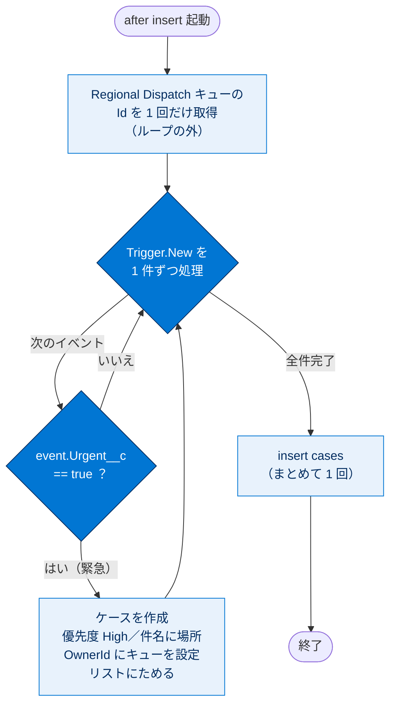
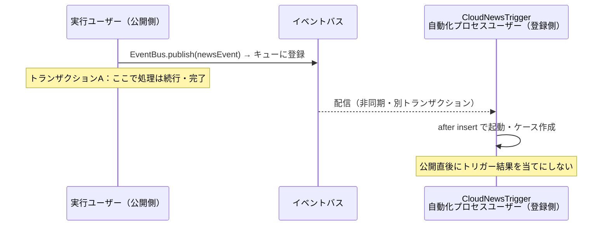
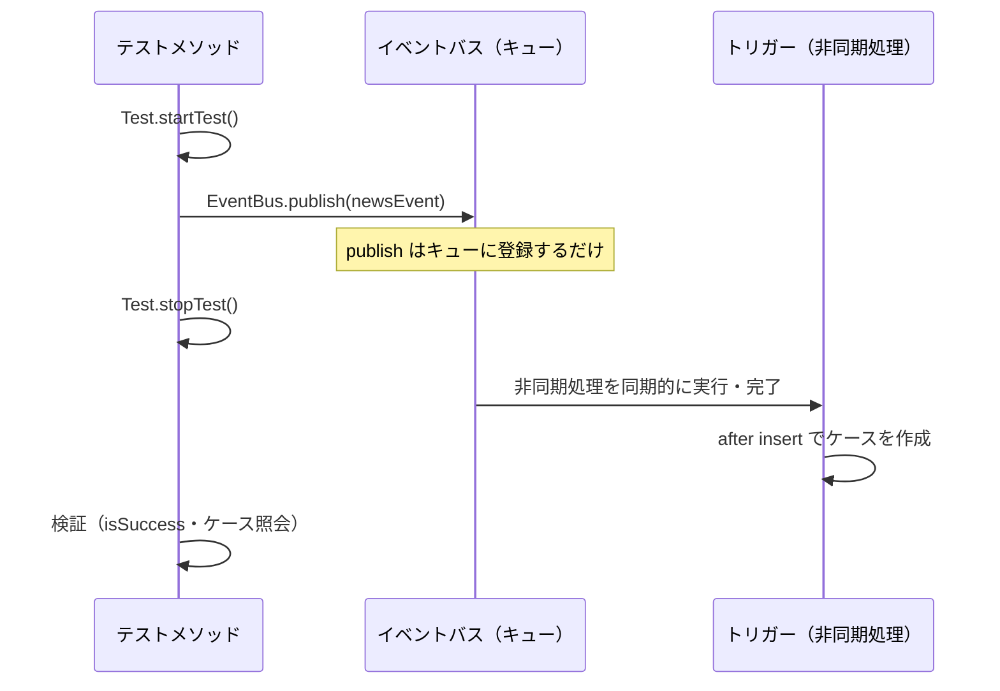

# プラットフォームイベントの登録

## 学習の目的

この単元を完了すると、次のことができるようになります。

- プラットフォームイベントメッセージの登録方法を説明する。
- プラットフォーム上と外部アプリケーション内のイベントに登録する。
- Apex テストメソッドでプラットフォームイベントをテストする。

> [!ポイント] この単元のゴール
>
> 登録（受信）の主役は **`after insert` トリガー**です。「イベントが届く＝レコードが insert される」とみなして `after insert` トリガーが起動する、という発想を押さえましょう。さらに、トリガーが**自動化プロセスユーザーで非同期実行される**こと、テストで `Test.startTest()` / `Test.stopTest()` を使うこと――この 3 点がこの単元と Challenge の核心です。

---

## プラットフォームイベントの登録

イベントに**登録**して通知を受け取るには、Salesforce Platform では **Apex トリガー、プロセス、フロー、`empApi` Lightning コンポーネント**を使い、外部アプリケーションでは **Pub/Sub API** を使います。

> [!用語] 登録（Subscribe／サブスクライブ）
>
> イベントチャネルを「リスン（待ち受け）」して、イベントメッセージが届いたら処理を実行するよう設定すること。公開（publish）の対になる操作で、登録した側が**コンシューマー（受信者）**になります。

| 登録方法 | 環境 | 特徴 |
| --- | --- | --- |
| **Apex トリガー（`after insert`）** | Salesforce 上 | コードで自動登録。Challenge で使用 |
| **フロー／プロセス** | Salesforce 上 | クリック操作（ノーコード） |
| **`empApi` Lightning コンポーネント** | Salesforce 上（画面） | LWC/Aura でリアルタイム受信 |
| **Pub/Sub API** | 外部アプリケーション | gRPC ベースで外部から受信 |

---

## Apex トリガーを使用したプラットフォームイベント通知の登録

受信イベントに登録するには、**イベントオブジェクトに対する `after insert` トリガーを記述するだけ**です。トリガーは Apex での**自動登録メカニズム**で、チャネルの作成・リスンを明示的に行う必要はなく、Apex と API のどちらで公開されたイベントも受信します。プラットフォームイベントは **`after insert` トリガーのみ**をサポートし、イベント公開時に起動します。

> [!ポイント] なぜ `after insert` だけなのか
>
> イベントメッセージは「公開＝新規に作られる（insert）」もので、**更新や削除はできません**。だから `before` 系や `update`/`delete` 系のトリガーは存在せず、**`after insert` だけ**がサポートされます。テストで頻出です。

> [!手順] プラットフォームイベントトリガーを作成する
>
> 1. **[Developer Console（開発者コンソール）]** で **[File]** | **[New]** | **[Apex Trigger]** をクリックする。
> 2. 名前を指定し、sObject のイベントを選択して **[Submit]** をクリックする。

開発者コンソールはトリガーテンプレートに `after insert` を自動追加します（[設定] のイベント定義ページの [トリガー] 関連リストでも作成可。その場合は `after insert` を自分で指定）。

次の例は Cloud News イベントのトリガーで、各イベントを反復処理して `Urgent__c` で緊急かを確認します。緊急の場合、ケースを作成してニュースレポーターを派遣し、場所をケースの件名に追加します。

> [!注意] この例を実行する前の準備
>
> 実行前に、**キューを作成し表示ラベルを `Regional Dispatch`（地域派遣）に設定**してください（設定方法は Salesforce ヘルプ「キューの設定」参照）。キューはプラットフォームイベントに含まれず必須でもありませんが、ケースをキューに割り当てると、メンバーであるサポートエージェントのチームに振り分けられます。キュー（Queue）は複数ユーザーで担当を共有する「待ち行列」のような所有者で、Apex 上では `Group`（種別 `Queue`）として扱われます。

```apex
// Cloud_News イベントをリスンするトリガー
trigger CloudNewsTrigger on Cloud_News__e (after insert) {
    // 作成するすべてのケースを保持するリスト
    List<Case> cases = new List<Case>();
    // ケースの所有者にするキューの Id を取得する
    Group queue = [SELECT Id FROM Group WHERE Name='Regional Dispatch' AND Type='Queue'];
    // 受信した各通知（イベント）を反復処理する
    for (Cloud_News__e event : Trigger.New) {
        if (event.Urgent__c == true) {
            // 新しいチームを派遣するためのケースを作成する
            Case cs = new Case();
            cs.Priority = 'High';
            cs.Subject = 'News team dispatch to ' +
                event.Location__c;
            // 自動化プロセスユーザーで動くため、所有者を明示的に設定する
            cs.OwnerId = queue.Id;
            cases.add(cs);
        }
   }
    // 受信イベントに対応するすべてのケースを挿入する
    insert cases;
}
```

> [!用語] Trigger.New（トリガーコンテキスト変数）
>
> トリガー内で使える特別な変数で、**今回の処理対象となる新しいレコード（イベント）のリスト**を表します。プラットフォームイベントトリガーでは、受信したイベントメッセージのバッチが `Trigger.New` に入ります。`for` ループで 1 件ずつ処理するのが定石です。

> [!例] このトリガーが行っていること
>
> 1. `Regional Dispatch` キューの Id を 1 回だけ取得する（ループの外＝ガバナ制限対策）。
> 2. 届いたイベントを 1 件ずつ調べ、`Urgent__c == true`（緊急）のものだけを対象にする。
> 3. 緊急イベントごとに、優先度「High」・件名に場所を含むケースを作りリストにためる。
> 4. ループを抜けてから `insert cases;` で**まとめて 1 回**挿入する。

トリガー処理の流れと分岐を図にすると次のとおりです。SOQL はループの外、`insert` はまとめて 1 回というバルク化の形が見て取れます。



---

## デバッグログの設定

プラットフォームイベントのトリガーは、**公開した Apex トランザクションとは別のトランザクション**で、システムユーザーである**自動化プロセスエンティティ**の下で実行されます。そのためデバッグログは自動化プロセスエンティティが作成し、**開発者コンソールでは見られません**。ログを収集するには、[設定] で追跡フラグエントリを自動化プロセスエンティティに追加します。

> [!手順] 自動化プロセスのデバッグログを有効にする
>
> 1. **[設定]** の **[クイック検索]** に `デバッグログ` と入力し、**[デバッグログ]** をクリックする。
> 2. **[新規]** をクリックする。
> 3. **[追跡対象エンティティ種別]** で **[自動化プロセス]** を選択する。
> 4. 収集するログの開始時刻と有効期限を選択する。
> 5. **[デバッグレベル]** に `*` と入力し **[検索]** をクリックする。
> 6. 事前定義デバッグレベル（`SFDC_DevConsole` など）を選ぶか、**[New]** で独自に作成する。
> 7. **[Save]** をクリックする。

> [!注意] Apex テストのログは例外
>
> Apex テストの場合は例外で、**同じテスト実行ログにイベントトリガーのログが含まれます**。テスト中は自動化プロセスの追跡を設定しなくてもログを確認できます。

---

## プラットフォームイベントトリガーに関する留意点

**イベント処理の順序**：トリガーはイベント通知を**受信した順序で順次処理**します。順序は **ReplayId** に基づきます。トリガーはイベントの**バッチ**を一度に受信でき、各バッチ内で順序が保持されます（バッチ内は複数の公開者由来の場合あり）。

**非同期のトリガー実行**：トリガーは**独自プロセス内で非同期に実行**され、公開トランザクションには含まれません。そのため公開からトリガー処理まで**遅延が発生することがあり**、トリガーの実行結果が公開直後に使えると想定してはいけません。



**自動化プロセスシステムユーザー**：トリガーは実行ユーザーではなく**自動化プロセスシステムユーザー**の下で実行されます。そのため例では所有者 ID を**明示設定**しています（`Regional Dispatch` キューの ID）。`OwnerId` を持つレコードを作る場合は所有者 ID を明示設定してください（ケース・リードは**割り当てルール**でも設定可）。トリガーで作成・更新したレコードのシステム項目（`CreatedById`、`LastModifiedById` 等）は**自動化プロセスエンティティ**を参照し、`UserInfo.getUserId()` も同じく自動化プロセスエンティティを返します。

> [!注意] 実行ユーザーは上書きできる
>
> トリガーの実行ユーザーを上書きし、指定ユーザーの下で実行させることもできます。設定には、メタデータ API または Tooling API の **`PlatformEventSubscriberConfig`** を使用します。

**Apex ガバナ制限・トリガーの制限**：標準・カスタムオブジェクトのトリガー同様、プラットフォームイベントトリガーにも **Apex ガバナ制限**が適用され、多くの制限を共有します。たとえば、トリガーから **Apex コールアウトを同期実行することはできません**（外部連携が必要なら `@future` などの非同期処理を使う）。

> [!用語] ガバナ制限 / コールアウト
>
> **ガバナ制限（Governor Limits）**＝マルチテナント環境で 1 つの処理がリソースを独占しないよう Apex 実行に設けた上限（SOQL 100 件、DML 150 件など）。だからこそ上の例のように **SOQL はループの外**、**`insert` はまとめて 1 回**にバルク化するのがベストプラクティス。
> **コールアウト（Callout）**＝Apex から外部システムを HTTP で呼び出すこと。トリガーからは同期コールアウトができません。

**トリガーバッチサイズ**：プラットフォームイベントトリガーのバッチサイズは**イベントメッセージ 2,000 件**で、Salesforce オブジェクトトリガーの **200** より大きくなっています。バッチサイズは `Trigger.New` リストのサイズに対応し、変更も可能です。

> [!ポイント] バッチサイズの比較（頻出）
>
> | トリガーの種類 | 1 回のバッチサイズ |
> | --- | --- |
> | 標準・カスタムオブジェクトトリガー | **200** |
> | プラットフォームイベントトリガー | **2,000** |
>
> 「プラットフォームイベントは 2,000 件」と数字で覚えましょう。

---

## イベント定義ページの登録関連リスト

[設定] のイベント定義詳細ページの **[登録]** の下に、有効なトリガーが実行情報・状態とともにリストされます（最終公開・最終処理イベントの ReplayId を含む）。状態は、トリガーが実行中か、復旧不能エラーや権限不足で登録から切断されているかを示します。**最大試行回数に達した場合にのみ**エラー状態になります。

> [!注意] [登録] 関連リストに表示されるもの／されないもの
>
> - **表示される**：Apex トリガー、イベントに登録しているフローとプロセス。
> - **表示されない**：Pub/Sub API、`empApi` Lightning コンポーネントを使う登録者。
> - 大規模プラットフォームイベントでは、**[最終公開 ID] は常に「利用できません」**と表示されます。

---

## イベントの Apex トリガーの登録者の管理

管理者は、一時停止した登録を停止した場所（最も古い使用可能イベント）から再開できます。エラーや不要なメッセージをスキップしたい場合は、**最新のイベントメッセージから**再開できます。

> [!手順] トリガー登録を管理する
>
> 1. **[登録]** 関連リストで、対象 Apex トリガー横の **[管理]** をクリックする。
> 2. 登録詳細ページで適切なアクションを選択する。
>    - 実行中の登録を一時停止：**[Suspend（サスペンド）]**
>    - 最も古い未処理メッセージから再開：**[再開]**
>    - 最新のメッセージから再開：**[Resume from Tip（最新から再開）]**

> [!注意] フロー・プロセスは管理リストの対象外
>
> フローとプロセスの登録は [登録] 関連リストでは管理できません。また、トリガーを保存するとトリガー登録は自動的に再開されます。

---

## プラットフォームイベントトリガーのテスト

Apex コード（トリガーを含む）をパッケージ化・本番リリースする前に**テストが必須**です。Apex テストでイベントを公開するには、publish ステートメントを **`Test.startTest()` と `Test.stopTest()` で囲みます**。テストコンテキストでは publish コールは公開操作を**キューに登録するだけ**で、**`Test.stopTest()` の時点で実際に公開が実行**されます。したがって検証は `Test.stopTest()` の**後**に書きます。

> [!ポイント] なぜ Test.startTest / stopTest で囲むのか
>
> プラットフォームイベントは通常**非同期**処理のため、テスト中にトリガーが起動する保証がありません。`Test.stopTest()` を呼ぶと、それまでにキューされた**非同期処理が同期的に実行・完了**します。これにより「公開 → トリガー起動 → ケース作成」までをテスト内で確実に検証できます。テスト・実務の両方で超重要です。

次の図は、テスト内での公開からトリガー実行・検証までの順序を示します。検証を `Test.stopTest()` の後に書く理由が見て取れます。



次は Cloud_News イベントのテストクラスです。イベントを公開すると関連トリガーが起動します。`Test.stopTest()` の後、`isSuccess()` で公開成功を確認し、さらに**トリガーが作成したケースを照会**します。ケースが見つかればトリガーが正常実行されており、テストは合格です。

```apex
@isTest
public class PlatformEventTest {
    @isTest static void test1() {
        // テスト用のイベントインスタンスを作成する
        Cloud_News__e newsEvent = new Cloud_News__e(
            Location__c='Mountain City',
            Urgent__c=true,
            News_Content__c='Test message.');
        Test.startTest();
        // イベントを公開するメソッドを呼び出す
        Database.SaveResult sr = EventBus.publish(newsEvent);
        // stopTest で非同期処理（トリガー）が実行される
        Test.stopTest();
        // ここから検証
        // 公開が成功したことを確認する
        System.assertEquals(true, sr.isSuccess());
        // トリガーが作成したケースが存在することを確認する
        List<Case> cases = [SELECT Id FROM Case];
        // ケースが 1 件見つかることを検証する
        // テストコンテキストにはテストケースが 1 件だけ存在する
        System.assertEquals(1, cases.size());
    }
}
```

> [!用語] @isTest / System.assertEquals
>
> `@isTest` はこのクラス・メソッドが**テスト専用**であることを示すアノテーション。`System.assertEquals(期待値, 実際の値)` は「2 つが一致しなければテストを失敗させる」検証メソッドです。テストは assert で「期待した結果か」を確認することで合否が決まります。

---

## Lightning コンポーネントを使用したプラットフォームイベント通知の登録

Lightning アプリケーションは、**`empApi` Lightning Web または Aura コンポーネント**でイベントに登録できます。

> [!用語] empApi（Emp API）
>
> Lightning コンポーネント（LWC / Aura）から、CometD ベースでプラットフォームイベントなどをリアルタイム購読する API。画面を開いているユーザーにイベントをライブで通知したい場合に使います。

**Lightning Web コンポーネント**では `lightning/empApi` モジュールから次のようにインポートし、JavaScript で呼び出します。

```javascript
import { subscribe, unsubscribe, onError, setDebugFlag, isEmpEnabled }
    from 'lightning/empApi';
```

**Aura コンポーネント**ではカスタムコンポーネント内に `lightning:empApi` を追加し、`aura:id` 属性を割り当ててクライアント側コントローラーから呼び出します。

```html
<lightning:empApi aura:id="empApi"/>
```

詳細は Lightning コンポーネントライブラリの `lightning-emp-api` / `lightning:empApi` ドキュメントを参照してください。

---

## クリックを使用したプラットフォームイベント通知の登録

イベント受信時にフローをトリガーするには、**プラットフォームイベントトリガーフロー**を作成します。開始要素でトリガーするイベントのプラットフォームイベントを選択し、フロー内では `$Record` グローバル変数でイベントの項目値を使えます（例：`$Record.Location__c`）。

または、**一時停止要素**でフローからイベントに登録できます。この場合、イベント受信時にフローを開始する代わりに、そのイベントで**一時停止中のフローインタビューを再開**します。たとえば Cloud News イベント受信まで一時停止し、場所が `{!contact.MailingCity}` と一致する場合のみ再開、といった設定ができます。

> [!用語] $Record（グローバル変数）
>
> フローを起動したレコード（ここでは受信イベントメッセージ）を表す変数。`$Record.Location__c` のように書けば、イベントの項目値をフロー内で参照できます。

---

## Pub/Sub API を使用したプラットフォームイベント通知への登録

**Pub/Sub API** は 1 つのインターフェースでイベントの公開と登録の両方を実行できます。**gRPC API** と **HTTP/2** に基づき、バイナリイベントメッセージを **Apache Avro** 形式で効率的に公開・配信します。

> [!用語] gRPC / Apache Avro / プル型サブスクリプション
>
> **gRPC**＝オープンソースのリモートプロシージャーコール（RPC）フレームワーク。**Apache Avro**＝データ逐次化（シリアライズ）システムで、イベントをコンパクトなバイナリ形式で表す。
> **プル型サブスクリプション**＝クライアントが「○件ください」と要求して受け取る方式（受信ペースを自分で制御＝フローコントロール）。Pub/Sub API はプル型で、プッシュ型（サーバーが一方的に送る）と違い公開が急増しても処理しきれないほど受け取りません。

Pub/Sub API の利点:

- 1 つの API で**イベントの公開・登録・スキーマ取得**を実行できる。
- 公開操作で、中間キューへの追加結果ではなく**最終的な公開結果**が得られる。
- フローコントロールで、`subscribe` コールごとに受け取るイベント数を指定できる。
- HTTP/2 の圧縮で、リアルタイム・高パフォーマンスなストリーミングを実現できる。
- gRPC がサポートする **11 種類のプログラミング言語**（Python、Java、Node、C++ など）で利用できる。

クライアントは受信イベントからスキーマ・ReplayId・ペイロードを別々に取得し、ペイロードをデコードできます。受信した Cloud News イベントのペイロード例:

```json
{
  "CreatedDate": 1652978695951,
  "CreatedById": "005SM000000146PYAQ",
  "Location__c": "San Francisco",
  "Urgent__c": true,
  "Ink_Percentage__c": "Large highway is closed due to asteroid collision."
}
```

---

## 試験対策：押さえておきたい追加ポイント

> [!ポイント] 登録・テストのよくある出題
>
> - 登録には **`after insert` トリガーのみ**が使える（イベントは更新・削除できないため）。
> - トリガーは**自動化プロセスシステムユーザー**で、**公開とは別のトランザクションで非同期**に実行される。`OwnerId` は明示設定が必要。
> - `CreatedById` / `LastModifiedById` / `UserInfo.getUserId()` は**自動化プロセスエンティティ**を返す。
> - トリガーバッチサイズは **2,000 件**（標準オブジェクトは 200）。
> - イベントは **ReplayId の順**で順次処理。バッチ内で順序が保たれる。
> - テストでは publish を **`Test.startTest()` / `Test.stopTest()`** で囲み、**検証は `stopTest()` の後**に書く。
> - [登録] 関連リストには **Apex トリガー・フロー・プロセス**が表示され、**Pub/Sub API・empApi は表示されない**。
> - 登録方法：Salesforce 内＝Apex トリガー／フロー・プロセス／empApi、外部＝Pub/Sub API。

---

## リソース

- Pub/Sub API ドキュメント：Java Quick Start for Pub/Sub API
- プラットフォームイベント開発者ガイド：プラットフォームイベントの割り当て
- プラットフォームイベント開発者ガイド：EventBus.RetryableException によるイベントトリガーの再試行
- Trailhead：インスタント通知アプリケーションの作成
- Salesforce ヘルプ：割り当てルール

---

## ハンズオン Challenge（+500 ポイント）

> [!まとめ] あなたの Challenge：Apex トリガーでのプラットフォームイベントへの登録
>
> Salesforce アプリケーションは Apex トリガーでイベントをリスンします。注文システムから通知を受信すると、**ToDo を作成**して注文発送をフォローアップします。
>
> **`Order_Event__e` 用の Apex トリガーを作成する**
>
> | 設定項目 | 値 |
> | --- | --- |
> | 名前（Name） | `OrderEventTrigger` |
> | 対象イベント | `Order_Event__e` |
>
> このトリガーは `CloudNewsTrigger` に似ていますが、`Order_Event__e` で動作し、**ケースではなく ToDo を作成**します。注文が発送済み（`event.Has_Shipped__c == true`）の場合、次の値で ToDo を作成します。
>
> | ToDo の項目 | 値 |
> | --- | --- |
> | Priority（優先度） | `'Medium'`（中） |
> | Subject（件名） | `'Follow up on shipped order 105'`（発送済み注文のフォローアップ 105） |
> | OwnerId | `event.CreatedById` |
>
> **メモ**：イベントを公開したユーザーと同じユーザーに ToDo の `OwnerId` を割り当てます（`event.CreatedById` を使用）。このステップは簡略化されているため、前提条件を実行する必要はありません。

> [!ポイント] Challenge 攻略のヒント
>
> - トリガーは `trigger OrderEventTrigger on Order_Event__e (after insert)` で始める。
> - `Trigger.New` を `for` ループで回し、`event.Has_Shipped__c == true` のものだけ ToDo を作る。
> - ToDo は **`Task` オブジェクト**として作成する（`Task` の `Priority`、`Subject`、`OwnerId` を設定）。
> - `OwnerId` には `event.CreatedById` をそのまま設定する（自動化プロセスユーザーでなく公開者を所有者にする）。
> - 作成した `Task` はリストにためて、ループの外で `insert` する（バルク化）。

> [!注意] 日本語環境で受講する場合
>
> Challenge は日本語の Trailhead Playground で開始し、かっこ内の翻訳を参照しながら進めてください。評価は英語データに対して行われるため、**英語の値のみ**をコピー＆ペーストします。不合格になった場合は、(1) [地域（Locale）] を [米国（United States）]、(2) [言語（Language）] を [英語（English）] に切り替えてから、(3) [Check Challenge] をクリックすると通ることがあります。

---

## 🎓 この単元のまとめ

この単元では、プラットフォームイベントを「登録（受信）」する仕組みを学びました。主役は `after insert` トリガーで、自動化プロセスユーザーのもとで公開とは別トランザクションで非同期に動く点、テストで `Test.startTest()` / `Test.stopTest()` を使う点が核心です。

次の表に、登録方法と覚えておきたい数値・特徴をまとめます。

| 観点 | ポイント |
| --- | --- |
| トリガーの種類 | `after insert` **のみ**（更新・削除がないため） |
| 実行ユーザー | **自動化プロセスシステムユーザー**（`OwnerId` は明示設定が必要） |
| 実行トランザクション | 公開とは**別**・**非同期**（遅延あり） |
| バッチサイズ | **2,000 件**（標準オブジェクトは 200） |
| 処理順序 | **ReplayId** の順・バッチ内で順序保持 |
| テスト | publish を **`Test.startTest()`/`Test.stopTest()`** で囲み、検証は **`stopTest()` の後** |
| 登録方法 | Salesforce 内＝トリガー／フロー・プロセス／empApi、外部＝Pub/Sub API |

> [!まとめ] この単元の要点
>
> - 登録（受信）は **`after insert` トリガー**が定石。イベントは更新・削除できないため他のトリガーは存在しない。
> - トリガーは **自動化プロセスユーザー**で **非同期・別トランザクション**で実行されるため、公開直後に結果を当てにしない。`OwnerId` は明示設定する。
> - トリガーのバッチサイズは **2,000 件**、イベントは **ReplayId 順**で処理される。
> - テストでは publish を **`Test.startTest()` / `Test.stopTest()`** で囲み、**検証は `stopTest()` の後**に書く。
> - [登録] 関連リストに表示されるのは **Apex トリガー・フロー・プロセス**のみ（Pub/Sub API・empApi は非表示）。

> [!豆知識] empApi は「画面の中」のライブ受信
>
> Apex トリガーが裏側（サーバー）で非同期に動くのに対し、`empApi`（Emp API）は CometD ベースで「ブラウザで開いている画面」にイベントをライブ配信します。たとえば在庫が動いた瞬間にダッシュボードの数字がリアルタイムで変わる、といった体験はこの empApi が支えています。だから [登録] 関連リストには出てこない（サーバー側の永続的な登録ではなく、画面が開いている間だけの一時的な購読だから）のです。
