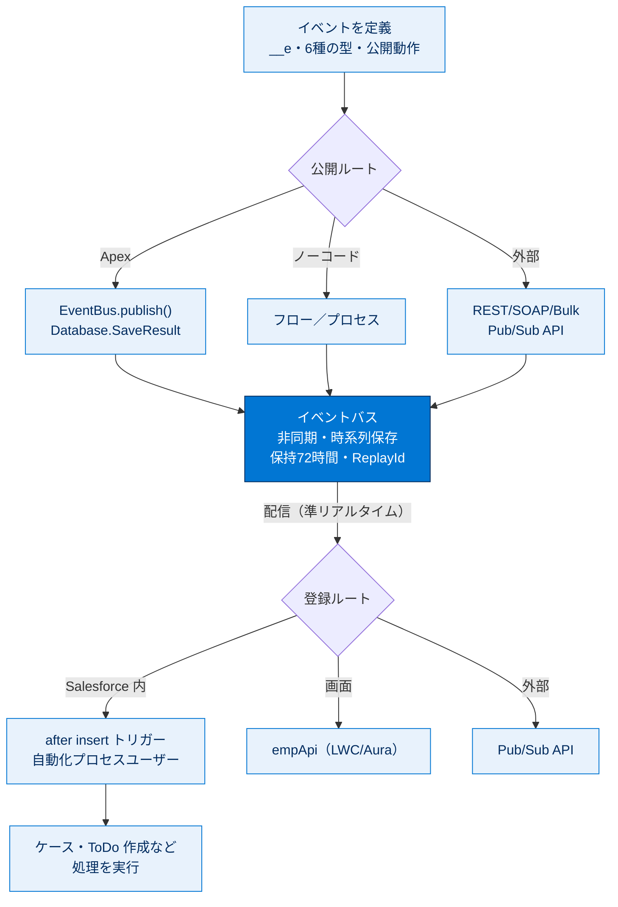

# Agentforce360 Platform のイベントの基本 総まとめ

このトピックでは、システム同士を疎結合でつなぐ「イベント駆動型アーキテクチャ」と、その Salesforce 実装である「プラットフォームイベント」を、概念・定義・公開・登録の順に学びました。状態変化（イベント）を公開者がイベントバスに publish し、登録者が `after insert` トリガーなどで subscribe して非同期に反応する、という一連の流れが核心です。`__e` サフィックス、`EventBus.publish()`、2 つの公開動作、`Test.startTest()`/`Test.stopTest()` といった頻出キーワードを一気に思い出せるよう、ここで全体を俯瞰します。

---

## 🗺️ トピック全体像

次の図は、このトピック全体の「定義 → 公開 → 配信 → 登録（受信）」の流れと登場概念の関係を 1 枚で俯瞰したものです。

---

## 📚 ユニット横断早見表

各ユニットの「学んだこと・キーワード・一言要点」を一覧にまとめます。

| ユニット | 学んだこと | キーワード | 一言要点 |
| --- | --- | --- | --- |
| 1. イベント駆動型ソフトウェアアーキテクチャの理解 | Pub/Sub モデルの概念、構成要素、利点、ユースケース、イベントメッセージの特徴 | プロデューサー／コンシューマー／チャネル／イベントバス／疎結合／非同期 | 最大の利点は「疎結合による通信の簡略化」。イベントメッセージは更新・削除・UI 表示・SOQL 不可 |
| 2. プラットフォームイベントの定義および公開 | イベント定義（`__e`・6 種の型）、公開動作、4 つの公開方法、`EventBus.publish()` | `__e`／EventBus.publish()／Database.SaveResult／すぐに公開／コミット後に公開 | カスタムオブジェクトのように定義し、Apex・フロー・REST・Pub/Sub で公開。公開は常に非同期 |
| 3. プラットフォームイベントの登録 | `after insert` トリガーでの登録、自動化プロセスユーザー、留意点、テスト方法 | after insert／Trigger.New／自動化プロセスユーザー／バッチ2000／Test.stopTest() | 登録の主役は `after insert` トリガー。非同期・別トランザクション。テストは stopTest 後に検証 |

---

## 🎯 試験頻出ポイント

> [!ポイント] このトピックで狙われやすい論点・暗記値
>
> - **イベント駆動型の最大の利点＝疎結合（プロデューサーとコンシューマーの分離）による通信の簡略化**。「複雑なロジックが必要」「連動関係を増やす」は誤り。
> - イベントは **非同期・準リアルタイム**で配信、受信確認はしない。**1 つのイベントを複数の登録者**が独立に受信できる。
> - **イベントメッセージ**＝オブジェクトレコードに似るが、**更新・削除・UI 表示・SOQL/SOSL は不可**、参照・作成は可。
> - API 参照名サフィックスは **`__e`**（`__c` はカスタムオブジェクト／項目）。
> - サポートされるデータ型は **6 種類**（チェックボックス・日付・日付/時間・番号・テキスト・テキストエリア（ロング））。
> - 公開は **`EventBus.publish()`**、戻り値 **`Database.SaveResult`**、`isSuccess()` で確認、**失敗しても例外は出ない**。
> - 公開動作：**[すぐに公開]（デフォルト）＝失敗しても公開／[コミット後に公開]＝コミット成功時のみ公開**。
> - 大規模イベントの保持は **72 時間**、復旧の目印は **ReplayId**。
> - 登録は **`after insert` トリガーのみ**。**自動化プロセスユーザー**で **非同期・別トランザクション**で実行、`OwnerId` は明示設定。
> - トリガーのバッチサイズは **2,000 件**（標準オブジェクトは 200）、イベントは **ReplayId 順**で処理。
> - テストは publish を **`Test.startTest()`/`Test.stopTest()`** で囲み、**検証は `stopTest()` の後**。
> - [登録] 関連リストに出るのは **トリガー・フロー・プロセス**のみ（Pub/Sub API・empApi は非表示）。

---

## 📖 用語早見表

このトピックで登場した重要用語をまとめます。

| 用語 | ひとことの意味 |
| --- | --- |
| プラットフォームイベント | Salesforce が提供するカスタムイベントメッセージの仕組み。`__e` サフィックスを持つ |
| 公開者-登録者モデル（Pub/Sub） | 公開者が放送し登録者が受信する通信モデル。互いを意識しない疎結合 |
| プロデューサー／コンシューマー | イベントを作って送る側／受け取って消費する側 |
| イベントチャネル | イベントが流れるストリーム |
| イベントバス | イベントを時系列に保存・配信するマルチテナントサービス |
| イベントメッセージ | プラットフォームイベントのインスタンス。更新・削除・UI 表示・SOQL 不可 |
| 疎結合（Loose Coupling） | システム間の依存が弱く、片方の変更が他方に影響しにくい状態 |
| `EventBus.publish()` | イベントを公開する Apex メソッド。戻り値は `Database.SaveResult` |
| Database.SaveResult | 公開結果を表す型。`isSuccess()` で成否を確認 |
| すぐに公開／コミット後に公開 | 公開コール直後に公開／トランザクションのコミット成功後に公開 |
| ReplayId（再実行 ID） | 各イベントの位置を表す ID。障害復旧時の再取得に使う |
| `after insert` トリガー | イベント登録（受信）に使う唯一のトリガー種別 |
| Trigger.New | トリガー処理対象の新しいイベントのリスト |
| 自動化プロセスユーザー | イベントトリガーを非同期実行するシステムユーザー |
| empApi（Emp API） | LWC/Aura から CometD でイベントをライブ購読する API |
| Pub/Sub API | gRPC/HTTP2・Avro ベースで公開と登録を行う外部向け API |
| Test.startTest()/stopTest() | テストで非同期処理（トリガー）を確実に実行・検証するための囲み |

---

> [!豆知識] 「準リアルタイム」は数百ミリ秒のずれ
>
> プラットフォームイベントは「リアルタイム」ではなく「準リアルタイム」と表現されます。これは公開からトリガー処理まで、システムリソースの空き状況により多少の遅延が生じるため。だから「公開した直後に登録側の処理結果を取得する」設計は禁物で、結果が必要なら [コミット後に公開] やコールバックを使い分けるのがプロの判断です。

> [!豆知識] バッチサイズ 2,000 は「メッセージは軽い」から
>
> 標準・カスタムオブジェクトのトリガーが 1 バッチ 200 件なのに対し、プラットフォームイベントトリガーは 2,000 件と 10 倍。これはイベントメッセージが「データを運ぶだけの軽いペイロード」で、レコードのような複雑な関連処理を伴わないため、より多くを一度にさばける設計になっているからです。

> [!豆知識] Pub/Sub API は 11 言語で使える
>
> Pub/Sub API は gRPC ベースなので、Python・Java・Node・C++ など **11 種類のプログラミング言語**から利用できます。さらに「プル型」で受信ペースを自分で制御できる（フローコントロール）ため、公開が急増しても処理しきれないほど受け取らずに済むのが、旧来のストリーミング API に対する大きな進化点です。

---

## ✅ 理解度セルフチェック

> [!まとめ] 確認問題（答えは各項目の末尾）
>
> 1. イベント駆動型アーキテクチャの最大の利点を一言で言うと？ → **疎結合（プロデューサーとコンシューマーの分離）による通信の簡略化**。
> 2. イベントメッセージは更新・削除・UI 表示・SOQL ができる？できない？ → **すべてできない**（参照・作成のみ可）。
> 3. プラットフォームイベントの API 参照名サフィックスは「___」。 → **`__e`**。
> 4. Apex でイベントを公開するメソッドと、その戻り値の型は？ → **`EventBus.publish()`／`Database.SaveResult`**。
> 5. 登録（受信）に使える唯一のトリガー種別は「___」。 → **`after insert`**。
> 6. プラットフォームイベントトリガーの 1 バッチのサイズは何件？ → **2,000 件**（標準オブジェクトは 200）。
