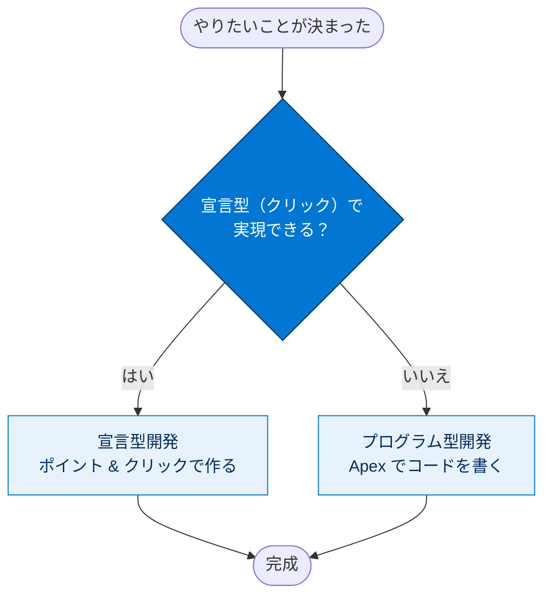
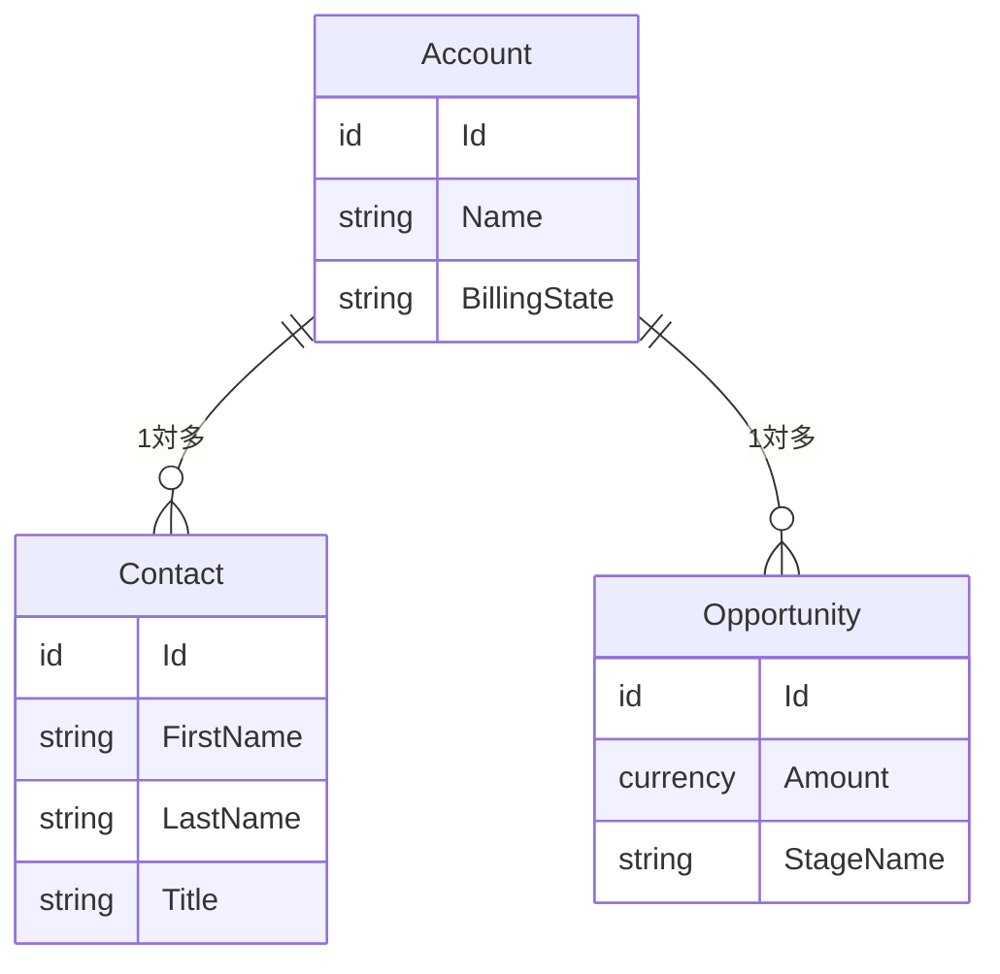
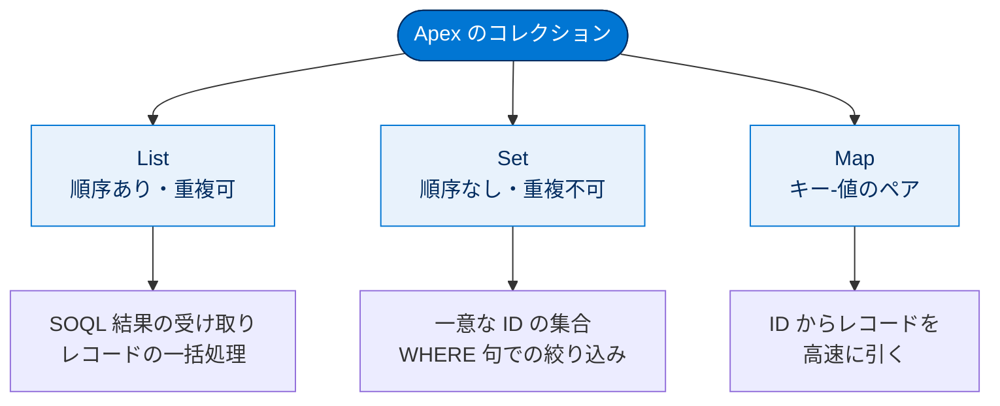
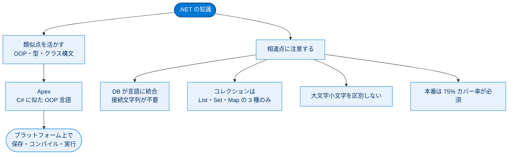

# .NET の概念の Agentforce 360 Platform への対応付け

## 学習の目的

この単元を完了すると、次のことができるようになります。

- Lightning プラットフォームを構成する主要な機能と Apex プログラミング言語を理解する
- .NET と Lightning プラットフォームの類似点と相違点を識別する
- 開発者コンソールを使用して最初の Apex クラスを作成する
- 匿名 Apex を使用して Apex クラスからメソッドを呼び出す

> [!ポイント] この単元のゴール
>
> .NET 開発者の知識を足がかりに、**Apex は C# に似たオブジェクト指向言語**であること、**Lightning プラットフォームはデータベースと一体化したメタデータ駆動型**であることを理解します。「コレクションは List / Set / Map の 3 つだけ」「本番リリースには 75% のテストカバー率が必須」が頻出ポイントです。

> [!用語] Lightning プラットフォーム（Lightning Platform）
>
> Salesforce アプリを動かす土台（PaaS）。データベース・UI・セキュリティ・レポートが最初から組み込まれ、開発者は「インフラ管理」ではなく「アプリ作り」に集中できます。旧称 Force.com とほぼ同義です。

---

## Lightning プラットフォームの概要

このモジュールでは、すでに知っている .NET の概念を Lightning プラットフォームに関連付けて学習します。

### プラットフォームの基本

Lightning プラットフォーム（旧 Force.com）と他の SaaS 製品との違いの 1 つは、**メタデータ駆動型アーキテクチャ**に依存している点です。コード・設定・アプリなど、すべてがメタデータとして指定されます。

> [!用語] メタデータ駆動型アーキテクチャ（Metadata-Driven Architecture）
>
> 「データそのもの」ではなく「データやアプリの構造を定義する情報（＝メタデータ）」を中心に組み立てる設計思想。項目・画面・権限の定義がメタデータとして保存され、プラットフォームはそれを読み取って動作します。これによりコードを書かずに画面や項目を追加する「宣言型開発」が可能になります。

> [!用語] SaaS / PaaS
>
> - **SaaS（Software as a Service）**：完成したソフトをサービスとして使う形態（例：Gmail）。
> - **PaaS（Platform as a Service）**：アプリを作る土台をサービスとして借りる形態（例：Lightning プラットフォーム）。「SaaS を作るための PaaS」と考えると分かりやすいです。

Azure 上のクラウドアプリと異なり、Lightning プラットフォームは**データベースと緊密に統合**され、UI・セキュリティ・レポートなどもプラットフォームに直接組み込まれています。この統合により、アプリを短期間で作成できます。ノードや管理タスク、アップグレード・調整・拡張の心配は不要で、アプリ作成だけに専念できます。

> [!例] .NET と Lightning の発想の違い
>
> .NET では「サーバー用意、IIS 設定、DB 接続文字列、デプロイ先整備」といった土台づくりが必要です。Lightning ではこれらをすべてプラットフォームが面倒を見るため、あなたは「取引先に項目を追加したい」「このタイミングで商談を自動作成したい」というビジネスロジックだけを考えればよい、というイメージです。

---

## Apex の基本

Lightning プラットフォームはメタデータアーキテクチャに緊密に統合されているため、**宣言型開発**（ポイント & クリック＝ノーコード）で多くの機能を実現できます。

> [!用語] 宣言型開発（Declarative）/ プログラム型開発（Programmatic）
>
> - **宣言型**：クリック操作（ポイント & クリック）で機能を作る。「何をしたいか」を設定するだけで動く。
> - **プログラム型**：Apex などのコードを書いて機能を作る。
>
> 鉄則は「**まず宣言型で実現できないか検討し、できないときだけコードを書く**」。試験でも「コードと宣言型のどちらを選ぶか」がよく問われます。

> [!用語] Apex（エイペックス）
>
> Salesforce 専用のプログラミング言語。Java や C# に似たオブジェクト指向言語で、**Lightning プラットフォーム上で直接コンパイル・保存・実行**されます。データベース操作（SOQL / DML）が言語に組み込まれているのが特徴です。

重要なのは、**コードが必要な状況とそうでない状況を理解する**ことです。ここからは Apex を使ったプログラミング方法を学びます。



---

## 類似点

Apex は C# に似ており、Lightning プラットフォーム上で直接保存・コンパイル・実行されるオブジェクト指向言語です。ここでは .NET 言語との類似点を説明します。

### オブジェクト指向設計

Apex では、カプセル化・抽象化・継承・多態性などオブジェクト指向の原則の多くがサポートされます。クラス、インターフェース、プロパティ、コレクションなど、使い慣れた言語構造が含まれます。たとえば次の `HelloWorld` クラスです。

```apex
public with sharing class HelloWorld {
    public void printMessage() {
        String msg = 'Hello World';
        System.debug(msg);
    }
}
```

このクラスはデバッグログにメッセージを出力する `printMessage` メソッドを 1 つ持つだけで、Apex が C# とよく似ていることが確認できます。

> [!用語] with sharing / without sharing
>
> クラス宣言に付け、**実行ユーザーの共有ルール（レコード参照権限）を尊重するかどうか**を指定します。`with sharing` を付けると、現在のユーザーがアクセスできるレコードしか扱えません。原則 `with sharing` がベストプラクティスです（詳細は次の単元）。

クラス定義の基本構文は次のとおりです。

```apex
private | public | global
[virtual | abstract][with sharing | without sharing | inherited sharing]
class ClassName [implements InterfaceNameList] [extends ClassName]
{
    // The body of the class
}
```

> [!ポイント] アクセス修飾子の違い（試験頻出）
>
> | 修飾子 | 参照できる範囲 |
> | --- | --- |
> | `private` | 同じクラス内のみ（デフォルト） |
> | `public` | 同じ名前空間（同じアプリ）内 |
> | `global` | すべての名前空間からアクセス可能。Web サービスや Batch クラスでよく使う |
>
> `global` は最も広く公開され、管理パッケージや `@future` を含むクラス、Batchable クラスで使われます。

### データ型

Apex は `Integer`、`Double`、`Long`、`Date`、`Datetime`、`String`、`Boolean` などのプリミティブ型をサポートします。レコード識別子用の `ID` 型もあります。

> [!用語] ID 型（18 桁の Salesforce レコード ID）
>
> すべてのレコードに自動で割り振られる一意の識別子。15 桁（大小区別あり）と 18 桁（区別なし、安全）があり、Apex では主に 18 桁を扱います。DB の主キーのようなものです。

**Apex ではすべての変数がデフォルトで `null` に初期化**されます。また .NET の文字列は不変でも内部的には参照型ですが、Apex では文字列は常にプリミティブな値の型として扱われます。

プリミティブ以外に **sObject** があり、汎用 sObject か、取引先・取引先責任者など特定の sObject になります。

> [!用語] sObject（エスオブジェクト）
>
> Salesforce のオブジェクト（＝DB のテーブルに相当）を Apex で表現した型。`Account`、`Contact` のような特定型と、どんなオブジェクトにも代入できる汎用 `sObject` 型があります。標準 sObject と、自作のカスタム sObject（API 名末尾が `__c`）があります。

> [!例] sObject はテーブルの 1 行
>
> `Account acc = new Account(Name='Acme');` は「取引先テーブルに Name が Acme の行を 1 つ用意する」イメージ。`acc.Name` でその行の Name 列にアクセスできます。

標準 sObject 同士は、データベースのテーブルのようにリレーション（関連）を持ちます。



データ型を **Enum（列挙）** にもできます。Apex の Enum は序数が 0 始まりで、数値の内容は定義できません。

```apex
public enum myEnums {
    Enum1,
    Enum2,
    Enum3
}
```

序数は 0 始まりなので、次の `enumOrd` は `2` になります。

```apex
Integer enumOrd = myEnums.Enum3.ordinal();
```

### コレクションの使用

.NET の大規模なコレクションライブラリと異なり、Apex には次の **3 つのコレクションしかありません**。

> [!ポイント] Apex のコレクションは 3 種類だけ（最重要・暗記）
>
> | コレクション | 特徴 | 主な用途 |
> | --- | --- | --- |
> | **List（リスト）** | 順序あり・重複可。配列のように使える | SOQL の結果を受け取る、レコードの一括処理 |
> | **Set（セット）** | 順序なし・**重複不可** | 一意な ID の集合、WHERE 句での絞り込み |
> | **Map（マップ／対応付け）** | キー‑値のペア。キーは一意 | ID からレコードを高速に引く |
>
> 「コレクションは List / Set / Map の 3 つ」は試験で頻出です。



#### リスト

リストは順序付けされたコレクションで、配列のように動作します。角括弧 `[]`（配列表記）で特定項目を参照できます。宣言方法には次のバリエーションがあります。

```apex
List<String> myStrings = new List<String>();
String[] myStrings = new List<String>();                                    // 角括弧表記
List<String> myStrings = new List<String> {'String1', 'String2', 'String3'}; // 宣言と初期化を 1 ステップで
```

作成後に値を追加することもできます。

```apex
List<String> myStrings = new List<String>();
myStrings.add('String1');
myStrings.add('String2');
```

> [!用語] SOQL（ソークル：Salesforce Object Query Language）
>
> Salesforce のデータベースからレコードを取得する問い合わせ言語。SQL の `SELECT` に似ますが、Salesforce のオブジェクトとリレーションに特化しています。**SOQL の検索結果は必ず List で返る**のがポイントです。

SOQL クエリの出力は常にリストなので、Apex 開発では多くのリスト変数を作ります。

```sql
List<Account> myAccounts = [SELECT Id, Name FROM Account];
```

リストのインデックスは 0 始まりです。最初の取引先名へのアクセスは次のいずれかです。

```apex
String firstAccount = myAccounts.get(0).Name;
String firstAccount = myAccounts[0].Name;  // 配列表記 [] を使用
```

クラス内の例（渡された役職に一致する取引先責任者を返す）です。

```apex
public with sharing class ContactUtils {
    public static List<Contact> contactsByTitle(String title) {
        List<Contact> contacts = [SELECT Id, FirstName, LastName FROM Contact WHERE Title = :title];
        return contacts;
    }
}
```

> [!用語] バインド変数（`:変数名`）
>
> SOQL 内で `WHERE Title = :title` のように `:` を付けて Apex 変数を埋め込むしくみ。SQL のパラメータ化クエリに相当し、SOQL インジェクションを防ぐ安全な書き方です。

#### セット

セットは重複を含まない順序なしのコレクションで、一意な ID の保存によく使います。SOQL の `WHERE` 句に渡せます。

```sql
Set<ID> accountIds = new Set<ID> {'001d000000BOaHSAA1','001d000000BOaHTAA1'};
List<Account> accounts = [SELECT Name FROM Account WHERE Id IN :accountIds];
```

> [!例] なぜ Set を使うのか
>
> 大量処理では「重複 ID を 1 つにまとめ、その一覧で一気に検索する」使い方をよくします。`WHERE Id IN :accountIds` のように Set を渡せば、1 回の SOQL で複数レコードをまとめて取得でき、ガバナ制限（後述）に優しい一括処理になります。

#### 対応付け（マップ）

対応付けはキー‑値のペアのコレクションで、キーは一意です。キーでの高速検索に便利です。SOQL の結果を直接渡して宣言できます。

```sql
Map<Id, Account> accountMap = new Map<Id, Account> ([SELECT Id, Name FROM Account]);
```

> [!ポイント] `Map<Id, sObject>` の便利な初期化
>
> `new Map<Id, Account>([SELECT ...])` のように SOQL の結果を直接渡すと、**各レコードの Id をキーにした Map が自動で作られます**。ID からレコードを引きたい場面で多用される定番テクニックです。

`get` メソッドで特定の取引先レコードにアクセスできます。

```apex
Id accId = '001d000000BOaHSAA1';
Account acc = accountMap.get(accId);
```

---

## 相違点

C# とは異なり、**Apex は大文字と小文字を区別しません**。

> [!注意] 大文字小文字を区別しない
>
> `myAccount` と `MyAccount` は Apex では同じ変数とみなされます。C# / Java の感覚で別物のつもりで使うと予期せぬ衝突が起きるので注意してください。

主な相違点を表で整理します。

| 観点 | .NET | Lightning プラットフォーム（Apex） |
| --- | --- | --- |
| 大文字小文字 | 区別する | **区別しない** |
| データベース | 別途用意・接続文字列が必要 | **言語に統合**・接続文字列不要 |
| 単体テスト | 推奨 | **本番リリースに必須（75% カバー率）** |
| ソリューション/プロジェクトファイル | あり | **なし** |
| クラスライブラリ | 巨大 | **比較的小さい** |
| 認証・セキュリティ | 自前で実装 | プラットフォームが処理（多くは宣言的） |

### Apex とデータベースは緊密に結合されている

標準・カスタムオブジェクトには、それぞれ Apex クラスを介した表現があり、クラスと基礎オブジェクトは常に同期されたミラーイメージです。オブジェクトに項目を作成するとクラスメンバーが自動で表れ、存在しない項目を参照するコードは保存できません（コンパイルエラー）。Apex で参照中のカスタムオブジェクトや項目は削除できません。

> [!ポイント] スキーマとコードの強い結合
>
> 「Apex で参照中の項目は削除できない」「存在しない項目を参照するコードは保存できない」は試験で問われます。コードと DB が常に同期＝**型安全が DB レベルまで保証される**のが Salesforce の強みです。

### 設計パターンが異なる

.NET の設計パターンのほとんどは Lightning プラットフォームでは機能しません（詳細は次の単元の実行コンテキストとトリガー設計）。同じ設計戦略をそのまま適用すると、テストやリリース時に問題が起きる可能性があります。コーディング前に、このプラットフォームで最適に機能する設計パターンを学ぶことをお勧めします。

### 単体テストは必須である

Lightning プラットフォームでは、**Apex コードを本番組織にリリースするには 75% のテストカバー率が必要**です。

> [!ポイント] テストカバー率 75%（最重要・暗記）
>
> 本番組織へのデプロイには、**全体で 75% 以上のコードカバレッジ**が必要です。さらに、すべてのトリガーが最低 1 行はカバーされている必要があります。「75%」は試験で頻出する数値です。

各メジャーリリース前に全テストが実行されるため、単体テストは堅牢なコード開発だけでなくプラットフォームの安定性にも不可欠です。

### ソリューションファイル、プロジェクトファイル、設定ファイルがない

Lightning プラットフォームにはソリューション/プロジェクトファイルがありません。アプリは、タブ・レポート・ダッシュボード・ページなどのコンポーネントの緩いコレクションにすぎず、ポイント & クリックのウィザードで作成できます。AppExchange でサードパーティ製アプリを購入することもできます。

> [!用語] AppExchange（アップエクスチェンジ）
>
> Salesforce 版のアプリストア。サードパーティ製アプリやコンポーネントを組織にインストールして機能を拡張できます。

コードはすべてクラウドで保存・実行され、設定ファイルはありません。DB が直接組み込まれているため**接続文字列は不要**で、ASP.NET MVC のようなルート設定も不要です。カスタム設定は宣言的に追加・管理します。

### クラスライブラリがはるかに小さい

Apex クラスライブラリは .NET Framework より小さく、迅速なアプリ開発という思想に基づきます。.NET の使い慣れた機能が Apex にないこともあります。詳細・完全にカスタムコーディングしたアプリには Heroku Enterprise プラットフォームが必要な性能と機能を提供します。

---

## 開発ツール

> [!用語] 開発者コンソール（Developer Console）
>
> ブラウザ上で動く Salesforce 標準の開発ツール。Apex クラス/トリガーの編集、SOQL/SOSL の実行、匿名 Apex の実行、デバッグログの確認ができます。インストール不要で使えるのが利点です。

開発者コンソールはソースコードの編集・操作、デバッグやトラブルシューティング、SOQL/SOSL クエリの実行やクエリプラン表示に使えます。

ローカルでカスタム開発を行う **VS Code 向け Salesforce 拡張機能**もあり、これは **Salesforce DX** と密接に結び付いています。コマンドライン派は **Salesforce CLI** を使えます。

> [!用語] Salesforce DX / Salesforce CLI
>
> - **Salesforce DX（SFDX）**：ソースコードを中心に据えたモダンな Salesforce 開発の仕組み（バージョン管理・スクラッチ組織など）。
> - **Salesforce CLI**：コマンドラインから組織の操作やデプロイを行うツール。CI/CD（自動デプロイ）にも使われます。

DevOps の最新情報はコードビルダーと DevOps Center を確認してください。

---

## セキュリティの処理

Lightning プラットフォームでは認証やパスワード・DB 接続文字列の保存を心配する必要がなく、ID はプラットフォームが処理します。データアクセスはオブジェクト・レコード・項目の各レベルで制御でき、多くは宣言的に（多くは管理者が）設定します。開発者もそのしくみを意識しておくことが重要です。

> [!ポイント] 3 つのアクセス制御レベル
>
> | レベル | 制御する内容 | 主な仕組み |
> | --- | --- | --- |
> | **オブジェクトレベル** | どのオブジェクトを参照/編集できるか | プロファイル、権限セット |
> | **レコードレベル** | どのレコードを見られるか | 組織の共有設定、共有ルール、ロール階層 |
> | **項目レベル** | どの項目（列）を見られるか | 項目レベルセキュリティ（FLS） |

---

## インテグレーションについて

Lightning プラットフォームとのインテグレーションでは **SOAP と REST** を最もよく使い、どちらの方向にも使えます。

> [!用語] インバウンド / アウトバウンド
>
> - **インバウンド**：外部システムから Salesforce を呼び出す（Salesforce が Web サービスを公開する側）。
> - **アウトバウンド（コールアウト）**：Salesforce から外部システムを呼び出す。

Apex で Web サービスを作成・公開したり、外部 Web サービスを呼び出したりできます。受信メールへの対応や送信メッセージの自動送信も可能です。自前処理では SOAP API / REST API で組織データに直接アクセスでき、.NET・Java・PHP など好きな言語のツールキットを使えます。AppExchange のサードパーティ製インテグレーションアプリも利用できます。

---

## Apex を実際に使ってみる

Trailhead Playground を起動して手順を実行しましょう。ハンズオン Challenge までスクロールし **[Launch（起動）]** をクリックします。

### Apex クラスの作成

開発者コンソールで Apex クラスを作成します。公開メソッド `sendMail` と、結果を検査する非公開ヘルパー `inspectResults` を含みます。

> [!手順] EmailManager クラスを作成する
>
> 1. **[Setup（設定）]** メニューから **[Developer Console（開発者コンソール）]** を選択する。
> 2. **[File（ファイル）] > [New（新規）] > [Apex Class（Apex クラス）]** を選択する。
> 3. クラス名を `EmailManager` と指定し、**[OK]** をクリックする。
> 4. 既存のコードを削除して、次のスニペットを挿入する。
> 5. **Ctrl + S** キーを押してクラスを保存する。

```apex
public with sharing class EmailManager {
    // Public method
    public static void sendMail(String address, String subject, String body) {
        // Create an email message object
        Messaging.SingleEmailMessage mail = new Messaging.SingleEmailMessage();
        String[] toAddresses = new String[] {address};
        mail.setToAddresses(toAddresses);
        mail.setSubject(subject);
        mail.setPlainTextBody(body);
        // Pass this email message to the built-in sendEmail method
        // of the Messaging class
        Messaging.SendEmailResult[] results = Messaging.sendEmail(
            new Messaging.SingleEmailMessage[] { mail });
        // Call a helper method to inspect the returned results.
        inspectResults(results);
    }
    // Helper method
    private static Boolean inspectResults(Messaging.SendEmailResult[] results) {
        Boolean sendResult = true;
        // sendEmail returns an array of result objects.
        // Iterate through the list to inspect results.
        // In this class, the methods send only one email,
        // so we should have only one result.
        for(Messaging.SendEmailResult res : results) {
            if(res.isSuccess()) {
                System.debug('Email sent successfully');
            } else {
                sendResult = false;
                System.debug('The following errors occurred: ' + res.getErrors());
            }
        }
        return sendResult;
    }
}
```

> [!注意] このサンプルとセキュリティ
>
> この例ではオブジェクトレベル/項目レベルのセキュリティは実装していません。実務では FLS などの考慮が必要です。迅速に開始するためのサンプルとして理解してください。

### メソッドを呼び出す

`sendMail` は静的（`static`）なので、**クラスのインスタンスを作らずに**アクセスできます。これは**匿名 Apex** で簡単に実行できます。

> [!用語] 匿名 Apex（Anonymous Apex）
>
> クラスとして保存せず、その場で 1 回だけ実行できるコードスニペット。開発者コンソールの **[Execute Anonymous Window]** で実行します。動作確認やデータ操作に便利で、.NET の「即時ウィンドウ」に近い感覚です。

> [!用語] 静的メソッド（static）
>
> インスタンス（`new`）を作らずに `クラス名.メソッド名()` の形で直接呼び出せるメソッド。`EmailManager.sendMail(...)` のように使います。

> [!手順] 匿名 Apex でメソッドを呼び出す
>
> 1. **[Debug（デバッグ）] > [Open Execute Anonymous Window（実行匿名ウィンドウを開く）]** を選択する。
> 2. 既存のコードを削除して次のスニペットを挿入する。最初のパラメーターには**自分のメールアドレス**を指定する。
> 3. **[Open Log（ログを開く）]** が選択されていることを確認し、**[Execute（実行）]** をクリックする。
> 4. 新しいタブに実行ログが表示される。
> 5. **[Debug Only（デバッグのみ）]** を選択するとデバッグステートメントのみ表示され、メール送信成功のメッセージが確認できる。有効なメールアドレスならメールも受信する。

```apex
EmailManager.sendMail('Your email address', 'Trailhead Tutorial', '123 body');
```

---

## 試験対策：押さえておきたい追加ポイント

> [!ポイント] この単元の頻出ポイントまとめ
>
> - **Apex は C# / Java に似たオブジェクト指向言語**で、プラットフォーム上で実行される。
> - **コレクションは List / Set / Map の 3 種類だけ**。SOQL の結果は必ず List。
> - **Apex は大文字小文字を区別しない**。
> - すべての変数は**デフォルトで `null`** に初期化される。
> - 本番リリースには**75% のテストカバー率**が必須。
> - **存在しない項目の参照はコンパイルエラー**になり、参照中の項目は削除できない（スキーマとコードの強い結合）。
> - **まず宣言型（クリック）で検討し、できないときだけコード**を書く。

---

## リソース

- Trailhead: Salesforce Platform の基礎
- Salesforce 開発者ブログ: When to Click Instead of Write Code（コードを書く代わりにクリック操作で開発するのはどのような場合か）
- Apex 開発者ガイド: Apex の概要
- Salesforce Developers: Apex 開発者ガイド
- Salesforce Developers: インテグレーションパターンの概要

---

## ハンズオン Challenge（+500 ポイント）

> [!まとめ] あなたの Challenge：取引先を返す Apex クラスを作成する
>
> ユーザーが指定した状態（州）の **Account（取引先）** オブジェクトのリストを返す Apex クラスを作成してください。
>
> **設定値**
> - `static` メソッドを含む Apex クラスを作成する
> - 名前：`AccountUtils`
> - メソッド名：`accountsByState`
> - メソッドは、メソッドに渡された**州の略号が `BillingState` と一致する**すべての Account（取引先）オブジェクトの **ID と名前**を返す必要がある

> [!ポイント] Challenge 攻略のヒント
>
> - メソッドは `public static List<Account>` を返す形にし、引数で州の略号（String）を受け取ります。
> - SOQL の `WHERE BillingState = :state` のように**バインド変数**で絞り込み、結果（List）をそのまま `return` すれば要件を満たせます。

> [!注意] 日本語環境で受講する場合
>
> Challenge は日本語の Trailhead Playground で開始し、かっこ内の翻訳を参照しながら進めてください。評価は英語データに対して行われるため、**英語の値のみ**をコピー & ペーストします。日本語組織で不合格になった場合は、(1) [Locale（地域）] を [United States（米国）] に、(2) [Language（言語）] を [English（英語）] に切り替えてから、(3) [Check Challenge] をクリックすると通ることがあります。

---

## 🎓 この単元のまとめ

この単元は「**.NET 開発者の知識を足がかりに、Apex と Lightning プラットフォームの全体像をつかむ**」入口でした。Apex は C# によく似たオブジェクト指向言語ですが、データベースと一体化したメタデータ駆動型である点が決定的に異なります。

次の図は、.NET の知識を Apex/Lightning にどう対応付けて理解するかを俯瞰したものです。



> [!まとめ] この単元の要点
>
> - Apex は **C# / Java に似たオブジェクト指向言語**で、Lightning プラットフォーム上で直接コンパイル・実行される。
> - コレクションは **List / Set / Map の 3 種類だけ**。SOQL の結果は必ず List で返る。
> - Apex は **大文字小文字を区別しない**／変数はデフォルトで **`null`** に初期化される。
> - DB が言語に統合され、**存在しない項目を参照するコードは保存できない**（スキーマとコードの強い結合）。
> - 本番リリースには **75% のテストカバー率**が必須。まず宣言型、無理ならコード。

> [!豆知識] 「Apex」という名前の由来
>
> Apex はもともと社内コードネーム由来とされ、当初は「Force.com コード」のような呼び方も検討されていました。Salesforce の旧プラットフォーム名「Force.com」は現在「Lightning プラットフォーム」に統合されていますが、`.force.com` のドメインなど名残はあちこちに残っています。「Force」「Apex」という勇ましい名前は、当時としては珍しかった「クラウド上でコードを直接動かす」という挑戦を象徴しています。
