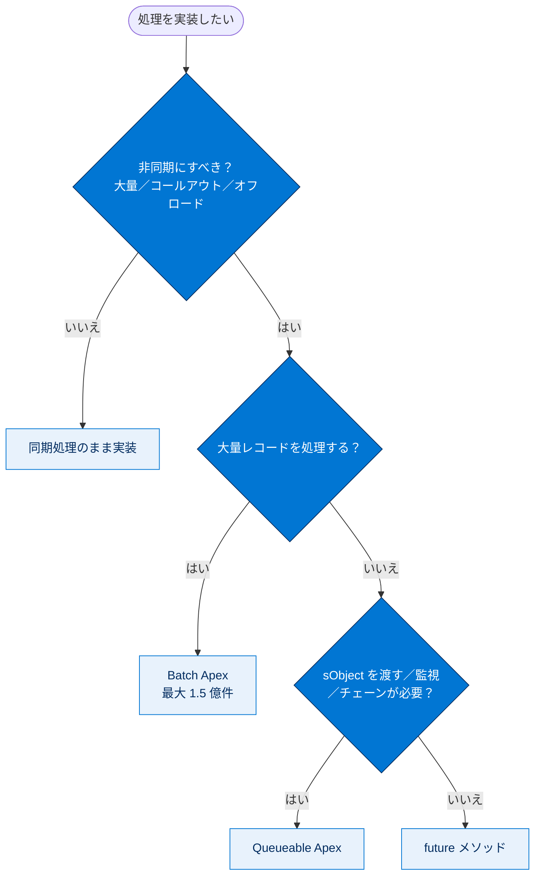
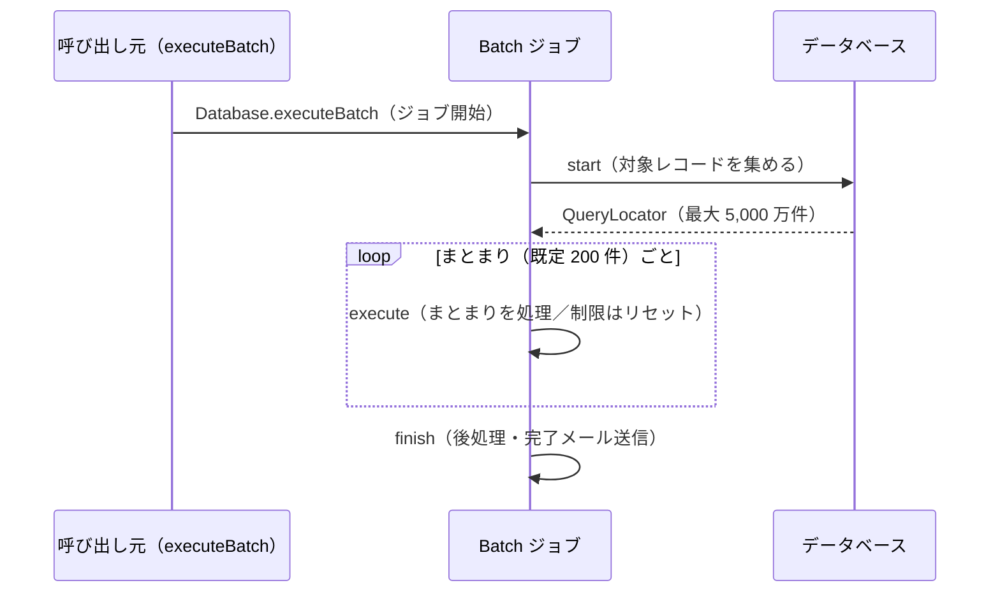
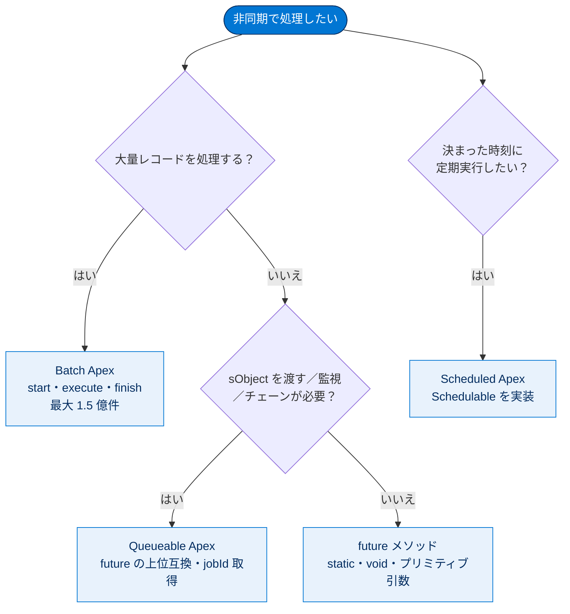

# 非同期 Apex の使用

## 学習の目的

この単元を完了すると、次のことができるようになります。

- どのような場合に非同期 Apex を使用するかを理解する
- `future` メソッドを使用して Web コールアウトを処理する
- Batchable インターフェースを使用して大量のレコードを処理する
- 中間突き合わせが必要な場合に Queueable インターフェースを使用する利点を理解する

> [!ポイント] この単元のゴール
>
> 非同期 Apex を使う 3 つの理由（**大量レコード・コールアウト・処理のオフロード**）と、4 つの手段（**future / Batch / Queueable / Scheduled**）の使い分けがゴールです。特に「future は sObject を引数に取れない／チェーンできない」「Queueable はその欠点を解消した上位互換」という対比が試験で頻出します。

> [!用語] 非同期 Apex（Asynchronous Apex）
>
> 呼び出した処理をその場で完了させず、**バックグラウンドで後から実行**する仕組み。ユーザーを待たせずに済み、同期処理より緩いガバナ制限が適用されるため、重い処理や時間のかかる処理に向きます。

---

## 非同期を使用する状況

Lightning プラットフォームで非同期プログラミングを選ぶ理由は、通常、次の **3 つ**です。

| 理由 | 説明 |
| --- | --- |
| **大量レコードの処理** | マルチテナント環境特有の理由。非同期プロセスの制限は同期より高く、数千〜数百万件を処理するなら非同期が最善 |
| **外部 Web サービスへのコールアウト** | コールアウトは時間がかかり、**トリガーから直接コールアウトはできない**ため非同期で行う |
| **処理のオフロード** | 一部の処理を非同期にまわしてユーザー体験を高速・快適にする。後回しでよい処理は後で実行する |

> [!用語] コールアウト（Callout）
>
> Salesforce から**外部システムの Web サービス（REST/SOAP）を呼び出す**こと。応答待ちで時間がかかるため、トリガーの処理中（同期）には直接行えず、`future` や Queueable などの非同期から実行します。

> [!例] 非同期が向いている場面
>
> - 夜間に **150 万件**の取引先データをクレンジングする → Batch
> - 取引先登録時に**外部の与信サービス**へ問い合わせる → future（callout=true）/ Queueable
> - 画面の保存はすぐ返し、**集計やメール送信は裏で**実行する → 処理のオフロード

非同期にすべきか、どの手段を選ぶかの判断フローは次のとおりです。



---

## future メソッド

Web サービスへのコールアウトや、単純な処理の非同期オフロードには `future` メソッドが最良の策となることがあります。

> [!用語] future メソッド（@future）
>
> メソッドに `@future` アノテーションを付けるだけで非同期にできる、最も手軽な非同期 Apex。Salesforce が空きリソースを見つけたタイミングで実行されます。

`@future` を付け、メソッドが **`static`** で **`void` 型のみを返す**ようにするだけです。たとえば Web サービスコールアウトを実行するメソッドは次のように書けます。

```apex
public class MyFutureClass {
    // コールアウトを行う場合は callout=true を指定する
    @future(callout=true)
    static void myFutureMethod(Set<Id> ids) {
        // future メソッドには sObject を引数で渡せないため、
        // ここで（ID をもとに）取引先責任者のリストを取得する
        List<Contact> contacts = [SELECT Id, LastName, FirstName, Email
            FROM Contact WHERE Id IN :ids];
        // 結果をループし、実際のコールアウトを行うメソッドを呼ぶ
        for(Contact con: contacts) {
            String response = anotherClass.calloutMethod(con.Id,
                con.FirstName,
                con.LastName,
                con.Email);
            // ここで応答内容をカスタムオブジェクトに
            // ログとして記録するコードを追加してもよい
        }
    }
}
```

> [!ポイント] future メソッドの 3 つのルール（暗記）
>
> 1. **`static`** メソッドであること
> 2. **戻り値は `void`**
> 3. 引数は**プリミティブ型かそのコレクション**のみ（sObject は不可）
>
> さらに、コールアウトを行うなら `@future(callout=true)` を指定します。作成後は他の静的メソッドと同様にコールします。

### future の制限事項

- **Apex ジョブ ID が返されない**ため、実行を追跡できません。
- **パラメーターはプリミティブ型またはそのコレクション**である必要があります（sObject は実行までに変更される可能性があるため不可）。
- **チェーニング（連鎖実行）や相互呼び出しができません**。特定順序での実行が必要なら Queueable Apex を使います。

> [!注意] なぜ sObject を渡せないのか
>
> future メソッドは「あとで」実行されます。その間に元のレコードが他の処理で書き換えられると、古い値で処理する恐れがあります。これを避けるため、**ID（プリミティブ）だけを渡し、future メソッドの中で最新のレコードを取り直す**のが定石です。

---

## Apex 一括処理またはスケジュール済み Apex

もう 1 つの非同期ツールが **Batchable インターフェース**です。最大の理由は**大量のレコードを処理**する必要があること。最大 1 億 5,000 万件のクリーンアップ/アーカイブには Batchable インターフェース（または Bulk API 2.0）を使い、特定時刻に実行されるようスケジュールもできます。

> [!用語] Batch Apex（一括処理 Apex）
>
> 大量レコードを**小さなまとまり（デフォルト 200 件）に分割し、何度もに分けて処理**する仕組み。各まとまりごとにガバナ制限がリセットされるため、合計で何百万件もの処理が可能です。`Database.Batchable` インターフェースを実装します。

クラスで `Database.Batchable` を実装し、`start()` / `execute()` / `finish()` を定義します。`Database.executeBatch` で呼び出します。

> [!ポイント] Batch の 3 メソッド（暗記）
>
> | メソッド | 役割 | 呼ばれる回数 |
> | --- | --- | --- |
> | `start()` | 処理対象のレコードを集める（QueryLocator か Iterable を返す） | **1 回だけ** |
> | `execute()` | 実際の処理。データはまとまり（既定 200 件）ごとに渡される | **まとまりの数だけ** |
> | `finish()` | 後処理（完了メールの送信など） | **1 回だけ（全 execute 完了後）** |

`start` で集めたレコードがまとまり（既定 200 件）に分割され、`execute` がまとまりの数だけ繰り返し呼ばれ、最後に `finish` が 1 回呼ばれる流れは次のとおりです。



次は、全取引先を処理し完了後にメールを送る Batchable クラスです。

```apex
global class MyBatchableClass implements
            Database.Batchable<sObject>,
            Database.Stateful {
    // 処理した取引先の合計件数を記録する
    global Integer numOfRecs = 0;
    // インターフェースメソッドに渡すレコードを集める。
    // このメソッドは 1 回だけ呼ばれ、ジョブに渡すレコード/オブジェクトを含む
    // Database.QueryLocator または Iterable を返す。
    global Database.QueryLocator start(Database.BatchableContext bc) {
        return Database.getQueryLocator('SELECT Id, Name FROM Account');
    }
    // データがまとまり（既定のバッチサイズは 200）に分割され、
    // ここで実際の処理が行われる。
    global void execute(Database.BatchableContext bc, List<Account> scope) {
        for(Account acc : scope) {
            // ここで何らかの処理を行い、
            // カウンタ変数をインクリメントする
            numOfRecs = numOfRecs + 1;
        }
    }
    // 必要な後処理を実行する。これは全バッチ完了後に
    // 1 回だけ呼ばれる。
    global void finish(Database.BatchableContext bc) {
        EmailManager.sendMail('someAddress@somewhere.com',
                              numOfRecs + ' Accounts were processed!',
                              'Meet me at the bar for drinks to celebrate');
    }
}
```

> [!用語] Database.Stateful / QueryLocator
>
> - **`Database.Stateful`**：通常、各 `execute()` 呼び出しでメンバー変数はリセットされます。これを実装すると**状態（変数の値）が次の execute に引き継がれ**、上記の `numOfRecs` のように合計件数を保持できます。
> - **`Database.QueryLocator`**：`start()` で対象レコードを指定する方法の 1 つ。SOQL で**最大 5,000 万件**まで対象にできます（単純な SOQL の上限を超えられる）。

匿名コードでの呼び出しは次のとおりです。

```apex
MyBatchableClass myBatchObject = new MyBatchableClass();
Database.executeBatch(myBatchObject);
```

> [!注意] スケジュール済み Apex について
>
> ここでは詳細は扱いませんが、Batchable インターフェースに似ています。`Schedulable` インターフェースを実装し、**特定の時刻（または定期間隔）に Apex を呼び出す**ために使います（例：毎晩 0 時に Batch を起動）。詳細は「非同期 Apex」モジュール参照。

### Batchable の制限事項

- **トラブルシューティングが煩雑**になることがあります。
- ジョブはキューに追加され、**サーバーの可用性に影響**されるため、予想より時間がかかる場合があります。
- 既述のとおり**制限があります**。

---

## Queueable Apex の登場

`future` メソッドと Batchable インターフェースには制限があり、より優れたソリューションを求める声が大きくなりました。そこで Salesforce は **Queueable Apex** で応えました。これは両者の最良の部分を 1 つにまとめた非同期ツールです。

> [!用語] Queueable Apex
>
> `Queueable` インターフェースを実装した非同期処理。`future` の手軽さを保ちつつ、その欠点（sObject を渡せない・追跡できない・チェーンできない）を解消した、いわば **future の上位互換**です。`System.enqueueJob()` で起動します。

Queueable Apex が `future` メソッドにもたらした利点は次のとおりです。

| 利点 | 内容 |
| --- | --- |
| **非プリミティブ型** | sObject やカスタム Apex データ型など、非プリミティブ型のパラメーターを受け入れられる |
| **監視（jobId）** | ジョブ送信時に `jobId` が返るため、ID でジョブを識別し進行状況を監視できる |
| **ジョブのチェーニング** | 実行中のジョブから 2 つ目のジョブを開始でき、連続的な処理に役立つ |

> [!ポイント] future と Queueable の対比（試験頻出）
>
> | 観点 | future | Queueable |
> | --- | --- | --- |
> | 引数 | プリミティブのみ | **sObject など何でも可** |
> | ジョブの追跡 | できない | **jobId で追跡可** |
> | チェーニング | 不可 | **可能** |
> | 戻り値 | void 必須 | （`execute` は void だが制約は緩い） |
>
> 「sObject を渡したい」「ジョブを監視・連鎖したい」なら Queueable を選ぶ、と覚えます。

先ほどの future コールアウト例を Queueable Apex で実装すると次のようになります。

```apex
public class MyQueueableClass implements Queueable {
    private List<Contact> contacts;
    // コンストラクタ。処理したい取引先責任者のリストを受け取る
    // （future と違い sObject のリストを直接渡せる）
    public MyQueueableClass(List<Contact> myContacts) {
        contacts = myContacts;
    }
    public void execute(QueueableContext context) {
        // コンストラクタで渡された取引先責任者をループし、
        // 実際のコールアウトを行うメソッドを呼ぶ
        for(Contact con: contacts) {
            String response = anotherClass.calloutMethod(con.Id,
                    con.FirstName,
                    con.LastName,
                    con.Email);
            // ここで応答内容をカスタムオブジェクトに
            // ログとして記録するコードを追加してもよい
        }
    }
}
```

呼び出しは次のとおり。`System.enqueueJob()` が返す `jobId` でジョブを監視できます。

```apex
List<Contact> contacts = [SELECT Id, LastName, FirstName, Email
    FROM Contact WHERE Is_Active__c = true];
Id jobId = System.enqueueJob(new MyQueueableClass(contacts));
```

---

## もうひとこと...

**Apex Flex キュー**も導入され、同時一括処理 5 つという制限が緩和され、キュー内のジョブの順序を監視・管理できるようになりました。テスト・ジョブ監視・ベストプラクティスなどの詳細は「非同期 Apex」モジュールを参照してください。

---

## 試験対策：押さえておきたい追加ポイント

> [!ポイント] 非同期 4 手段の使い分け（重要）
>
> | 手段 | 主な用途 | 特徴 |
> | --- | --- | --- |
> | **future** | 手軽なコールアウト・軽い処理のオフロード | static / void / プリミティブ引数のみ。追跡・チェーン不可 |
> | **Batch** | 大量レコード（最大 1.5 億件）の処理 | start/execute/finish。まとまりごとに制限リセット |
> | **Queueable** | sObject を渡したい・監視・チェーンしたい | future の上位互換。jobId が返る |
> | **Scheduled** | 決まった時刻・定期実行 | Schedulable を実装。Batch と組み合わせることが多い |

> [!ポイント] よくある引っかけ
>
> - 「**トリガーから直接コールアウトはできない**」→ future / Queueable 経由で行う。
> - 「future は sObject を引数に取れない」→ ID を渡して中で取り直す。
> - 「future ではジョブの追跡もチェーンもできない」→ それが必要なら Queueable。

---

## リソース

- Trailhead: 非同期 Apex
- Apex 開発者ガイド: 実行ガバナと制限

---

## テスト

この単元を完了するには、テストのすべての質問に正しく解答する必要があります。（+100 ポイント）

> [!まとめ] 確認テスト
>
> **問 1. 非同期処理を使用できるのはいつですか?**
> - A. 外部 Web サービスへのコールアウトを行う必要があるとき。
> - B. ユーザーの操作性をさらに適切に速くするとき。
> - C. 多くのレコードを処理しているとき。
> - **D. 上記のすべて**
>
> **問 2. 非同期処理のタイプでないものはどれですか?**
> - A. Apex 一括処理
> - B. Queueable Apex
> - C. future メソッド
> - **D. future Apex に戻る**（このような処理タイプは存在しない）

> [!ポイント] 解説
>
> - **問 1 → D**：大量レコード・コールアウト・処理のオフロードの 3 つすべてが非同期の使いどころです。
> - **問 2 → D**：実在する非同期タイプは future / Batch / Queueable / Scheduled。「future Apex に戻る」というタイプはありません。

---

## 🎓 この単元のまとめ

この単元は「**非同期 Apex の 3 つの使いどころと 4 つの手段**」を学びました。大量レコード・コールアウト・処理のオフロードという目的に対し、future / Batch / Queueable / Scheduled をどう選ぶかが要点です。

次の図は、非同期手段の選び方を 1 枚で俯瞰したものです。



> [!まとめ] この単元の要点
>
> - 非同期を使う理由は **大量レコード処理・外部コールアウト・処理のオフロード**の 3 つ。
> - **future**：`@future` を付けるだけで手軽。**`static` / 戻り値 `void` / 引数はプリミティブのみ**。追跡・チェーン不可。
> - **Batch**：`start` / `execute` / `finish` を実装。**まとまり（既定 200 件）ごとに制限がリセット**され最大 1.5 億件を処理可能。
> - **Queueable**：future の上位互換。**sObject を渡せ・`jobId` で追跡でき・チェーンもできる**。
> - **トリガーから直接コールアウトはできない**ため、future / Queueable 経由で行う。

> [!豆知識] Queueable は「いいとこ取り」で生まれた
>
> Queueable Apex は、future の手軽さ（クラスを `enqueueJob` で投げるだけ）と Batch の柔軟さ（sObject を保持できる・チェーンできる）の「両方の良い部分」を 1 つにまとめる形で後発で登場しました。そのため公式ドキュメントでも future の制約を解消した存在として紹介され、現場では「迷ったら future より Queueable」と言われることが多いツールです。
