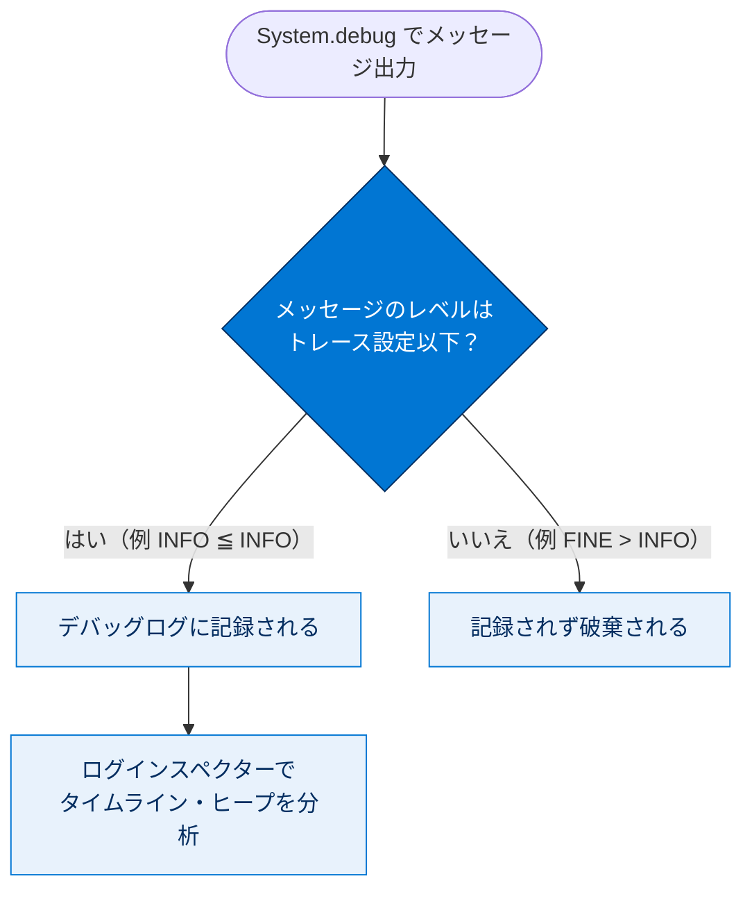

# デバッグと診断の実行

## 学習の目的

この単元を完了すると、次のことができるようになります。

- Lightning プラットフォームで使用可能なデバッグ機能について理解する
- 開発者コンソールのログインスペクターを使用してデバッグログを調べる

> [!ポイント] この単元のゴール
>
> 「**デバッグ情報の主役はデバッグログ**」であること、ログレベル（NONE 〜 FINEST）の順序、そして「**チェックポイントは実行を止めないブレークポイント**」という 3 点を押さえれば、この単元の試験対策は十分です。

---

## Lightning プラットフォームでのデバッグについて

Lightning プラットフォームのデバッグは Visual Studio とは似ていません。**マルチテナントクラウド環境のデバッグには特有の課題**があるためです。とはいえデバッグや診断ができないわけではなく、これまでとは異なるだけです。Salesforce はこの分野でリリースごとに機能を強化しています。

> [!注意] なぜ .NET と同じようにデバッグできないのか
>
> 全ユーザーが同じインフラを共有するマルチテナント環境では、誰か一人が実行を途中で止めると全員に影響します。そのため、.NET のような「行で実行を止めるブレークポイント」は使えず、**ログ中心**のデバッグになります。後述のチェックポイントも、実行を止めない点が大きな違いです。

---

## 頼れる味方、デバッグログ

コードのデバッグと分析に必要な情報のほとんどは**デバッグログ**で見つかります。出力は次のように行います。

```apex
System.debug('My Debug Message');
```

> [!用語] デバッグログ（Debug Log）/ System.debug()
>
> コードの実行内容（イベント、変数の値、ガバナ制限の使用状況など）を記録した実行ログ。`System.debug()` で任意のメッセージを書き出せます。Lightning プラットフォームでは、これがデバッグ情報を得る**最も主要な手段**です。

ログレベルを指定することもできます。

> [!ポイント] ログレベルの順序（暗記）
>
> 上記は**低い順**で、各レベルには下位レベルが含まれます。つまり **FINEST を選ぶと ERROR / WARN / INFO などすべてが記録**されます。詳細に見たいほど右側を、ログ量を抑えたいほど左側を選びます。複数のログ**カテゴリ**もあり、ログレベルに応じて記録される情報量が決まります。


成功には制限の理解が不可欠なので、ログの制限も押さえます。

> [!ポイント] デバッグログのサイズ制限（試験頻出）
>
> | 項目 | 制限値 |
> | --- | --- |
> | 1 つのデバッグログの最大サイズ | **20 MB** |
> | 1 組織が保持できるデバッグログの合計 | **1,000 MB** |
>
> 1 ログが 20 MB を超えると、その先の情報が記録されません。組織の合計が 1,000 MB を超えると、**最も古いログから上書き**されます。

> [!注意] ログが大きくなりすぎたら
>
> ログレベルを必要以上に詳細（FINEST など）にすると、すぐに 20 MB に達して肝心の情報が切れます。**調査対象のカテゴリだけ詳細にし、他は粗く**するのがコツです。

---

## ログインスペクターを使用する

> [!用語] ログインスペクター（Log Inspector）
>
> 開発者コンソールでデバッグログを**視覚的に分析**するツール。タイムライン、実行単位（Executed Units）、実行ログ、ヒープなどを「パースペクティブ」として切り替えて確認できます。

匿名コードを実行して結果を確認しましょう。

> [!手順] ログレベルとパースペクティブを準備する
>
> 1. **[Setup（設定）]** から **[Developer Console（開発者コンソール）]** を選択する。
> 2. **[Debug（デバッグ）] > [Change Log Levels（ログレベルの変更）]** を選択する。
> 3. **[General Trace Setting for You（全般トレース設定）]** で **[Add/Change（追加/変更）]** リンクをクリックする。
> 4. すべての列のデバッグレベルとして **[INFO（情報）]** を選択する。
> 5. **[完了]** をクリックし、もう一度 **[完了]** をクリックする。
> 6. **[Debug（デバッグ）] > [Perspective Manager（パースペクティブマネージャー）]** を選択する。
> 7. **[All (Predefined)（すべて (定義済み)）]** を選択し、**[Set Default（デフォルトの設定）]** をクリックする。
> 8. デフォルトのパースペクティブに変更するため **[Yes（はい）]** をクリックする。
> 9. **[Perspective（パースペクティブ）]** ウィンドウを閉じる。

> [!用語] パースペクティブ（Perspective）
>
> ログインスペクターのパネル配置（タイムライン、実行ログ、ヒープなど）の組み合わせを指す表示プリセット。調査内容に応じて切り替えます。`All (Predefined)` はすべてのパネルを表示する定義済みレイアウトです。

> [!手順] 匿名 Apex を実行する
>
> 1. **[Debug（デバッグ）] > [Open Execute Anonymous Window（実行匿名ウィンドウを開く）]** を選択する。
> 2. 既存のコードを削除し、次のスニペットを挿入する。
> 3. **[Open Log（ログを開く）]** が選択されていることを確認し、**[Execute（実行）]** をクリックする。

```apex
System.debug(LoggingLevel.INFO, 'My Info Debug Message');
System.debug(LoggingLevel.FINE, 'My Fine Debug Message');
List<Account> accts = [SELECT Id, Name FROM Account];
for(Account a : accts) {
    System.debug('Account Name: ' + a.name);
    System.debug('Account Id: ' + a.Id);
}
```

> [!例] ログレベル指定の効果
>
> 上のコードは 1 行目を `INFO`、2 行目を `FINE` で出力しています。トレース設定が `INFO` のとき、`INFO` のメッセージは記録されますが、より詳細な `FINE` のメッセージは**記録されません**。FINE を見るにはトレース設定を FINE 以上（詳細側）に上げます。

トレース設定のレベルとメッセージのレベルを照合し、記録するか破棄するかを判断する流れは次のとおりです。



> [!手順] 結果を調べ、ログレベルを変えて再確認する
>
> 1. **[Debug（デバッグ）] > [Switch Perspective（パースペクティブを切り替え）] > [All (Predefined)（すべて (定義済み)）]** を選択する。
> 2. **[Timeline（タイムライン）]** タブと **[Executed Units（実行単位）]** タブで結果を調べる。
> 3. **[Execution Log（実行ログ）]** の **[Filter（検索条件）]** に `FINE` と入力する。デバッグレベルが INFO のため結果は表示されない。
> 4. **[Debug（デバッグ）] > [Change Log Levels（ログレベルの変更）]** を選択する。
> 5. **[Add/Change（追加/変更）]** リンクをクリックし、`ApexCode` と `Profiling` の DebugLevel を **[FINEST（最も詳細）]** に変更する。
> 6. **[完了]** をクリックし、もう一度 **[完了]** をクリックする。
> 7. **[Open Execute Anonymous Window]** を開き、既存のコードはそのままに **[Execute（実行）]** をクリックする。
> 8. **[Execution Log]** の **[Filter]** に `FINE` と入力する（**大文字小文字を区別**）。今度は「My Fine Debug Message」が表示される。
> 9. **[Logs（ログ）]** タブで 2 つの最新ログ間のサイズの違いも確認する。

> [!ポイント] フィルタは大文字小文字を区別する
>
> 実行ログの **[Filter]** は大文字小文字を区別します。`FINE` と `fine` は別物として扱われるので注意してください。

---

## チェックポイントを設定する

クラウドベースのマルチテナント環境では、誰でも実行を停止してデータベース接続を開いたままにできると壊滅的な事態になります。そのため .NET のブレークポイントの代わりにチェックポイントを使います。

> [!用語] チェックポイント（Checkpoint）
>
> ブレークポイントに似て、特定のコード行の**詳細な実行情報（変数の値やヒープの状態）を取得**できる機能。ただし**その行で実行を停止しない**点が決定的に異なります。マルチテナント環境を止めないための工夫です。

> [!ポイント] チェックポイント vs ブレークポイント（試験頻出）
>
> | 項目 | ブレークポイント（.NET） | チェックポイント（Salesforce） |
> | --- | --- | --- |
> | 実行を止めるか | **止める** | **止めない** |
> | 得られる情報 | その時点の状態 | その行通過時のスナップショット |
> | 環境 | ローカル単独 | マルチテナント共有 |
>
> 「チェックポイントは実行を停止しない」は頻出。引っかけ問題の定番です。

前の「実行コンテキストの理解」単元で作成したコードにチェックポイントを設定します。`AccountTrigger` のハンドラーとトリガーをまだ作成していない場合は、先にその単元の該当セクションを完了してください。

> [!手順] チェックポイントを設定して情報を確認する
>
> 1. **[File（ファイル）] > [Open（開く）]** を選択する。
> 2. エンティティ種別として **[Classes（クラス）]**、エンティティとして **[AccountHandler]** を選択する。
> 3. **[Open（開く）]** をクリックする。
> 4. カーソルを **10 行目**の左余白の上に置いて 1 回クリックする。行番号の横に赤いドットが表示される。
> 5. **[Logs（ログ）]** パネルで最新のエントリをダブルクリックしてデバッグログを開く。
> 6. **[Debug（デバッグ）] > [Open Execute Anonymous Window]** を選択する。
> 7. 既存のコードを削除し、次のスニペットを挿入する。
> 8. **[Open Log（ログを開く）]** が選択されていることを確認し、**[Execute（実行）]** をクリックする。
> 9. **[Checkpoints（チェックポイント）]** タブをクリックし、表示された最初のエントリをダブルクリックする。チェックポイントインスペクターが表示される。
> 10. **[Symbols（記号）]** タブで実行ツリー内のノードを展開し、**[Key（キー）]** 列と **[Value（値）]** 列を確認する。
> 11. **[Heap（ヒープ）]** タブをクリックし、**[Count（件数）]** 列と **[Total Size（合計サイズ）]** 列を確認する。

```apex
Account acct = new Account(
    Name='Test Account 3',
    Phone='(415)555-8989',
    NumberOfEmployees=30,
    BillingCity='San Francisco');
insert acct;
```

> [!用語] ヒープ（Heap）
>
> 実行中にメモリ上へ確保されたオブジェクトの集まり。チェックポイントの **[Heap]** タブでは、どのオブジェクトがいくつ・どれだけのサイズを占めているかを確認でき、メモリ（ヒープサイズ）のガバナ制限調査に役立ちます。

---

## 次のステップ

これで Apex の基本が理解できました。既存の開発スキルを活かして Salesforce アプリをすばやく構築するには、開発者向け初級トレイルを進めてください。

---

## 試験対策：押さえておきたい追加ポイント

> [!ポイント] この単元の頻出ポイントまとめ
>
> - デバッグ情報の主要ソースは **デバッグログ**（`System.debug()`）。
> - ログレベルは **NONE → ERROR → WARN → INFO → DEBUG → FINE → FINER → FINEST** の順で、右ほど詳細。上位レベルは下位を含む。
> - 1 ログ **20 MB**／組織合計 **1,000 MB**（超過分は古いログから上書き）。
> - **ログインスペクター**でタイムライン・実行単位・ヒープなどを視覚的に分析できる。
> - 実行ログの **Filter は大文字小文字を区別**する。
> - **チェックポイントは実行を停止しない**（ブレークポイントとの最大の違い）。

---

## リソース

- Apex 開発者ガイド: Debug Log（デバッグログ）
- Apex 開発者ガイド: Working with Logs in the Developer Console（開発者コンソールを使用したログの操作）
- Salesforce ヘルプ: ログインスペクターの使用例
- Salesforce ヘルプ: Apex コードへのチェックポイントの設定

---

## テスト

この単元を完了するには、テストのすべての質問に正しく解答する必要があります。（+100 ポイント）

> [!まとめ] 確認テスト
>
> **問 1. Lightning プラットフォームのデバッグ情報の主なソースは?**
> - A. Apex ベリファイアー
> - B. Apex エラーレポートログ
> - **C. デバッグログ**
> - D. スタックログ
>
> **問 2. チェックポイントについて正しいものはどれですか?**
> - A. 本番組織のみで実行できる。
> - B. 非同期 Apex ではチェックポイントを使用できない。
> - C. トリガーではチェックポイントを使用できない。
> - **D. 実行はチェックポイントが設定された行で停止しない。**

> [!ポイント] 解説
>
> - **問 1 → C**：Salesforce ではデバッグログが情報取得の中心。他の選択肢は実在しない名称の引っかけです。
> - **問 2 → D**：チェックポイントはブレークポイントと違い、その行で**実行を止めません**。これが本単元の最重要ポイントです。

---

## 🎓 この単元のまとめ

この単元は「**マルチテナント環境ならではのデバッグ手法**」を学びました。実行を止められないクラウド環境では、デバッグログとログインスペクター、そして実行を止めないチェックポイントが主役になります。

下表は、この単元で押さえるべき要点を凝縮したものです。

| 項目 | 押さえどころ | 数値・キーワード |
| --- | --- | --- |
| **デバッグログ** | デバッグ情報の主要ソース | `System.debug()` で出力 |
| **ログレベル** | 右ほど詳細・上位は下位を含む | NONE → ERROR → WARN → INFO → DEBUG → FINE → FINER → FINEST |
| **ログのサイズ制限** | 超過分は古いログから上書き | 1 ログ **20 MB** / 組織合計 **1,000 MB** |
| **ログインスペクター** | ログを視覚的に分析 | タイムライン・実行単位・ヒープ・パースペクティブ |
| **チェックポイント** | ブレークポイントと違い**実行を止めない** | Filter は大文字小文字を区別 |

> [!まとめ] この単元の要点
>
> - デバッグ情報の主要ソースは **デバッグログ**（`System.debug()`）。
> - ログレベルは **NONE → ERROR → WARN → INFO → DEBUG → FINE → FINER → FINEST** の順で、右ほど詳細。上位は下位を含む。
> - サイズ制限は 1 ログ **20 MB**、組織合計 **1,000 MB**（超過分は古いログから上書き）。
> - **ログインスペクター**でタイムライン・実行単位・ヒープを視覚的に分析できる。実行ログの **Filter は大文字小文字を区別**する。
> - **チェックポイントは実行を停止しない**（.NET のブレークポイントとの最大の違い・頻出の引っかけ）。

> [!豆知識] 「止められないデバッグ」は弱点ではなく設計思想
>
> .NET 開発者がまず驚くのが「ブレークポイントで実行を止められない」点ですが、これはマルチテナント（1 つの基盤を全顧客が共有）を守るための意図的な設計です。1 人が DB 接続を握ったまま実行を止めると、同じ基盤を共有する他社の処理まで巻き添えになりかねません。チェックポイントは「止めずにスナップショットだけ取る」ことで、共有環境の安定とデバッグの両立を実現しています。
