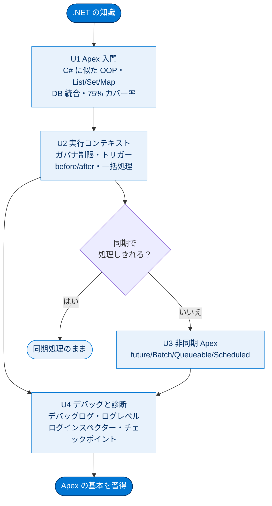

# Apex と .NET の基本 総まとめ

このトピックでは、.NET 開発者の知識を足がかりに **Apex と Lightning プラットフォーム**の世界へ入りました。Apex が C# に似たオブジェクト指向言語であること、コードが「実行コンテキスト」という単位で動きそこにガバナ制限が適用されること、重い処理を非同期 Apex（future / Batch / Queueable / Scheduled）に逃がすこと、そしてマルチテナント環境ならではのデバッグ手法までを一気通貫で学びました。「宣言型で無理ならコード」「DB と言語が一体」「制限を意識した一括処理」という Salesforce 開発の根本思想を押さえるのがゴールです。

---

## 全体像

次の図は、このトピック全体（4 ユニット）の関係と流れを 1 枚で俯瞰したものです。

---

## ユニット横断 早見表

| ユニット | 学んだこと | キーワード | 一言要点 |
| --- | --- | --- | --- |
| **01 .NET の概念の対応付け** | Apex / Lightning の基本、.NET との類似点・相違点、最初の Apex クラスと匿名 Apex | Apex・メタデータ駆動・List/Set/Map・with sharing・75% カバー率 | C# に似た OOP 言語が DB と一体で動く |
| **02 実行コンテキストの理解** | 実行コンテキスト、トリガー、ガバナ制限、一括処理対応 | 実行コンテキスト・ガバナ制限・before/after・200 件・SOQL 100/DML 150・バルク化 | 1 起点 = 1 制限。ループ内に SOQL/DML を書かない |
| **03 非同期 Apex の使用** | 非同期の 3 つの使いどころと 4 つの手段の使い分け | future・Batch・Queueable・Scheduled・コールアウト・jobId | 大量・コールアウト・オフロードは非同期へ |
| **04 デバッグと診断の実行** | デバッグログ、ログレベル、ログインスペクター、チェックポイント | System.debug・ログレベル・20MB/1000MB・チェックポイント | ログ中心、実行は止めずに調べる |

---

## 🎯 試験頻出ポイント

> [!ポイント] このトピックで狙われやすい論点・暗記値
>
> **言語・基礎（U1）**
> - Apex は **C# / Java に似た OOP 言語**。**大文字小文字を区別しない**。変数はデフォルトで **`null`**。
> - コレクションは **List / Set / Map の 3 種だけ**。SOQL の結果は必ず **List**。
> - 本番リリースには **75% のテストカバー率**が必須。存在しない項目を参照するコードは保存不可。
>
> **実行コンテキスト・制限（U2）**
> - 実行コンテキスト = **`EXECUTION_STARTED` 〜 `EXECUTION_FINISHED`**。この単位で 1 セットのガバナ制限。
> - トリガー **最大 200 件** / 同期 SOQL **100** / DML **150**。**ループ内に SOQL・DML を書かない**。
> - **before**＝加工・検証（DML 不要）、**after**＝確定 `Id` 利用・関連レコード作成。**1 オブジェクト 1 トリガー**。
>
> **非同期（U3）**
> - 非同期の理由は **大量レコード・コールアウト・オフロード**。
> - **future** は `static` / `void` / プリミティブ引数のみ・追跡/チェーン不可。**トリガーから直接コールアウトは不可**。
> - **Queueable** は future の上位互換（sObject 可・`jobId` で追跡・チェーン可）。**Batch** は `start/execute/finish`、まとまりごとに制限リセット。
>
> **デバッグ（U4）**
> - 情報源は **デバッグログ**。ログレベルは **NONE → ERROR → WARN → INFO → DEBUG → FINE → FINER → FINEST**。
> - 1 ログ **20 MB** / 組織合計 **1,000 MB**。**チェックポイントは実行を止めない**。

---

## 📖 用語早見表

| 用語 | ひとことの意味 |
| --- | --- |
| **Apex** | Salesforce 専用の C#/Java に似た OOP 言語。プラットフォーム上で直接実行される |
| **Lightning プラットフォーム** | Salesforce アプリを動かす土台（PaaS）。旧称 Force.com |
| **メタデータ駆動型アーキテクチャ** | データ構造の定義（メタデータ）を中心に組み立てる設計思想。宣言型開発を可能にする |
| **宣言型 / プログラム型** | クリックで作る方式 / コードで作る方式。まず宣言型を検討する |
| **sObject** | Salesforce のオブジェクト（DB テーブル相当）を Apex で表す型 |
| **SOQL** | Salesforce のレコードを取得する問い合わせ言語。結果は必ず List |
| **DML** | レコードを操作する命令（insert/update/delete/upsert/undelete） |
| **実行コンテキスト** | 1 起点から終了までの処理のまとまり。1 セットのガバナ制限が適用される |
| **ガバナ制限** | 1 組織がリソースを独占しないための実行ごとの上限値 |
| **マルチテナント** | 1 つの物理基盤を多数の顧客が共有するアーキテクチャ |
| **トリガー** | レコードの保存イベントに連動して自動実行される Apex |
| **一括処理対応（バルク化）** | 複数レコードをまとめて処理できるようにコードを書くこと |
| **非同期 Apex** | バックグラウンドで後から実行する仕組み（future/Batch/Queueable/Scheduled） |
| **コールアウト** | Salesforce から外部 Web サービスを呼び出すこと |
| **デバッグログ** | 実行内容を記録したログ。`System.debug()` で出力する |
| **チェックポイント** | 行の状態を取得できるが**実行は止めない**診断機能 |

---

> [!豆知識] 「75%」という数字が決まっている理由
>
> 本番デプロイに必要なテストカバー率「75%」は、Salesforce が組織のコード品質を一定以上に保つために設けた共通ライン。100% を求めないのは現実的に難しいゲッターやデバッグ行があるためで、「重要なロジックは確実にテストされている」ことを担保しつつ開発者の負担を抑える、絶妙なバランスとして長年この値が使われています。

> [!豆知識] トリガーの「200 件」とバッチの「200 件」は別物
>
> トリガーが一度に受け取る最大 200 件と、Batch Apex の既定バッチサイズ 200 件はどちらも「200」ですが意味が違います。前者は「1 回の DML がまとめて起動するトリガーのレコード数の上限」、後者は「大量レコードを分割するときの 1 まとまりの既定サイズ（変更可能）」です。数字が同じなので混同しやすい頻出の引っかけポイントです。

> [!豆知識] 匿名 Apex はデータベースにも保存されない
>
> 開発者コンソールの「実行匿名ウィンドウ」で動かす匿名 Apex は、クラスとして組織に保存されず、その場で 1 回だけコンパイル・実行されて消えます。ちょっとした動作確認やデータ修正に便利な反面、テストカバレッジには一切寄与しないため、本番に残すロジックは必ずクラスとして書く必要があります。

---

## ✅ 理解度セルフチェック

> [!まとめ] このトピックを思い出せるか確認しよう（答えは各行末）
>
> 1. Apex で使えるコレクションは何種類で、それぞれ何か？ → **3 種類。List / Set / Map**
> 2. 本番組織へのデプロイに必要なテストカバー率は？ → **75%**
> 3. （穴埋め）実行コンテキストは `EXECUTION_STARTED` から ＿＿＿＿ まで。 → **`EXECUTION_FINISHED`**
> 4. トリガーが一度に受け取るレコードの最大件数と、同期 SOQL・DML の上限は？ → **200 件 / SOQL 100 / DML 150**
> 5. 「future メソッドは sObject を引数に取れる」は Yes / No？ → **No（プリミティブとそのコレクションのみ。sObject を渡したいなら Queueable）**
> 6. 「チェックポイントは設定した行で実行を停止する」は Yes / No？ → **No（実行を止めず情報だけ取得する）**
