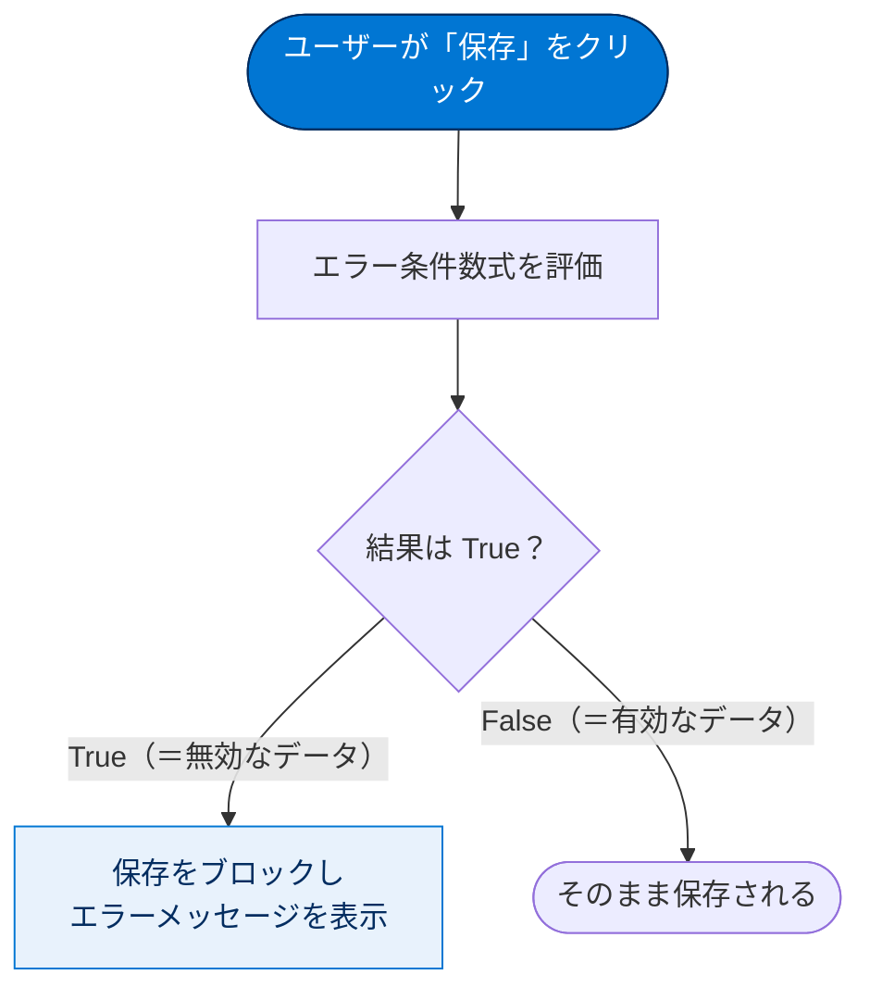
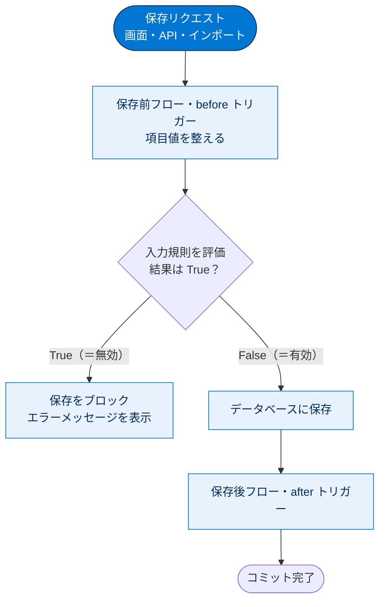

# 入力規則の作成

## 学習の目的

この単元を完了すると、次のことができるようになります。

- 入力規則の 2 つの使用事例を説明する。
- 入力規則の要素をリストする。
- 入力規則を作成する。

> [!ポイント] この単元のゴール
>
> 「**おかしなデータを保存させない番人**」が入力規則です。次の3点を押さえれば試験対策は十分です。
> - 入力規則は **保存の直前** にチェックされる。
> - エラー条件数式が **True を返したら保存をブロック**してエラーメッセージを出す（True＝無効なデータ）。
> - 入力規則の要素は **ルール名・エラー条件数式・エラーメッセージ・エラー表示場所** の4つ。

---

## 入力規則の概要

入力規則は、レコードを保存する前に、入力データが基準を満たすかを確認します。1 つ以上の項目を評価する数式や条件式を設定し、「True」または「False」を返します。

> [!用語] 入力規則（Validation Rule）
>
> レコードを**保存する直前に**、入力データが正しいかをチェックする仕組み。条件に合わない（無効な）データを保存しようとすると保存を止めてエラーメッセージを表示します。データの品質（正確さ・統一性）を保つ「番人」のような機能です。

> [!注意] 「True＝エラー」という向きに注意（最重要）
>
> 直感に反しますが、入力規則の数式が **True を返すと「無効なデータ」とみなして保存をブロック**します。「データが正しいか？」ではなく「**データが間違っているか？（エラー条件に当てはまるか？）**」を書くのがコツです。この向きを取り違えると規則が逆に動くため、試験でも実務でも最頻出の落とし穴です。

> [!例] 入力規則の使いどころ
>
> - すべての電話番号項目に、指定された形式が含まれていることを確認する。
> - 特定の商品の割引が、定義済みの割合を超えないことを確認する。
> - 取引先番号が必ず8文字であることを確認する（このあと作成する例）。



---

## 入力規則の定義

入力規則はオブジェクト・項目・キャンペーンメンバー・ケースマイルストーンに作成できます。次の手順では、不正な長さの取引先番号で保存しようとしたときに実行される入力規則を作成します。

> [!用語] 入力規則の4つの要素
>
> 入力規則は、おもに次の要素から構成されます。試験では「入力規則の要素を挙げよ」という形で問われます。
>
> | 要素 | 役割 |
> | --- | --- |
> | **ルール名（Rule Name）** | 規則を識別する名前。スペース不可（アンダースコアで区切る）。 |
> | **エラー条件数式（Error Condition Formula）** | True/False を返す数式。**True なら保存をブロック**する。 |
> | **エラーメッセージ（Error Message）** | ブロック時にユーザーへ表示する文言。 |
> | **エラー表示場所（Error Location）** | エラーをページ上部に出すか、特定の項目の近くに出すか。 |

### 入力規則の作成

取引先番号が8文字でないと保存できない入力規則を作ります。

> [!手順] 取引先番号を8文字に限定する入力規則を作成する
>
> 1. **[Setup (設定)]** から **[Object Manager (オブジェクトマネージャー)]** に移動し、**[Account (取引先)]** をクリックします。
> 2. 左サイドバーで **[Validation Rules (入力規則)]** をクリックします。
> 3. **[新規]** をクリックします。
> 4. 入力規則に次のプロパティを入力します。
>    - Rule Name (ルール名): `Account_Number_8_Characters`
>    - Error Condition Formula (エラー条件数式): `LEN( AccountNumber) <> 8`
>    - Error Message (エラーメッセージ): `Account number must be 8 characters long.`（取引先番号は 8 文字にする必要があります。）
> 5. **[Check Syntax (構文を確認)]** をクリックして数式にエラーがないか確認します。
> 6. **[Save (保存)]** をクリックして終了します。

```text
LEN( AccountNumber ) <> 8
```

> [!用語] LEN() 関数と `<>` 演算子
>
> - `LEN(text)` … テキストの**文字数**を返す関数。`LEN("ABC")` は `3`。
> - `<>` … 「**等しくない（Not Equal、不等号）**」を表す演算子。
>
> したがって `LEN(AccountNumber) <> 8` は「取引先番号の文字数が **8 ではない** か？」を意味します。8 文字でなければ True（＝無効）となり、保存がブロックされます。

---

## 入力規則の例

自分で試せる入力規則の例を紹介します。それぞれ「どんな関数を使い、どんな条件を判定しているか」を読み解きましょう。

---

### 例1: 取引先番号は数値で指定する

使われている関数・演算子:

- **AND**: すべての値が true なら「True」、1 つでも false なら「False」を返す。
- **ISBLANK**: 式に値があるかを判断する（空なら True）。
- **ISNUMBER**: 式の値が数値かを判断する（数値なら True）。
- **NOT**: 真偽を反転させる。

「取引先番号が**空白でも数値でもない**か」を判断します。数値以外を入力すると True を返しエラーメッセージを表示します。

| 項目 | 値 |
| --- | --- |
| **説明** | [Account Number (取引先番号)] が数値になっていることを確認します（空白でない場合）。 |
| **エラーメッセージ** | 取引先番号が数値になっていません。 |
| **エラー表示場所** | 取引先番号 |

```text
AND(
   NOT(ISBLANK(AccountNumber)),
   NOT(ISNUMBER(AccountNumber))
)
```

> [!例] 数式を分解して読む
>
> - `NOT(ISBLANK(AccountNumber))` … 取引先番号が**空ではない**とき True。
> - `NOT(ISNUMBER(AccountNumber))` … 取引先番号が**数値ではない**とき True。
> - `AND(...)` … 上の2つが**両方 True**のときだけ True。
>
> つまり「**値が入っていて、かつ数値ではない**」ときにだけ保存をブロックします。空欄のときはブロックしません（`ISBLANK` 側が False になるため）。

---

### 例2: 今年の日付であること

使われている関数・演算子:

- **YEAR**: 指定された日付の 4 桁の年を返す。
- **TODAY**: 現在の日付を返す。
- **`<>`**: 等しくないかを判断する。

「指定された日付の年が今日の年と等しくない」かを判断します。現在の年でない日付を入力すると True を返しエラーメッセージを表示します。

| 項目 | 値 |
| --- | --- |
| **説明** | カスタム日付項目（[My Date (私の日付)]）の値が、今年の日付であることを確認します。 |
| **エラーメッセージ** | 今年の日付を入力してください。 |
| **エラー表示場所** | 私の日付 |

```text
YEAR( My_Date__c ) <> YEAR( TODAY() )
```

> [!用語] カスタム項目の API 参照名（`__c`）
>
> `My_Date__c` の末尾の `__c` は、その項目が**カスタム項目**であることを示す印（サフィックス）。数式や入力規則で項目を参照するときはこの **API 参照名**を使います。標準項目（例: `BillingCountry`）には `__c` は付きません。

---

### 例3: 数値範囲入力規則

「2 つの値（最大給与と最小給与）の差が 20,000 ドルより大きい」かを判断します。差が 20,000 ドルを超えると True を返しエラーメッセージを表示します。

| 項目 | 値 |
| --- | --- |
| **説明** | [Salary Min (最小給与)] と [Salary Max (最大給与)] の範囲が 20,000 ドルを超えないことを確認します。 |
| **エラーメッセージ** | 給与の範囲は 20,000 ドルです。最大または最小給与の値を変更してください。 |
| **エラー表示場所** | 最大給与 |

```text
(Salary_Max__c - Salary_Min__c) > 20000
```

> [!例] 数値で確認
>
> - 最大給与 80,000・最小給与 65,000 → 差は 15,000 → `> 20000` は False → 保存できる。
> - 最大給与 90,000・最小給与 60,000 → 差は 30,000 → `> 20000` は True → 保存をブロック。

---

### 例4: Web サイトの拡張子

使われている関数・演算子:

- **AND**: すべての値が true なら「True」、1 つでも false なら「False」を返す。
- **`<>`**: 等しくないかを判断する。

ユーザーが入力した URL の拡張子が 6 つの有効な拡張子のいずれとも等しくない場合に True を返し、エラーメッセージを表示します。いずれかと等しければ有効なので False を返します。

| 項目 | 値 |
| --- | --- |
| **説明** | [Web Site (Web サイト)] の最後の 4 文字が、有効な Web サイトの拡張子になっていることを確認します。 |
| **エラーメッセージ** | Web サイトには、.com、.org、または .net の拡張子が必要です。 |
| **エラー表示場所** | Web サイト |

```text
AND(
   RIGHT( Web_Site__c, 4) <> ".COM",
   RIGHT( Web_Site__c, 4) <> ".com",
   RIGHT( Web_Site__c, 4) <> ".ORG",
   RIGHT( Web_Site__c, 4) <> ".org",
   RIGHT( Web_Site__c, 4) <> ".NET",
   RIGHT( Web_Site__c, 4) <> ".net"
 )
```

> [!用語] RIGHT() 関数
>
> `RIGHT(text, 文字数)` は、テキストの**右側から指定文字数**を取り出します。`RIGHT("example.com", 4)` は `.com` を返します。ここでは URL の末尾4文字を取り出し、有効な拡張子のどれとも一致しないかを確認しています。

> [!注意] 大文字・小文字を別々に書く理由
>
> `".COM"` と `".com"` を**両方**チェックしているのは、Salesforce の数式が**大文字・小文字を区別する**ためです。`AND()` で「どの拡張子とも一致しない（すべて `<>` が True）」ときだけ True になり保存をブロックします。

---

### 例5: 有効な [国 (請求先)]

使われている関数・演算子:

- **OR**: 1 つ以上が true なら「True」、すべて false なら「False」を返す。
- **LEN**: テキストの文字数を返す。
- **CONTAINS**: あるテキストに指定文字列が含まれているかを判断する。
- **NOT**: 真偽を反転させる。

[Billing Country (国 (請求先))] が 1 文字、または有効な 2 文字コードのいずれでもない場合に True を返しエラーメッセージを表示します。有効な 2 文字コードなら両方の式が false になり、False を返します。

| 項目 | 値 |
| --- | --- |
| **説明** | 取引先の [国(請求先)] が、ISO 3166 で有効な 2 文字のコードになっているかを確認します。 |
| **エラーメッセージ** | 2 文字の有効な国コードを入力してください。 |
| **エラー表示場所** | Billing Country (国(請求先)) |

```text
OR(
LEN(BillingCountry) = 1,
NOT(
CONTAINS(
"AF:AX:AL:DZ:AS:AD:AO:AI:AQ:AG:AR:AM:" &
"AW:AU:AZ:BS:BH:BD:BB:BY:BE:BZ:BJ:BM:BT:BO:" &
"BA:BW:BV:BR:IO:BN:BG:BF:BI:KH:CM:CA:CV:KY:" &
"CF:TD:CL:CN:CX:CC:CO:KM:CG:CD:CK:CR:CI:HR:" &
"CU:CY:CZ:DK:DJ:DM:DO:EC:EG:SV:GQ:ER:EE:ET:FK:" &
"FO:FJ:FI:FR:GF:PF:TF:GA:GM:GE:DE:GH:GI:GR:GL:" &
"GD:GP:GU:GT:GG:GN:GW:GY:HT:HM:VA:HN:HK:HU:" &
"IS:IN:ID:IR:IQ:IE:IM:IL:IT:JM:JP:JE:JO:KZ:KE:KI:" &
"KP:KR:KW:KG:LA:LV:LB:LS:LR:LY:LI:LT:LU:MO:MK:" &
"MG:MW:MY:MV:ML:MT:MH:MQ:MR:MU:YT:MX:FM:MD:MC:" &
"MC:MN:ME:MS:MA:MZ:MM:MA:NR:NP:NL:AN:NC:NZ:NI:" &
"NE:NG:NU:NF:MP:NO:OM:PK:PW:PS:PA:PG:PY:PE:PH:" &
"PN:PL:PT:PR:QA:RE:RO:RU:RW:SH:KN:LC:PM:VC:WS:" &
"SM:ST:SA:SN:RS:SC:SL:SG:SK:SI:SB:SO:ZA:GS:ES:" &
"LK:SD:SR:SJ:SZ:SE:CH:SY:TW:TJ:TZ:TH:TL:TG:TK:" &
"TO:TT:TN:TR:TM:TC:TV:UG:UA:AE:GB:US:UM:UY:UZ:" &
"VU:VE:VN:VG:VI:WF:EH:YE:ZM:ZW",
BillingCountry)))
```

> [!用語] CONTAINS() 関数と `&`（文字列連結）
>
> - `CONTAINS(大きい文字列, 探す文字列)` … 大きい文字列の中に探す文字列が含まれていれば True。
> - `&` … 2 つの文字列を**つなげる（連結する）** 演算子。
>
> 有効な国コードを `:` 区切りで1つの長い文字列にし（`&` で連結）、入力された国コードが含まれるかを `CONTAINS` で確認します。`NOT(...)` で「含まれていない＝無効」を True にしています。

> [!例] 国コードの判定例
>
> - 入力が `JP` → 長い文字列に含まれる → `CONTAINS` が True → `NOT` で False、`LEN=1` も False → `OR` は False → 保存できる。
> - 入力が `J`（1文字）→ `LEN(BillingCountry) = 1` が True → `OR` は True → 保存をブロック。

---

## 試験対策：押さえておきたい追加ポイント

> [!ポイント] 入力規則のよくある出題
>
> - **True＝保存ブロック**、False＝保存許可。条件の向きを必ず確認する。
> - 入力規則は**保存処理の中**で実行される。実行順序では **入力規則 → 保存前フロー／トリガー（before）→ 保存 →** と進む（おおまかに「保存前」に動くと覚える）。
> - エラー表示場所は「**ページ上部（Top of Page）**」か「**特定の項目の近く（Field）**」のどちらかを選べる。
> - 入力規則は**インポートや API 経由の保存にも適用**される。
> - 数式は**大文字・小文字を区別**する。項目 API 名（例: `__c` 付きカスタム項目）に注意。
> - よく使う関数: `ISBLANK` / `ISNULL` / `LEN` / `ISNUMBER` / `RIGHT` / `LEFT` / `CONTAINS` / `AND` / `OR` / `NOT` / `YEAR` / `TODAY` / `ISCHANGED` / `PRIORVALUE` / `ISNEW`。

次の図は、レコード保存時の実行順序の中で入力規則がどこで動くかを示します。入力規則は保存処理のかなり前段で評価され、True なら以降の処理に進まずブロックされます。



> [!用語] ISBLANK と ISNULL の違い
>
> どちらも「値が空か」を判定しますが、`ISBLANK` はテキスト項目も含めて空を正しく判定できるため、**新しい数式では `ISBLANK` の使用が推奨**されています。`ISNULL` はテキスト項目で意図どおり動かない場合があります。

> [!まとめ] この単元の要点
>
> - 入力規則は、**保存前に無効なデータをブロック**してデータ品質を守る仕組み。
> - 数式が **True を返すと無効（保存ブロック）**、False なら保存OK。
> - 要素は **ルール名・エラー条件数式・エラーメッセージ・エラー表示場所**。
> - `AND` / `OR` / `NOT` / `LEN` / `ISNUMBER` / `ISBLANK` / `CONTAINS` / `RIGHT` / `YEAR` / `TODAY` などの関数を組み合わせて条件を書く。
> - 数式は**大文字・小文字を区別**し、カスタム項目は **API 名（`__c`）** で参照する。

---

## リソース

- Salesforce ヘルプ: 入力規則ルール
- Salesforce ヘルプ: 入力規則の管理
- Salesforce ヘルプ: 入力規則の記述のヒント
- Salesforce ヘルプ: コンテキストごとの数式の演算子と関数

---

## ハンズオン Challenge（+500 ポイント）

各自のハンズオン組織で実行します。**[起動]** をクリックして開始するか、組織名をクリックして別の組織を選びます。

> [!まとめ] あなたの Challenge：入力規則を作成する
>
> 取引先と取引先責任者の郵便番号が異なる場合にエラーメッセージを表示して、ユーザーが取引先の取引先責任者の作成や更新ができないようにする入力規則を作成します。関連付けられた取引先がない取引先責任者の作成や更新は許可してください。
>
> **設定値**
> - Rule Name (ルール名): `Contact_must_be_in_Account_ZIP_Code`
> - 演算子: AND（条件が両方とも true の場合は true を返す）
> - 2 つの条件を定義し、両方が満たされた場合にエラーメッセージを表示する:
>   1. 取引先責任者が取引先 ID に関連付けられている。
>   2. 取引先責任者の郵便番号（郵送先）が取引先の郵便番号（納入先）と異なる。
> - **ヒント**: API 参照名（`MailingPostalCode` および `Account.ShippingPostalCode`）と `<>`（Not Equal、不等号）演算子を使用します。
> - 入力規則のエラーメッセージを入力する。

> [!注意] Challenge を解くヒント（True＝ブロックの向きで考える）
>
> 「**取引先に関連付けられていて、かつ郵便番号が異なる**」とき（＝両方 true のとき）にだけブロックしたいので、`AND` で2つの条件をつなぎます。1つ目の条件は「取引先 ID が空ではない」、2つ目は「`MailingPostalCode <> Account.ShippingPostalCode`」です。取引先が無い取引先責任者は1つ目の条件が false になるため保存が許可されます。

> [!注意] 日本語環境で受講する場合
>
> Challenge は日本語の Trailhead Playground で開始し、かっこ内の翻訳を参照しながら進めてください。評価は英語データに対して行われるため、**英語の値のみ**をコピー&ペーストします。日本語組織で不合格になった場合は、(1) **[Locale (地域)]** を **[United States (米国)]** に、(2) **[Language (言語)]** を **[English (英語)]** に切り替えてから、(3) **[Check Challenge]** をクリックすると通ることがあります。
