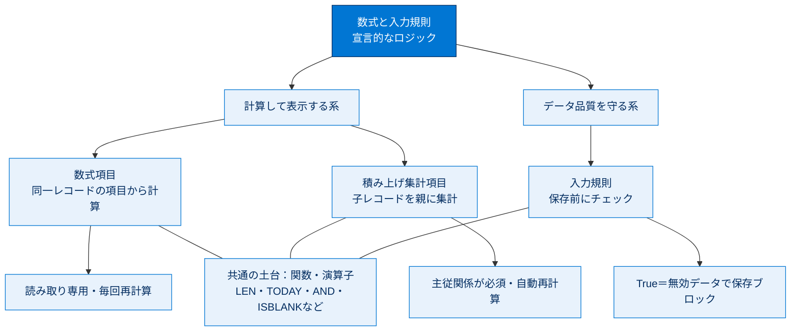

# 数式と入力規則 総まとめ

このトピックでは、コードを書かずに「計算」と「データ品質」を実現する3つの宣言的機能を学びました。**数式項目**は他の項目から計算した結果を読み取り専用で自動表示し、**積み上げ集計項目**は子レコードの値を親に集計表示します。**入力規則**は保存前に無効なデータをブロックしてデータ品質を守ります。いずれも同じ「数式（関数・演算子）」の知識を土台にしている点が大きな特徴です。

---

## 全体像

次の図は、3つの機能が「何を入力に、どこで、いつ動くか」を1枚で俯瞰したものです。

---

## ユニット横断 早見表

| ユニット | 学んだこと | キーワード | 一言要点 |
| --- | --- | --- | --- |
| **01 数式項目の使用** | 他の項目から計算した結果を自動表示する読み取り専用項目の作り方・デバッグ | 数式項目／戻り値の型／クロスオブジェクト数式／Check Syntax | **同一レコード内**の項目から計算し、毎回再計算する |
| **02 積み上げ集計項目の実装** | 子レコードの値を親に集計表示する項目と4つの集計種別 | 積み上げ集計／主従関係／COUNT・SUM・MIN・MAX | **子レコードの集合**を親に集計、主従関係が前提 |
| **03 入力規則の作成** | 保存前に無効なデータをブロックしデータ品質を守る仕組み | 入力規則／エラー条件数式／True＝ブロック／4つの要素 | **保存前**にチェックし、True なら保存させない |

---

## 🎯 試験頻出ポイント

> [!ポイント] このトピックで狙われやすい論点・暗記値
>
> - **数式項目は読み取り専用**で、表示・レポート・リストビュー実行のたびに再計算される（値は保存されない＝ストレージを消費しない）。
> - クロスオブジェクト数式は親方向に**最大 10 階層**までドット（`.`）でたどれる。
> - **積み上げ集計は主従関係が必須**で、**主（親）側**に作る。**参照関係（Lookup）では標準では不可**。
> - 集計種別 **COUNT／SUM／MIN／MAX**。**SUM は日付を集計できない**（MIN/MAX は数値・通貨・パーセントに加え日付・日付/時間も可）。
> - 入力規則は **True＝無効データで保存ブロック**、False＝保存許可。向きの取り違えが最頻出の落とし穴。
> - 入力規則の4要素：**ルール名・エラー条件数式・エラーメッセージ・エラー表示場所**。エラー表示場所はページ上部か特定の項目。
> - 入力規則は**インポートや API 経由の保存にも適用**される。
> - 数式・入力規則とも**大文字・小文字を区別**し、カスタム項目は **API 名（`__c`）** で参照する。テキストリテラルは**ダブルクォート**で囲む。

---

## 📖 用語早見表

| 用語 | ひとことの意味 |
| --- | --- |
| **数式項目（Formula Field）** | 他の項目や関数から計算した結果を自動表示する読み取り専用項目 |
| **クロスオブジェクト数式** | リレーションでつながった別オブジェクト（親）の項目を参照する数式 |
| **積み上げ集計項目（Roll-Up Summary）** | 関連する子レコードの値を集計して親に表示する項目 |
| **主従関係（Master-Detail）** | 親子を強く結びつけるリレーション。積み上げ集計の前提 |
| **参照関係（Lookup）** | 親子を緩く結びつけるリレーション。標準の積み上げ集計は不可 |
| **COUNT／SUM／MIN／MAX** | 積み上げ集計の4種類の計算（件数・合計・最小・最大） |
| **入力規則（Validation Rule）** | 保存前に無効なデータをブロックしてデータ品質を守る仕組み |
| **エラー条件数式** | True/False を返す数式。**True で保存をブロック**する |
| **Check Syntax（構文を確認）** | 数式の文法エラーを検出するボタン |
| **構文エラー** | 括弧・カンマ・型・項目名などの書き方の間違い |
| **項目レベルセキュリティ（FLS）** | 項目単位で参照・編集可否をプロファイルごとに制御する仕組み |
| **API 参照名（`__c`）** | カスタム項目を数式・規則で参照するときの名前。末尾に `__c` が付く |
| **TODAY()** | 実行時点の現在の日付を返す関数（引数不要） |
| **LEN()** | テキストの文字数を返す関数 |
| **AND()／OR()／NOT()** | 論理関数（全条件 true／いずれか true／真偽の反転） |

---

> [!豆知識] 「計算」と「集計」は別物
>
> 数式項目と積み上げ集計項目は混同されがちですが、見るデータの範囲が違います。数式項目は**1件のレコード内**の項目を計算し、積み上げ集計は**関連する複数の子レコード**を集計します。「1件で完結するか、複数件をまたぐか」で使い分けると迷いません。

> [!豆知識] 入力規則の「True＝ブロック」はなぜ直感に反する？
>
> 入力規則は内部的に「エラー条件に当てはまったか？」を判定しています。エラー条件が成立（True）したらブロック、というのは自然な設計です。利用者の頭の中の「正しいか？」とは逆向きになるため、`<>` や `NOT()` を使って「間違っている条件」を書くのがコツです。

> [!豆知識] 参照関係でも集計したいときの選択肢
>
> 標準の積み上げ集計は主従関係限定ですが、現場では参照関係で集計したい場面も多くあります。その場合は Apex トリガーで自作するか、AppExchange の無料パッケージ **DLRS（Declarative Lookup Rollup Summaries）** を使うのが定番です。試験では「参照関係では標準では作れない」という事実を押さえておけば十分です。

---

## ✅ 理解度セルフチェック

> [!まとめ] 答えながらトピック全体を思い出す
>
> 1. 数式項目に値を直接入力して編集できる？
>    → **いいえ。読み取り専用**で、毎回再計算される。
> 2. クロスオブジェクト数式は親方向に何階層までたどれる？
>    → **最大 10 階層**。
> 3. 積み上げ集計項目は参照関係（Lookup）の上に作れる？
>    → **いいえ。主従関係（Master-Detail）が必須**。
> 4. 集計種別のうち、日付を集計できないのはどれ？
>    → **SUM**。MIN/MAX は日付・日付/時間も使える。
> 5. 入力規則のエラー条件数式が True を返すとどうなる？
>    → **無効なデータとみなして保存をブロック**し、エラーメッセージを表示する。
> 6. 入力規則の4つの要素は？
>    → **ルール名・エラー条件数式・エラーメッセージ・エラー表示場所**。
