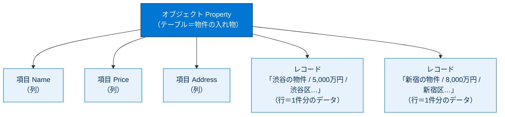
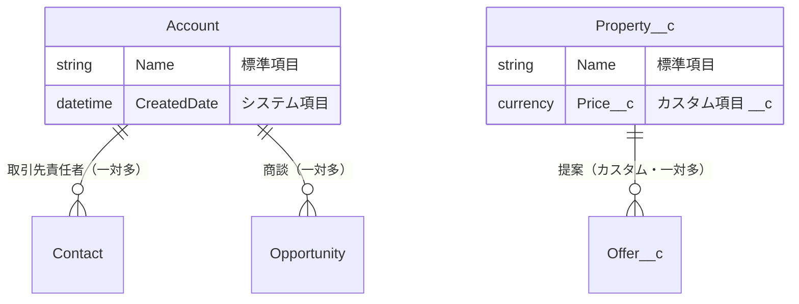
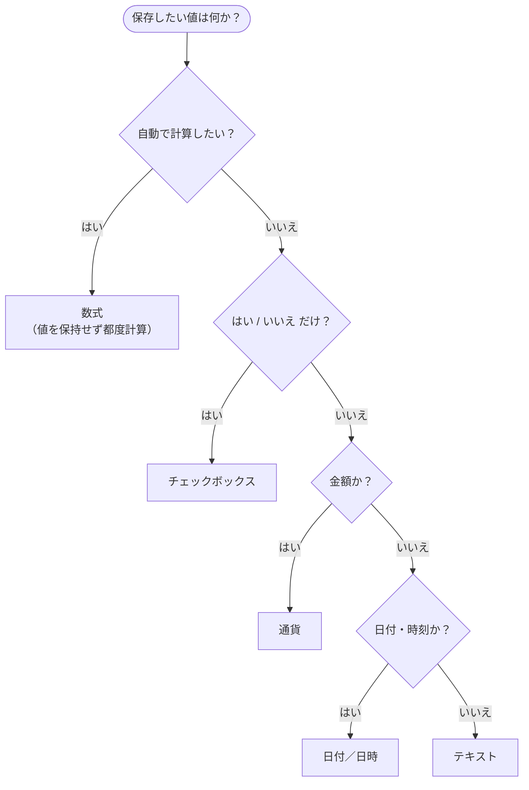

# 標準オブジェクトとカスタムオブジェクトを使用して顧客データを最適化する

## 学習の目的

この単元を完了すると、次のことができるようになります。

- Salesforce CRM プラットフォームでオブジェクトを使用するメリットを説明する。
- 標準オブジェクトとカスタムオブジェクトの違いを説明する。
- オブジェクトに設定可能なカスタム項目種別を挙げる。

> [!ポイント] この単元のゴール
>
> Salesforce のデータは「**オブジェクト（テーブル）／項目（列）／レコード（行）**」の3単位で構成されます。最初から用意されている**標準オブジェクト**と自分で作る**カスタムオブジェクト**の違い、カスタム項目に設定できる**データ型**を押さえれば、データモデリングの土台が固まります。

---

## データモデルとは

DreamHouse は不動産会社で、顧客がオンラインで物件を探し、エージェントに問い合わせできるようにしています。仲介業者は取引先責任者やリードなどの標準機能で購入者データを管理していますが、Salesforce には物件を追跡する標準機能がありません。販売物件や販売価格をどう把握するかが課題です。

そこで登場するのが**データモデル**です。データベーステーブルの構造をモデル化したもので、スプレッドシートに例えると分かりやすいです。列に住所・価格などの属性、行に各物件の情報を保存するのと同じ構造です。

> [!用語] データモデル（Data Model）
>
> アプリケーションで扱う「オブジェクトと項目のコレクション」。どんなデータを、どんな構造で、どう関連づけて保存するかの設計図です。

Salesforce では、テーブルを**オブジェクト**、列を**項目**、行を**レコード**とみなします。スプレッドシートとの対応は次のとおりです。

| スプレッドシート | データベース | Salesforce | 例 |
| --- | --- | --- | --- |
| シート／表 | テーブル | **オブジェクト** | 物件（Property） |
| 列 | カラム | **項目（Field）** | 価格、住所 |
| 行 | レコード | **レコード（Record）** | 「渋谷の物件」1件 |
| セルの値 | 値 | 項目の値 | 5,000万円 |

> [!用語] オブジェクト・項目・レコード
>
> - **オブジェクト**：同じ種類のデータをまとめる「入れ物（テーブル）」。例：取引先、物件。
> - **項目（Field）**：1件のデータが持つ属性（列）。例：名前、価格、住所。
> - **レコード（Record）**：1件分のデータ（行）。例：「渋谷の物件」というデータ1件。

> オブジェクト（テーブル）の下に、項目（列）とレコード（行）がぶら下がる関係です。

---

## オブジェクトについて知る

Salesforce には標準オブジェクト・カスタムオブジェクト・外部オブジェクト・プラットフォームイベント・BigObjects があります。ここでは最も一般的な**標準オブジェクト**と**カスタムオブジェクト**に絞ります。

- **標準オブジェクト**：Salesforce に含まれるオブジェクト。取引先、取引先責任者、リード、商談など。
- **カスタムオブジェクト**：会社や業種に固有の情報を保存するため自分で作るオブジェクト。DreamHouse では物件情報を保存する Property カスタムオブジェクトを作ります。

カスタムオブジェクトを作成すると、プラットフォームがページレイアウトなどの UI を自動生成します。

> [!用語] 標準オブジェクト（Standard Object）
>
> Salesforce にあらかじめ用意されているオブジェクト。取引先（Account）、取引先責任者（Contact）、リード（Lead）、商談（Opportunity）、ケース（Case）などが代表例です。

> [!用語] カスタムオブジェクト（Custom Object）
>
> 自社・自業種に固有のデータを保存するため**自分で作成する**オブジェクト。API 参照名の末尾に `__c` が付きます（例：`Property__c`）。

| 比較項目 | 標準オブジェクト | カスタムオブジェクト |
| --- | --- | --- |
| 提供元 | Salesforce が標準提供 | **自分で作成** |
| 例 | 取引先、取引先責任者、商談 | 物件（Property）、提案（Offer） |
| API 参照名 | `Account`、`Contact` など | 末尾に `__c`（例：`Property__c`） |
| 削除 | できない（標準機能） | できる |
| 用途 | 一般的なビジネスデータ | 業種・自社固有のデータ |

> [!例] DreamHouse の場合
>
> 「顧客（取引先責任者）」「見込み客（リード）」は標準オブジェクトで足りますが、「販売物件」の標準オブジェクトは存在しないため、**Property（物件）カスタムオブジェクト**を新たに作ります。これがカスタムオブジェクトの典型的な使いどころです。

---

## カスタムオブジェクトを作成する

このオブジェクトは後で必要になるため、手順をスキップしないでください。

> [!手順] Property（物件）カスタムオブジェクトを作成する
>
> 1. このページの一番下までスクロールし、**Trailhead Playground** を作成する（省略不可。このモジュールには必ず新しい Playground を使用する。Dreamhouse アプリの再インストールは不要）。
> 2. Playground 作成後（1 分ほど）、**[起動]** をクリックする。
> 3. ページ上部の**歯車アイコン**から **[設定]** を起動する。
> 4. **[オブジェクトマネージャー]** タブをクリックする。
> 5. 右上の **[作成]** | **[カスタムオブジェクト]** をクリックする。
> 6. **[表示ラベル]** に `Property`（物件）と入力する（[オブジェクト名][レコード名] は自動入力）。
> 7. **[表示ラベル(複数形)]** に `Properties`（物件）と入力する。
> 8. ページ下部の **[カスタムオブジェクトの保存後、新規カスタムタブウィザードを起動する]** チェックボックスをオンにする。
> 9. 残りはデフォルトのまま **[Save（保存）]** をクリックする。
> 10. **[新規カスタムタブ]** ページで **[タブスタイル]** をクリックし、任意のスタイル（UI に表示するアイコン）を選択する。
> 11. **[Next（次へ）]**、**[Next（次へ）]**、**[Save（保存）]** の順にクリックする。

> [!ポイント] 表示ラベルと API 参照名
>
> 入力するのは**表示ラベル**（画面に出る名前）ですが、Salesforce は内部で使う **API 参照名**を自動生成します。カスタムオブジェクトの API 参照名は末尾に `__c` が付きます（`Property__c`）。Apex や数式からはこの API 参照名で参照します。

---

## 項目について知る

すべての標準／カスタムオブジェクトには**項目**が関連付けられています。主な種別は次のとおりです。

| 種別 | 説明 | 例 |
| --- | --- | --- |
| **ID** | 全レコードで自動生成される 18 文字の値（大文字小文字を区別しない）。URL に含まれる。 | `0015000000Gv7qJAAN` |
| **システム項目** | 作成日・最終変更日などをシステムが提供する参照のみの項目。 | `CreatedDate`、`LastModifiedById`、`LastModifiedDate` |
| **Name（名前）** | レコードを区別する名前。テキスト名または自動採番が使える。 | 「Julie Bean」、ケース「CA-1024」 |
| **Custom（カスタム）** | 標準／カスタムオブジェクトで独自に作成する項目。 | 取引先責任者の「誕生日」 |

> [!用語] レコード ID（Record ID）
>
> 全レコードに自動付与される一意の識別子。**18 文字版**（大文字小文字を区別しない、安全）と **15 文字版**（区別する、URL で見かける短縮版）があります。

> [!注意] 15 文字 ID と 18 文字 ID
>
> 15 文字 ID を Excel など大文字小文字を区別しないツールに貼ると別レコードが同じ ID に見えることがあります。データ連携では**18 文字版**を使うのが安全です。

ID・システム・名前項目は全オブジェクト共通の標準項目です。標準オブジェクトにもカスタムオブジェクトにもカスタム項目を追加できます。

---

## データ型を理解する

すべての項目には**データ型**があり、項目に保存される情報の種類を示します。

> [!用語] データ型（Data Type）
>
> その項目に「どんな種類の値を入れられるか」を決める設定。テキスト・数値・日付・チェックボックスなど多数あり、入力欄の形も型に応じて変わります。一度作成すると後からの変更は既存データに影響するため慎重に選びます。

一般的なデータ型は次のとおりです。

| データ型 | 用途 | 例 |
| --- | --- | --- |
| **チェックボックス** | 単純な「はい／いいえ」 | 「契約済み？」 |
| **日付／日時** | 日付、または日付と時刻 | 誕生日、販売マイルストーン |
| **数式** | 記述した数式に基づき**自動計算**される特殊な型 | コミッションの自動計算 |
| **通貨** | 金額 | 物件の価格 |
| **テキスト** | 自由入力の文字列 | 住所、備考 |

カスタム項目を作成するときは、その項目に保存するデータの種類を考慮することが重要です。

> [!ポイント] データ型は試験頻出
>
> 「コミッションを自動計算したい → **数式**」「はい／いいえを記録したい → **チェックボックス**」のように、**要件に合うデータ型を選ぶ**問題がよく出ます。数式項目は値を保持せず、参照のたびに自動計算される点に注意しましょう。

---

## カスタム項目を作成する

Property オブジェクトにカスタム項目を追加します。Trailhead Playground に戻ります。

> [!手順] Property に Price（価格）項目を追加する
>
> 1. **[設定]** から **[オブジェクトマネージャー]** | **[プロパティ]** に移動する。
> 2. サイドバーで **[項目とリレーション]** をクリックする（すでに名前項目とシステム項目がある）。
> 3. 右上の **[New（新規）]** をクリックする。
> 4. データ型に **[通貨]** を選択する。
> 5. **[次へ]** をクリックする。
> 6. 次のように入力する。
>    - 項目の表示ラベル：`Price`（価格）
>    - 説明：`The listed sale price of the home.`
> 7. **[必須]** チェックボックスをオンにする。
> 8. **[Next（次へ）]**、**[Next（次へ）]**、**[Save（保存）]** をクリックする。

項目リストに **[Price（価格）]** が表示され、[項目名] は「`Price__c`」となります。

> [!ポイント] `__c` でカスタムと分かる
>
> 標準項目は `Name` や `CreatedDate` のように `__c` が付きません。カスタムオブジェクトもカスタム項目も末尾に **`__c`** が付くため、API 参照名で標準かカスタムかを一目で判別できます。

---

## レコードを作成する

> [!手順] 物件レコードを作成する
>
> 1. **アプリケーションランチャー**で **[セールス]** を選択する。
> 2. ナビゲーションバーの **[Properties（物件）]** タブをクリックする（無ければ **[さらに表示]** から探す）。
> 3. 右上の **[New（新規）]** をクリックする。
> 4. 物件の名前と価格を入力し、**[Save（保存）]** をクリックする。

これで物件レコードが1件作成され、詳細ページが表示されます。

---

## カスタマイズする上での留意点

オブジェクトの追加・カスタマイズは簡単に見えますが、バックグラウンドの処理は技術的に複雑です。ベストプラクティスを押さえましょう。

> [!ポイント] カスタマイズのベストプラクティス
>
> - **よく考えて名前を付ける**：「物件 2」のような曖昧な名前は混乱の元。**わかりやすい一意の名前**を付ける。
> - **ユーザーが理解できるようにする**：オブジェクトと項目に**説明**を追加し、複雑なものには**ヘルプテキスト**で補足する。
> - **必要に応じて項目を必須にする**：入力が抜けてはならない項目（例：物件の価格）は**必須**に設定し、データの不完全さを防ぐ。

---

## リソース

- Salesforce ヘルプ：オブジェクトと項目の概要
- Salesforce ヘルプ：カスタムオブジェクトの作成
- Salesforce ヘルプ：カスタム項目のデータ型
- Trailhead：データモデリング

---

> [!注意] 日本語環境で受講する場合（アクセシビリティ／翻訳について）
>
> - この単元にはスクリーンリーダーユーザー向けの詳細版があります。
> - Challenge は日本語 Playground で開始し、かっこ内の翻訳を参照しながら進めます。評価は英語データに対して行われるため、**英語の値のみ**をコピー&ペーストします。
> - 日本語組織で不合格になった場合は、(1) **[Locale（地域）]** を **[United States（米国）]**、(2) **[Language（言語）]** を **[English（英語）]** に切り替え、(3) **[Check Challenge]** をクリックすると通ることがあります。

> [!まとめ] この単元のまとめ
>
> - Salesforce のデータは **オブジェクト（テーブル）／項目（列）／レコード（行）** の3単位で表現される。
> - **標準オブジェクト**は Salesforce 提供、**カスタムオブジェクト**は自分で作成し API 参照名に `__c` が付く。
> - 項目には **ID・システム・Name・カスタム**の種別があり、カスタム項目には**データ型**（チェックボックス・日付・数式・通貨など）を選ぶ。
> - 名前付け・説明・必須設定などのベストプラクティスを守ると、保守しやすいデータモデルになる。
