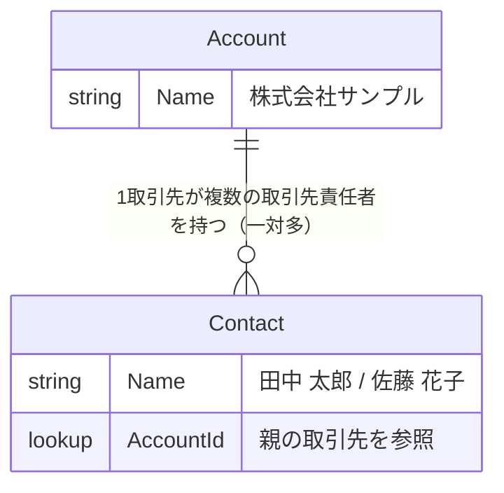
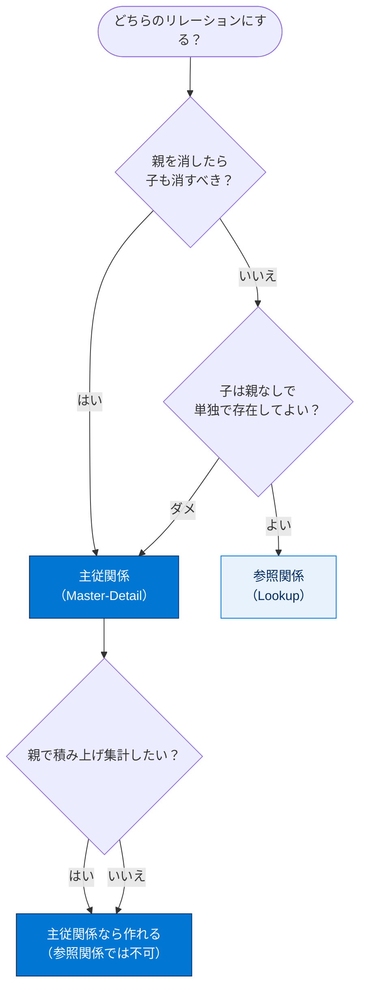
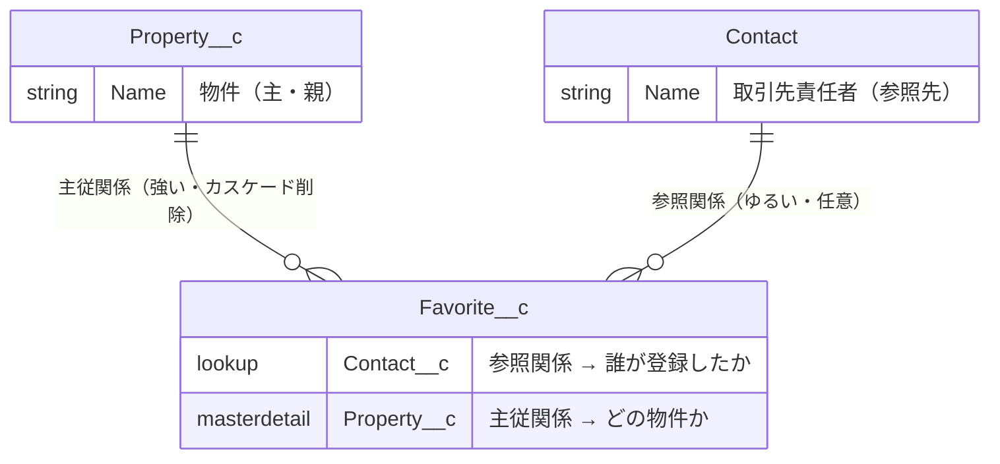
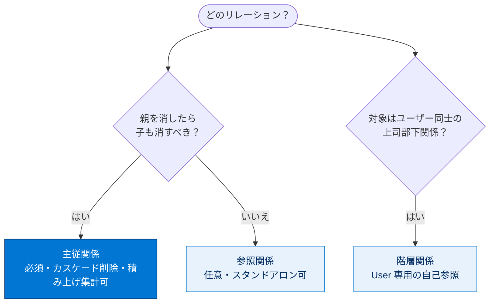

# オブジェクトリレーションの作成

## 学習の目的

この単元を完了すると、次のことができるようになります。

- オブジェクトリレーションとは何かを説明する。
- 参照関係と主従関係の違いを説明する。
- カスタムオブジェクトに参照関係・主従関係のリレーション項目を作成する。

> [!ポイント] この単元のゴール
>
> オブジェクト同士をつなぐ「**リレーション**」には、ゆるくつなぐ**参照関係（Lookup）**と、強くつなぐ**主従関係（Master-Detail）**があります。2つの違い（削除の連動・親が必須か・スタンドアロンか）を理解すれば、試験頻出のリレーション問題に対応できます。

---

## オブジェクトリレーションとは？

**オブジェクトリレーション**は、2 つのオブジェクトを接続する特殊な項目種別です。

> [!用語] オブジェクトリレーション（Object Relationship）
>
> 2つのオブジェクトを結びつける特殊な項目。たとえば「この取引先責任者はどの取引先に所属しているか」をたどれるようにし、片方のレコードからもう片方の関連レコードを参照・表示できます。

たとえば取引先と取引先責任者の間には標準でリレーションがあります。取引先レコードの **[関連]** タブには取引先責任者のセクションが表示され、追加ボタンも用意されています。

> 取引先（親）の **[関連]** タブに、その取引先を参照している取引先責任者（子）が一覧表示されます。

オブジェクトや項目と同様、カスタムリレーションも構築できます。前の単元で作成した **[Property（物件）]** と **[Offer（提案）]** をつなげば、物件に関するすべての提案をそのレコードに表示できます。

---

## オブジェクトリレーションの種類

主要なリレーションは**参照関係**と**主従関係**の 2 種類です。

### 参照関係

**参照関係**は 2 つのオブジェクトをリンクし、一方から他方を関連項目として参照できるようにします。**一対一**および**一対多**が可能です（1 取引先が複数の取引先責任者を持てるので、取引先と取引先責任者は一対多）。DreamHouse では [Property（物件）] と [Home Seller（不動産会社）] の一対一リレーションを作れます。

> [!用語] 参照関係（Lookup Relationship）
>
> 2つのオブジェクトを**ゆるく**つなぐリレーション。子は親を持たなくてもよく、親を削除しても子は残ります。子は独立して存在できる「スタンドアロン」として機能します。

### 主従関係

**主従関係**はより厳格で、1 つが**主**、もう 1 つが**従**になります。主オブジェクトは従の参照権限などの動作を制御します。たとえば [Property] と [Offer] を主従関係にすれば、物件を削除したときに関連する提案もまとめて削除できます。

> [!用語] 主従関係（Master-Detail Relationship）
>
> 親（主）と子（従）を**強く**結びつけるリレーション。子は必ず親を持ち、親を削除すると子も**連動して削除**されます（カスケード削除）。子の参照権限は親に従い、子はスタンドアロンとして存在できません。親側で積み上げ集計項目を作れます。

> [!用語] カスケード削除（Cascade Delete）
>
> 親レコードを削除すると、紐づく子レコードも自動的に一緒に削除される動作。主従関係の最大の特徴です。物件を削除すると、その物件への提案もすべて消えます。

> [!例] DreamHouse での削除の連動
>
> 物件の所有者が住宅を取り下げてその物件レコードを削除すると、関連する提案（Offer）も主従関係によって**まとめて削除**されます。提案だけがゴミとして残らず、データがきれいに保たれます。

---

## 参照関係と主従関係の違い

通常、オブジェクトが**一部のケースでのみ関連する場合に参照関係**を使います。参照関係のオブジェクトはスタンドアロンとして機能し、独自のタブを持ちます。一方、**主従関係の従オブジェクトはスタンドアロンとして機能せず**、主に大きく依存します。リレーション項目は**子（従）側**に作成します。

| 比較項目 | 参照関係（Lookup） | 主従関係（Master-Detail） |
| --- | --- | --- |
| 結びつきの強さ | ゆるい | 強い |
| 子に親は必須か | **任意**（無くてもよい） | **必須**（必ず親が要る） |
| 親削除時の子 | 残る（または制限可） | **一緒に削除**（カスケード削除） |
| 子のスタンドアロン | できる（独自タブを持つ） | できない（親に依存） |
| 子の参照権限 | 独自に設定 | 親に従う |
| 積み上げ集計項目 | **作れない** | **作れる** |
| リレーション項目の作成場所 | 子側 | 子（従）側 |

> [!ポイント] 試験で問われる見分け方
>
> - **「親を消したら子も消えるべきか」** → はい＝主従関係、いいえ＝参照関係。
> - **「子は親なしで単独で存在してよいか」** → よい＝参照関係、ダメ＝主従関係。
> - **「親で積み上げ集計したい」** → 主従関係が必須（参照関係では標準の積み上げ集計は作れない）。
> - リレーション項目は、参照・主従どちらも**子（従）側のオブジェクト**に作成する。

### 階層関係

3 番目のリレーション種別が**階層関係**です。特別な参照関係で、**ユーザーオブジェクトでのみ使用できる**点が異なります。ユーザー間の管理チェーン（誰が誰の上司か）の作成などに使います。

> [!用語] 階層関係（Hierarchical Relationship）
>
> **ユーザー（User）オブジェクト専用**の特殊な参照関係。同じユーザーオブジェクトの別レコードを参照する「自己参照」で、上司・部下の管理チェーンを表現します。

> [!注意] リレーションが増えると複雑さも増す
>
> リレーションを追加するとデータモデルの複雑さが増します。オブジェクト・レコード・項目の変更や削除は特に注意が必要です（主従関係では削除が連動するため影響範囲が広がる）。なお Salesforce はインクルーシブではない用語の変更を進めていますが、実装への影響を避けるため一部の用語（master/detail など）はそのまま使用しています。

---

## ハンズオン：Favorite オブジェクトとリレーションを作成する

DreamHouse は Web サイトで物件をお気に入り登録したユーザーを追跡したいと考えています。この機能により販売担当者が潜在的な購入者に連絡しやすくなります。

> [!注意] 同じ Playground を使う
>
> 「システム管理者初級」トレイルの一部として受講する場合でも、必ず**前の単元で作成した Trailhead Playground**を使用してください。

### カスタムオブジェクトを作成する

> [!手順] Favorite（お気に入り）カスタムオブジェクトを作成する
>
> 1. **[オブジェクトマネージャー]** タブをクリックする。
> 2. 右上の **[作成]** | **[カスタムオブジェクト]** をクリックする。
> 3. **[表示ラベル]** に `Favorite`（お気に入り）と入力する。
> 4. **[表示ラベル(複数形)]** に `Favorites` と入力する。
> 5. **[カスタムオブジェクトの保存後、新規カスタムタブウィザードを起動する]** チェックボックスをオンにする。
> 6. 残りはデフォルトのまま **[Save（保存）]** をクリックする。
> 7. **[新規カスタムタブ]** ページで **[タブスタイル]** をクリックし、任意のスタイルを選択する。
> 8. **[Next（次へ）]**、**[Next（次へ）]**、**[Save（保存）]** の順にクリックする。

### 参照関係を作成する

[Favorite] に、物件をお気に入りにしたユーザーをリストする参照関係を作成します。

> [!手順] Contact への参照関係を作成する
>
> 1. **[設定]** から **[オブジェクトマネージャー]** | **[Favorite（お気に入り）]** に移動する。
> 2. サイドバーで **[項目とリレーション]** をクリックする。
> 3. **[新規]** をクリックする。
> 4. **[参照関係]** を選択して **[Next（次へ）]** をクリックする。
> 5. **[関連先]** で **[取引先責任者]** を選択する（取引先責任者は潜在的な住宅購入者を表す）。
> 6. **[次へ]** をクリックする。
> 7. **[Field Name（項目名）]** に `Contact`（取引先責任者）と入力し、**[Next（次へ）]** をクリックする。
> 8. **[Next（次へ）]**、**[Next（次へ）]**、**[Save（保存）]** の順にクリックする。

### 主従関係を作成する

**[Property（物件）] が主で [Favorite（お気に入り）] が従**の主従関係を作成します。

> [!手順] Property への主従関係を作成する
>
> 1. カスタムオブジェクトの **[オブジェクトマネージャー]** ページで **[項目とリレーション]** をクリックする。
> 2. **[新規]** をクリックする。
> 3. **[主従関係]** を選択して **[Next（次へ）]** をクリックする。
> 4. **[関連先]** で **[Property（物件）]** を選択する。
> 5. **[次へ]** をクリックする。
> 6. **[項目名]** に `Property`（物件）と入力し、**[次へ]** をクリックする。
> 7. **[Next（次へ）]**、**[Next（次へ）]**、**[Save（保存）]** の順にクリックする。

これで物件レコードを参照すると、関連タブに **[Favorites（お気に入り）]** が表示されます。

> [!ポイント] Favorite が持つ2つのリレーション
>
> この演習で Favorite には2種類のリレーションを作りました。
>
> - **参照関係 → Contact（取引先責任者）**：誰がお気に入り登録したか（ゆるい関連）
> - **主従関係 → Property（物件）**：どの物件のお気に入りか（強い関連。物件を消せばお気に入りも消える）
>
> 「同じ子オブジェクトに参照関係と主従関係を併用できる」点も覚えておきましょう。

### お気に入り物件を追加する

> [!手順] お気に入りレコードを作成する
>
> 1. **アプリケーションランチャー**から **[Sales（セールス）]** を選択する。
> 2. ナビゲーションバーの **[Properties（物件）]** タブをクリックする（無ければ **[さらに表示]** から探す）。
> 3. 物件レコードの名前をクリックする。
> 4. **[Related（関連）]** をクリックする（**[Favorites (0)]** が表示される）。
> 5. **[新規]** をクリックする。
> 6. **[Favorite Name（お気に入り名）]** に名前を入力して **[Save（保存）]** をクリックする。

これで [Favorite（お気に入り）] オブジェクトの設定が完了しました。

---

## リソース

- Salesforce ヘルプ：オブジェクトリレーションの概要
- Salesforce ヘルプ：オブジェクトリレーションの考慮事項

---

> [!まとめ] この単元のまとめ
>
> - **オブジェクトリレーション**は2つのオブジェクトをつなぐ特殊な項目で、参照関係・主従関係の2種類が主要。
> - **参照関係（Lookup）**はゆるい結びつき。子は親なしで存在でき、親を消しても子は残る。一対一／一対多が可能。
> - **主従関係（Master-Detail）**は強い結びつき。子は必ず親を持ち、親を消すと子も**連動削除**。参照権限も親に従う。
> - **階層関係**はユーザーオブジェクト専用の特殊な参照関係（管理チェーンなど）。
> - リレーション項目は**子（従）側**に作成し、同じ子に参照関係と主従関係を併用することもできる。

---

## 🎓 この単元のまとめ

この単元は、2つのオブジェクトを結ぶ **オブジェクトリレーション** の種類と、その最大の違いである「**結びつきの強さ／削除の連動／親の必須性**」を扱いました。要件から参照関係・主従関係を選び分けられることがゴールです。

| 観点 | 参照関係（Lookup） | 主従関係（Master-Detail） |
| --- | --- | --- |
| 結びつき | ゆるい | 強い |
| 子に親は必須か | 任意（無くてよい） | **必須** |
| 親削除時の子 | 残る | **連動削除（カスケード）** |
| スタンドアロン | できる | できない |
| 積み上げ集計 | 作れない | **作れる** |

> [!まとめ] この単元の要点
>
> - リレーションは子から親をたどる**特殊な項目**で、項目は必ず**子（従）側**に作成する。
> - **参照関係**＝ゆるい・親は任意・親を消しても子は残る・スタンドアロン可。一対一／一対多が可能。
> - **主従関係**＝強い・親は必須・**カスケード削除**・子の参照権限は親に従う・親で**積み上げ集計**が作れる。
> - **階層関係**は **User オブジェクト専用** の自己参照（管理チェーン）。
> - 同じ子オブジェクトに参照関係と主従関係を**併用**できる（例：Favorite → Contact は参照、→ Property は主従）。

> [!豆知識] 1オブジェクトに主従関係は最大2つまで＝「ジャンクションオブジェクト」
>
> 子オブジェクトには主従関係を最大2つまで設定でき、これを使うと多対多リレーションを表現する **ジャンクションオブジェクト** が作れます。たとえば「会議」と「参加者」を多対多でつなぐ「出席」オブジェクトがその典型です。なお、主従関係は後から参照関係へ変換することも可能ですが、子に親なしのレコードが1件でもあると変換できないなどの制約があります。
