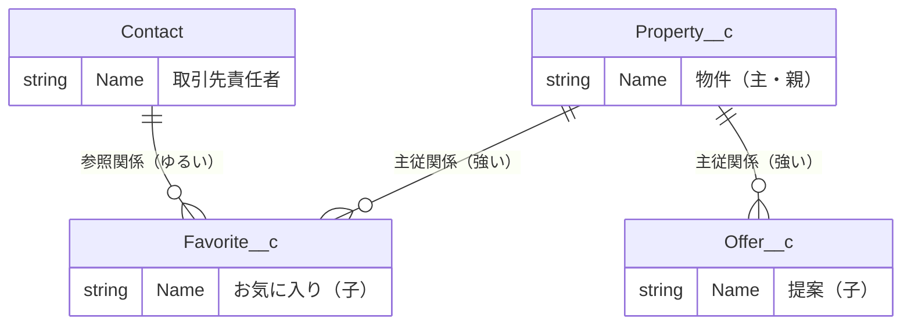
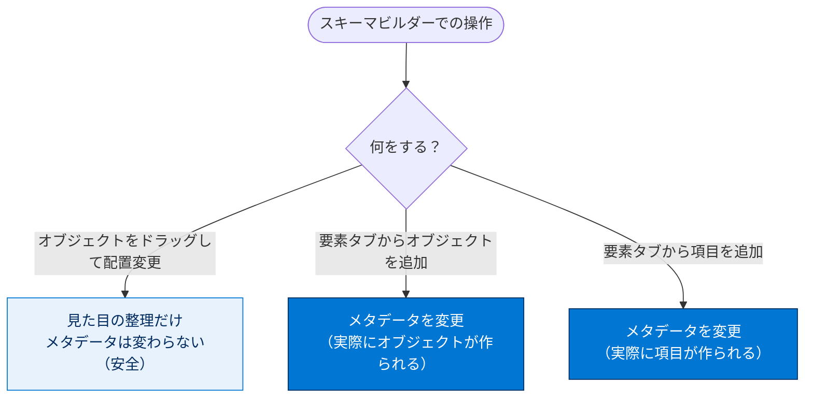

# スキーマビルダーを使う

## 学習の目的

この単元を完了すると、次のことができるようになります。

- スキーマビルダーで既存のデータモデルを視覚化する。
- スキーマビルダーを使ってオブジェクトを作成する。
- スキーマビルダーを使って項目を作成する。

> [!ポイント] この単元のゴール
>
> **スキーマビルダー**は、オブジェクト・項目・リレーションを**1枚の図として視覚化・編集**できるツールです。複雑なデータモデルを俯瞰したり、ドラッグ＆ドロップでオブジェクトや項目を作ったりできることを押さえましょう。

---

## スキーマビルダーとは

オブジェクト・項目・リレーションが増えるとデータモデルは複雑になります。**スキーマビルダー**は、そうしたデータモデルの視覚化と編集ができるツールで、設計や理解に役立ちます。

> [!用語] スキーマビルダー（Schema Builder）
>
> オブジェクト・項目・リレーションを**図（ダイアグラム）として表示・編集**できる Salesforce のツール。オブジェクト同士のつながりを線で確認でき、ドラッグ＆ドロップで新しいオブジェクトや項目を追加できます。

> [!用語] スキーマ（Schema）
>
> データベースやアプリケーションの「構造の設計図」。どんなオブジェクトがあり、どんな項目を持ち、どう関連しているかの全体像を指します。

---

## 実際のデータモデルを表示する

> [!手順] スキーマビルダーでデータモデルを表示する
>
> 1. **[Setup（設定）]** の **[Quick Find（クイック検索）]** で `Schema Builder`（スキーマビルダー）を検索してクリックする。
> 2. 左パネルで **[選択解除]** をクリックする。
> 3. **[Contact（取引先責任者）]**、**[Favorite（お気に入り）]**、**[Offer（提案）]**、**[Property（物件）]** のチェックボックスをオンにする。
> 4. **[自動レイアウト]** をクリックする。

選択したオブジェクトがボックスで表示され、リレーションが線でつながったダイアグラムが描かれます。

オブジェクトはキャンバス上で**ドラッグ**できます。配置を変えてもオブジェクトやリレーションは変わりません。同僚にカスタマイズを紹介したり、データの流れを説明したりするのに便利です。

> [!例] スキーマビルダーが役立つ場面
>
> - 新メンバーに「うちの組織のデータ構造」を一目で説明したいとき。
> - 主従関係・参照関係の位置を線で確認し、削除の影響範囲を把握したいとき。
> - 設計レビューでオブジェクト間のつながりの抜け漏れを俯瞰したいとき。

> [!ポイント] レイアウト変更は安全
>
> オブジェクトをドラッグして配置を変えても、**実際のデータモデルは変わりません**（見た目の整理だけ）。一方、後述のオブジェクト作成・項目作成は**実際にメタデータを変更する**操作なので区別して覚えましょう。

---

## スキーマビルダーでオブジェクトを作成する

スキーマビルダーの視覚的インターフェースからオブジェクトを作成することもできます。

> [!手順] スキーマビルダーでオブジェクトを作成する
>
> 1. 左サイドバーで **[要素]** タブをクリックする。
> 2. **[オブジェクト]** をクリックしてキャンバスにドラッグする。
> 3. オブジェクトに関する情報を入力する。
> 4. **[Save（保存）]** をクリックする。

新しいオブジェクトがスキーマビルダーに表示されます。

---

## スキーマビルダーで項目を作成する

項目の作成方法もオブジェクトと同じです。

> [!手順] スキーマビルダーで項目を作成する
>
> 1. **[要素]** タブから項目種別を選択し、作成したオブジェクトにドラッグする（**リレーション項目・数式項目・通常の項目**を作成できる）。
> 2. 新しい項目の詳細を入力する。
> 3. **[Save（保存）]** をクリックする。

オブジェクトマネージャーに戻ると、新しいオブジェクトが既存のオブジェクトと同じように表示されます。

> [!ポイント] スキーマビルダーで作れるもの・確認
>
> - スキーマビルダーから作成したオブジェクト・項目は、**オブジェクトマネージャーで作ったものと完全に同じ**です（作成方法が違うだけ）。
> - 作成できる項目種別は**リレーション項目・数式項目・通常の項目**。

---

## リソース

- Salesforce ヘルプ：スキーマビルダーを使用した独自のデータモデルの設計
- Salesforce ヘルプ：スキーマビルダーのカスタムオブジェクト定義

---

> [!注意] アクセシビリティ／翻訳について
>
> - この単元にはスクリーンリーダーユーザー向けの詳細版があります。
> - Challenge は日本語 Playground で開始し、かっこ内の翻訳を参照しながら進めます。評価は英語データに対して行われるため、**英語の値のみ**をコピー&ペーストします。日本語組織で不合格になった場合は、**[Locale（地域）]** を **[United States（米国）]**、**[Language（言語）]** を **[English（英語）]** に切り替えてから **[Check Challenge]** をクリックすると通ることがあります。

> [!まとめ] モジュール全体のまとめ
>
> - **オブジェクト・項目・レコード**といったデータモデルの基本を学び、DreamHouse アプリケーションで実際に作成した。
> - **標準オブジェクトとカスタムオブジェクト**の違い、カスタム項目の**データ型**を理解した。
> - オブジェクト間の**リレーション**（参照関係・主従関係・階層関係）と削除の連動などの違いを学んだ。
> - **スキーマビルダー**でデータモデルを視覚化・編集する方法を学んだ。
>
> カスタム項目とカスタムオブジェクトを使いこなすことが、データモデリングのプロフェッショナルへの第一歩です。
