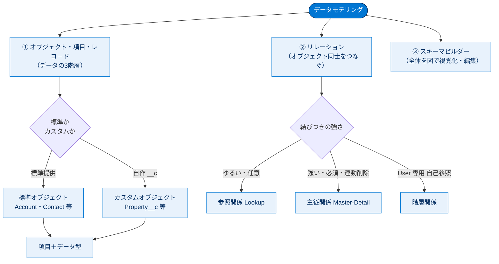
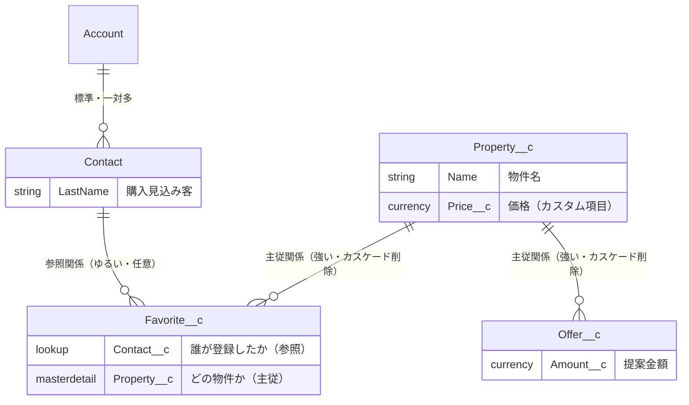

# データモデリング 総まとめ

このトピックでは、Salesforce でデータをどう設計し格納するかという「**データモデリング**」の基礎を学びました。データの器である **オブジェクト**（標準／カスタム）、その属性である **項目**（とデータ型）、1件分のデータである **レコード** の3階層を理解し、オブジェクト同士を結ぶ **リレーション**（参照関係・主従関係・階層関係）で関連付けました。最後に、これらの全体像を1枚の図として視覚化・編集する **スキーマビルダー** を学びました。DreamHouse（不動産アプリ）を題材に、Property・Favorite・Offer などのカスタムオブジェクトとリレーションを実際に作成したのが流れの軸です。

---

## 全体像

DreamHouse で実際に構築したデータモデルの関係は次のとおりです。

---

## ユニット横断 早見表

| ユニット | 学んだこと | キーワード | 一言要点 |
| --- | --- | --- | --- |
| 01 標準/カスタムオブジェクトで顧客データを最適化 | データモデルの3階層、標準／カスタムの違い、データ型 | オブジェクト・項目・レコード、`__c`、データ型 | データは **テーブル＝列＝行**。器は標準／自作で選び、項目には**型**を与える |
| 02 オブジェクトリレーションの作成 | 参照関係・主従関係・階層関係の違いと使い分け | Lookup、Master-Detail、カスケード削除、積み上げ集計 | **親を消したら子も消す？** がリレーション選択の分かれ目 |
| 03 スキーマビルダーを使う | データモデルの視覚化・編集 | スキーマビルダー、ドラッグ＝安全、要素タブ＝実変更 | 配置変更は見た目だけ、**要素タブの追加はメタデータを実変更** |

---

## 🎯 試験頻出ポイント

> [!ポイント] データモデリングで狙われる論点
>
> - **標準オブジェクトは削除不可・カスタムオブジェクトは削除可**。カスタムオブジェクト／カスタム項目の API 参照名は末尾に **`__c`**。
> - **レコード ID は18文字版が安全**（大文字小文字を区別する15文字版はツール連携で誤認の恐れ）。
> - **要件 → データ型** の対応：自動計算＝**数式**、はい／いいえ＝**チェックボックス**、金額＝**通貨**、日付・時刻＝**日付／日時**。
> - **参照関係（Lookup）**：ゆるい・親は任意・親を消しても子は残る・スタンドアロン可・**積み上げ集計は不可**。
> - **主従関係（Master-Detail）**：強い・親は必須・**カスケード削除**・子の参照権限は親に従う・親で**積み上げ集計が作れる**。
> - **階層関係**は **User オブジェクト専用** の特殊な参照関係（管理チェーン）。
> - リレーション項目は参照・主従とも **子（従）側** に作成する。
> - **スキーマビルダー**：ドラッグでの配置変更は安全（メタデータ不変）、要素タブからの追加は実際にメタデータを変更する。

---

## 📖 用語早見表

| 用語 | ひとことの意味 |
| --- | --- |
| データモデル | 扱うオブジェクトと項目のコレクション＝データの設計図 |
| オブジェクト | 同種データをまとめる入れ物（テーブル） |
| 項目（Field） | 1件のデータが持つ属性（列） |
| レコード（Record） | 1件分のデータ（行） |
| 標準オブジェクト | Salesforce が標準提供するオブジェクト（Account 等） |
| カスタムオブジェクト | 自分で作るオブジェクト。API 参照名末尾に `__c` |
| データ型 | 項目に保存できる値の種類（テキスト・通貨・数式など） |
| レコード ID | 全レコードの一意な識別子（18文字版が安全） |
| 参照関係（Lookup） | ゆるく結ぶリレーション。親は任意・子は単独で存在可 |
| 主従関係（Master-Detail） | 強く結ぶリレーション。親必須・カスケード削除・積み上げ集計可 |
| カスケード削除 | 親を消すと子も連動して削除される動作 |
| 積み上げ集計項目 | 主従の子レコードの値を親で集計する項目 |
| 階層関係 | User オブジェクト専用の自己参照リレーション |
| スキーマビルダー | データモデルを図で視覚化・編集するツール |
| ジャンクションオブジェクト | 主従関係2つで多対多を表現する中間オブジェクト |

---

> [!豆知識] `__c` の正体と仲間たち
>
> カスタム要素に付く `__c` は "custom" の略。仲間として外部オブジェクト項目の `__x`、カスタムメタデータ型の `__mdt`、リレーション参照（子→親をたどる）に使う `__r` などがあります。API 参照名の末尾を見れば、その要素がどんな種類かを一目で見分けられます。

> [!豆知識] 主従関係は子1オブジェクトに最大2つ＝多対多が作れる
>
> 子オブジェクトには主従関係を最大2つまで設定でき、これを使うと2つの親をつなぐ **ジャンクションオブジェクト** で多対多リレーションを表現できます。「会議」と「参加者」を「出席」でつなぐのが典型例です。

> [!豆知識] master/detail という用語が今も残る理由
>
> Salesforce はインクルーシブでない用語の置き換えを進めていますが、master/detail（主従）はメタデータ API や数式など既存実装への影響が大きいため、あえて従来名を維持しています。試験でも実務でもこの用語はそのまま使われます。

---

## ✅ 理解度セルフチェック

> [!まとめ] 答えられるか確認しよう（答えは各行末尾）
>
> 1. スプレッドシートの「行」は Salesforce では何に当たる？ → **レコード**
> 2. カスタムオブジェクト `Property__c` の `__c` は何の略？ → **custom（カスタムであることを示す）**
> 3. 「親を削除したら子も一緒に消したい」リレーションはどちら？ → **主従関係（Master-Detail）**
> 4. 親オブジェクトで**積み上げ集計項目**を作れるのは参照関係・主従関係のどちら？ → **主従関係**
> 5. **User オブジェクト専用**の自己参照リレーションの名前は？ → **階層関係**
> 6. スキーマビルダーでオブジェクトをドラッグして配置を変えると、メタデータは変わる？ → **変わらない（見た目の整理だけで安全）**
