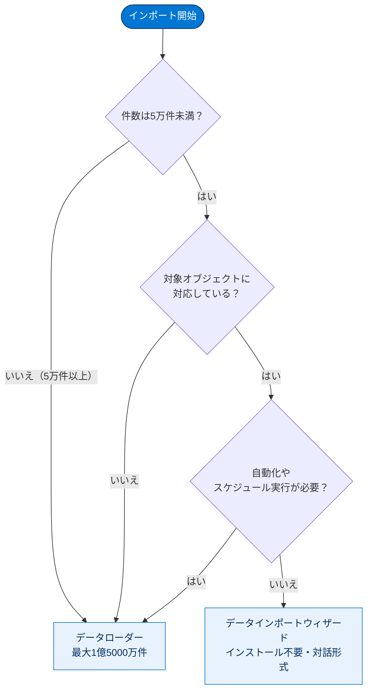
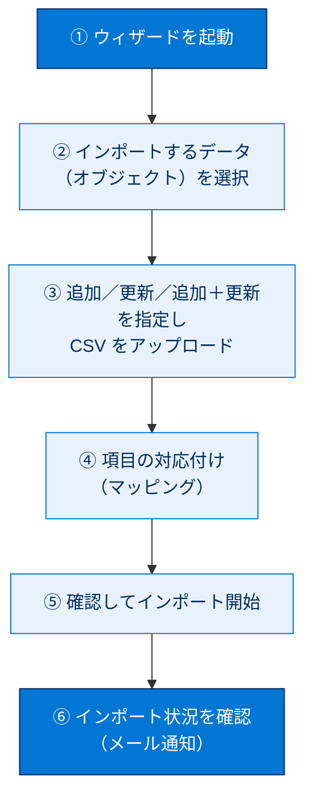
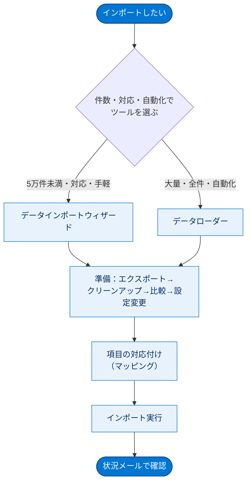

# データのインポート

## 学習の目的

この単元を完了すると、次のことができるようになります。

- Salesforce にインポートする各種オプションを説明・比較する。
- データインポートウィザードで .csv データを準備・インポートするステップを挙げる。

> [!ポイント] この単元のゴール
>
> 取り込みの2大ツール**データインポートウィザード**と**データローダー**の違い（件数上限・対応オブジェクト・自動化の可否）が最重要。あわせて、インポート前のデータ準備の流れ、ウィザードの操作ステップ、項目の挙動（選択リスト・チェックボックス・数式項目・入力規則）を理解しましょう。

---

## データのインポートの概要

外部データは CSV（カンマ区切りテキスト）形式で保存できれば Salesforce にインポートできます。

> [!用語] CSV（Comma-Separated Values：カンマ区切り値）
>
> データをカンマ（,）で区切ったテキスト形式（拡張子 `.csv`）。Salesforce のインポート/エクスポートは基本この CSV を介して行います。

> [!例] CSV ファイルの中身（イメージ）
>
> 1行目がヘッダー（項目名）、2行目以降が実データです。
>
> ```text
> 姓,名,会社名,メール
> 田中,太郎,Cloud Kicks,taro@example.com
> 鈴木,花子,Get Cloudy,hanako@example.com
> ```

インポートの主な方法は次の2種類です。

- **データインポートウィザード** — [設定] からアクセスするブラウザーツール（インストール不要・対話形式）。主な標準オブジェクト（取引先責任者・リード・取引先など）とカスタムオブジェクトに対応。一度の最大は **5 万件**。設定・データソース・**項目の対応付け（マッピング）**を指定します。
- **データローダー** — インストールして使うクライアントアプリ。一度に **1 億 5,000 万件**のあらゆるデータ型を扱え、すべてのオブジェクトに対応。UI またはコマンドラインで操作でき、後者は設定ファイルで対応付け等を指定し **API コールで自動化**できます。

> [!注意] どちらの方法でも共通の制限
>
> インポート可能なレコード数は**権限・データ型・組織のデータストレージ制限**により、インポート可能なオブジェクトの種別は**エディション**により異なります。

---

### 2つのツールの使い分け

- **ウィザード**：5 万件未満／対象オブジェクトが対応／自動化が不要、のとき。
- **データローダー**：5 万～1 億 5,000 万件／ウィザード非対応オブジェクト／定期スケジュール（夜間インポート等）、のとき。1.5億件超は Salesforce パートナーや AppExchange 製品を検討。



| 比較項目 | データインポートウィザード | データローダー |
| --- | --- | --- |
| アクセス方法 | [設定] からブラウザーで利用 | アプリをインストールして利用 |
| インストール | **不要** | **必要** |
| 一度の最大件数 | **5 万件** | **1 億 5,000 万件** |
| 対応オブジェクト | 主な標準＋カスタム（一部のみ） | **すべて**のオブジェクト |
| 自動化（スケジュール実行） | **不可** | **可能**（コマンドライン／API） |
| 操作方法 | 対話形式の画面 | UI またはコマンドライン |

> [!ポイント] 試験での最頻出ポイント
>
> 「**5万件**」「**1億5,000万件**」の2数字、「**自動化＝データローダー／手軽さ＝ウィザード**」、「ウィザードはインストール不要・データローダーは必要」を確実に暗記。

> [!用語] API（Application Programming Interface）
>
> プログラム同士がやり取りする窓口・仕様。データローダーは Salesforce の API を呼んでレコードを処理し、外部システムとの自動連携を実現します。

> [!用語] SOAP API / Bulk API
>
> どちらもデータ入出力用 API。データローダーは標準で **SOAP API**（1件ずつ確実に処理する従来型）を使い、設定で **Bulk API** に切り替えられます。Bulk API は大量レコードを**並列処理**しネットワーク往復が少なく高速。「大量データを速く＝Bulk API」と覚えましょう。

---

## データのインポートの準備

Cloud Kicks のシステム管理者 Linda は、5 万件未満のため**データインポートウィザード**を使うことにしました。次のガイドラインでデータを準備します。

> [!用語] CRM（Customer Relationship Management：顧客関係管理）
>
> 顧客情報（取引先・取引先責任者・商談など）を一元管理し営業・サポートに活用する仕組み。Salesforce は代表的な CRM プラットフォームです。

1. 既存ソフトで**エクスポートファイル**を作成する。これをインポートに使う。
2. インポートファイルを**クリーンアップ**する（重複排除・不要情報の削除・スペル修正・命名規則の統一）。
3. データ項目とインポート可能な Salesforce 項目を**比較**し、対応付けられる項目があるか確認する。必要なら対応付けを微調整する。
4. Salesforce 側で必要な**設定変更**を行う（カスタム項目の作成、選択リスト値の追加、ワークフロールールの一時無効化など）。


> [!用語] データのクリーンアップ（データクレンジング）
>
> インポート前にデータを整える作業。重複・表記揺れ（株式会社／（株）など）・スペルミス・空欄を直してから取り込み、データ品質を保ちます。

> [!注意] まずは小さなテストファイルで試す
>
> 最初に**小さなテストファイル**で準備が正しいか確認するのがおすすめ。いきなり全件を入れて失敗すると、削除・やり直しの手間が大きくなります。

> [!ポイント] 準備の流れを4ステップで覚える
>
> 「**①エクスポート → ②クリーンアップ → ③項目を比較（マッピング準備） → ④Salesforce 側の設定変更**」。「インポート前にやるべきこと」として試験で問われます。

---

## データインポートウィザードの使用

エクスポートとクリーンアップを終えたら、次の流れでインポートします。



> [!手順] ウィザードを起動する
>
> 1. **[設定]** の **[クイック検索]** に「データインポートウィザード」と入力し、**[データインポートウィザード]** を選択。
> 2. お知らせページを確認し、**[ウィザードを起動する]** をクリック。

> [!手順] インポートするデータを選択する
>
> 1. 標準オブジェクト（取引先・取引先責任者・リード・ソリューション・個人取引先・キャンペーンメンバー）なら **[標準オブジェクト]**、カスタムなら **[カスタムオブジェクト]** をクリック。
> 2. **新規追加** / **既存の更新** / **追加と更新を同時** のいずれかを指定。
> 3. 必要に応じて一致条件などを指定（疑問符にマウスを置くと詳細表示）。
> 4. CSV をアップロード領域にドラッグ、またはカテゴリから選択して指定。
> 5. ファイルの**文字コード**を選択（通常はデフォルトで可）。
> 6. **[次へ]** をクリック。

> [!用語] 一致条件（重複の判定基準）
>
> 「更新」「追加＋更新」を選んだとき、CSV の各行が**どの既存レコードと同じか**を判定する基準（例：メール一致なら同じ取引先責任者とみなす）。

> [!注意] 文字コードの選択（日本語データの文字化け対策）
>
> 日本語を含む CSV は文字コードを誤ると文字化けします。通常はデフォルトで問題ありませんが、化けたら別の文字コード（UTF-8 など）を試してください。

> [!手順] データ項目を Salesforce 項目に対応付ける（マッピング）
>
> 1. ウィザードが可能な限り自動で対応付けを試みます。自動対応できない項目は**手動**で対応付け。**対応付けされない項目はインポートされません。**
> 2. 標準項目の一覧は [設定] の **[オブジェクトマネージャー]** → 対象オブジェクト → **[項目とリレーション]** で確認（例：[オブジェクトマネージャー] | [リード] | [項目とリレーション]）。
> 3. 対応付けされていない項目を探す。
> 4. 各項目左の **[対応付け]** をクリック。
> 5. **[項目の対応付け]** ダイアログで対応付ける Salesforce 項目を選び、**[対応付け]** をクリック（取引先/取引先責任者の一般メモ項目として保存する場合は [取引先 メモ]／[取引先責任者 メモ] を選択）。
> 6. 自動対応付けを変えるには該当項目左の **[変更]** をクリックして選び直す。
> 7. **[次へ]** をクリック。

> [!用語] 項目の対応付け（マッピング）
>
> CSV の列名（例：「会社名」）を Salesforce の項目（例：[取引先名]）に**ひも付ける**作業。正しく結びつけることでデータが正しい場所に入ります。

> [!注意] 対応付けされていない項目は捨てられる
>
> マッピングされない CSV の列は**無視されインポートされません**。「データを入れたのに項目が空」というトラブルの多くはこの対応付け漏れが原因。インポート前に全列の対応付けを確認しましょう。

> [!手順] 確認してインポートを開始する
>
> 1. 確認ページで内容を確認。未対応の項目があれば **[前へ]** で戻って対応付ける。
> 2. **[インポートを開始]** をクリック。
> 3. 状況確認は [設定] の [クイック検索] に「一括データ読み込みジョブ」と入力し **[一括データ読み込みジョブ]** を選択。

> [!注意] [対応付け] ボタンが表示されないとき
>
> ブラウザーの**ズーム**でコンテンツを縮小して調整します。

インポートを開始したユーザーには、完了時に**状況メール**が送信されます。

---

## もうひとこと… インポート時の項目の挙動

項目の型ごとにインポート時の振る舞いが異なります。

| 項目の型 | インポート時の挙動 |
| --- | --- |
| **選択リスト**（非制限） | インポートファイル内の値がそのまま使用される |
| **選択リスト**（制限付き） | デフォルト値が使われ、一致が見つからないと失敗することがある |
| **複数選択リスト** | 複数値は**セミコロン（;）**で区切って指定する |
| **チェックボックス** | チェックあり＝**1**、チェックなし＝**0** |
| **数式項目** | 参照のみのため、データを**受け入れない**（インポート不可） |
| **デフォルト値** | 選択リスト等を対応付けしないと、デフォルト値があれば自動挿入される |
| **日付/時間項目** | 地域設定で Salesforce に表示される形式に一致させる |
| **入力規則** | インポート前に実行され、違反レコードはインポートされない |

なお**入力規則**は影響するものを実行前に**無効化**しておくとインポート失敗を防げます。

> [!用語] 入力規則（Validation Rule）
>
> 保存時に「条件を満たさなければ保存させない」と定めるルール。インポートも保存処理なので違反行は取り込まれません。大量インポート時は一時無効化が定石です。

> [!ポイント] 試験で問われやすい項目の挙動
>
> - **チェックボックスは 1（オン）／ 0（オフ）**。
> - **複数選択リストはセミコロン区切り**。
> - **数式項目はインポート不可**（読み取り専用）。
> - **入力規則はインポート時にも適用** → 違反レコードは弾かれる。
>
> 「インポートしたのに一部データが入らない」原因として頻出です。

---

## 試験対策：押さえておきたい追加ポイント

> [!ポイント] ツール選択の判断フロー
>
> ```text
> 件数は？
>  ├─ 5万件未満 ─ 対応オブジェクト？ ── 対応 ── 自動化不要 ─→ データインポートウィザード
>  │                            └─ 非対応 ──────────────────→ データローダー
>  └─ 5万件以上（～1.5億件） ───────────────────────────────→ データローダー
>         └─ 1.5億件超 ─→ Salesforce パートナー / AppExchange 製品
> ```

> [!注意] インポートとデータストレージ
>
> インポート件数は組織の**データストレージ容量**にも左右され、容量超過で失敗します。大量取り込み前に空きを確認しましょう。

> [!まとめ] この単元の要点
>
> - データインポートは **CSV** 形式を介して行う。
> - **データインポートウィザード**：ブラウザー・インストール不要・最大5万件・自動化不可・主な標準＋カスタム対応。
> - **データローダー**：要インストール・最大1.5億件・自動化可（API/コマンドライン）・全オブジェクト対応・SOAP/Bulk API を利用。
> - インポート前は「**エクスポート → クリーンアップ → 項目比較 → 設定変更**」の順で準備。
> - **マッピングされない項目は取り込まれない**。チェックボックスは 1/0、複数選択リストはセミコロン区切り、数式項目は不可、入力規則はインポート時も適用。

---

## リソース

- Salesforce ヘルプ: インポートに関する一般的な質問
- Salesforce ヘルプ: データのインポートの準備
- Developers: データローダーについて
- Salesforce: データのインポートの動画シリーズ

---

> [!注意] 日本語環境で受講する場合
>
> Challenge は日本語の Trailhead Playground で開始し、かっこ内の翻訳を参照しながら進めます。評価は**英語データ**対象のため、**英語の値のみ**をコピー&貼り付けします。不合格時は (1) [Locale] を [United States]、(2) [Language] を [English] に切り替え、(3) [Check Challenge] をクリックしてみてください。

> [!注意] アクセシビリティ
>
> この単元にはスクリーンリーダー向けの追加説明があります。Trailhead の「スクリーンリーダーの説明を開く」リンクをクリックしてください。

---

## 🎓 この単元のまとめ

この単元は「外部データを CSV 経由で Salesforce に取り込む」方法を学びました。ツール選び（ウィザード／データローダー）と、取り込み前の準備、項目の挙動が核心です。

次の図は、インポートの全体像を「ツール選択 → 準備 → 実行 → 確認」という一筋の流れで俯瞰したものです。



| 観点 | ウィザード | データローダー |
| --- | --- | --- |
| 最大件数 | 5 万件 | 1 億 5,000 万件 |
| インストール | 不要 | 必要 |
| 自動化 | 不可 | 可能（API／コマンドライン） |

> [!まとめ] この単元の要点
>
> - インポートは **CSV** を介して行い、ツールは**ウィザード（手軽・5万件）**と**データローダー（大量・自動化）**の2択。
> - 取り込み前は「**エクスポート → クリーンアップ → 項目比較 → 設定変更**」の順で準備する。
> - **対応付け（マッピング）されない列は取り込まれない**のが定番トラブルの原因。
> - 項目の挙動：**チェックボックスは 1/0**、**複数選択リストはセミコロン区切り**、**数式項目はインポート不可**、**入力規則はインポート時も適用**。

> [!豆知識] 「1.5億件」はデータローダーの上限ではなく「一度の処理」の目安
>
> データローダーの「1 億 5,000 万件」は1回のジョブで扱える件数の目安で、Bulk API による並列処理が前提です。それ以上の超大規模移行では、Salesforce パートナーや AppExchange のデータ移行ツールを使うのが実務の定石です。
