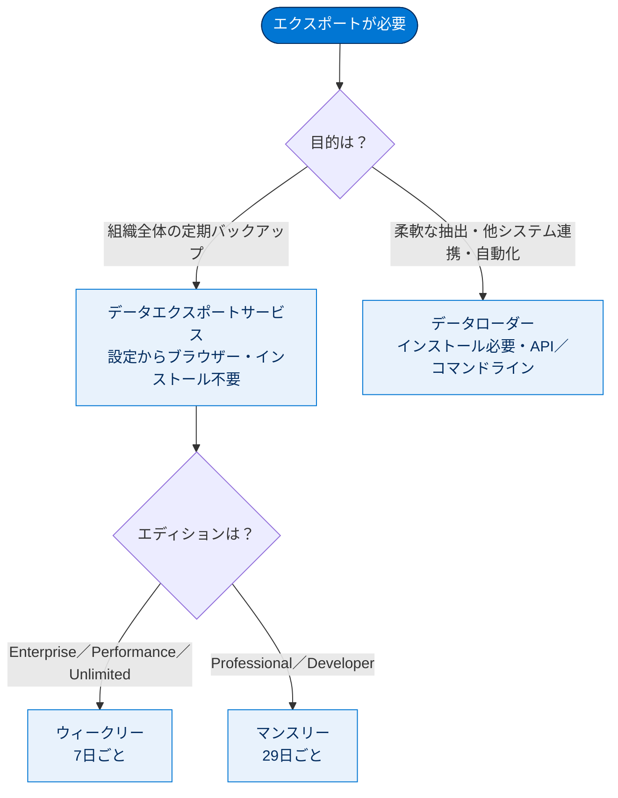
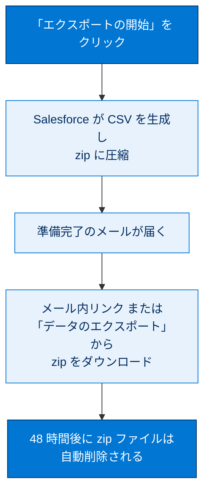
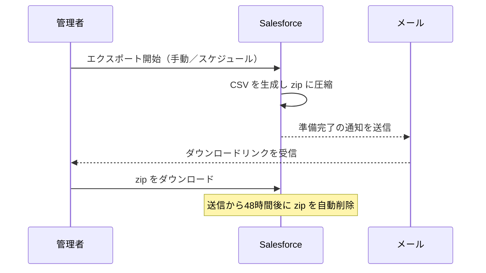

# データのエクスポート

## 学習の目的

この単元を完了すると、次のことができるようになります。

- Salesforce からデータをエクスポートする 2 種類の方法を説明・比較する。
- データエクスポートサービスで手動エクスポートする。
- 週次・月次スケジュールでの自動エクスポートを設定する。

> [!ポイント] この単元のゴール
>
> 取り出しの2大ツール**データエクスポートサービス**と**データローダー**の違いが最重要。「エクスポートサービスは設定画面からブラウザー／データローダーはインストール必要」という対比と、エクスポート周期（**ウィークリー＝7日／マンスリー＝29日**）とエディションの関係が頻出です。

---

## データのエクスポートの概要

Salesforce のデータは手動または自動スケジュールでエクスポートでき、結果は CSV ファイルとして出力されます。**バックアップ**にも別システムへの**インポート**用にも使える、データのコピーを得る便利な方法です。

> [!用語] エクスポート / バックアップ
>
> **エクスポート**は Salesforce のデータを外部に取り出すこと。取り出したコピーを保管するのが**バックアップ**。万一データが消えても復元できます。

> [!用語] CSV（Comma-Separated Values：カンマ区切り値）
>
> データをカンマ（,）で区切ったテキスト形式。エクスポート結果は CSV ファイルとして出力され、複数の CSV をまとめた zip 形式で受け取ります。

エクスポートの主な方法は次の2種類です。

- **データエクスポートサービス** — **[設定]** メニューからアクセスするブラウザー内サービス（インストール不要）。**7 日ごと（ウィークリー）** または **29 日ごと（マンスリー）** に手動／自動でエクスポートできます。ウィークリーは Enterprise・Performance・Unlimited で利用可、Professional・Developer は 29 日ごと（マンスリー）が基本です。
- **データローダー** — 個別に**インストール**するクライアントアプリ。インポート/エクスポート両用で、UI またはコマンドラインで操作でき、自動化や API による他システム統合には後者が便利です。

> [!用語] エディション（Edition）
>
> Salesforce の契約プラン（Developer / Professional / Enterprise / Performance / Unlimited など）。使える機能や上限が異なり、エクスポート周期にも差が出ます。

---

### 2つのツールの比較

| 比較項目 | データエクスポートサービス | データローダー |
| --- | --- | --- |
| アクセス方法 | **[設定]** からブラウザーで利用 | アプリをインストールして利用 |
| インストール | **不要** | **必要** |
| 操作方法 | 画面操作（手動／スケジュール） | UI またはコマンドライン |
| 自動化・外部連携 | スケジュール自動エクスポート | コマンドライン／**API** で自動化・他システム統合 |
| 主な用途 | 組織全体の定期バックアップ | 柔軟な抽出・システム間連携 |

> [!ポイント] エクスポート周期の数字を覚える
>
> - **ウィークリー＝7 日ごと**（Enterprise / Performance / Unlimited）
> - **マンスリー＝29 日ごと**（Professional / Developer）
>
> 「7日／29日」と「ウィークリーは上位エディション、マンスリーは Professional・Developer」の対応は試験で頻出です。

---

## データエクスポートサービスの使用

Get Cloudy のシステム管理者 Chinua は、データ消失が事業に直結するため、データエクスポートサービスで**週次バックアップを自動化**しています。

> [!例] なぜ定期バックアップが重要か
>
> 操作ミスによる大量削除や外部連携の不具合でデータが壊れたとき、直近のバックアップがあれば被害を最小限に復元できます。定期的な自動エクスポートは「保険」として欠かせません。

> [!手順] データエクスポートサービスでエクスポートする
>
> 1. **[設定]** の **[クイック検索]** に「データのエクスポート」と入力し、**[データのエクスポート]** を開いて **[今すぐエクスポート]** または **[エクスポートをスケジュール]** を選択。
>    - **[今すぐエクスポート]** はすぐに準備を行うが、前回から**十分な時間が経過した場合のみ**使用可。
>    - **[エクスポートをスケジュール]** は月次間隔で実行をスケジュールできる。
> 2. エクスポートファイルの**文字コード**を選択。
> 3. 画像・ドキュメント・添付ファイルを含める場合は該当オプションを選択。
> 4. 改行をスペースに置き換えるなら **[改行をスペースに置換]** を選択（再インポートや連携時に有用）。
> 5. スケジュール時は**頻度**（マンスリー組織のみ）・**開始/終了日**・**時刻**を選択。
> 6. **[エクスポートデータ]** で含める**データ型**を選択（不明なら **[すべてのデータを含める]** が推奨）。
> 7. **[エクスポートの開始]** または **[Save（保存）]** をクリック。

> [!用語] [改行をスペースに置換]
>
> テキスト項目内の改行をエクスポート時にスペースへ置換するオプション。改行を含む CSV を別システムに取り込むと行がずれて崩れるため、再インポートや連携時に役立ちます。

> [!注意] [今すぐエクスポート] はすぐに何度も使えない
>
> 前回から一定期間（ウィークリーなら約7日、マンスリーなら約29日）が経過しないと再実行できません。「さっきエクスポートしたばかりでボタンが押せない」のはこのためです。

エクスポート完了後の流れは次のとおりです。

完了日時は保証されません。**zip はメール送信から 48 時間後に削除されます。**

> [!ポイント] エクスポート結果の取り扱い
>
> - 結果は **zip 形式**（中身は CSV）。
> - 大きなエクスポートは**複数ファイルに分割**。
> - 完了は**メール通知**。
> - **48 時間でダウンロードリンク（zip）が削除**されるため早めにダウンロードする。
>
> 「48時間」の保持期間は試験で問われることがあります。

---

## 試験対策：押さえておきたい追加ポイント

> [!ポイント] エクスポート2ツールの使い分け
>
> - **定期的な組織全体のバックアップ** → データエクスポートサービス（[設定] からブラウザー、スケジュール自動化）。
> - **柔軟な抽出・他システム連携・自動化** → データローダー（インストール必要、コマンドライン／API）。

> [!まとめ] この単元の要点
>
> - エクスポート結果は **CSV を zip にまとめた**形で出力。
> - **データエクスポートサービス**：[設定] からブラウザー利用、インストール不要、手動＋スケジュール自動。
>   - **ウィークリー＝7日ごと**（Enterprise / Performance / Unlimited）。
>   - **マンスリー＝29日ごと**（Professional / Developer）。
> - **データローダー**：インストール必要、UI／コマンドライン、API で自動化・外部連携。
> - 完了はメール通知、**zip は48時間で削除**、大きなエクスポートは複数ファイルに分割。

---

## リソース

- Developers: データローダーについて
- Developers: データローダーのインストール
- Developers: Salesforce からのデータのエクスポート

---

## テスト（+100 ポイント獲得）

> [!ポイント] 理解度チェック
>
> 各設問に正解と簡単な解説を添えました。冗談の選択肢（魔法使い・つえ等）は不正解です。

**第 1 問：データエクスポートサービスについての正しい記述はどれですか?**

- コマンドラインで操作できる
- 個別にインストールする必要がある
- 実在する魔法使いがインストールする必要がある
- **[設定] メニューからアクセスできる** ← 正解

> [!用語] 正解の根拠
>
> データエクスポートサービスはブラウザー内サービスで **[設定] メニューからアクセス**します。インストールやコマンドライン操作が必要なのは「データローダー」です。

**第 2 問：データエクスポートサービスでデータを手動エクスポートする場合の操作は?**

- **[設定] から [データのエクスポート] を開き、[今すぐエクスポート] を選択する** ← 正解
- データローダークライアントアプリケーションをインストールする
- 長い髭をはやし、魔法のつえを探す
- データローダー bin ファイルをコマンドプロンプトで開き、[Extract All] コマンドを実行する

> [!用語] 正解の根拠
>
> 手動エクスポートは **[設定] → [データのエクスポート] → [今すぐエクスポート]** の流れ。データローダーやコマンドプロンプトは別ツールの操作です。

**第 3 問：[エクスポートをスケジュール] でスケジュールできる間隔は?**

- 毎日
- 隔日
- 毎週木曜日と、毎週火曜日に 2 回
- 毎年
- **毎月** ← 正解

> [!用語] 正解の根拠
>
> [エクスポートをスケジュール] では**月次（毎月）間隔**を指定できます（マンスリー組織では頻度を選択可）。「毎日」「隔日」「毎年」は選べません。

> [!注意] 完了日について（教材の記録値）
>
> このテストの完了日は教材上 **2025/11/21** と記録されています。学習進捗の参考情報です。

---

> [!注意] アクセシビリティ
>
> この単元にはスクリーンリーダー向けの追加説明がある場合があります。Trailhead の「スクリーンリーダーの説明を開く」リンクを参照してください。
