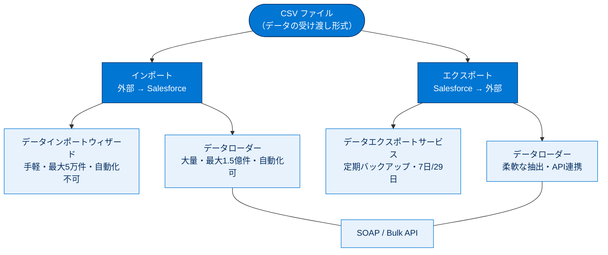

# データ管理 総まとめ

このトピックでは、Salesforce の「データの出し入れ」を学びました。外部データを取り込む**インポート**と、組織のデータを取り出す**エクスポート**の2方向です。どちらも **CSV** を介して行い、用途や規模に応じて**データインポートウィザード／データエクスポートサービス／データローダー**を使い分けます。件数の上限・自動化の可否・エディション差など、暗記すべき数字が多いのが特徴です。

---

## 全体像

次の図は、データ管理のトピック全体（インポートとエクスポートの2方向と、そこで使うツール）を1枚で俯瞰したものです。

---

## ユニット横断 早見表

| ユニット | 学んだこと | キーワード | 一言要点 |
| --- | --- | --- | --- |
| 01 データのインポート | 外部 CSV を Salesforce に取り込む方法と準備・項目の挙動 | データインポートウィザード／データローダー／マッピング／5万件・1.5億件 | 手軽なら**ウィザード**、大量・自動化なら**データローダー**。対応付けされない列は捨てられる。 |
| 02 データのエクスポート | Salesforce のデータを CSV で取り出す方法と周期 | データエクスポートサービス／ウィークリー7日・マンスリー29日／48時間／zip | 定期バックアップは**エクスポートサービス**、柔軟な抽出は**データローダー**。zip は48時間で消える。 |

---

## 🎯 試験頻出ポイント

> [!ポイント] このトピックで狙われやすい論点・暗記値
>
> - **件数の数字**：ウィザード＝**5 万件**／データローダー＝**1 億 5,000 万件**。
> - **インストールの有無**：ウィザード・エクスポートサービスは**不要（ブラウザー）**／データローダーは**必要（クライアントアプリ）**。
> - **自動化**：スケジュール／API 自動化は**データローダー**（とエクスポートサービスのスケジュール機能）。ウィザードは自動化**不可**。
> - **エクスポート周期**：**ウィークリー＝7日**（Enterprise/Performance/Unlimited）／**マンスリー＝29日**（Professional/Developer）。
> - **48時間**：エクスポートの zip ダウンロードリンクは送信から **48 時間**で削除。
> - **項目の挙動**：チェックボックス＝**1/0**、複数選択リスト＝**セミコロン区切り**、数式項目＝**インポート不可**、入力規則＝**インポート時も適用**。
> - **インポート準備の順序**：**エクスポート → クリーンアップ → 項目比較 → 設定変更**。
> - **API**：大量・高速処理は **Bulk API**（並列処理）、従来型は **SOAP API**。

---

## 📖 用語早見表

| 用語 | ひとことの意味 |
| --- | --- |
| CSV | カンマ区切りのテキスト形式。インポート/エクスポートの共通フォーマット。 |
| データインポートウィザード | 設定からブラウザーで使う対話形式の取り込みツール（最大5万件）。 |
| データローダー | インストールして使うクライアントアプリ。大量データと自動化に対応。 |
| データエクスポートサービス | 設定からブラウザーで使う定期バックアップ用エクスポート機能。 |
| マッピング（項目の対応付け） | CSV の列を Salesforce の項目にひも付ける作業。 |
| 一致条件 | 更新時、CSV の行をどの既存レコードと同じとみなすかの判定基準。 |
| データのクリーンアップ | 取り込み前に重複・表記揺れ・スペルミスを整える作業。 |
| 入力規則 | 保存時の条件チェック。違反行はインポートされない。 |
| ウィークリー / マンスリー | エクスポート周期。7日ごと／29日ごと。 |
| エディション | Salesforce の契約プラン。使える機能や上限が異なる。 |
| バックアップ | エクスポートしたデータのコピーを保管すること。 |
| SOAP API | 1件ずつ確実に処理する従来型のデータ入出力 API。 |
| Bulk API | 大量レコードを並列処理する高速な API。 |
| zip | エクスポート結果（複数 CSV）をまとめた圧縮形式。 |

---

> [!豆知識] 「5万件の壁」はウィザードを選ぶか否かの分かれ目
>
> データインポートウィザードの 5 万件という上限は、試験でツール選択を問う設問の決め手としてよく登場します。「5万件未満かつ対応オブジェクトかつ自動化不要」の3条件がそろったときだけウィザード、ひとつでも外れたらデータローダー、と整理すると迷いません。

> [!豆知識] エクスポートの「48時間」は親切なようで落とし穴
>
> エクスポート完了メールが届いてからダウンロードできるのは 48 時間だけ。週末をはさんで放置すると消えてしまうため、自動エクスポートを設定する組織では「届いたらすぐ保存」を運用ルールにしているところが多いです。

> [!豆知識] インポートとエクスポートは「対」で覚える
>
> 両方の主役は CSV とデータローダーで、データローダーはインポート・エクスポート両用です。ブラウザーツール側だけが用途別に分かれており（取り込み＝ウィザード／取り出し＝エクスポートサービス）、ここを対で覚えると混同しません。

---

## ✅ 理解度セルフチェック

> [!まとめ] 答えながら理解度を確認しよう（答えは各問の末尾）
>
> 1. 一度に 5 万件を超えるデータを取り込みたい。ウィザードとデータローダーのどちら？ → **データローダー**（ウィザードは最大5万件）。
> 2. データインポートウィザードはインストールが必要？（Yes/No） → **No**（設定からブラウザーで利用）。
> 3. インポート時、複数選択リストの値はどの記号で区切る？ → **セミコロン（;）**。
> 4. 数式項目にはデータをインポートできる？（Yes/No） → **No**（読み取り専用のため受け入れない）。
> 5. ウィークリーエクスポートは何日ごと？ また対象エディションは？ → **7 日ごと／Enterprise・Performance・Unlimited**。
> 6. エクスポートした zip のダウンロードリンクは何時間で削除される？ → **48 時間**。
