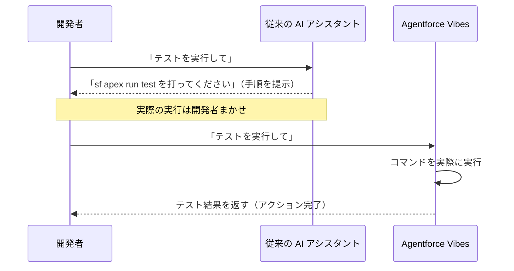
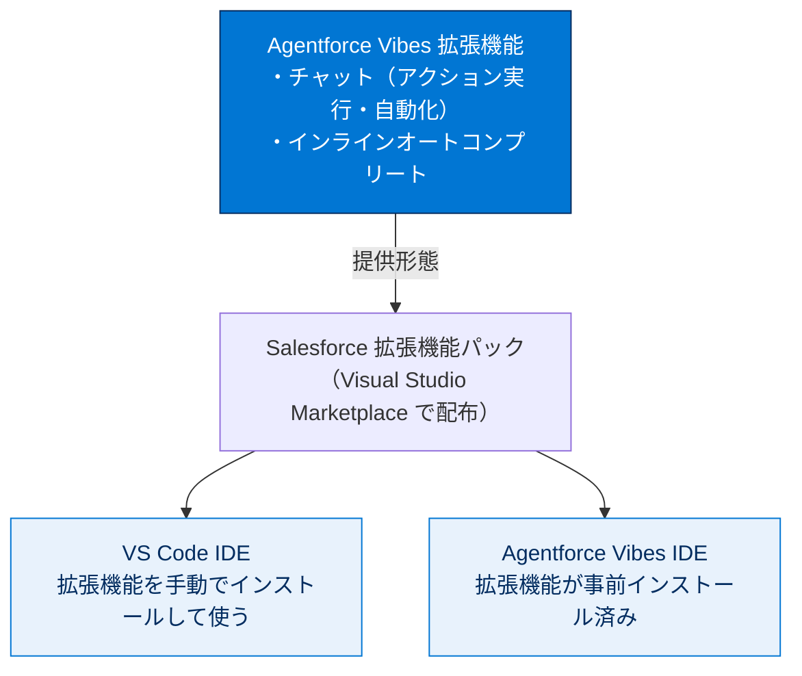

# Agentforce Vibes について知る

## 学習の目的

この単元を完了すると、次のことができるようになります。

- Agentforce Vibes がお客様の成果をどのように向上させるかを説明する。
- Agentforce Vibes が通常のチャットとどのように異なるかを説明する。
- VS Code とコードビルダーでの Agentforce Vibes のコア機能を特定する。

> [!ポイント] この単元のゴール
>
> 「**何か**」「**普通の AI チャットとの違い（＝アクションを実行できる）**」「**どこで使えるか（VS Code / Agentforce Vibes IDE）**」の3点を押さえる。とくに「**コード提案だけでなくコマンド実行やワークフロー自動化まで行うエージェンティック AI である**」点が試験で問われます。

---

## Agentforce Vibes 拡張機能とは?

**Agentforce Vibes 拡張機能**（旧称: 開発者向け Agentforce）は、開発者の生産性を高め、複雑な開発ワークフローを自動実行する**エージェンティック AI ツールのスイート**です。

> [!用語] エージェンティック AI（Agentic AI）
>
> 質問に答えるだけでなく、**自分で判断してアクション（操作）を実行する** AI。「テストを実行して」と頼むと、手順を文章で返すのではなく、実際にコマンドを走らせて結果を返します。拡張機能（Extension）は VS Code に後から追加する機能パッケージで、Agentforce Vibes は Salesforce 開発機能を VS Code に追加する形で提供されます。

---

### 主な機能

| 機能 | 何ができるか | 対応ファイル |
| --- | --- | --- |
| **Agentforce Vibes チャット** | 情報提供だけでなく、コマンド実行・ワークフロー自動化・組織への直接接続まで行う | 自然言語の会話 |
| **インラインオートコンプリート** | 入力中にコード補完を提案し、作業を中断させない | Apex / LWC（JavaScript・CSS・HTML） |

**チャット**は MCP を搭載したエージェンティックチャットで、コマンド実行・ワークフロー自動化のほか Salesforce 組織への直接接続も行える「インテリジェントな開発パートナー」です。ツール切り替えが減り、自然言語の会話でテスト・リリース・メタデータ操作の効率が上がります。

> [!用語] MCP（Model Context Protocol：モデルコンテキストプロトコル）
>
> AI モデルが外部のツールやデータソースと安全にやり取りするための共通の仕組み。Agentforce Vibes は MCP を使って Salesforce 組織やコマンドなど「AI の外側にあるもの」と連携しアクションを実行します。詳細は別単元で扱います。

**インラインオートコンプリート**は入力中にコード補完を提案し、流れを止めずに候補から選べる機能。**Apex** と **LWC（JavaScript・CSS・HTML）** で使えます。

> [!用語] LWC（Lightning Web Components）
>
> Salesforce で UI（画面部品）を作る標準フレームワーク。JavaScript・HTML・CSS という Web 標準技術で構成されます。オートコンプリートはこの LWC 各ファイルと Apex に対応します。

> [!例] インラインオートコンプリートのイメージ
>
> Apex で `List<Account> accounts = ` まで入力すると、続きの `[SELECT Id, Name FROM Account];` がグレーで表示され、Tab で確定。タイピングを止めずに書き進められます。

---

## 概要

Agentforce Vibes は、自然言語で**コード生成、Apex クラスや Lightning コンポーネントの構築、ソリューションの実装、組織の管理**を行えます。従来のペアプログラミングを超え、開発プロセス全体で開発者の代わりにアクションを実行。Salesforce のセキュアなカスタム AI モデル（匿名化されたコードパターンから学習）を活用し、コマンド実行・組織とのやり取り・複数ステップのワークフロー完了を行いながら、自動生成・テスト・統計分析・セキュリティスキャンといったベストプラクティスを適用します。

> [!例] 「提案するだけの AI」と「動く AI」の違い
>
> - **従来の AI アシスタント**：「`sf apex run test` を打ってください」と**手順を教える**。
> - **Agentforce Vibes**：「テストを実行して」で**実際に走らせて結果まで返す**。
>
> この「教える」から「やってくれる」への違いがエージェンティック AI の核心です。



Agentforce Vibes 拡張機能は **Salesforce DX プロジェクト**で使用でき、**Salesforce 拡張機能パック**の一部として **Visual Studio Marketplace** で入手できます。VS Code IDE にインストール可能で、**Agentforce Vibes IDE** には事前インストール済みです。

> [!用語] Salesforce DX（Salesforce Developer Experience）
>
> ソースコード中心に開発を進める最新の手法とツール群。プロジェクトをローカルフォルダー（DX プロジェクト）として管理し、Git 等と組み合わせます。Agentforce Vibes はこの DX プロジェクト上で動作します。

> [!ポイント] 入手方法は1つだけ覚える
>
> 拡張機能は **VS Code 用 Salesforce 拡張機能パック（Salesforce Extension Pack）に含まれている**形で入手します。「事前インストール済み」「営業担当に連絡が必要」「一部ユーザー限定」ではありません。試験頻出です。

---

## 使える環境の整理



---

## 始める前に

利用開始前に **Salesforce テレメトリーを有効にする**必要があります。テレメトリーは Salesforce の生成 AI が正しく機能しているか監視・監査します。

> [!用語] テレメトリー（Telemetry）
>
> ソフトウェアの利用状況や動作データを自動収集・送信する仕組み。Agentforce Vibes では生成 AI が正しく機能しているか監視・監査するために利用するため、事前の有効化が必要です。

> [!手順] Salesforce テレメトリーを有効にする
>
> 1. **[File]** | **[Preferences]** | **[Settings]**（Windows/Linux）、または **[Code]** | **[Settings]** | **[Settings]**（macOS）を選択する。
> 2. `salesforcedx-vscode-core.telemetry.enabled` を検索し、ワークスペースで有効になっているか確認する。
> 3. 無効なら、チェックボックスをオンにする。
> 4. `telemetry` を検索し、**[Telemetry: Telemetry Level]** のドロップダウンで **[all]** を選択する。
> 5. ターミナルで次のコマンドを実行し CLI テレメトリーを有効化する。
> 6. **Ctrl + Shift + P**（Windows）/ **Command + Shift + P**（Mac）でコマンドパレットを開き、**Developer: Reload Window** を実行する。

```bash
# CLI 側のテレメトリーを有効化（disable-telemetry=false ＝有効、--global で全体適用）
sf config set disable-telemetry=false --global
```

> [!注意] 設定はワークスペース単位で確認する
>
> テレメトリー設定は VS Code 全体だけでなく、開いている**ワークスペース（プロジェクト）**でも有効か確認します。変更後は **Developer: Reload Window** を実行しないと反映されないことがあります。

Agentforce Vibes 拡張機能はデフォルトでデスクトップアプリで有効になっており、Salesforce 組織の **[Set Up（設定）]** メニューから起動できます。ステータスバーのアイコンをクリックすればいつでもオフにできます。

> [!注意] 生成 AI の出力は必ず確認する
>
> 生成 AI を使うため、不正確または有害な応答や、**非決定的（毎回同じとは限らない）**な出力が生じることがあります。使用前に正確性と安全性を確認してください。結果を組織に適用する方法については**利用者が責任を負います**。

次は、VS Code でよりスマートかつ迅速に開発するための Agentforce Vibes のチャット、ルール、スキルを学びます。

---

## 試験対策：押さえておきたい追加ポイント

> [!まとめ] この単元の要点
>
> - **Agentforce Vibes** はコード提案だけでなく**コマンド実行やワークフロー自動化を実行する**エージェンティック AI ツールのスイート。
> - 従来との最大の違いは「**アクションを実行し、ワークフローを自動実行する**」こと（速度やメモリの少なさではない）。
> - 入手方法は **VS Code 用 Salesforce 拡張機能パックに含まれている**形のみ。
> - 主な機能は **チャット**（MCP 搭載・組織に直接接続可）と **インラインオートコンプリート**（Apex・LWC 対応）。
> - 利用前に **Salesforce テレメトリー**の有効化が必要。
> - 生成 AI の出力は非決定的。**使う前の正確性・安全性確認は利用者の責任**。

---

## リソース

- 開発者ガイド: Agentforce Vibes
- 開発者ガイド: Salesforce DX 開発者ガイド
- 開発者ガイド: Visual Studio Code 向け Salesforce 拡張機能
- Trailhead: クイックスタート: Salesforce 開発のための Visual Studio Code

---

## テスト

この単元を完了するには、テストのすべての質問に正しく解答する必要があります。（+100 ポイント）

**問 1. Agentforce Vibes 拡張機能を入手するにはどうすればよいですか?**

- A. Salesforce 組織に事前にインストールされている。
- B. VS Code 用 Salesforce Extension Pack に含まれている。
- C. 一部のユーザーのみがアクセスできる。
- D. アクセス権を得るには Salesforce の営業担当に連絡する必要がある。

**問 2. Agentforce Vibes は従来の AI アシスタントと何が違いますか?**

- A. コードの提案のみを行う。
- B. アクションを実行し、ワークフローを自動的に実行する。
- C. ほかの AI ツールよりも動作が速い。
- D. 実行に必要なメモリが少なくて済む。

> [!ポイント] 解答の考え方
>
> - **問 1 → B**：拡張機能は VS Code 用 Salesforce 拡張機能パックに含まれて配布されます。
> - **問 2 → B**：従来は「提案する」だけ、Agentforce Vibes は「**アクションを実行し、ワークフローを自動化する**」点が決定的な違いです。
