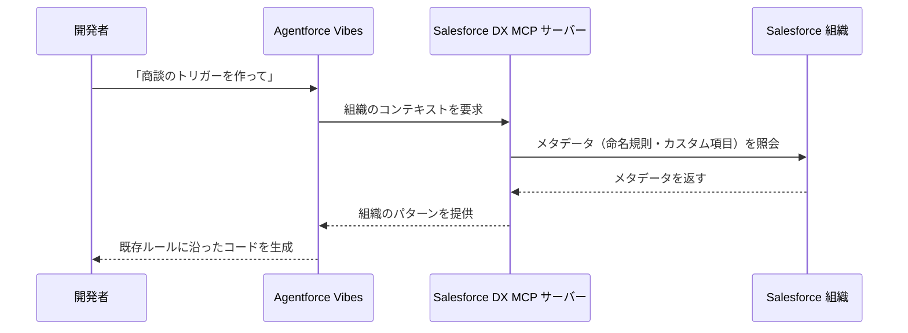
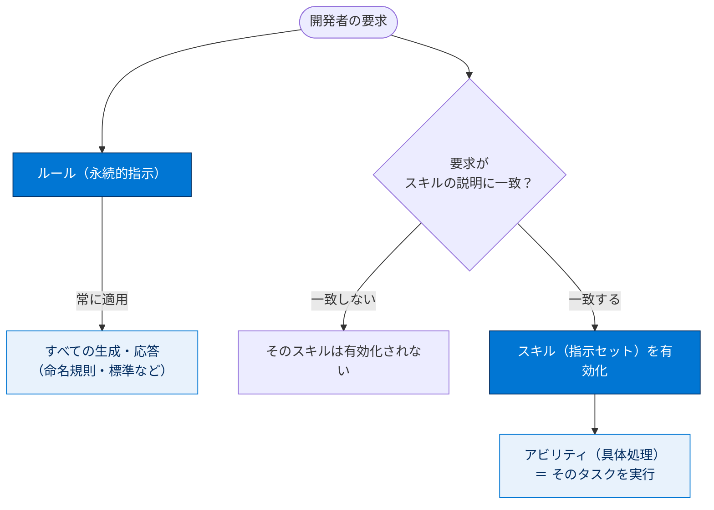

# コーディング時に Agentforce とシームレスに連携する

## 学習の目的

この単元を完了すると、次のことができるようになります。

- VS Code で Agentforce Vibes チャットに移動する。
- Agentforce Vibes がコードの記述とリリースをどのように補佐するかを説明する。
- ルールによってプロジェクト全体で一貫したコーディング標準がどのように維持されるかを説明する。
- スキルとアビリティによって、反復可能な開発ワークフローがどのようにサポートされるかを説明する。

> [!ポイント] この単元のゴール
>
> 4つのキーワード — **チャット / ルール / スキル / アビリティ** — の役割と違いを区別できることがゴール。とくに「**ルールは常に適用される永続的な指示**」「**スキルは要求に一致したときだけ有効化**」「**Apex はパスカルケース、LWC はケバブケース**」が試験で問われます。

---

## Agentforce Vibes について知る

Agentforce Vibes は単なるチャットボットではなく、Salesforce プラットフォーム上で**構築・調整・リリースを主体的に実行する開発パートナー**です。Model Context Protocol（MCP）、スキル、ルール、ワークフローを搭載したエージェントチャットを介して、VS Code 内からコマンド実行や複雑なワークフローの自動化を行います。コードを提案するだけでなく、**プロジェクトのコンテキストを理解し、本人に代わってツールを実行**します。

> [!用語] エージェントチャット（Agentic Chat）
>
> 会話形式でやり取りしながら、AI が**実際にツールを実行してタスクを完了する**チャット。普通のチャットボットが「答えを返すだけ」なのに対し、会話の流れの中で作業そのものを進めます。

> [!用語] コンテキスト（Context）
>
> AI が応答生成時に参照する背景情報。開いているファイル・プロジェクト構造・組織のメタデータ・命名規則などを指し、豊富なほどプロジェクトに合った正確なコードを生成できます。

> [!手順] Agentforce Vibes チャットを開く
>
> 1. VS Code 左端の **活動バー（Activity Bar）** を確認する。
> 2. **Agentforce Vibes アイコン** をクリックする。
> 3. チャット画面（パネル）が起動する。
> 4. 開いているファイルや作業内容を自動認識し、それに沿って会話・コード提案を行う。

---

## サンプルを使って会話を始める

Agentforce Vibes が **Salesforce DX MCP サーバー**を使ってアクションを実行し、組織のコンテキストを理解する例を示すプロンプトを紹介します。

> [!用語] Salesforce DX MCP サーバー
>
> Agentforce Vibes と Salesforce 組織・DX プロジェクトを橋渡しする MCP サーバー。AI が実際の組織のメタデータ（カスタム項目・命名規則・共有モデル）を読み取り、それに合わせたコードを生成できます。詳細は次の単元で扱います。

> [!用語] プロンプト（Prompt）
>
> AI に与える指示文。自然言語（英語・日本語どちらでも可）で書け、具体的なほど結果の精度が上がります。

### 組織に応じた開発

```text
Create an Apex class for Account management that follows my org's existing patterns
（私の組織の既存のパターンに従って取引先を管理する Apex クラスを作成してください）

Generate a Lightning web component for Contact search using my org's custom fields
（私の組織のカスタム項目を使用して取引先責任者を検索する Lightning Web コンポーネントを作成してください）

Build a trigger for Opportunity that matches my org's naming conventions
（私の組織の命名規則に厳密に従って、商談のトリガーを作成してください）
```

### スマートなコード生成

```text
Create comprehensive unit tests for my AccountService class
（私の AccountService クラスに包括的な単体テストを作成してください）

Build an Apex method that validates data based on my org's validation rules
（私の組織の検証ルールに基づいてデータを検証する Apex メソッドを作成してください）
```

### コンテキストに応じた支援

```text
Explain why this SOQL query might be slow in my org and suggest improvements
（私の組織でこの SOQL クエリに時間がかかることがある理由を説明し、改善点を提案してください）

Review my Apex class and suggest security improvements based on my org's sharing model
（私の Apex クラスを確認し、組織の共有モデルに基づくセキュリティの強化策を提案してください）

Help me understand the relationships between my custom objects
（カスタムオブジェクト間のリレーションを理解できるように説明してください）
```

これらは、Agentforce Vibes が**組織のメタデータと構造を使ってコンテキストに応じた支援**を行うことを示しています。



> [!例] 「組織に応じた」生成の効果
>
> 命名規則が `XxxxHandler` のチームで「商談のトリガーを作って」と頼むと、組織のメタデータを参照して `OpportunityTriggerHandler` のように**既存ルールに沿った名前**で生成します。汎用 AI のように無関係な名前を勝手につけることを避けられます。

---

## ルールとワークフローを使用する

**Agentforce Vibes ルール**を使うと、開発セッションを通して従う**一貫したコーディング標準とプロジェクト固有の設定**を確立できます。ルールは**永続的な指示**として機能し、開発全般で一貫性が保たれ、チームが同じパターンに従えます。

> [!用語] ルール（Rules）
>
> Agentforce Vibes が**常に従う永続的な指示**。「Apex クラスはパスカルケースで命名する」と一度決めれば、以降の生成すべてに自動適用されます。セッションごとにリセットされる一時設定ではなく、プロジェクトに常駐するコーディング標準です。

### ルールの主なメリット

- コーディングパターンやアーキテクチャの決定が**自動的に適用される**。
- 一貫した命名規則とコード構造が維持される。
- チーム全体で開発実務が共有される。
- セキュリティやドキュメントの標準に確実に準拠する。

### 推奨されるルール

| 対象 | 命名規則 | 例 |
| --- | --- | --- |
| **Apex クラス名** | パスカルケース（PascalCase） | `AccountService`、`OpportunityTriggerHandler` |
| **Lightning Web コンポーネント名** | ケバブケース（kebab-case） | `account-detail`、`product-search` |
| **トリガー** | 組織固有の命名パターン／エラー処理方法に従う | （組織ごと） |

> [!用語] 命名規則（ケース）の種類
>
> - **パスカルケース（PascalCase）**：各単語の先頭を大文字（例：`AccountService`）。Apex クラス名に使用。
> - **キャメルケース（camelCase）**：先頭だけ小文字（例：`accountService`）。
> - **ケバブケース（kebab-case）**：すべて小文字、単語をハイフンで連結（例：`account-detail`）。LWC 名に使用。

> [!ポイント] 命名規則は試験頻出
>
> **Apex クラス名 = パスカルケース（`AccountService`）**、**LWC 名 = ケバブケース（`account-detail`）** をセットで覚えます。キャメルケースや大文字スネークケースは Apex クラス名の正解ではありません。

> [!手順] ルールを作成する
>
> 1. Agentforce Vibes のインターフェース（UI）から作成する、または
> 2. チャットで `/newrule` コマンドを実行する。

---

## スキルとアビリティを活用する

Agentforce Vibes は**スキル**と**アビリティ**を組み合わせ、**1 回限りのプロンプトから再利用可能な実行へ移行**できるよう支援します。

> [!用語] スキル（Skills）
>
> 特定タスクを実行するための**モジュール化された指示セット**。ガイダンス・ワークフロー・任意のリソースを含み、**関連する場合にのみオンデマンドで読み込まれます**。「Apex サービスを作る」スキルは Apex 生成の要求時だけ有効になります。

> [!用語] アビリティ（Abilities）
>
> ワークフロー内で実行できる**具体的な処理**（コード生成・ファイル分析・テスト作成・接続ツールの使用など）。スキルが「指示書」なら、アビリティは「実際に手を動かす行為」です。

### スキルとアビリティの主なメリット

- 再利用可能な開発ガイダンスをパッケージ化し、共通タスクを一貫して処理する。
- 関連スキルの指示のみを有効化し、**集中度とトークン効率を向上**させる。
- 組み込み機能と接続機能を活用し、実用的なワークフローを迅速に実行する。
- 再試行や手戻りを減らし、顧客向けの改善を迅速に提供する。

> [!用語] トークン効率（Token Efficiency）
>
> AI が一度に処理できる情報量（トークン）には上限があります。関連スキルだけを読み込むことで不要な指示で枠を消費せず、本当に必要な情報に AI を集中させられること。

### スキルとアビリティの例

- **スキル**：Apex サービスの命名規則・構造・必須の検証手順を定義する `apex-class-generator`
- **スキル**：コンポーネントのスキャフォールディングとテスト要件を標準化する `lwc-component-creator`
- **アビリティの動作**：実装コードを生成し、ドラフトテストを作成し、プロジェクトの標準に照らして出力を調整する。接続ツールのコンテキストを活用して関連性を高める。

> [!用語] スキャフォールディング（Scaffolding）
>
> 新しいコンポーネントやクラスの「ひな形（骨組み）」を自動生成すること。必要なファイルやフォルダー構成をまとめて作るため、開発を素早く始められます。

**ルールが常時適用されるのに対し、スキルは要求がスキルの説明に一致した場合のみ有効化**され、関連性のない指示の混入を防ぎます。スキルはデフォルトで有効で、スキル UI で管理できます。

> [!ポイント] ルールとスキルの違い（重要）
>
> | 項目 | ルール（Rules） | スキル（Skills） |
> | --- | --- | --- |
> | 適用タイミング | **常に**適用（永続的な指示） | 要求が**説明に一致したときだけ**有効化 |
> | 目的 | 一貫したコーディング標準の維持 | 再利用可能なタスク手順の提供 |
> | デフォルト | プロジェクトに常駐 | 有効（スキル UI で管理） |
>
> 「ルール＝いつも」「スキル＝必要なときだけ」という対比で覚えます。



---

## コンテキストを追加して結果を改善する

Agentforce Vibes を最大限に活用するには、**プロジェクト・要件・コーディング標準に関する適切なコンテキストを伝えます**。

- 既存のアーティファクト（チャットで `@` を入力すると一覧が表示）を参照する。
- ビジネスロジックを説明する。
- 作業中の Salesforce の特定機能に言及する。
- 意図する機能を説明する。

コンテキストが明確なほど、生成コードの正確性・関連性が高まり、既存コードベースとの一貫性が維持されます。

> [!例] `@` で参照する
>
> チャット入力中に `@` を打つと、参照できる既存ファイルやアーティファクトの一覧が表示されます。`@AccountService.cls` を選べばその既存クラスをコンテキストとして渡せ、それに合わせたコードを生成してもらえます。

> [!注意] あいまいなプロンプトは精度を下げる
>
> 「いい感じに作って」のような抽象的な依頼は組織やプロジェクトに合わない結果になりがちです。対象オブジェクト・命名規則・参照すべき既存コードなど、**具体的なコンテキストを添える**ほど正確性と関連性が高まります。

---

## 試験対策：押さえておきたい追加ポイント

> [!まとめ] この単元の要点
>
> - **チャット**は活動バーの Agentforce Vibes アイコンから開く。作業中のファイル・組織コンテキストを認識して支援する。
> - **ルール（Rules）** は**常に適用される永続的な指示**。コーディング標準・命名規則を全生成に自動適用する。作成は `/newrule`。
> - **スキル（Skills）** は**要求が説明に一致したときだけ有効化**されるモジュール化された指示セット。トークン効率を高める。
> - **アビリティ（Abilities）** はスキルの中で実行される具体的な処理（コード生成・テスト作成・ツール利用など）。
> - 命名規則：**Apex クラス＝パスカルケース（`AccountService`）／ LWC ＝ケバブケース（`account-detail`）**。
> - `@` でコンテキスト（既存ファイル）を参照すると生成精度が上がる。

---

## リソース

- Salesforce 開発者: Agentforce Plan and Act Modes（Agentforce の計画モードと実行モード）
- Salesforce 開発者: Agentforce Rules（Agentforce ルール）
- Salesforce 開発者: Agentforce Vibes Context（Agentforce Vibes コンテキスト）

---

## テスト

この単元を完了するには、テストのすべての質問に正しく解答する必要があります。（+100 ポイント）

**問 1. Agentforce ルールとは何ですか?**

- A. 特定のタスクの 1 回限りのプロンプト
- B. 継続的なガイダンスとなる永続的な指示
- C. セッションごとにリセットする一時的な設定
- D. Trust Layer で PII を非表示にするために使用するデータマスキング設定

**問 2. Apex クラス名に使用すべき命名規則はどれですか?**

- A. キャメルケース（例: `accountService`）
- B. ケバブケース（例: `account-service`）
- C. パスカルケース（例: `AccountService`）
- D. 大文字（例: `ACCOUNT_SERVICE`）

> [!ポイント] 解答の考え方
>
> - **問 1 → B**：ルールは「継続的なガイダンスとなる永続的な指示」。1 回限りや一時的・データマスキングではありません。
> - **問 2 → C**：Apex クラス名は**パスカルケース**（`AccountService`）。ケバブケースは LWC 名、キャメルケースや大文字スネークケースは正解ではありません。
