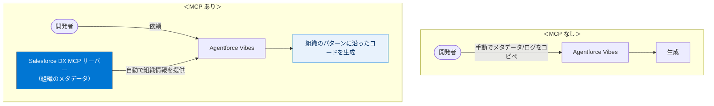
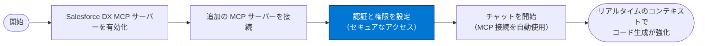

# MCP インテグレーションで開発を大幅に向上させる

## 学習の目的

この単元を完了すると、次のことができるようになります。

- Model Context Protocol（MCP）の概要とそれが重要な理由を説明する。
- Salesforce DX MCP サーバーによって開発ワークフローが強化される理由を説明する。
- MCP サーバーを Agentforce Vibes と統合して機能を強化する。
- MCP を使用して外部のツールやデータソースにアクセスする。

> [!ポイント] この単元のゴール
>
> 「**MCP は AI を外部のツール・データにつなぐオープン標準**」「**Salesforce DX MCP サーバーが組織のメタデータを AI に渡し、組織に合ったコードを生成できる**」「**MCP で AI が環境を認識し、ログやメタデータの手動コピペが不要になる**」の3点が試験で問われます。「速くする」「メモリを減らす」ではない点に注意。

---

## Model Context Protocol とは?

**Model Context Protocol（MCP）** は、Agentforce Vibes のような AI アシスタントが**外部のツール・データソース・サービスにセキュアに接続**できるようにする**オープン標準**です。AI がほぼすべてのシステムとやり取りできるようにする「**万能翻訳機**」のような存在で、機能を大幅に拡張します。

> [!用語] Model Context Protocol（MCP：モデルコンテキストプロトコル）
>
> AI アシスタントが外部のツール・データソース・サービスと**安全にやり取りするための共通ルール（オープン標準）**。「オープン標準」は特定の会社に縛られず誰でも使える公開仕様の意。これにより AI は学習データの中だけでなく、外部の最新情報や実システムにアクセスできます。

> [!例] 「万能翻訳機」のたとえ
>
> AI と外部システム（DB、開発ツール、組織のメタデータ等）はそれぞれ違う「言葉」を話します。MCP はその間に立つ翻訳機で、AI がどんなシステムとも同じやり方でやり取りできるようにします。1 つの仕組みを覚えれば多様なツールに接続できます。

MCP により、Agentforce Vibes は**スタンドアロンのコーディングツール**から**包括的な開発エコシステム**へ飛躍します。トレーニングデータに基づくコード生成にとどまらず、次が可能になります（すべて**セキュリティとプライバシーの標準を維持したまま**）。

- リアルタイムの情報にアクセスする。
- 各自の開発ツールとやり取りする。
- データベースに照会する。
- サードパーティのサービスと統合する。

> [!用語] スタンドアロン（Standalone）
>
> 他システムとつながらず単体で完結して動作すること。MCP を使わない AI は学習データの範囲でしかコードを生成できません。MCP を使うと外部とつながった「エコシステム」の一部として機能します。

> [!注意] MCP は「速くする」道具ではない
>
> MCP の本質は「AI を外部のツール・データにつなぐ」こと。処理速度向上・メモリ削減・構文ハイライト改善のための仕組みではありません。試験ではこの混同を狙った選択肢が出ます。

---

## Salesforce DX MCP サーバー: 開発を下支えする存在

**Salesforce DX MCP サーバー**は、Agentforce Vibes を **Salesforce 開発環境に直接結び付ける専用の MCP 実装**です。これにより、**組織のメタデータ・設定・開発ツール**へアクセスできます。

> [!用語] MCP サーバー（MCP Server）
>
> MCP の仕組みに従い、AI に特定のツールやデータを提供する側のプログラム。Salesforce DX MCP サーバーは「Salesforce 組織の情報」を提供する専用サーバーです。AI（Agentforce Vibes）がクライアント、MCP サーバーが情報提供元という関係になります。

> [!用語] メタデータ（Metadata）
>
> 「データについてのデータ」。Salesforce ではオブジェクト定義・項目設定・リレーション・権限セット・プロファイルなど、**組織の構造や設定そのもの**を指します。実際の業務データ（取引先名や金額）とは区別されます。

Salesforce DX MCP サーバーを使うと、Agentforce Vibes は次が可能になります。

| できること | 具体例 |
| --- | --- |
| 組織のスキーマやメタデータをリアルタイムに照会する | 最新のオブジェクト構成を即座に把握 |
| カスタムのオブジェクト定義、項目設定、リレーションにアクセスする | カスタム項目を踏まえたコード生成 |
| 既存の Apex クラス、トリガー、Lightning コンポーネントを取得・分析する | 既存コードに合わせた実装 |
| 組織のセキュリティモデル、権限セット、プロファイルを把握する | 共有設定に沿ったセキュアなコード |
| 組織固有の設定と合致したコードを生成する | 命名規則・パターンの順守 |
| 実際のデータモデルや使用パターンに基づいた最適化を提案する | 現実に即したパフォーマンス改善 |

> [!用語] スキーマ（Schema）
>
> データ構造の設計図。Salesforce では、どんなオブジェクトがあり、どんな項目を持ち、どう関連しているかという「データモデルの全体像」を指します。

> [!用語] リモート MCP サーバー / ホスト型 MCP サーバー
>
> - **リモート MCP サーバー**：自分の環境の外（ネットワーク越し）に置かれた MCP サーバー。
> - **Salesforce でホストされている MCP サーバー**：Salesforce 側で運用・提供される MCP サーバー。
>
> どちらも Agentforce Vibes に接続して機能拡張に使えます（MCP サーバーは有効化して使用）。

---

## MCP を開発ワークフローに統合する

MCP を統合すると、**コンテキストを手動で提供しなくても、MCP サーバーが開発環境の関連情報を自動供給**します。Agentforce Vibes は組織のパターンや規則に沿った適切なコードを生成できます。

たとえば新しい Apex クラスの作成を依頼すると、Salesforce DX MCP サーバーが次を提供します。

- 既存のよく似たクラス
- 組織の命名規則
- 必要なセキュリティ上の考慮事項
- 関連するカスタムオブジェクト

> [!例] MCP あり／なしの違い
>
> - **MCP なし**：開発者が「うちの命名規則は `XxxxHandler` で、関連オブジェクトはこれ…」と**毎回メタデータやログを手でコピペ**して説明する必要がある。
> - **MCP あり**：MCP サーバー経由で**組織の情報を自動取得**するため、説明なしで組織に合ったクラスを生成する。
>
> この「環境認識（環境を自分で把握する力）」が MCP の最大の価値です。

---

## MCP を使ってみる

> [!手順] Agentforce Vibes で MCP を使い始める
>
> 1. **Salesforce DX MCP サーバー**を有効にする。
> 2. 開発ツール用の**追加の MCP サーバー**を接続する。
> 3. セキュアなアクセスのために**認証と権限**を設定する。
> 4. チャットを開始すると、**MCP 接続が自動的に使用**される。
> 5. リアルタイムのコンテキストとインテグレーションで**コード生成が強化**される。

> [!注意] 認証と権限の設定は必須
>
> MCP は外部のツールやデータに接続するため、誰でも無制限にアクセスできては危険です。利用前に**認証と権限**を正しく設定し、セキュアなアクセスを確保することが前提です。

MCP により、AI アシスタントはコードだけでなく**開発エコシステム全体を理解する真のパートナー**になります。

---

## 試験対策：押さえておきたい追加ポイント

> [!まとめ] この単元の要点
>
> - **MCP** は、AI アシスタントが**外部のツールやデータをセキュアに使えるようにするオープン標準**。AI を「速くする」「メモリを減らす」ものではない。
> - **Salesforce DX MCP サーバー**は、組織のメタデータ・設定・開発ツールへのアクセスを Agentforce Vibes に提供する専用実装。
> - MCP を統合すると、エージェントが**環境認識を獲得**し、開発者が**ログやメタデータを手動でコピペする時間を削減**できる。
> - 使い始めの流れ：DX MCP サーバー有効化 → 追加サーバー接続 → 認証・権限設定 → チャット開始（自動でMCP使用）。
> - リモート型・Salesforce ホスト型のどちらの MCP サーバーも設定可能。

---

## まとめ

このモジュールでは、Agentforce Vibes と MCP インテグレーションによる機能を紹介しました。基本的なコード生成から包括的なエコシステムの統合まで、Agentforce Vibes と MCP は**コンテキストに応じたインテリジェントな開発の新時代の基盤**になります。

---

## リソース

- Salesforce 開発者: MCP Solutions for Developers（開発者向けの MCP ソリューション）
- GitHub: Salesforce DX MCP Server（Salesforce DX MCP サーバー）
- Salesforce 開発者: Agentforce Vibes

---

## テスト

この単元を完了するには、テストのすべての質問に正しく解答する必要があります。（+100 ポイント）

**問 1. MCP はどのような方法で AI 支援開発を強化しますか?**

- A. AI を加速する。
- B. AI アシスタントが外部のツールやデータを使用できるようにする。
- C. コード構文の強調表示を改善する。
- D. メモリの使用量を減らす。

**問 2. MCP インテグレーションによって Agentforce Vibes とのやり取りはどのように変わりますか?**

- A. 開発者はすべてのプロンプトの JSON スキーマを手動で記述する必要がある。
- B. エージェントは環境認識を獲得し、開発者がログやメタデータをコピーして貼り付ける時間を削減する。
- C. エージェントはファイルを読み取れるが、コード変更は提案できない。
- D. 処理能力を節約するため、「作業中/思考中」インジケーターを無効化する。

> [!ポイント] 解答の考え方
>
> - **問 1 → B**：MCP は「AI アシスタントが外部のツールやデータを使用できるようにする」仕組み。加速・構文ハイライト・メモリ削減ではありません。
> - **問 2 → B**：MCP により、エージェントが**環境認識を獲得**し、メタデータやログの手動コピペの手間が減ります。JSON 手書きや機能制限が生じるわけではありません。
