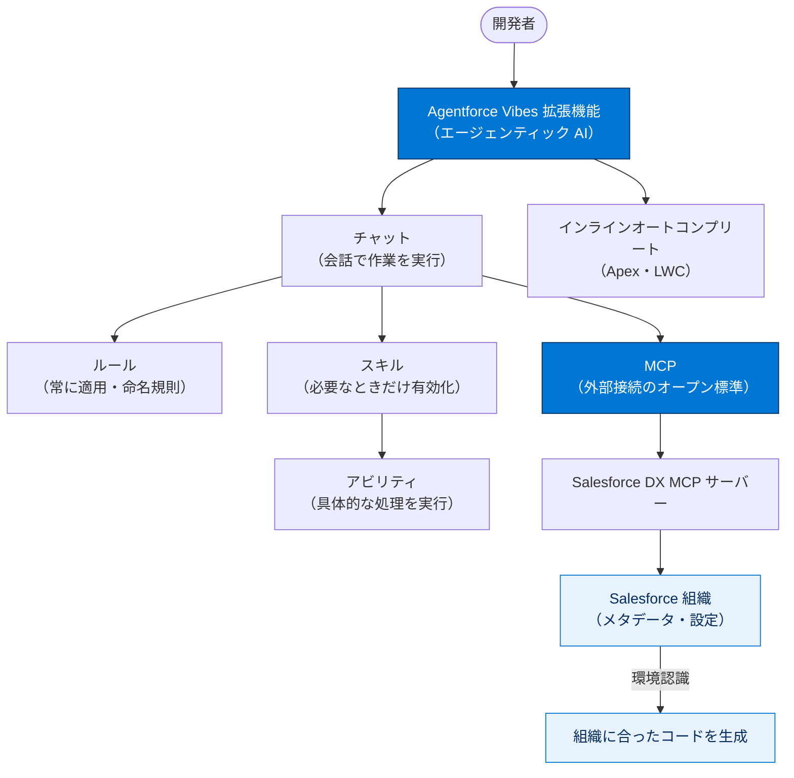

# Agentforce Vibes 拡張機能 総まとめ

このトピックでは、Salesforce 開発を加速するエージェンティック AI ツール **Agentforce Vibes 拡張機能**を学びました。提案だけでなくアクションを実行する点、開発を支える4つの構成要素（チャット・ルール・スキル・アビリティ）、そして AI を組織のメタデータや外部ツールにつなぐ **MCP（Model Context Protocol）** までを通して、「組織に合ったコードを自動で書ける開発パートナー」の全体像をつかみました。このページ1枚で、トピック全体を一気に思い出せるように整理します。

---

## 全体像

次の図は、このトピックに登場した概念がどう連携して「組織に合った開発」を実現するかを俯瞰したものです。

---

## ユニット横断早見表

| ユニット | 学んだこと | キーワード | 一言要点 |
| --- | --- | --- | --- |
| **01 Agentforce Vibes について知る** | 製品の正体・2大機能・入手方法・利用前準備 | エージェンティック AI／チャット／インラインオートコンプリート／拡張機能パック／テレメトリー | 提案だけでなく**アクションを実行する**AI。入手は**拡張機能パック**経由のみ。 |
| **02 コーディング時に Agentforce とシームレスに連携する** | チャット・ルール・スキル・アビリティの役割と命名規則 | ルール／スキル／アビリティ／パスカルケース／ケバブケース／`@`参照 | **ルール＝いつも、スキル＝必要なときだけ**。Apex はパスカル、LWC はケバブ。 |
| **03 MCP インテグレーションで開発を大幅に向上させる** | MCP の概要・DX MCP サーバー・統合のメリットと手順 | MCP／オープン標準／Salesforce DX MCP サーバー／環境認識／認証と権限 | MCP は AI を**外部のツール・データにつなぐ標準**。手動コピペが不要に。 |

---

## 🎯 試験頻出ポイント

> [!ポイント] このトピックで狙われやすい論点
>
> - **Agentforce Vibes と従来 AI の違い** → 「**アクションを実行し、ワークフローを自動化する**」（速い・メモリが少ないは誤り）。
> - **入手方法** → **VS Code 用 Salesforce 拡張機能パック（Salesforce Extension Pack）に含まれる**形のみ。事前インストール・営業連絡・限定ユーザーは誤り。
> - **ルール vs スキル** → ルールは**常に適用される永続的な指示**、スキルは**要求が説明に一致したときだけ有効化**される。
> - **命名規則** → Apex クラス＝**パスカルケース**（`AccountService`）／ LWC ＝**ケバブケース**（`account-detail`）。
> - **MCP の本質** → AI アシスタントが**外部のツールやデータを使えるようにするオープン標準**。加速・構文ハイライト・メモリ削減ではない。
> - **MCP 統合の効果** → エージェントが**環境認識を獲得**し、ログやメタデータの**手動コピペが減る**。
> - **利用前提** → 利用前に **Salesforce テレメトリーの有効化**、MCP 接続前に **認証と権限の設定**が必要。

---

## 📖 用語早見表

| 用語 | ひとことの意味 |
| --- | --- |
| **Agentforce Vibes 拡張機能** | コマンド実行・ワークフロー自動化まで行うエージェンティック AI ツールのスイート（旧称：開発者向け Agentforce） |
| **エージェンティック AI** | 自分で判断してアクションを実行する AI（手順を教えるだけでなく実際にやる） |
| **インラインオートコンプリート** | 入力中にコードを提案する機能。Apex と LWC に対応 |
| **チャット** | 会話しながら実際に作業を進めるエージェントチャットの入口 |
| **ルール（Rules）** | 常に従う永続的な指示。コーディング標準・命名規則を全生成に自動適用 |
| **スキル（Skills）** | 要求が説明に一致したときだけ有効化されるモジュール化された指示セット |
| **アビリティ（Abilities）** | スキル内で実行される具体的な処理（コード生成・テスト作成・ツール利用など） |
| **パスカルケース** | 各単語の先頭を大文字（例：`AccountService`）。Apex クラス名に使用 |
| **ケバブケース** | 全小文字をハイフン連結（例：`account-detail`）。LWC 名に使用 |
| **MCP** | AI を外部のツール・データにセキュアにつなぐオープン標準 |
| **Salesforce DX MCP サーバー** | 組織のメタデータ・設定・開発ツールへのアクセスを提供する専用 MCP 実装 |
| **メタデータ** | オブジェクト定義・項目設定・権限など、組織の構造・設定そのもの |
| **環境認識** | AI が組織の状態を自分で把握する力。手動コピペを不要にする |
| **テレメトリー** | 利用状況・動作データを自動収集する仕組み。利用前に有効化が必要 |
| **スキャフォールディング** | コンポーネントやクラスのひな形（骨組み）を自動生成すること |

---

> [!豆知識] 「Vibes」という製品名の背景
>
> Agentforce Vibes の旧称は「開発者向け Agentforce（Agentforce for Developers）」でした。意図や雰囲気を自然言語で AI に伝えて開発する「バイブコーディング（vibe coding）」のスタイルがそのまま製品名になっています。

> [!豆知識] MCP は「AI の USB-C ポート」
>
> MCP は Anthropic が2024年11月に公開したオープン標準で、AI と外部ツールをつなぐ共通端子としてしばしば「USB-C ポート」にたとえられます。1つの仕様を覚えれば多様なツールに同じやり方で接続できる、という発想が普及の理由です。

> [!豆知識] チャットと補完で対応範囲が違う
>
> インラインオートコンプリートが対応するのは Apex と LWC（JavaScript・CSS・HTML）。一方チャットは MCP を介してコマンド実行・組織接続・メタデータ操作まで踏み込めます。「補完＝書きながらの提案」「チャット＝作業まで実行」という守備範囲の差を押さえると混同しません。

---

## ✅ 理解度セルフチェック

> [!まとめ] 自分の言葉で答えられるか確認しよう（答えつき）
>
> 1. Agentforce Vibes が従来の AI アシスタントと最も違う点は？ → **アクションを実行し、ワークフローを自動的に実行する点**（コード提案だけではない）。
> 2. Agentforce Vibes 拡張機能の入手方法は？ → **VS Code 用 Salesforce 拡張機能パックに含まれる**形で入手する。
> 3. 「常に適用される永続的な指示」はルールとスキルのどちら？ → **ルール（Rules）**。スキルは要求が説明に一致したときだけ有効化される。
> 4. Apex クラス名と LWC 名の命名規則をそれぞれ答えよ。 → Apex は **パスカルケース**（`AccountService`）、LWC は **ケバブケース**（`account-detail`）。
> 5. MCP を一言で説明すると？ → AI アシスタントが**外部のツールやデータをセキュアに使えるようにするオープン標準**（速くする仕組みではない）。
> 6. MCP を統合するとエージェントは何を獲得し、何の手間が減る？ → **環境認識**を獲得し、**ログやメタデータの手動コピペ**の手間が減る。
