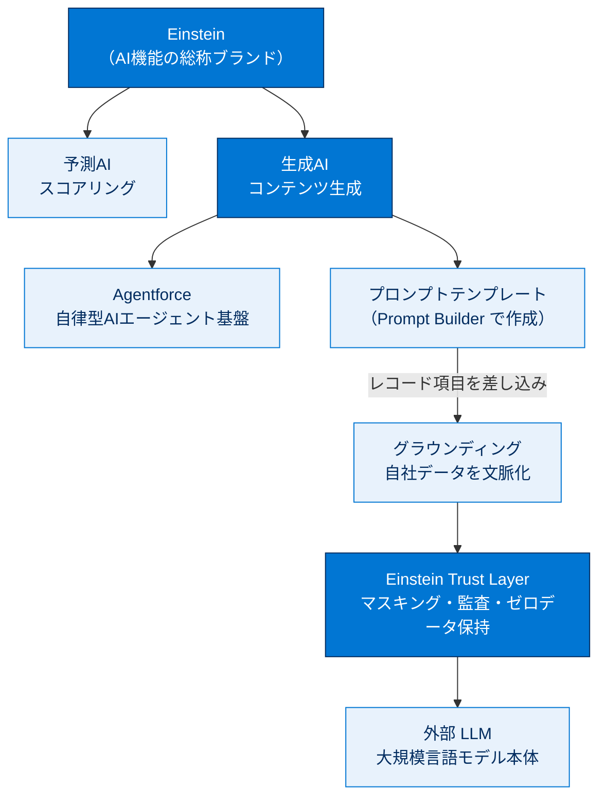
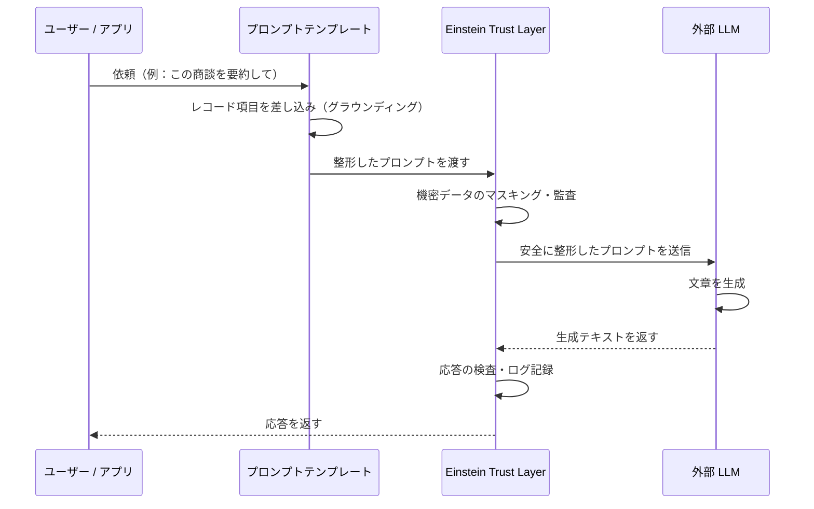
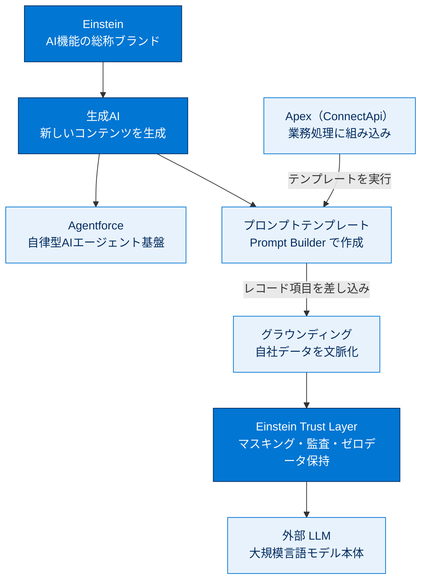

# Agentforce および Einstein 生成AI 入門

## このセクションについて

Salesforce における**生成AI（Generative AI）** の基礎を学ぶセクションです。Salesforce は AI 機能を **Einstein** と **Agentforce** というブランドで提供し、開発者は「文章生成」「要約」「分類」「対話エージェント」を業務アプリに組み込めます。

本セクションは外部の Trailhead trail への**導入**です。本格的なハンズオンは下記公式リソースで進めますが、ここでは試験に関連する用語と概念を先に整理します。

> [!ポイント] このセクションのゴール
>
> 生成AI / LLM / プロンプト / Agentforce / Einstein / プロンプトテンプレート / グラウンディング / Einstein Trust Layer の**意味**と、**Apex から生成AIをどう呼ぶか**の全体像をつかむこと。試験では細かい手順より「用語と役割」が問われます。

---

## 学習リソース

詳細・最新情報は必ず公式を参照してください。

- [Salesforce ヘルプ：生成AI（Generative AI）](https://help.salesforce.com/s/articleView?id=ai.generative_ai.htm&type=5)

---

## 生成AIとは

> [!用語] 生成AI（Generative AI）
>
> 学習データをもとに**新しいコンテンツ（文章・画像・コードなど）を生み出す**AI。「このリードは成約しそうか」を数値で返す従来の予測AIと違い、「メールの下書きを書く」「商談を要約する」といった**創作的な出力**ができます。

Salesforce では「営業メールの自動生成」「ケースの要約」「ナレッジ記事の下書き」「対話型エージェント」などに使われ、裏側では**大規模言語モデル（LLM）** が動いています。

> [!例] 予測AIと生成AIの違い
>
> - **予測AI（従来の Einstein）**：「この商談の成約確率は 72%」とスコアを返す。
> - **生成AI**：「この商談を3行で要約して」と頼むと文章を返す。
>
> 同じ「Einstein」ブランドでも、やっていることが違う点に注意。

---

## 主要な用語

> [!用語] 大規模言語モデル（LLM：Large Language Model）
>
> 膨大なテキストで訓練された、**言葉を扱うAIモデル**。入力（プロンプト）の続きとしてもっともらしい文章を生成します。GPT などが代表例。Salesforce はこの LLM を**外部サービスとして呼び出して**生成AI機能を実現します。

> [!用語] プロンプト（Prompt）
>
> LLM への**指示文・入力文**。「次の商談メモを丁寧な日本語で要約して」のように、AIに何をしてほしいかを書いたテキスト。出力品質はプロンプトの質に大きく左右されます。

> [!用語] Einstein
>
> Salesforce の**AI 機能の総称ブランド**。予測AI（スコアリング）から生成AIまで、プラットフォームに組み込まれた AI 機能群を指します。

> [!用語] Agentforce
>
> Salesforce の**自律型AIエージェント**基盤。ユーザーや顧客と対話し、必要に応じて Salesforce のデータ参照やアクション実行まで行う「AIエージェント」を構築・運用する仕組み。生成AIとデータ、アクションを組み合わせて業務を自動化します。

> [!用語] プロンプトテンプレート（Prompt Template）
>
> 繰り返し使うプロンプトを**ひな形として保存**したもの。レコードの項目値を差し込み（マージ）して状況に応じたプロンプトを動的に組み立てます。**Prompt Builder** という宣言的ツールで作成し、Apex からも利用できます。

> [!用語] グラウンディング（Grounding）
>
> LLM に**自社の実データ（レコードやナレッジ）を文脈として与える**こと。これにより AI は一般論でなく「その顧客・その商談に即した」回答を生成できます。プロンプトテンプレートにレコード項目を差し込むのが代表的な手段です。

> [!用語] Einstein Trust Layer
>
> 生成AIを**安全・セキュアに**使うための Salesforce のガードレール層。外部 LLM へデータを送る際の**個人情報マスキング**、**プロンプト・応答のロギング**、**有害コンテンツ検出**、**ゼロデータ保持**を担い、企業データが LLM 提供側に学習・保存されないよう保護します。

> [!ポイント] ブランドと役割の対応を覚える
>
> | 用語 | 役割 |
> | --- | --- |
> | **Einstein** | Salesforce の AI 機能全体のブランド |
> | **Agentforce** | 自律型AIエージェントの構築・運用基盤 |
> | **LLM** | 文章を生成する外部のAIモデル本体 |
> | **プロンプトテンプレート** | 再利用可能なプロンプトのひな形 |
> | **グラウンディング** | 自社データを文脈として与えること |
> | **Einstein Trust Layer** | 安全性・プライバシーを守る保護層 |

ブランド・部品の関係を図にすると次のとおりです。Einstein という総称ブランドの下に予測AIと生成AIがあり、生成AIは「プロンプトテンプレートでグラウンディング → Trust Layer で保護 → LLM が生成」という流れで動きます。



---

## 生成AIが応答を返すまでの流れ

ユーザーの依頼が、プロンプトテンプレートでの組み立て、Trust Layer による保護、外部 LLM での生成、再び Trust Layer での検査を経て応答として返るまでの**時間的なやり取り**です。



> [!注意] 外部 LLM にデータが「学習」されない仕組み
>
> 生成AIでは企業データを外部 LLM に送りますが、Einstein Trust Layer の**ゼロデータ保持（Zero Data Retention）** により、送ったデータが LLM 提供側に保存・再学習されないよう契約・技術の両面で保護されます。ここが「個人の AI ツールに業務データを貼り付ける」のとの決定的な違いです。

---

## Apex から生成AIを呼ぶ概念

開発者にとって重要なのは、これらの生成AI機能を**Apex コードから呼び出せる**点です。Salesforce では **`ConnectApi` 名前空間**を通じてプロンプトテンプレートを実行する API が提供され、トリガー・バッチ・LWC コントローラーなど**通常の Apex 処理に生成AIの結果を組み込む**ことができます。

> [!例] Apex から生成AIを使うイメージ（概念コード）
>
> ```apex
> // ※ 概念を示す擬似コード。実際のAPI署名は後続トピック／公式で確認すること。
> //   1. どのプロンプトテンプレートを使うか指定
> //   2. グラウンディング用の入力（レコードIdなど）を渡す
> //   3. ConnectApi 経由でテンプレートを実行
> //   4. 返ってきた生成テキストを業務ロジックで利用
> ```

> [!用語] コールアウト（Callout）
>
> Apex から Salesforce 外部のサービス（ここでは LLM サービス）へ HTTP 通信などで処理を呼び出すこと。生成AIの利用は実質的に外部呼び出しなので、レスポンス時間やガバナ制限の対象になります。

> [!ポイント] 開発者視点でおさえる観点
>
> - 生成AIの呼び出しは内部的に**外部サービスへのコールアウト**を伴い、ガバナ制限（コールアウト数・タイムアウト）の影響を受ける。
> - プロンプトテンプレートは**宣言的（Prompt Builder）に作り、Apex から呼ぶ**のが基本パターン。
> - 機密データは **Einstein Trust Layer** が担保するが、開発者も「何を LLM に渡すか」を意識する責任がある。

---

## 試験対策：押さえておきたいポイント

> [!まとめ] このセクションの要点と試験での狙われ方
>
> - **生成AI**は新しいコンテンツを生み出す AI で、裏側では**LLM**が動く。LLM への指示が**プロンプト**、その再利用形が**プロンプトテンプレート**。
> - 自社データを文脈として与えるのが**グラウンディング**（定義をそのまま覚える）。
> - **Einstein** は AI 機能の総称ブランド、**Agentforce** は自律型AIエージェント基盤、**LLM** はモデル本体。この3つの役割を混同しない。
> - **Einstein Trust Layer の責務**（マスキング・ゼロデータ保持・監査・有害コンテンツ検出）をキーワードで言えるようにする。
> - **プロンプトテンプレートは宣言的に作り、Apex（ConnectApi）から実行できる**。この呼び出しは**外部コールアウトを伴い、ガバナ制限の対象**になる。
> - 詳細なハンズオンは上記「学習リソース」の Trailhead / Salesforce ヘルプで進める。

---

## 🎓 この単元のまとめ

この単元は、Salesforce の生成AI（Einstein / Agentforce）の登場人物と役割、そして「依頼→グラウンディング→Trust Layer→LLM」という応答が返るまでの流れ、開発者が Apex（ConnectApi）からそれを呼び出す全体像をつかむ導入でした。

次の図は、生成AIの「ブランド・部品・流れ」を1枚で俯瞰したものです。総称ブランド Einstein の下に生成AIがあり、プロンプトテンプレートでグラウンディングし、Trust Layer で保護しながら LLM へ渡し、Apex から実行する関係を示します。



> [!まとめ] この単元の要点
>
> - **生成AI**は新しいコンテンツを生み出す AI で、裏側では**LLM**が動く。LLM への指示が**プロンプト**、その再利用形が**プロンプトテンプレート**。
> - **Einstein**＝AI機能の総称ブランド、**Agentforce**＝自律型AIエージェント基盤、**LLM**＝モデル本体。この3つの役割を混同しない。
> - **グラウンディング**は自社の実データを文脈として与えること。**Einstein Trust Layer** はマスキング・ゼロデータ保持・監査・有害コンテンツ検出で安全性を担保する。
> - プロンプトテンプレートは**宣言的（Prompt Builder）に作り、Apex（ConnectApi）から実行**するのが基本パターンで、内部的に**外部コールアウト**を伴いガバナ制限の対象になる。

> [!豆知識] 「Trust Layer」が解く本当の課題
>
> 個人向けの生成AIツールに業務データを貼り付けると、その内容がモデルの再学習に使われる懸念があります。Einstein Trust Layer の**ゼロデータ保持（Zero Data Retention）** は、送信データを LLM 提供側に保存・再学習させない契約・技術的な取り決めで、これが「企業で安心して使える生成AI」と「個人ツール」を分ける決定的なポイントです。
