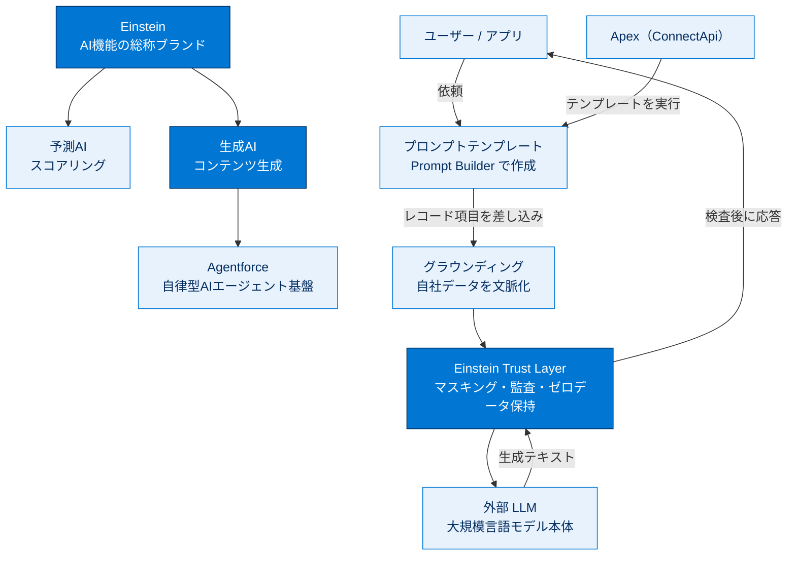

# Agentforce および Einstein 生成AI 総まとめ

このトピックでは、Salesforce における**生成AI（Generative AI）** の全体像を学びました。AI 機能の総称ブランド **Einstein**、自律型AIエージェント基盤 **Agentforce**、文章を生成する本体 **LLM** という登場人物の役割を整理し、「プロンプトテンプレートでグラウンディング → Einstein Trust Layer で保護 → LLM が生成」という応答が返るまでの流れを理解しました。さらに、これらを **Apex（ConnectApi）** から呼び出して業務処理に組み込めること、その呼び出しが外部コールアウトとしてガバナ制限の対象になることを押さえました。試験では細かい手順より「**用語と役割**」が問われます。

---

## 全体像

次の図は、このトピックに登場した概念の関係と、生成AIが応答を返すまでの流れを1枚で俯瞰したものです。

---

## ユニット横断早見表

| ユニット | 学んだこと | キーワード | 一言要点 |
| --- | --- | --- | --- |
| Agentforce および Einstein 生成AI 入門 | 生成AIの定義と主要用語、応答が返るまでの流れ、Apex からの呼び出し概念 | 生成AI / LLM / プロンプト / プロンプトテンプレート / グラウンディング / Einstein / Agentforce / Einstein Trust Layer / ConnectApi | 「用語と役割」を押さえ、宣言的に作って Apex から呼ぶ全体像をつかむ |

---

## 🎯 試験頻出ポイント

> [!ポイント] このトピックから狙われやすい論点
>
> - **予測AIと生成AIの違い**：予測AIはスコア（例「成約確率72%」）を返し、生成AIは文章などの新しいコンテンツを生む。同じ Einstein ブランドでも別物。
> - **ブランドと部品の役割を混同しない**：Einstein＝AI機能の総称ブランド、Agentforce＝自律型AIエージェント基盤、LLM＝文章生成モデル本体。
> - **グラウンディング**＝LLM に自社の実データ（レコード・ナレッジ）を文脈として与えること。定義をそのまま覚える。
> - **Einstein Trust Layer の4つの責務**：個人情報マスキング・プロンプト/応答のロギング（監査）・有害コンテンツ検出・ゼロデータ保持（Zero Data Retention）。
> - **プロンプトテンプレート**は宣言的ツール **Prompt Builder** で作り、**Apex（ConnectApi 名前空間）から実行**できる。
> - 生成AIの呼び出しは内部的に**外部サービスへのコールアウト**を伴い、**ガバナ制限**（コールアウト数・タイムアウト）の影響を受ける。

---

## 📖 用語早見表

| 用語 | ひとことの意味 |
| --- | --- |
| 生成AI（Generative AI） | 学習データをもとに新しいコンテンツ（文章・画像・コード）を生み出すAI |
| 予測AI | 「成約確率72%」のようにスコア・予測値を返す従来型のAI |
| LLM（大規模言語モデル） | 膨大なテキストで訓練された、言葉を生成するAIモデル本体 |
| プロンプト（Prompt） | LLM への指示文・入力文 |
| プロンプトテンプレート | 再利用できるプロンプトのひな形。項目値を差し込んで動的に組み立てる |
| Prompt Builder | プロンプトテンプレートを作る宣言的ツール |
| グラウンディング（Grounding） | LLM に自社の実データを文脈として与えること |
| Einstein | Salesforce の AI 機能全体を指す総称ブランド |
| Agentforce | 対話・データ参照・アクション実行を行う自律型AIエージェント基盤 |
| Einstein Trust Layer | 生成AIを安全に使うためのガードレール層 |
| ゼロデータ保持（Zero Data Retention） | 送信データを LLM 提供側に保存・再学習させない仕組み |
| ConnectApi | Apex からプロンプトテンプレート実行などを呼び出す名前空間 |
| コールアウト（Callout） | Apex から外部サービスへ通信して処理を呼び出すこと |
| ガバナ制限 | Salesforce が課す実行リソースの上限（コールアウト数・時間など） |

---

> [!豆知識] 「Trust Layer」がなぜ必要なのか
>
> 個人向けの生成AIツールに業務データを貼り付けると、その内容がモデルの再学習に使われる懸念があります。Einstein Trust Layer のゼロデータ保持は、送信データを LLM 提供側に保存・再学習させないための契約・技術両面の取り決めで、これが「企業で安心して使える生成AI」と「個人ツール」を分ける決定的な差です。

> [!豆知識] 「グラウンディング」は地に足をつけること
>
> Grounding は直訳すると「地に足をつける／接地させる」。LLM は何も与えないと一般論で答えがちですが、自社レコードを文脈として渡すと「その顧客・その商談に即した」回答に“接地”します。プロンプトテンプレートにレコード項目を差し込むのが代表的な接地手段です。

> [!豆知識] 「Einstein」というブランドの幅広さ
>
> Einstein は物理学者アインシュタインにちなんだ名前で、Salesforce では予測スコアリングから生成AIまで非常に幅広い機能の総称として使われます。そのため「Einstein＝生成AI」と思い込むと出題で足をすくわれます。Einstein は“傘”で、その下に予測AIと生成AIがある、と覚えるのが安全です。

---

## ✅ 理解度セルフチェック

> [!まとめ] 理解度を確認しよう（答え付き）
>
> 1. 「商談の成約確率を72%と返す」のは予測AI・生成AIのどちら？ → **予測AI**
> 2. 「この商談を3行で要約して」と文章を返すのはどちら？ → **生成AI**
> 3. 自律型AIエージェントを構築・運用する基盤の名前は？ → **Agentforce**
> 4. LLM に自社の実データを文脈として与えることを何という？ → **グラウンディング**
> 5. 個人情報マスキング・監査・有害コンテンツ検出・ゼロデータ保持を担う層は？ → **Einstein Trust Layer**
> 6. プロンプトテンプレートを Apex から実行するときに使う名前空間は？ → **ConnectApi**（呼び出しは外部コールアウトを伴い、ガバナ制限の対象になる）
