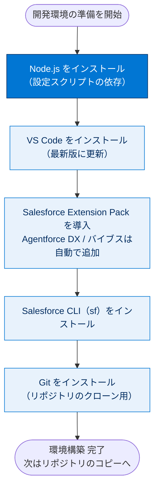
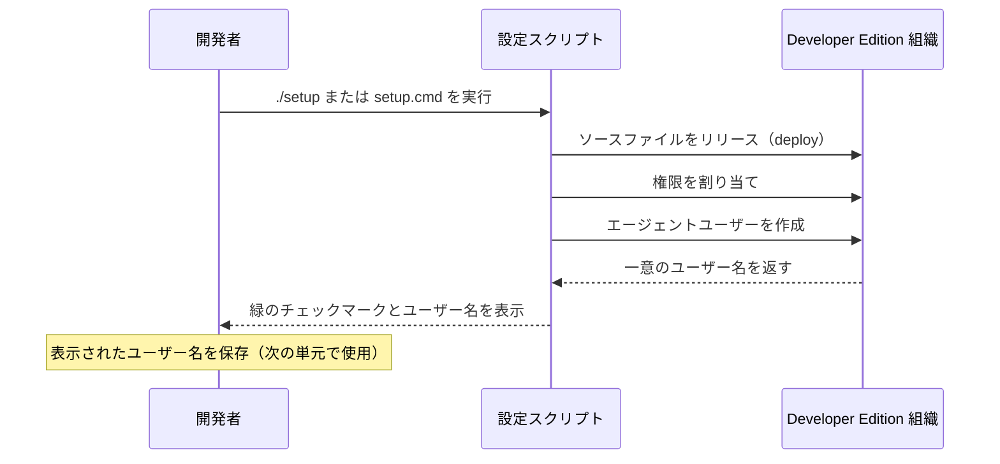

# Agentforce DX の使用開始

## 学習の目的

このプロジェクトを完了すると、次のことができるようになります。

- Agentforce DX がエージェントの構築にどのように役立つか説明する。
- Agentforce DX 開発環境を設定する。
- サンプルエージェントを含むリポジトリを DX プロジェクトにコピーする。

> [!ポイント] このプロジェクトのゴール
>
> 「**エージェントを Apex や Lightning コンポーネントと同じソースコード（メタデータ）として扱い、Git で管理し、CLI / VS Code から作成・テスト・公開する**」——これが Agentforce DX（プロコード開発）です。本プロジェクトでは、開発環境を整え、サンプルエージェントのリポジトリを手元に用意するところまで行います。

---

## Agentforce DX とは

> [!用語] Agentforce DX（Agentforce Developer Experience）
>
> Salesforce DX（開発者向けツールセット）を **AI エージェント開発に対応させて拡張したもの**。エージェントのロジックをソースコード（メタデータ）として扱い、リポジトリでバージョン管理して、Apex や Lightning コンポーネントと同じワークフローで開発・テスト・リリースできます。コードを書いてエージェントを構築する「**プロコード（pro-code）**」のアプローチです。

これまでエージェントの構築には **Agentforce Builder UI**（クリック操作で作る**ローコード**）を使っていたかもしれません。AI を最新の **DevOps パイプライン**（開発と運用を連携させ素早く安定して届ける手法。**CI**＝継続的インテグレーションでビルド・テストを自動実行する）に組み込むには、ブラウザーの域を出て Agentforce DX という**プロコード**の世界に進む必要があります。

> [!用語] ローコード / プロコード（low-code / pro-code）
>
> - **ローコード**：画面上のクリック操作・設定で構築。Agentforce Builder UI が該当。素早いが、バージョン管理や CI への組み込みは弱い。
> - **プロコード**：コードとして記述しエディター・CLI で開発。Agentforce DX が該当。学習コストはあるが、Git 履歴管理や自動テストなど本格的な開発プロセスに乗せられる。

Salesforce 開発者なら **Salesforce DX**（アプリを構築・テスト・配信するプロコードのツールセット）をご存じかもしれません。**Agentforce バイブス**、**VS Code 拡張機能**、**Salesforce CLI** などで構成され、Agentforce DX はこれらをエージェントと連動するよう拡張します。

> [!用語] メタデータ（Metadata）
>
> Apex クラス・フローなど「組織のカスタマイズ内容」を表す設定情報。**エージェントも他のカスタマイズと同じくメタデータで構成される**ため、ファイルとして DX プロジェクトに入れて Git 管理したり組織間で移動したりできる。

Agentforce DX には Builder UI を使わずエージェントを作成・変更・プレビュー・テストできるプロコードツールがあり、メタデータを DX プロジェクトと**スクラッチ組織・Sandbox・本番組織**間で移動できます。

> [!用語] スクラッチ組織 / Sandbox / 本番組織
>
> - **スクラッチ組織（Scratch Org）**：開発・テスト用に使い捨てで作る一時的な組織。
> - **Sandbox**：本番のコピーに近いテスト専用の組織。
> - **本番組織（Production）**：実際にユーザーが利用する組織。

> [!例] Coral Cloud Resorts のシナリオ
>
> リゾート企業「**Coral Cloud Resorts**」の開発チームに採用された設定で学びます。チームはお客様に天気予報やイベント情報を伝える「**ローカル情報エージェント（Local Info Agent）**」を開発中で、あなたはそれを引き継ぎます。Git や CI に慣れた「現代の開発者」として、Agentforce DX でエージェント開発の基本を身につけます。

---

## Agentforce 用の Developer Edition 組織にサインアップする

このプロジェクトには、**Agentforce とサンプルデータが搭載された特別な Developer Edition 組織**が必要です。無料の Developer Edition を入手して Trailhead に接続します。

> [!注意] 専用の Developer Edition が必要
>
> この Developer Edition は**このバッジの Challenge 向けに設計されている**ため、ほかのバッジでは機能しないことがあります。使用している組織が推奨されているものか必ず確認してください。

> [!手順] Developer Edition 組織にサインアップする
>
> 1. Agentforce を搭載した無料の Developer Edition 組織にサインアップします。
> 2. フォームに記入します。
>    - **[Email (メール)]** に有効なメールアドレスを入力。
>    - **[Username (ユーザー名)]** に一意のメールアドレス（例: `yourname@test.com`）を入力（実在アカウントでなくてよい）。
> 3. **[Sign me up (サインアップ)]** をクリックします。
> 4. アクティベーションメール（数分かかる場合あり）を開いて **[Verify Account (アカウントを確認)]** をクリックします。
> 5. パスワードと確認用の質問を設定して登録を完了します。

> [!ポイント] ログイン情報は必ず保存する
>
> **ユーザー名・パスワード・ログイン URL** を安全な場所に保存します。後で **Salesforce CLI を認証するとき**に必要です。

> [!手順] Developer Edition 組織を Trailhead に接続する
>
> 1. Trailhead アカウントにログインしていることを確認します。
> 2. ページ最下部の「**Verify Step (ステップを確認)**」で、表示されているハンズオン組織をクリックし **[Connect Org (組織を接続)]** をクリックします。
> 3. ログイン画面で、設定した Developer Edition のユーザー名とパスワードを入力します。
> 4. **[Allow Access? (アクセスを許可しますか?)]** 画面で **[Allow (許可)]** をクリックします。
> 5. **[この組織をハンズオン Challenge 用に接続しますか?]** で **[はい! 保存します。]** をクリックします。

---

## Developer Edition 組織で Agentforce を有効にする

Agentforce DX でエージェントを開発するには、組織で **Agentforce を有効にします**。その土台として **Einstein**（Salesforce の AI 機能の総称）と **Einstein ボット**（チャットボット機能。エージェントの基盤の一部）も先に有効化します。

> [!手順] Agentforce 関連機能を有効化する
>
> 1. Developer Edition 組織にログインし、右上の**設定ギアアイコン**をクリックします。
> 2. ドロップダウンの **[Setup (設定)]** をクリックします。
> 3. **[Quick Find]** に `Einstein Setup` と入力し、**[Einstein Setup (Einstein 設定)]** をクリックします。
> 4. **[Turn on Einstein (Einstein を有効化)]** が **[On (オン)]** になっていることを確認します。
> 5. **[Quick Find]** に `Einstein Bots` と入力し、**[Einstein Bots (Einstein ボット)]** をクリックします。
> 6. **[Einstein Bots]** を **[On (オン)]** に切り替えます。
> 7. **[Quick Find]** に `Salesforce Go` と入力し、**[Salesforce Go]** を選択します。
> 8. **[Search features...]** に `Agentforce` と入力し、**[Agentforce (Default)]** を選択します。
> 9. **[使用開始]** → **[Turn On (有効化)]** → **[Confirm (確認)]** をクリックします。

---

## 開発環境を設定する

Coral Cloud Resorts の開発チームは、**VS Code と CLI コマンドの両方**を使ってエージェントを構築しています。各ツールの役割は後述の表のとおりです（**VS Code** = Microsoft の無料 IDE、**Salesforce CLI** = `sf` コマンドで組織を操作、**Node.js** = 開発ツールが内部で使う JavaScript 実行環境）。すでにインストール済みなら同じ設定を使えますが、**VS Code を最新リリースに更新**してください。

> [!手順] 開発環境を設定する
>
> 1. `code.visualstudio.com` で **[Download]** をクリックし VS Code をインストールします。
> 2. VS Code マーケットプレイスから **Salesforce Extension Pack** をインストールします。**Agentforce DX** と **Agentforce バイブス** の 2 つは自動的にインストールされます。
> 3. **Salesforce CLI** をインストールします。
> 4. **Node.js** をインストールします。

> [!注意] Node.js は先にインストールしておく
>
> 後半で実行する**設定スクリプトは Node.js に依存**します。先に**グローバルにインストール**しておかないと後の手順で失敗します。

開発環境セットアップの全体像は次のとおりです。**Node.js を先に**用意してから設定スクリプトに進む点に注意してください。



開発ツールの役割は次のとおりです。

| ツール | 役割 |
| --- | --- |
| **VS Code** | コードを書く / プレビューする統合開発環境 (IDE) |
| **Salesforce Extension Pack** | VS Code に Salesforce 開発機能を追加（Agentforce DX / バイブスを含む） |
| **Salesforce CLI（`sf`）** | ターミナルから組織を認証・リリース・操作 |
| **Node.js** | 各種ツールや設定スクリプトを動かす実行環境 |
| **Git** | サンプルリポジトリのコピー（クローン）とバージョン管理 |

---

## サンプルリポジトリをコピーする

開発チームはソースコードを **GitHub リポジトリ**にチェックインしています。ソースコードは標準の **Salesforce DX プロジェクト**で、メタデータ・サンプルデータ・テストがこの構造に従って整理されています。

> [!用語] リポジトリ / クローン（Repository / Clone）
>
> **リポジトリ**はソースコードと変更履歴を保管する場所（GitHub はそれをネット上で共有するサービス）。**クローン（Git: Clone）** はリポジトリを自分のコンピューターに**まるごとコピー**して手元で編集できるようにする操作。

> [!注意] Git のインストールを確認する
>
> VS Code でリポジトリをコピーできるよう、**Git がインストールされている**ことを確認します。または、サンプルリポジトリを **ZIP でダウンロードしてローカルで解凍**することも可能です。

> [!手順] サンプルリポジトリを VS Code でコピー（クローン）する
>
> 1. VS Code で **[View (表示)] → [Command Palette]** をクリックし **[Git: Clone]** を選択します。
> 2. リポジトリ URL に次を入力します。
>    ```text
>    https://github.com/forcedotcom/afdx-pro-code-testdrive
>    ```
> 3. 保存先ディレクトリに移動し **[Select as Repository Destination]** をクリックします。
> 4. **[Open (開く)]** をクリックします。

VS Code に `afdx-pro-code-testdrive` という標準の Salesforce DX プロジェクトが表示されます。

---

## Developer Edition 組織を認証する

組織のユーザー名とパスワードで組織を**ローカルで認証**し、VS Code と CLI を使えるようにします。

> [!用語] 組織を認証する（Authorize an Org）
>
> ローカルの開発ツール（VS Code / CLI）に「この組織にアクセスしてよい」という許可を与える操作。認証すると毎回ログインせずコマンドで組織を操作できる。組織には**別名（エイリアス）** を付けて呼び分ける。

> [!手順] Developer Edition 組織を認証する
>
> 1. VS Code で **[View (表示)] → [Command Palette]** をクリックし **[SFDX: Authorize an Org]** を選択します。
> 2. **[Product (製品)]** をクリックします。
> 3. 組織の別名として `agentforce` と入力します。
> 4. 開いたブラウザーで、ログイン情報を使って Developer Edition 組織にサインインします。
> 5. **[Allow (許可)]** をクリックします。
> 6. **[Authentication Successful]** メッセージを確認し、ブラウザーを閉じます。

これで組織が認証され、**デフォルト組織**として設定されました。

---

## スクリプトを実行して、組織に必要なアーティファクトを作成してリリースする

コピーしたリポジトリには、ローカル情報エージェントを実装するアーティファクト（Apex クラス、プロンプトテンプレート、フローなどの構成要素）のソースファイルが含まれます。これらは組織に必要なため、リポジトリに用意された**スクリプト**でリリースします。スクリプトはソースファイルを**リリース**し、**権限を割り当て**、**エージェントユーザーを作成**します。

> [!用語] エージェントユーザー（Agent User）
>
> Agentforce エージェントは「**Einstein エージェントユーザー**」プロファイルを持つ**専用ユーザー**として実行されます。このユーザーがエージェントの**ランタイム ID（実行時の身元）** となり、組織内でどんな権限で動くかを決めます。

> [!手順] 設定スクリプトを実行する
>
> 1. VS Code の**統合ターミナル**から、OS に合わせて設定スクリプトを実行します。
>    - macOS または Linux:
>      ```bash
>      ./setup
>      ```
>    - Windows:
>      ```bash
>      setup.cmd
>      ```
> 2. 各ステップが正常に完了すると**緑のチェックマーク**が表示されます。

設定スクリプトが組織に対して行う処理の流れは次のとおりです。



> [!注意] 生成されたユーザー名を必ず保存する
>
> このスクリプトで作成される**一意のユーザー名は次の単元で必要**です。ターミナルに表示されたユーザー名を必ず控えてください。

---

## エージェントコマンドを表示する

`agent` コマンドを使う前にその内容を確認します。CLI コマンドの大半は VS Code のコマンドパレットに相当するものがあります。

> [!手順] 利用できる agent コマンドを確認する
>
> 1. VS Code 統合ターミナルから次を実行すると、使用可能な agent コマンドがすべて表示されます。
>    ```bash
>    sf search
>    ```
> 2. 次を実行すると、`agent` コマンドを含む CLI プラグインの技術情報が表示されます。
>    ```bash
>    sf plugins inspect agent
>    ```
> 3. `--help` フラグでそのコマンドの詳しい説明（フラグ、使用例）が、`-h` で簡潔な説明が表示されます。
>    ```bash
>    sf agent validate authoring-bundle --help
>    ```

> [!ポイント] このバッジで中心となる 2 つのコマンド
>
> - `agent validate authoring-bundle` … エージェント（作成バンドル）を**検証**する
> - `agent publish authoring-bundle` … エージェント（作成バンドル）を組織に**公開**する

開発環境が整ったので、「エージェントのコーディング」に進みましょう。

---

## 試験対策：押さえておきたい追加ポイント

> [!ポイント] Agentforce DX の頻出ポイント
>
> - エージェントは**メタデータで構成される**。だから Apex / LWC と同じく Git 管理・組織間移動・CI 組み込みができる。
> - **ローコード（Builder UI）とプロコード（DX）は併用できる**。組織のエージェントを DX プロジェクトに取得したりその逆も可能。**DX プロジェクトと組織の同期**を意識する。
> - エージェントは「**Einstein エージェントユーザー**」プロファイルの専用ユーザーとして実行される（ランタイム ID）。
> - シミュレーションモードでも **LLM へは組織経由でアクセス**するため組織への認証が必要。
> - 作成バンドル（`.agent` を含む `AiAuthoringBundle`）がエージェント開発の中心となるメタデータコンポーネント。

> [!例] エージェント開発のライフサイクル（全体像）
>
> ```mermaid
> flowchart LR
>     D["開発 Develop<br/>.agent を<br/>コーディング"] --> P["公開 Publish<br/>作成バンドルを<br/>組織にリリース"]
>     P --> T["テスト Test<br/>Sandbox/スクラッチ<br/>組織で検証"]
>     T --> Dep["実装 Deploy<br/>本番組織へ<br/>メタデータ移行"]
>     Dep --> A["有効化 Activate<br/>お客様が<br/>利用できる"]
>     classDef hl fill:#0176D3,stroke:#032D60,color:#fff;
>     classDef soft fill:#E8F2FC,stroke:#0176D3,color:#032D60;
>     class D,P hl;
>     class T,Dep,A soft;
> ```
> このバッジでは主に「**開発**」と「**公開**」のステップ（青）を扱います。

---

## リソース

- Salesforce Developers: Build Agents with Agentforce DX（Agentforce DX を使用したエージェントの構築）
- Salesforce Developers: Salesforce CLI Command Reference, agent Commands（CLI コマンドリファレンス、agent コマンド）
- Salesforce Developers: Agentforce バイブス拡張機能
- Salesforce Developers: How Salesforce Developer Experience (DX) Tooling Changes the Way You Work
- Salesforce 開発者: Visual Studio Code 向け Salesforce 拡張機能
- Salesforce Developers: Salesforce CLI Setup Guide, Quick Start
- Salesforce ヘルプ: Design and Implement Agents（エージェントの設計および実装）
- Trailhead: 新しい Agentforce Builder について知る

---

## ステップを確認

> [!まとめ] このプロジェクトのゴールと進め方
>
> コードを書く前の**準備**を完了させます。
>
> 1. Agentforce 搭載の**特別な Developer Edition 組織**にサインアップし、Trailhead に接続する。
> 2. 組織で **Einstein / Einstein ボット / Agentforce** を有効化する。
> 3. **VS Code・Salesforce 拡張機能・Salesforce CLI・Node.js・Git** をそろえる。
> 4. サンプルリポジトリ `https://github.com/forcedotcom/afdx-pro-code-testdrive` を**クローン**する。
> 5. 組織を別名 `agentforce` で**認証**する。
> 6. **設定スクリプト（`./setup` または `setup.cmd`）** を実行し、表示された**ユーザー名を保存**する（次の単元で使用）。

> [!注意] 日本語環境で受講する場合
>
> Challenge は日本語の Trailhead Playground で開始し、かっこ内の翻訳を参照しながら進めます。評価は英語データに対して行われるため、**英語の値のみ**をコピー&ペーストします。不合格になった場合は、(1) [Locale] を [United States]、(2) [Language] を [English] に切り替えてから、(3) [Check Challenge] をクリックすると通ることがあります。
