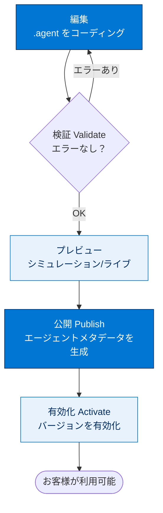
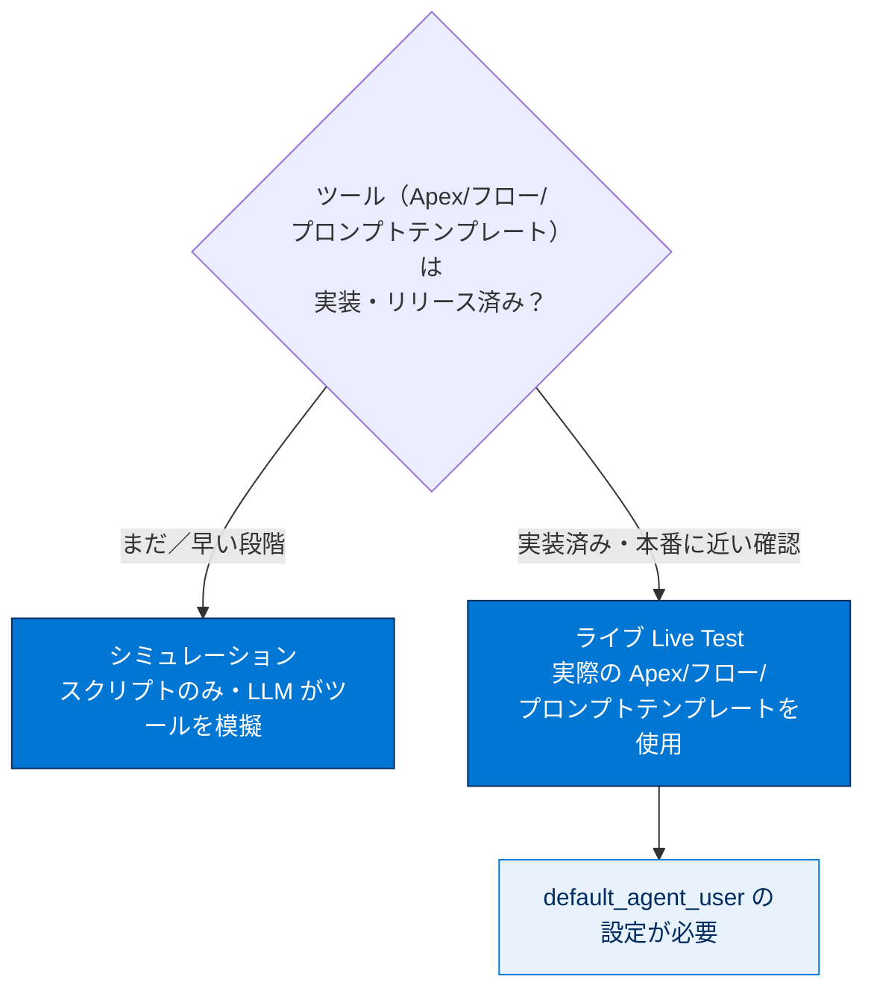
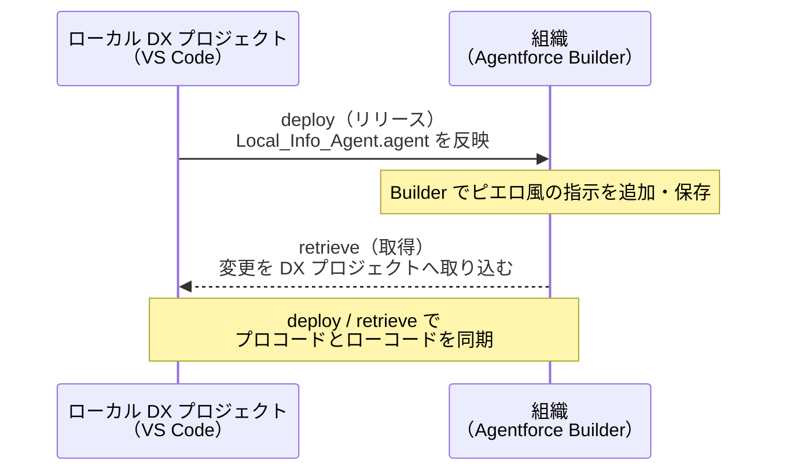
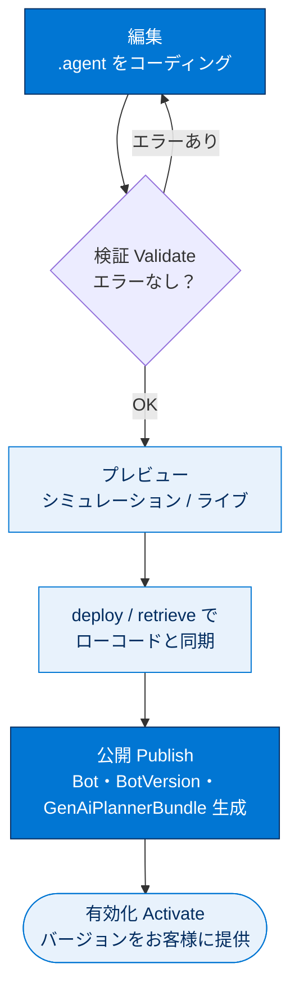

# エージェントスクリプトを使用してエージェントを作成する

## 学習の目的

この単元を完了すると、次のことができるようになります。

- エージェントスクリプトファイルがエージェントのブループリント（設計図）であることを説明する。
- VS Code でエージェントスクリプトファイルをプレビューし、コーディングする。
- 作成バンドルを組織に公開して、エージェントを有効化し、Agentforce Builder UI に表示する。

> [!ポイント] この単元のゴール
>
> 「**`.agent` というエージェントスクリプトファイルを編集 → 検証 → プレビュー → 公開 → 有効化**」の流れを VS Code と Salesforce CLI で体験します。シミュレーション／ライブの 2 つのプレビューモードの違い、公開で生成されるメタデータ（Bot, BotVersion, GenAiPlannerBundle など）を押さえましょう。

> [!注意] 前提：前の単元で作成した組織を使う
>
> この単元では、ステップ 1 で作成・認証した **Developer Edition 組織**とクローンした DX プロジェクトをそのまま使います。設定スクリプトで表示された**ユーザー名**も使うので手元に控えておいてください。

---

## エージェントのブループリントとなるエージェントスクリプトの概要

エージェント構築は次の**ライフサイクル**に従います。

| ステップ | 内容 |
| --- | --- |
| **開発（Develop）** | エージェントスクリプトファイルをコーディングし、指示とロジックを定義する。 |
| **公開（Publish）** | エージェントスクリプトファイルを組織にリリースし、エージェントメタデータを作成する。 |
| **テスト（Test）** | Sandbox またはスクラッチ組織で動作を検証する。 |
| **実装（Deploy）** | エージェントメタデータを本番環境に移行する。 |
| **有効化（Activate）** | エージェントを有効にして、お客様が利用できるようにする。 |

このバッジでは**開発と公開**を中心に説明します。この単元で実際にたどる作業の流れは次のとおりです。



> [!用語] エージェントスクリプト / バイブコーディング / LLM
>
> - **エージェントスクリプト（Agent Script）**：次世代 Agentforce エージェントの基盤となる記述言語。**自然言語によるバイブコーディングの柔軟性**と**プログラム的表現の信頼性**を兼ね備え、LLM のメリットを活かしつつエージェントに**決定論的な動作**（必ず同じように動く振る舞い）を追加できる。
> - **バイブコーディング（Vibe Coding）**：自然言語で「こう振る舞ってほしい」と指示し、厳密に書かずに挙動を作る手法。スクリプトでは自然言語の指示とプログラム的ルールを組み合わせられる。
> - **LLM（大規模言語モデル）**：大量のテキストで学習し自然言語を理解・生成する AI モデル。応答が揺れやすいため、スクリプトで「決まったルール」を補い信頼できる動作にする。

エージェントスクリプトファイルは、**AiAuthoringBundle（作成バンドル）** というメタデータコンポーネントの一部です。

> [!用語] 作成バンドル（AiAuthoringBundle）
>
> エージェントスクリプトファイルなどをまとめた**メタデータコンポーネント**。用意する方法は 3 通り。
>
> 1. DX プロジェクトで **CLI コマンドまたは VS Code を使ってゼロから作成**する。
> 2. **バイブコーディング**で作成する。
> 3. 組織で **Agentforce Builder を使ってエージェントを作成**し、その作成バンドルを DX プロジェクトに**取得**する。
>
> 作成バンドルには **`.agent` 拡張子**のファイルが含まれ、これがエージェントの**ブループリント（設計図）** となるエージェントスクリプトファイルです。

前の単元でコピーしたリポジトリの作成バンドルとエージェントスクリプトファイルで作業を始めます。

> [!手順] エージェントスクリプトファイルを開く
>
> 1. VS Code で、コピーした DX プロジェクトの次のディレクトリを開きます。
>    ```text
>    force-app/main/default/aiAuthoringBundles/Local_Info_Agent
>    ```
> 2. その中の `Local_Info_Agent.agent` を開きます。

このファイルは構文が**色分け**され、構文エラーには赤い波線が示されます。Apex や LWC と同様、Salesforce VS Code 拡張機能が**エージェントスクリプトをプログラミング言語としてサポート**しているためです。ファイルは次の**ブロック**で構成されます。

| ブロック | 役割 |
| --- | --- |
| **system** | エージェントの基本的な動作・前提を定義する。 |
| **config** | エージェントを定義する**設定パラメーター**を含む（このバッジで 1 つ変更する）。 |
| **variables** | エージェントが使う変数を定義する。 |

> [!注意] config ブロックは後で変更する
>
> `config` ブロックの設定パラメーターのうち、このバッジの後半で **`default_agent_user` を変更**します。今は場所だけ確認しておきます。

詳細は「Get Started with Agent Script（エージェントスクリプトの使用開始）」を参照してください。

---

## エージェントスクリプトファイルのみを使用してエージェントをプレビューする

コーディング中は**エージェントと定期的に会話する**ことをお勧めします。変更しながら応答をリアルタイムで確認でき、期待どおり動くかを確かめる**インタラクティブなテスト**になります。

> [!用語] シミュレーションモード（Simulation）
>
> エージェントスクリプトファイル**のみ**を使って会話し、**すべてのツールをシミュレーション（模擬）** するプレビューモード。ツールを実装する Apex クラス・フロー・プロンプトテンプレートが**まだ使えない段階**で役立つ。LLM がスクリプトの情報をもとに「ツールが何を行い、どう応答するか」を推測して再現する。**LLM へは組織経由でアクセスするため、シミュレーションでも組織への認証が必要**（前の単元で認証済み）。

> [!手順] シミュレーションモードでプレビューする
>
> 1. `Local_Info_Agent.agent` を右クリックしてコンテキストメニューを開きます。
> 2. **[AFDX: Preview This Agent]** を選択します。左側に Agentforce DX パネルが開きます。
> 3. **[Select agent…]** ドロップダウンから **[Local_Info_Agent]** を選択します。
> 4. **[Agent Script]** セクションでのエージェントの位置に注意します。新規作成していなければ `Local_Info_Agent` のみが表示されます。
> 5. ドロップダウンで **[Simulation]** を選択し、**[Start Simulation]** をクリックします。
> 6. チャットボックスに次を入力します（どのようなことを手伝ってもらえるのですか?）。
>    ```text
>    What can you help me with?
>    ```
> 7. 次の質問を入力します。
>    ```text
>    What's the weather like?
>    ```

天気予報のサマリーが示されますが、**エージェントの口調が海賊風**です（応答が「Arrr matey」で始まるなど）。

> [!例] なぜ海賊風に話すのか
>
> **エージェントスクリプトファイルに「現地の天気を説明するときは海賊風に話す」と指示されている**ためです。口調や振る舞いはスクリプト内の自然言語の指示で決まる好例で、次のステップでこの指示を取り除きます。プロフェッショナルなエージェントには一貫したブランドボイスが求められます。

---

## エージェントスクリプトファイルをコーディングする

動作を変更するときはスクリプトをコーディングし、**検証**してエラーがないことを確認します。ここでは海賊風の応答を止めさせます。

> [!用語] 検証（Validate）
>
> エージェントスクリプトに構文エラーや問題がないかをチェックする操作。VS Code の **[AFDX: Validate this Agent]** や CLI の `sf agent validate authoring-bundle` で実行する。**スクリプトを変更したら必ず検証する**のがベストプラクティス。

> [!手順] 海賊風の指示を削除して検証する
>
> 1. エージェントスクリプトに目を通し、海賊風に応答する指示を探します。
>    - **ヒント**：`local_weather` の推論指示、または**行 117 付近**の `Finally, ALWAYS give answers` で始まる行。
> 2. `Finally, ALWAYS give answers` で始まる行を**すべて削除**します。
> 3. ファイルを保存します。
> 4. ファイルを右クリックし **[AFDX: Validate this Agent]** を選択します。
> 5. 検証中は右下に小さなウィンドウが表示されます。手順どおりなら正常に検証されます。
> 6. **[Restart Options]** → プレビューウィンドウ右上の **[Compile & Restart]** をクリックします。
> 7. 同じ質問を入力します（上向き矢印でチャット履歴を再利用可）。
>    ```text
>    What's the weather like?
>    ```
> 8. 今回は**プロフェッショナルな返信**になっているはずです。
> 9. 質問し終えたら **[Stop Simulation]** をクリックします。

> [!注意] 指示された行以外は変更しない
>
> 把握している場合を除き、`Finally, ALWAYS give answers` の行以外は変更しないでください。意図しない変更は後の検証や公開で問題を起こします。

---

## ライブモードでエージェントをプレビューする

> [!用語] ライブモード（Live Test）
>
> 開発組織の**実際の Apex クラス・フロー・プロンプトテンプレート**を使ってプレビューするモード。ツールを模擬するシミュレーションと違い、**実際の動作に極めて近いもの**が示される。

必要な Apex クラスと関連アセットは初期設定で組織にリリース済みです（ローカルで変更したら**リリースし直す**）。ライブプレビューでは**実際の組織ユーザー**（前の単元で作成したユーザー）を使うため、スクリプトに変更が必要です。

> [!手順] default_agent_user を設定してライブプレビューする
>
> 1. `Local_Info_Agent.agent` を開きます。
> 2. **config セクション（行 11 付近）** で `default_agent_user` プロパティを見つけます。
> 3. `UPDATE_WITH_YOUR_DEFAULT_AGENT_USER` プレースホルダーを、**前の単元でスクリプトが生成したユーザー名**に更新します。例えば生成ユーザー名が `afdx-agent@testdrive.org98eca4a312-3456xyz` なら次のようになります。
>    ```text
>    default_agent_user: "afdx-agent@testdrive.org98eca4a312-3456xyz"
>    ```
> 4. エージェントを**検証**します（スクリプト変更時のベストプラクティス）。
> 5. Agentforce DX パネルが閉じていれば、スクリプトを右クリックし **[AFDX: Preview This Agent]** を選択します。
> 6. ドロップダウンで **[Live Test]** を選択し、**[Start Live Test]** をクリックします。
> 7. もう一度質問します。
>    ```text
>    What's the weather like?
>    ```

応答はシミュレーションと似ていますが、今回は **`65.3°F ～ 81.1°F`** という具体的な気温の範囲が示されます。

> [!例] シミュレーションとライブの違いが現れるところ
>
> 具体的な気温が出るのは、エージェントが組織の**実際の Apex クラス（`WeatherService`）** を使うためです。このクラスはテスト目的で温度をこの範囲に**ハードコーディング**しています。`force-app/main/default/classes/WeatherService.cls` を確認してみましょう。

2 つのプレビューモードの比較です。

| 比較項目 | シミュレーション（Simulation） | ライブ（Live Test） |
| --- | --- | --- |
| 使うもの | エージェントスクリプトファイルのみ | 組織の実際の Apex / フロー / プロンプトテンプレート |
| ツール | LLM が模擬（シミュレーション） | 実物が動作 |
| 適した場面 | ツール未実装の早い段階のテスト | 本番に近い動作確認 |
| 組織への認証 | 必要（LLM へ組織経由でアクセス） | 必要（実際の組織ユーザーを使用） |

プレビューモードの選び方は次のとおりです。



---

## Agentforce Builder でエージェントを表示して変更する

組織の **Agentforce Builder UI** に戻ります。VS Code と同じようにプレビュー・コーディングでき、ここではエージェントが**ピエロ風**に応答するよう変更します。

> [!ポイント] プロコードとローコードの同期が肝
>
> **ローカルのエージェントスクリプトファイルを変更している**ことに注意します。組織内ビルダー（ローコード）でも同じコードを使うには `Local_Info_Agent` 作成バンドルを**組織にリリース**する必要があります。プロコードとローコードの両方を使う際は **DX プロジェクトと組織を同期させること**が重要です。

> [!用語] リリース / 取得（deploy / retrieve）
>
> - **リリース（deploy）**：ローカル DX プロジェクトのメタデータを**組織へ反映**（ローカル → 組織）。
> - **取得（retrieve）**：組織のメタデータを**ローカルへ取り込む**（組織 → ローカル）。
>
> 両方を使い分けてローカルと組織の内容を一致させます。



> [!手順] Agentforce Builder でエージェントを表示・変更する
>
> 1. 統合ターミナルで次を実行し、更新された作成バンドルを組織にリリースします。
>    ```bash
>    sf project deploy start --metadata aiAuthoringBundle:Local_Info_Agent
>    ```
> 2. ターミナルにリリース状況が表示されます。
> 3. 次を実行して Agentforce Studio をブラウザーで開きます。
>    ```bash
>    sf org open authoring-bundle
>    ```
> 4. 場所が違うというメッセージが出たら **[Take Me There]** をクリックします。
> 5. テーブルで **[Local Info Agent]** をクリックすると Agentforce Builder で開きます。表示されない場合は再度 `sf org open authoring-bundle` を実行します。このバージョンは**バージョン 1 (ドラフト)** です。
> 6. **[Script]** ビューを選択し、`ALWAYS Provide forecasts that include a temperature range`（**行 116 付近**）の直後の新しい行に次の指示を追加します。
>    ```text
>    Finally, ALWAYS give answers like you're a clown in a circus, using clown-themed language and expressions to make the interaction more engaging and fun for the user.
>    ```
> 7. **[Save (保存)]** をクリックします。
> 8. 必要に応じて **[Preview]** ボタンで組織内で直接プレビューできます。
> 9. 次を実行して、組織の更新された作成バンドルを DX プロジェクトに取得します。
>    ```bash
>    sf project retrieve start --metadata AiAuthoringBundle:Local_Info_Agent
>    ```
> 10. ライブプレビューをコンパイルして再起動し、天気を質問します。エージェントが**ピエロ風**に応答するはずです。

> [!注意] [Canvas] ビューと [Script] ビューの切り替え
>
> Agentforce Builder では視覚的な **[Canvas]** ビューとスクリプトを直接編集する **[Script]** ビューをドロップダウンで切り替えます。上記の指示追加は **[Script]** ビューで行います。

---

## 作成バンドルを公開する

作成バンドルを組織に**公開（publish）** すると、エージェントスクリプトファイルから**エージェントメタデータ**の新しいバージョン（`v1` など）が生成されます。公開のたびにバージョンが積み上がります。

> [!用語] 公開で生成されるエージェントメタデータ
>
> | コンポーネント | 役割 |
> | --- | --- |
> | **Bot** | エージェント本体を表すメタデータ。 |
> | **BotVersion** | エージェントの**バージョン**を表す。 |
> | **GenAiPlannerBundle** | エージェントの計画（プランニング）に関するバンドル。 |
> | **GenAiFunction** | エージェントが呼び出す機能（関数）を表す。 |
>
> このメタデータに基づき、組織に**新しいエージェントが作成**されるか**既存エージェントの新バージョン**が作成されます。

公開したエージェントをテストし、本番組織に実装・有効化すればユーザーが利用できます。最後に DX プロジェクトが組織から新規・更新メタデータを取得します。

> [!手順] 作成バンドルを公開する
>
> 1. `Local_Info_Agent.agent` を開きます。
> 2. 右クリックして **[AFDX: Publish This Agent]** を選択します。
> 3. **[Output]** タブで公開手順の進行状況を確認できます（ドロップダウンで Agentforce DX 情報に絞り込み）。
> 4. エクスプローラーで、DX プロジェクトの `force-app/main/default` に取得されたメタデータ（例: `GenAiPlannerBundle` の XML ファイル）を確認します。
> 5. 組織の Agentforce Builder を更新します。ローカル情報エージェントの**バージョン 1 (確定済み)** が作成されているはずです。

---

## エージェントを有効にする

ゲストがローカル情報エージェントを利用できるよう、VS Code から **BotVersion メタデータファイル**を使ってエージェントを有効にします。

> [!用語] 有効化（Activate）
>
> 公開して作られたエージェントの特定の**バージョンを「有効」にする**操作。有効化するとそのバージョンが実際にお客様に提供されます。`Local_Info_Agent.bot-meta.xml` や `v1.botVersion-meta.xml` を右クリックして実行する。

> [!手順] エージェントを有効化する
>
> 1. VS Code のエクスプローラーで次のディレクトリに移動します。
>    ```text
>    force-app/main/default/bots/Local_Info_Agent
>    ```
> 2. `Local_Info_Agent.bot-meta.xml` を右クリックし **[AFDX: Activate Agent]** を選択します。
> 3. VS Code 上部のドロップダウンで **[Version 1]** をクリックします。
> 4. 組織の Agentforce Builder でページを更新します。**[Version 1 (Active)]** など有効なバージョンが表示されます。

お疲れさまでした。Agentforce DX でエージェントスクリプトをコーディングし、プレビューして、組織に公開できました。

> [!注意] 本番公開前に語調を整える
>
> 本番向けエージェントの公開前に、**ユースケースに適した語調（ブランドボイス）に調整**してください。海賊風やピエロ風はテストでは面白いですが、実際のお客様には一貫したプロフェッショナルな口調が求められます。

---

## 試験対策：押さえておきたい追加ポイント

> [!ポイント] エージェントスクリプト・公開まわりの頻出ポイント
>
> - エージェントの中心ファイルは **`.agent`（エージェントスクリプトファイル）**。それを含むメタデータが **`AiAuthoringBundle`（作成バンドル）**。
> - 公開で生成される主なメタデータ＝ **Bot / BotVersion / GenAiPlannerBundle / GenAiFunction**。
> - プレビューは 2 種類：**シミュレーション**（スクリプトのみ・ツール模擬）と **ライブ**（実際の Apex / フロー / プロンプトテンプレート使用）。
> - ライブテストには **`default_agent_user`**（エージェント実行ユーザー）の設定が必要。
> - **deploy（ローカル→組織）/ retrieve（組織→ローカル）** でプロコードとローコードを同期する。
> - スクリプトを変更したら**必ず検証（validate）** する。
> - 公開後、特定バージョンを**有効化（activate）** して初めてお客様が利用できる。

> [!例] この単元で使った CLI コマンドまとめ
>
> | コマンド | 役割 |
> | --- | --- |
> | `sf project deploy start --metadata aiAuthoringBundle:Local_Info_Agent` | 作成バンドルを組織へリリース |
> | `sf org open authoring-bundle` | ブラウザーで Agentforce Studio / Builder を開く |
> | `sf project retrieve start --metadata AiAuthoringBundle:Local_Info_Agent` | 作成バンドルを組織から取得 |
> | `sf agent validate authoring-bundle` | 作成バンドルを検証 |
> | `sf agent publish authoring-bundle` | 作成バンドルを公開 |

---

## リソース

- Salesforce Developers: Build Agents with Agentforce DX（Agentforce DX を使用したエージェントの構築）
- Salesforce Developers: Salesforce CLI Command Reference | agent Commands
- Salesforce Developers: Agentforce バイブス拡張機能
- Salesforce ヘルプ: Design and Implement Agents（エージェントの設計および実装）
- Trailhead: 新しい Agentforce Builder について知る

---

## ステップを確認

> [!まとめ] この単元でやったこと
>
> 1. `Local_Info_Agent.agent` を開き、`system` / `config` / `variables` の構成を確認した。
> 2. **シミュレーションモード**でプレビューし、海賊風の応答を確認した。
> 3. `Finally, ALWAYS give answers` の行を削除して**検証**し、プロフェッショナルな応答に変えた。
> 4. `default_agent_user` を設定して **ライブモード**でプレビューし、`WeatherService` による気温（`65.3°F ～ 81.1°F`）を確認した。
> 5. Agentforce Builder（ローコード）でピエロ風の指示を追加し、**deploy / retrieve** で同期した。
> 6. 作成バンドルを**公開**して Bot / BotVersion / GenAiPlannerBundle などのメタデータを生成し、バージョン 1 を**有効化**した。

> [!注意] 日本語環境で受講する場合
>
> このステップではステップ 1 で作成した Developer Edition 組織を使います。Challenge は日本語の Trailhead Playground で開始し、かっこ内の翻訳を参照しながら進めます。評価は英語データに対して行われるため、**英語の値のみ**をコピー&ペーストします。不合格になった場合は、(1) [Locale] を [United States]、(2) [Language] を [English] に切り替えてから、(3) [Check Challenge] をクリックすると通ることがあります。

---

## 🎓 この単元のまとめ

この単元は、**`.agent`（エージェントスクリプトファイル）を編集 → 検証 → プレビュー → 公開 → 有効化**するエージェント開発の一連の流れを VS Code と Salesforce CLI で体験する回でした。シミュレーションとライブの 2 つのプレビューモードの違い、プロコードとローコードの同期（deploy / retrieve）、公開で生成されるメタデータが核心です。

次の図は、この単元でたどった編集から有効化までのサイクルを俯瞰したものです。



| 観点 | シミュレーション | ライブ |
| --- | --- | --- |
| 使うもの | `.agent` スクリプトのみ | 組織の実 Apex / フロー / プロンプトテンプレート |
| ツールの扱い | LLM が模擬 | 実物が動作（具体値が出る） |
| 事前設定 | 組織への認証 | 組織認証 ＋ `default_agent_user` |

> [!まとめ] この単元の要点
>
> - エージェントの中心ファイルは **`.agent`**、それを含むメタデータが **`AiAuthoringBundle`（作成バンドル）**。`.agent` は **system / config / variables** のブロックで構成される。
> - プレビューは **シミュレーション**（スクリプトのみ・ツール模擬）と **ライブ**（実物使用・`default_agent_user` 必須）の 2 種類。
> - スクリプトを変更したら**必ず検証（validate）** する。VS Code か `sf agent validate authoring-bundle` で実行。
> - プロコード（DX）とローコード（Builder UI）は **deploy（ローカル→組織）/ retrieve（組織→ローカル）** で同期させる。
> - 公開（publish）で **Bot / BotVersion / GenAiPlannerBundle / GenAiFunction** が生成され、特定バージョンを**有効化（activate）** して初めてお客様が利用できる。

> [!豆知識] 海賊風・ピエロ風は「自然言語の指示」だけで決まる
>
> エージェントが「Arrr matey」と海賊風に話したり、ピエロ風に振る舞ったりするのは、コードのロジックではなく **`.agent` ファイル内の自然言語の一文**で決まっています。たった 1 行を足したり消したりするだけで口調（ブランドボイス）が一変するのが、エージェントスクリプトの「バイブコーディング」らしさです。だからこそ本番公開前の語調調整が大切になります。
