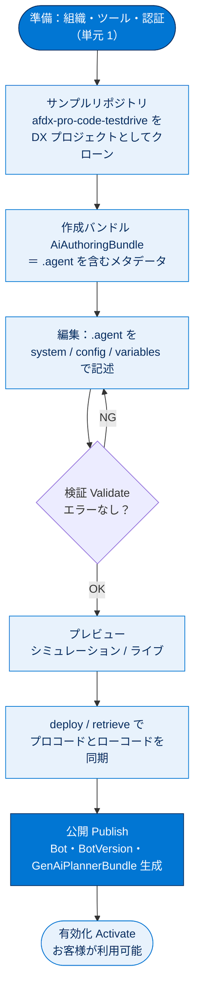

# Agentforce DX を使用してエージェントを構築する 総まとめ

このトピックでは、AI エージェントを「クリック操作（ローコード）」ではなく「**ソースコード／メタデータ（プロコード）**」として開発する **Agentforce DX** を学びました。専用 Developer Edition 組織のセットアップから、サンプルリポジトリのクローン・認証・設定スクリプト実行までの**準備**（単元 1）と、`.agent` ファイルを**編集 → 検証 → プレビュー → 公開 → 有効化**する**開発サイクル**（単元 2）の 2 段構えです。VS Code・Salesforce CLI・Git といった現代の開発ツールでエージェントを Apex や LWC と同じワークフローに乗せられる点が一番のポイントです。

---

## 全体像

次の図は、このトピック全体（準備 → 開発サイクル）と登場する主要概念の関係を 1 枚で俯瞰したものです。

---

## ユニット横断 早見表

| ユニット | 学んだこと | キーワード | 一言要点 |
| --- | --- | --- | --- |
| **01 Agentforce DX の使用開始** | プロコード開発の概念と開発環境の準備 | プロコード / メタデータ / DevOps・CI / 専用 Developer Edition / 設定スクリプト | エージェントをコードとして扱う「土台」を整える |
| **02 エージェントスクリプトを使用してエージェントを作成する** | `.agent` の編集から公開・有効化までの開発サイクル | `.agent` / AiAuthoringBundle / シミュレーション・ライブ / deploy・retrieve / publish・activate | スクリプトを編集して検証・プレビューし組織へ公開・有効化する |

---

## 🎯 試験頻出ポイント

> [!ポイント] このトピックで狙われやすい論点
>
> - **プロコード vs ローコード**：Agentforce DX ＝ プロコード（コード・CLI・Git）、Agentforce Builder UI ＝ ローコード（クリック）。両者は**併用でき、deploy / retrieve で同期**する。
> - エージェントは**メタデータで構成される**ため、Apex / LWC と同じく **Git 管理・組織間移動・CI 組み込み**ができる。
> - 中心ファイルは **`.agent`（エージェントスクリプトファイル）**、それを含むメタデータが **`AiAuthoringBundle`（作成バンドル）**。`.agent` は **system / config / variables** ブロックで構成。
> - 作成バンドルの用意方法は **3 通り**：CLI / VS Code でゼロから作成・バイブコーディング・Builder で作って DX に取得。
> - プレビューは 2 種類：**シミュレーション**（スクリプトのみ・ツールを LLM が模擬）と **ライブ**（実 Apex / フロー / プロンプトテンプレート使用）。**どちらも組織への認証が必要**（LLM へ組織経由でアクセスするため）。
> - **ライブテストには `default_agent_user` の設定が必須**。エージェントは「**Einstein エージェントユーザー**」プロファイルの専用ユーザー（ランタイム ID）として実行される。
> - 公開（publish）で生成される主要メタデータ＝ **Bot / BotVersion / GenAiPlannerBundle / GenAiFunction**。
> - スクリプト変更後は**必ず検証（validate）**。公開後、特定バージョンを**有効化（activate）** して初めてお客様が利用できる。
> - 中心の 2 コマンド：`agent validate authoring-bundle`（検証）と `agent publish authoring-bundle`（公開）。

---

## 📖 用語早見表

| 用語 | ひとことの意味 |
| --- | --- |
| **Agentforce DX** | エージェントをコード（メタデータ）として開発するプロコードのツールセット |
| **プロコード / ローコード** | コードで開発（DX）／クリックで構築（Builder UI） |
| **メタデータ** | 組織のカスタマイズ内容を表す設定情報。エージェントもこれで構成される |
| **エージェントスクリプト（`.agent`）** | エージェントのブループリント（設計図）となる記述言語ファイル |
| **AiAuthoringBundle（作成バンドル）** | `.agent` などをまとめたメタデータコンポーネント |
| **バイブコーディング** | 自然言語で振る舞いを指示してエージェントを作る手法 |
| **LLM（大規模言語モデル）** | 自然言語を理解・生成する AI。応答が揺れるためスクリプトで補強する |
| **シミュレーション** | `.agent` のみで会話し、ツールを LLM が模擬するプレビュー |
| **ライブ（Live Test）** | 実際の Apex / フロー / プロンプトテンプレートを使うプレビュー |
| **`default_agent_user`** | ライブテストで使うエージェント実行ユーザー（config で設定） |
| **エージェントユーザー** | エージェントを実行する専用ユーザー（ランタイム ID） |
| **deploy / retrieve** | ローカル→組織へ反映 ／ 組織→ローカルへ取り込み |
| **publish（公開）** | 作成バンドルから Bot 等のエージェントメタデータを生成する |
| **activate（有効化）** | 特定バージョンを有効にしてお客様が利用できる状態にする |
| **validate（検証）** | スクリプトに構文エラーや問題がないかチェックする |

---

> [!豆知識] サンプルの舞台は「Coral Cloud Resorts」
>
> このトピックの題材は、リゾート企業 Coral Cloud Resorts が開発する「ローカル情報エージェント（Local Info Agent）」です。Coral Cloud Resorts は Salesforce の多くの Trailhead 教材に共通で登場する架空企業で、ハンズオンに一貫したストーリー性を持たせる役割を担っています。

> [!豆知識] 気温「65.3°F ～ 81.1°F」の正体
>
> ライブプレビューで表示される具体的な気温は、実在の天気 API ではなく `WeatherService.cls` という Apex クラスに**ハードコーディングされたテスト値**です。シミュレーション（模擬）とライブ（実物）の違いを体感させるため、あえて固定値が仕込まれています。

> [!豆知識] 「Agentforce バイブス」という拡張機能
>
> Salesforce Extension Pack を入れると、Agentforce DX と並んで「**Agentforce バイブス（Vibes）**」という拡張機能が自動で追加されます。名前は、自然言語で挙動を作る「バイブコーディング」に由来し、エージェント開発を支援する一連の機能を指します。

---

## ✅ 理解度セルフチェック

> [!まとめ] 理解度を確認しよう（答え付き）
>
> 1. Agentforce DX はローコードとプロコードのどちら？
>    → **プロコード**（コード・CLI・Git で開発する）。
> 2. エージェントの中心となるファイルの拡張子は？ また、それを含むメタデータコンポーネントの名称は？
>    → **`.agent`** ／ **`AiAuthoringBundle`（作成バンドル）**。
> 3. シミュレーションモードとライブモードの最大の違いは？
>    → シミュレーションは**スクリプトのみでツールを LLM が模擬**、ライブは**実際の Apex / フロー / プロンプトテンプレートを使用**する。
> 4. ライブテストを行うために config ブロックで設定が必要なプロパティは？
>    → **`default_agent_user`**（エージェント実行ユーザー）。
> 5. 公開（publish）で生成される主なエージェントメタデータを 4 つ挙げよ。
>    → **Bot / BotVersion / GenAiPlannerBundle / GenAiFunction**。
> 6. ローカル DX プロジェクトと組織の内容を一致させるための 2 つの操作は？
>    → **deploy（ローカル→組織）** と **retrieve（組織→ローカル）**。
