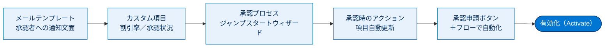
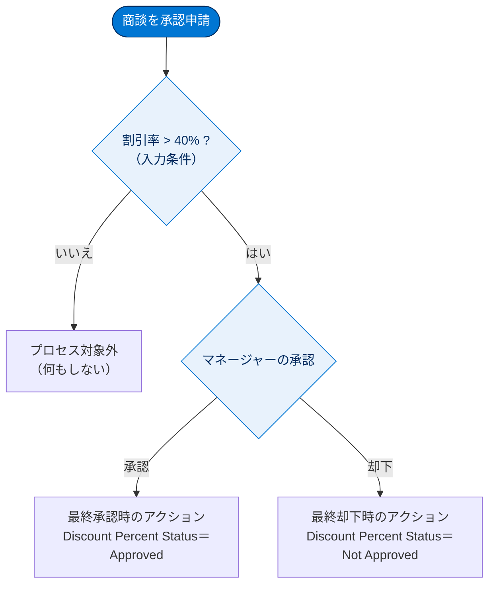
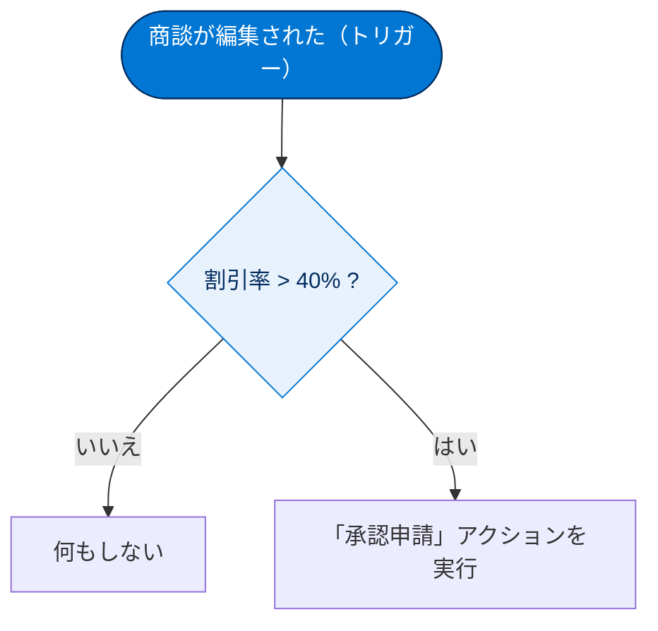

# 承認プロセスを作成する

## 学習の目的

この単元を完了すると、次のことができるようになります。

- 承認プロセスに必要なメールテンプレートとカスタム項目を作成する。
- ジャンプスタートウィザードで承認プロセスを作成する。
- 最終承認時・最終却下時のアクション（項目自動更新）を設定する。
- レコードの承認申請を開始する方法（ボタン／フロー）を理解する。

> [!ポイント] この単元のゴール
>
> 「**割引率が 40% を超える商談はマネージャーの承認が必要**」というルールを実際に作ります。流れは **メールテンプレート → カスタム項目 → 承認プロセス（ジャンプスタート）→ 承認時のアクション → 承認申請ボタン** の順。各ステップで何のために何を作るのか意識しましょう。

> [!手順] Flow Builder のハンズオン準備
>
> 1. Trailhead Playground を起動します。
> 2. ハンズオン Challenge までスクロールし、**[Launch（起動）]** をクリックします。
> 3. Challenge を実行するときにもこの Playground を使用します。

> [!用語] Trailhead Playground
>
> 学習者専用の練習用 Salesforce 組織。本番に影響を与えず設定変更やハンズオンを試せます。Challenge の評価もこの組織に対して行われます。

---

## メールテンプレートを作成する

まず、レコード所有者のマネージャーに「商談の割引率が 40% を超えた」と通知するメールテンプレートを作成します。

> [!用語] 差し込み項目（Merge Field）
>
> `{!Opportunity.Name}` のように波かっこで囲む特殊な記述。メール送信時に実際の商談名やマネージャー名に自動で置き換わるため、定型文1つでレコードごとに内容を変えられます。

> [!手順] Classic メールテンプレートを作成する
>
> 1. **[設定（Setup）]** から **[クイック検索]** に「テンプレート」と入力し、**[Classic メールテンプレート]** を選択する。
> 2. **[新規テンプレート]** をクリックする。
> 3. 種類に **[テキスト]** を選択し、**[Next（次へ）]** をクリックする。
> 4. 次の値で設定する。
>    - **Folder（フォルダー）**：`Unfiled Public Classic Email Templates`（未整理公開 Classic メールテンプレート）
>    - **Available for Use（有効）**：選択
>    - **Email Template Name（メールテンプレート名）**：`Approve Opportunity Discount`（商談割引の承認）
>    - **Encoding（文字コード）**：`General US & Western Europe`（米国および西ヨーロッパ言語）
>    - **件名**：`Please approve this discounted opportunity`（この割引された商談を承認してください）
>    - **Email Body（メール本文）**：`{!User.Manager}, the {!Opportunity.Name} has been discounted. Please approve this discount. Thank you.`（{!User.Manager} さん、{!Opportunity.Name} が割引されました。この割引を承認してください。よろしくお願い申し上げます。）
> 5. **[Save（保存）]** をクリックする。

> [!例] 差し込み項目がメールでどう表示されるか
>
> 本文 `the {!Opportunity.Name} has been discounted.` は、商談名が「Acme - 1,200 Widgets」なら `the Acme - 1,200 Widgets has been discounted.` と表示されます。`{!Opportunity.Name}` は商談レコードへのリンクも追加するため、承認者がレコードを確認してから応答できます。

> [!注意] 差し込み項目の値はそのまま正確に入力する
>
> `{!User.Manager}` や `{!Opportunity.Name}` は、スペル・大文字小文字・波かっこ・エクスクラメーションマークまで含めて**正確に**入力してください。1文字でも違うと差し込みが機能しません。

---

## カスタム項目を追加する

各商談の割引率と承認状況を追跡できるよう、商談オブジェクトに **パーセント型** と **選択リスト型** の2項目を追加します。

> [!用語] パーセント型（Percent）・選択リスト型（Picklist）
>
> - **パーセント型**：割合（%）を保存する数値項目。ここでは「割引率」に使用。
> - **選択リスト型**：決めた選択肢から1つを選ばせる項目。ここでは「承認済み／未承認」を保持する「承認状況」に使用。自由入力を防ぎ値を統一できます。

> [!手順] 割引率（パーセント型）と承認状況（選択リスト型）の項目を作成する
>
> 1. **[設定]** から **[クイック検索]** に「オブジェクトマネージャー」と入力し、**[オブジェクトマネージャー]** を選択する。
> 2. **[Opportunity（商談）]** をクリックする。
> 3. **[Fields & Relationships（項目とリレーション）]** を選択し、**[New（新規）]** をクリックする。
> 4. **[Data Type（データ型）]** 列で **[Percent（パーセント）]** を選択し、**[Next（次へ）]** をクリックする。
> 5. **[Percent]** 項目を次の値で設定する。
>    - **Field Label（項目の表示ラベル）**：`Discount Percent`（割引率）
>    - **Length（長さ）**：デフォルトのまま
>    - **Decimal Places（小数点の位置）**：デフォルトのまま
>    - **Required（必須）**：選択
> 6. **[次へ]** をクリックする。
> 7. **[次へ]** をクリックする。
> 8. **[Save & New（保存 & 新規）]** をクリックする。
> 9. **[Data Type]** 列で **[Picklist（選択リスト）]** を選択し、**[Next（次へ）]** をクリックする。
> 10. **[Picklist]** 項目を次の値で設定する。
>     - **Field Label（項目の表示ラベル）**：`Discount Percent Status`（割引率の状況）
>     - **Value（値）**：各値を改行で区切って次の2つを入力する。
>       - `Approved`（承認済み）
>       - `Not Approved`（未承認）
> 11. **[次へ]** をクリックする。
> 12. **[次へ]** をクリックする。
> 13. **[Save（保存）]** をクリックする。

> [!注意] 選択リストの値は英語のまま入力する
>
> `Approved` と `Not Approved` を表記ゆれなく**そのまま**入力してください。後で承認・却下時のアクションがこの値を更新するため、綴りが一致しないと正しく動きません。

> [!例] ここまでで作った「部品」
>
> - **メールテンプレート**：承認者（マネージャー）に「割引されたから承認して」と知らせる文面。
> - **Discount Percent（割引率）**：商談がどれだけ値引きされたかを記録する箱。
> - **Discount Percent Status（割引率の状況）**：承認の結果（Approved / Not Approved）を記録する箱。

---

## 承認プロセスを作成する

組織の準備ができたので、**ジャンプスタートウィザード** で承認プロセスを作成します。

> [!用語] ジャンプスタートウィザード（Jump Start Wizard）・入力条件（Entry Criteria）
>
> - **ジャンプスタートウィザード**：1ステップの簡単な承認プロセスを、一部設定を自動選択しながらすばやく作るウィザード。複雑な多段承認には「標準ウィザード」を使います。
> - **入力条件（Entry Criteria）**：どんなレコードがこの承認プロセスの対象になるかを決める条件。ここでは「割引率が 40% より大きい商談」だけを対象にします。

> [!手順] ジャンプスタートウィザードで承認プロセスを作成する
>
> 1. **[設定]** から **[クイック検索]** に「承認」と入力し、**[承認プロセス]** を選択する。
> 2. **[承認プロセスを管理するオブジェクト]** で **[商談]** を選択する。
> 3. **[承認プロセスの新規作成]** | **[ジャンプスタートウィザードを使用]** をクリックする。
> 4. 次の値で設定する。
>    - **Name（名前）**：`Approve Opportunity Discount`（商談割引の承認）
>    - **Approval Assignment Email Template（承認割り当てメールテンプレート）**：`Approve Opportunity Discount`（商談割引の承認）
>    - **Specify Entry Criteria（入力条件の指定）**：
>      - **Field（項目）**：`Opportunity: Discount Percent`（商談: 割引率）
>      - **Operator（演算子）**：`greater than`（次の値より大きい）
>      - **Value（値）**：`40`
>    - **Select Approver（承認者の選択）**：`Let the submitter choose the approver manually`（申請者が承認者を手動で選択する）
> 5. 承認プロセスを保存する。
> 6. **[承認プロセスの詳細ページの参照]** をクリックする。

> [!注意] ジャンプスタートウィザードが自動で選ぶ設定
>
> 一部の設定（申請時のレコードロックなど）は自動的に選択されます。そのため入力条件と承認者など最小限の項目だけで動かせます。

### 承認時・却下時のアクションを追加する

承認結果に応じて、先ほど作った **Discount Percent Status（割引率の状況）** を自動更新します。

> [!手順] 最終承認時・最終却下時のアクション（項目自動更新）を設定する
>
> 1. **[最終承認時のアクション]** で **[新規アクションの追加]** | **[項目自動更新]** をクリックし、次の値で設定する。
>    - **Name（名前）**：`Approved`（承認済み）
>    - **Field to Update（更新する項目）**：`Discount Percent Status`（割引率の状況）
>    - **A specific value（特定値）**：`Approved`（承認済み）
> 2. **[Save（保存）]** をクリックする。
> 3. **[最終却下時のアクション]** で **[新規アクションの追加]** | **[項目自動更新]** をクリックし、次の値で設定する。
>    - **Name（名前）**：`Not Approved`（未承認）
>    - **Field to Update（更新する項目）**：`Discount Percent Status`（割引率の状況）
>    - **A specific value（特定値）**：`Not Approved`（未承認）
> 4. **[Save（保存）]** をクリックする。

> [!注意] 有効化を忘れない
>
> 承認プロセスは作成しただけでは動きません。最後に**有効化（Activate）**して初めて、レコードの承認申請が評価されます。有効化忘れはよくある落とし穴です。

> [!例] 作った承認プロセスの動き
>
> 割引率 45% の商談を申請すると、入力条件（40% より大きい）に合致して承認プロセスに進みます。承認すると **Discount Percent Status = Approved**、却下すると **Not Approved** に自動更新されます。割引率 30% の商談は条件に合わずプロセスの対象になりません。

---

## レコードの送信（承認申請）を確認する

次は、ユーザーが承認プロセスを開始できる **[Submit for Approval（承認申請）] ボタン** をページレイアウトに追加します。

> [!用語] ページレイアウト（Page Layout）
>
> レコード詳細画面で、どの項目・ボタン・関連リストをどこに表示するかを決める設定。ここでは「承認申請」ボタンを置いてユーザーが押せるようにします。

> [!手順] [承認申請] ボタンをページレイアウトに追加する
>
> 1. **[Setup（設定）]** から **[Object Manager（オブジェクトマネージャー）]** タブをクリックする。
> 2. **[Opportunity（商談）]** をクリックする。
> 3. **[Page Layouts（ページレイアウト）]** をクリックする。
> 4. **[Opportunity Layout（商談レイアウト）]** を選択する。
> 5. ヘッダーバーで **[Buttons（ボタン）]** を選択する。
> 6. **[Submit for Approval（承認申請）]** ボタンを **[Standard Buttons（標準ボタン）]** セクションにドラッグする。
> 7. **[Save（保存）]** をクリックする。

> [!注意] 動的アクション対応の Lightning レコードページの場合
>
> 動的アクションを使うようアップグレードされた Lightning レコードページでは、**[Submit for Approval（承認申請）]** アクションを**強調表示パネル**に追加する必要があります。詳細は「Lightning アプリケーションビルダーでの動的アクションの作成」を参照してください。

### ボタンの押し忘れをフローで防ぐ

ユーザーがボタンをクリックし忘れるとどうなるでしょうか？ ここで **Flow Builder** が役立ちます。

> [!用語] レコードトリガーフロー（Record-Triggered Flow）
>
> レコードが作成・更新・削除されたことをきっかけに自動実行されるフロー。ボタンのクリックを待たず、システム側で処理を起動できます。

> [!ポイント] フローで承認申請を自動化する
>
> アクション要素で選べるアクションの1つが「**Submit for Approval（承認申請）**」です。承認を自動申請するレコードトリガーフローを作れば、ユーザーは承認申請を覚えておく必要がありません。
>
> 1. 商談が編集されるとトリガーされる。
> 2. 割引率が 40% より大きいかチェックする。
> 3. 大きい場合は、承認申請のアクション要素を実行する。

詳細は「フローのデータとアクション」バッジを参照してください。「Flow Builder を使用したフローの作成」トレイルの残りも完了し、レコードトリガーフローの作成方法を学習することをお勧めします。

---

## もうひとこと…

ホームページに**未承認申請コンポーネント**を追加すると、ユーザーが進行中の承認申請を確認できます。また、ユーザーがメールや Chatter から直接、承認申請に応答できるようにもできます。

> [!用語] 未承認申請（Items to Approve）コンポーネント
>
> 自分が承認すべき申請の一覧を表示する Lightning ホームページ用コンポーネント。承認者が「自分宛ての承認依頼」を見落とさないようにします。

> [!ポイント] 承認への応答方法は複数ある
>
> 承認者は、(1) レコード画面の承認関連リスト、(2) ホームの未承認申請コンポーネント、(3) **メール**、(4) **Chatter** から承認・却下に応答できます。メールや Chatter から応答できると承認スピードが上がります。

---

## リソース

- Salesforce ヘルプ：標準ウィザードを使用した従来の承認プロセスの作成
- Salesforce ヘルプ：[承認申請] アクション
- Trailhead：割引承認プロセスの作成

---

## 試験対策：押さえておきたい追加ポイント

> [!ポイント] 承認プロセス作成のよくある出題
>
> - 作成ウィザードには **ジャンプスタートウィザード**（簡易）と **標準ウィザード**（多段・詳細設定可）の2種類がある。
> - **入力条件（Entry Criteria）** または **数式** で対象レコードを絞り込める。
> - 承認結果の反映には **項目自動更新（Field Update）** をアクションに設定するのが定番。
> - 承認申請の開始は **[承認申請] ボタン** または **レコードトリガーフローの [承認申請] アクション**。
> - 承認プロセスは **有効化（Activate）** しないと動作しない。
> - メールテンプレートは承認者への**割り当て通知**に使われる。

> [!まとめ] この単元の要点整理
>
> 1. **メールテンプレート**で承認者に通知できるようにする。
> 2. **カスタム項目**（割引率・承認状況）でデータを追跡する。
> 3. **ジャンプスタートウィザード**で承認プロセスを作り、入力条件「割引率 > 40」と承認者を設定する。
> 4. **最終承認時／最終却下時のアクション**（項目自動更新）で承認状況を Approved / Not Approved に更新する。
> 5. **[承認申請] ボタン**をレイアウトに追加し、必要なら**フロー**で申請を自動化する。
> 6. 最後に承認プロセスを**有効化**する。

---

## ハンズオン Challenge（+500 ポイント）

> [!注意] 準備を始めましょう
>
> この単元は各自のハンズオン組織で実行します。**[起動]** をクリックして開始するか、組織の名前をクリックして別の組織を選びます。

> [!まとめ] あなたの Challenge：承認プロセスを作成する
>
> 従業員数 500 人を超えるプロスペクトアカウントを顧客に変換する前に承認するための承認プロセスを作成します。
>
> **始める前に**
>
> - **[Object Manager（オブジェクトマネージャー）]** で **Account（取引先）** オブジェクトの **Fields and Relationships（項目とリレーション）** に移動し、**Type（種別）** 項目の選択リスト値 `Prospect`、`Customer`、`Pending` を確認する。不足があれば追加する。
>
> **ジャンプスタートウィザードを使用して、承認プロセスを作成します。**
>
> - **Manage Approval Processes For（承認プロセスを管理するオブジェクト）**：`Account`（取引先）
> - **Name（名前）**：`Approve New Account`（新規取引先の承認）
> - **Unique Name（一意の名前）**：`Approve_New_Account`
> - **Approval Assignment Email Template（承認割り当てメールテンプレート）**：任意のテンプレートを選択する
> - **Entry Criteria（エントリ条件）**：
>   - `Account: Type equals Prospect`（取引先: 種別が Prospect と等しい）
>   - `Account: Employees is greater than 500`（取引先: 従業員が 500 より大きい）
> - **Approver（承認者）**：
>   - `Automatically assign to approver(s)`（自動的に承認者に割り当てる）
>   - **User（ユーザー）**：自分を割り当てる
>
> **項目を更新する申請時のアクションを追加する：**
>
> - **Name（名前）**：`Account Type To Pending`（取引先種別を保留中にする）
> - **Unique Name（一意の名前）**：`Account_Type_To_Pending`
> - **Action（アクション）**：`Type`（種別）項目を `Pending` に更新する
>
> **項目を更新する最終承認時のアクションを追加する：**
>
> - **Name（名前）**：`Account Type To Customer`（取引先種別を顧客にする）
> - **Unique Name（一意の名前）**：`Account_Type_To_Customer`
> - **Action（アクション）**：`Type`（種別）項目を `Customer` に更新する
>
> **既存の最終承認時のアクションを編集する：**
>
> - **Name（名前）**：`Record Lock`（レコードをロック）
> - **Action（アクション）**：`Unlock the record for editing`（レコードを編集するためにロック解除する）
>
> **項目を更新する最終却下時のアクションを追加する：**
>
> - **Name（名前）**：`Account Type To Prospect`（取引先種別をプロスペクトにする）
> - **Unique Name（一意の名前）**：`Account_Type_To_Prospect`
> - **Action（アクション）**：`Type`（種別）項目を `Prospect` に更新する
>
> 最後に、**承認プロセスを有効化する**。

> [!注意] Challenge の設定値は英語で正確に
>
> 項目名・一意の名前（API 名）・選択リスト値（`Prospect` / `Customer` / `Pending`）は、大文字小文字やアンダースコアまで含めて**正確にそのまま**入力してください。評価は英語の値に対して行われます。

> [!注意] 日本語環境で受講する場合
>
> 日本語の Trailhead Playground で Challenge を開始し、かっこ内の翻訳を参照しながら進めてください。評価は英語データを対象に行われるため、**英語の値のみ**をコピーして貼り付けます。不合格だった場合は、(1) [Locale（地域）] を [United States（米国）] に、(2) [Language（言語）] を [English（英語）] に切り替えてから、(3) [Check Challenge（Challenge を確認）] ボタンをクリックしてみてください。

---

## 🎓 この単元のまとめ

この単元では、「割引率が 40% を超える商談はマネージャーの承認が必要」というルールを、メールテンプレート・カスタム項目・承認プロセス・項目自動更新・承認申請ボタンという複数の部品を組み合わせて実際に作りました。最後の有効化までが1セットです。

次の表は、作成した部品とその役割、そして「作る順番」を整理したものです。

| 順番 | 作る部品 | 役割 |
| --- | --- | --- |
| 1 | メールテンプレート | 承認者（マネージャー）への割り当て通知文面 |
| 2 | カスタム項目（割引率・承認状況） | 値引き量と承認結果を記録する箱 |
| 3 | 承認プロセス（ジャンプスタート） | 入力条件「割引率 > 40」と承認者を設定 |
| 4 | 承認時／却下時のアクション（項目自動更新） | 承認状況を Approved / Not Approved に更新 |
| 5 | [承認申請] ボタン ＋ フロー | ユーザーが申請を開始（フローで自動化も可） |
| 6 | 有効化（Activate） | これをしないと承認プロセスは動かない |

> [!まとめ] この単元の要点
>
> - 承認プロセスは1機能で完結せず、**メールテンプレート・カスタム項目・項目自動更新**など複数部品の組み合わせで実現する。
> - **ジャンプスタートウィザード**は1ステップの簡単な承認を素早く作るためのもので、多段承認には**標準ウィザード**を使う。
> - 対象レコードは**入力条件（Entry Criteria）**または数式で絞り込む（例：割引率 > 40）。
> - 承認結果の反映には**項目自動更新（Field Update）**を承認時／却下時のアクションに設定する。
> - 承認申請の開始は**[承認申請] ボタン**または**レコードトリガーフロー**で行い、最後に必ず**有効化**する。

> [!豆知識] 承認は「メール」や「Chatter」からでも返せる
>
> 承認者はレコード画面を開かなくても、割り当て通知メールやホームの未承認申請コンポーネント、さらには Chatter からも直接「承認／却下」を返せます。出張中のマネージャーがスマホのメールから一言で承認できるよう設計されており、承認プロセスがビジネスのスピードを落とさない工夫がされています。
