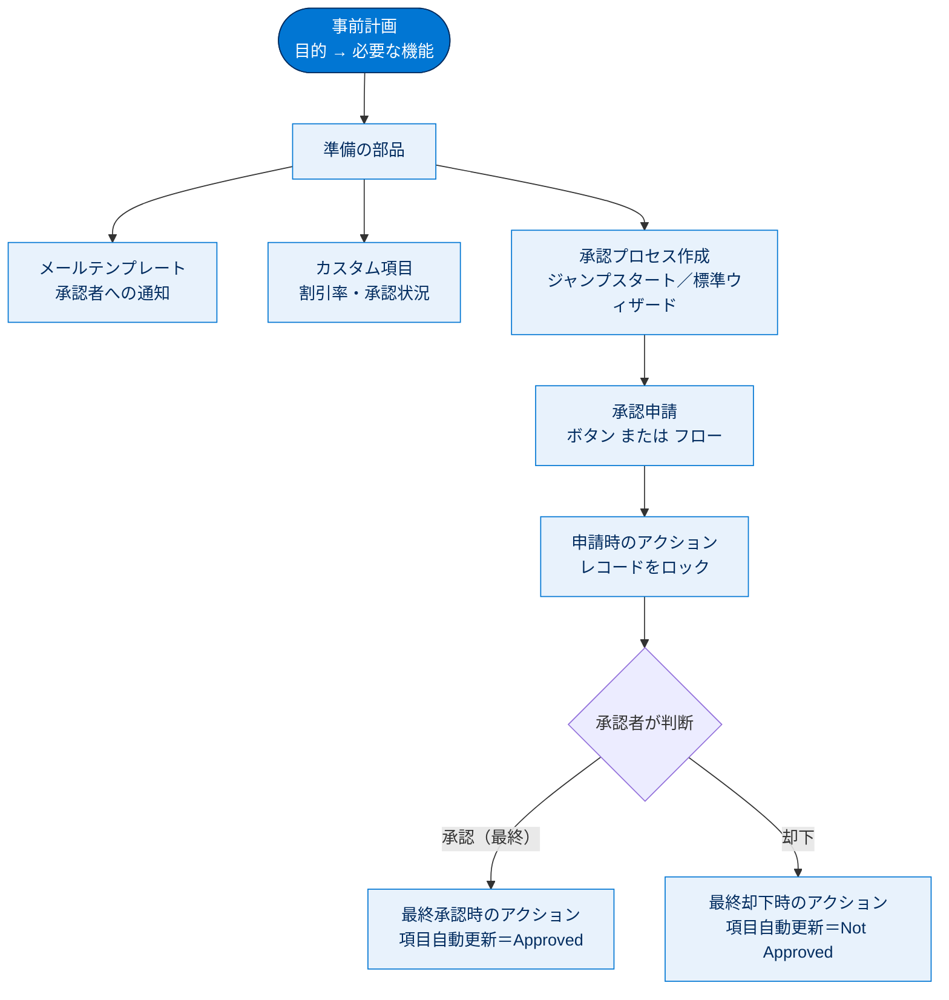

# 承認プロセスを使用してレコードを承認する 総まとめ

このトピックでは、Salesforce の標準機能である **承認プロセス**を学びました。前半の単元で「承認プロセスとは何か（ステップ・承認者・アクションの3要素と、申請時／最終承認時／最終却下時という3つのアクションのタイミング）」という概念を理解し、後半の単元で「割引率が 40% を超える商談はマネージャーの承認が必要」というルールを、メールテンプレート・カスタム項目・項目自動更新・承認申請ボタンを組み合わせて実際に作り上げました。ノーコードで社内の承認ルールをシステムとして強制できることが、このトピックの最大のポイントです。

---

## 全体像

次の図は、このトピックで登場した概念と、承認プロセスを「準備 → 作成 → 申請 → 判断 → 結果反映」という流れで俯瞰したものです。

---

## ユニット横断 早見表

| ユニット | 学んだこと | キーワード | 一言要点 |
| --- | --- | --- | --- |
| 01 レコードの承認方法をカスタマイズする | 承認プロセスの概念と構成要素、レコードの流れ、事前計画 | ステップ・承認者・アクション／申請時・最終承認時・最終却下時／レコードのロック | 承認の流れを「3要素」と「3つのタイミング」で捉える |
| 02 承認プロセスを作成する | メールテンプレート・カスタム項目・承認プロセス・項目自動更新・承認申請の実装 | ジャンプスタートウィザード／入力条件／項目自動更新／承認申請ボタン／フロー／有効化 | 複数の部品を組み合わせ、最後に有効化して動かす |

---

## 🎯 試験頻出ポイント

> [!ポイント] このトピックで狙われやすい論点
>
> - 承認プロセスは **ステップ・承認者・アクション** の3要素で定義する。
> - アクションのタイミングは **申請時／（各ステップの）承認時・却下時／最終承認時／最終却下時**。
> - **申請時のアクション**のデフォルトは **レコードのロック**。承認者とシステム管理者以外は編集できない。
> - **最終承認時のアクション**は、後続ステップがない **最後の承認** でのみ実行される。
> - 作成ウィザードは **ジャンプスタートウィザード**（1ステップの簡易）と **標準ウィザード**（多段・詳細設定可）の2種類。
> - 対象レコードの絞り込みは **入力条件（Entry Criteria）** または **数式**。
> - 承認結果の反映には **項目自動更新（Field Update）** をアクションに設定するのが定番。
> - 承認申請の開始は **[承認申請] ボタン** または **レコードトリガーフローの [承認申請] アクション**。
> - 承認者の割り当て方法は「**申請者が手動で選ぶ**」「**自動で承認者に割り当てる**（マネージャー項目など）」「**キューに割り当てる**」。
> - 承認プロセスは **有効化（Activate）** しないと動作しない。

---

## 📖 用語早見表

| 用語 | ひとことの意味 |
| --- | --- |
| 承認プロセス（Approval Process） | レコードの承認の流れを自動化する標準機能 |
| ステップ（Step） | 「誰が・どの順番で承認するか」を定義する段階 |
| 承認者（Approver） | そのステップで承認・却下を行うユーザー |
| アクション（Action） | 承認・却下などのタイミングで自動実行される処理 |
| 申請時のアクション | 承認申請の直後に走る処理（既定はレコードのロック） |
| 最終承認時のアクション | 全ステップ通過後の承認確定時に走る処理 |
| 最終却下時のアクション | いずれかのステップで却下されたときに走る処理 |
| レコードのロック | 承認待ちの間、対象レコードを編集不可にすること |
| 入力条件（Entry Criteria） | どのレコードが承認プロセスの対象になるかの条件 |
| ジャンプスタートウィザード | 1ステップの承認を素早く作る簡易ウィザード |
| 標準ウィザード | 多段承認や詳細設定が可能な作成ウィザード |
| 項目自動更新（Field Update） | 条件成立時に項目値を自動で書き換えるアクション |
| メールテンプレート | 差し込み項目を使った定型メール文面 |
| 差し込み項目（Merge Field） | `{!Opportunity.Name}` のように値が自動置換される記述 |
| レコードトリガーフロー | レコードの作成・更新・削除を契機に自動実行されるフロー |
| 有効化（Activate） | 承認プロセスを実際に動作させる最終操作 |

---

> [!豆知識] ジャンプスタートと標準ウィザードの違いは「ステップ数」
>
> ジャンプスタートウィザードは **1ステップ・1段階の承認**しか作れません。「課長 → 部長 → 社長」のような多段承認を組みたいときは標準ウィザードを使います。試験では「素早く・簡単に作る＝ジャンプスタート」「複雑・多段＝標準」という対比で問われることがあります。

> [!豆知識] ロックは「他人の改ざん防止」だけが目的ではない
>
> 申請時のレコードロックは、承認中に金額などを書き換える不正を防ぐと同時に、承認者が「見たときの内容」と「実際に承認した内容」のズレをなくす役割もあります。だからこそ最終承認時のアクションで明示的に「ロック解除」を入れることが多いのです。

> [!豆知識] 承認状況を表す標準の項目がある
>
> レコードには承認の進行状況を示す情報（誰が・いつ承認したか）が履歴として残り、承認関連リストから追跡できます。教材で作った「Discount Percent Status」のようなカスタム項目は、あくまで業務上わかりやすく結果を表示するための補助であり、承認プロセス自体は内部で状態を管理しています。

---

## ✅ 理解度セルフチェック

> [!まとめ] 確認問題（答えを考えてから読み合わせてください）
>
> **問1.** 承認プロセスを定義する3つの構成要素は何か。
> → **ステップ・承認者・アクション**。
>
> **問2.（正誤）** 申請時のアクションのデフォルトはメール送信である。
> → **誤り**。デフォルトは**レコードのロック**。
>
> **問3.（穴埋め）** 最終承認時のアクションは、後続ステップが（　　）最後の承認でのみ実行される。
> → **ない（残っていない）**。
>
> **問4.** 1ステップの簡単な承認を素早く作るためのウィザードの名前は？
> → **ジャンプスタートウィザード**。
>
> **問5.（正誤）** 承認プロセスは作成すればすぐに動作する。
> → **誤り**。**有効化（Activate）** しないと動作しない。
>
> **問6.** 承認結果に応じて承認状況の項目を自動で書き換えるには、どのアクションを使うか。
> → **項目自動更新（Field Update）**。
