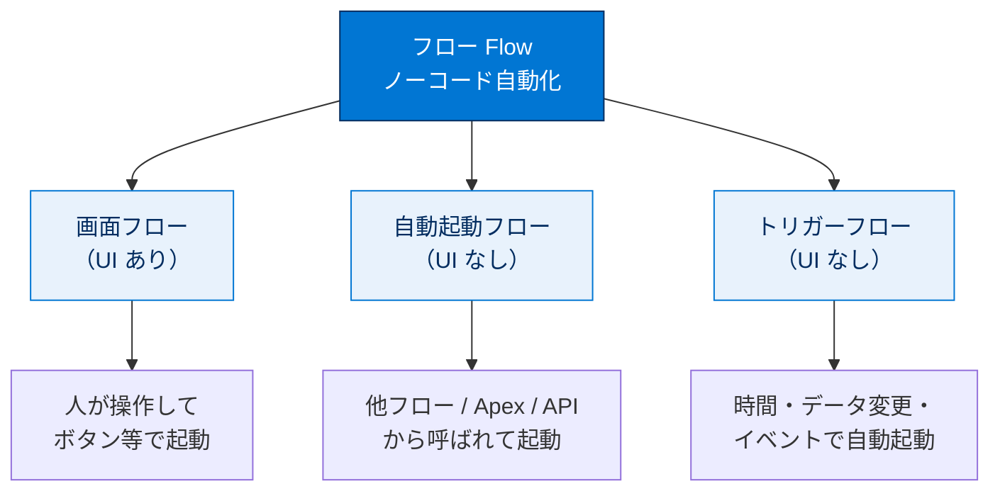
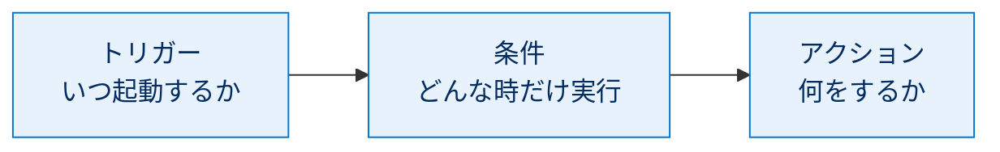
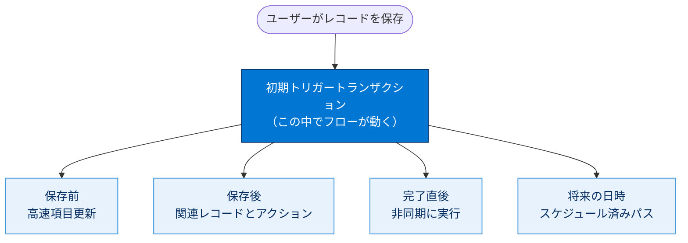

# トリガーフロー入門

> [!ポイント] この単元のゴール
>
> 自動化ツール **フロー** には 3 種類（画面フロー・自動起動フロー・トリガーフロー）があります。本単元では最頻出の **レコードトリガーフロー** を中心に、「いつ・何をきっかけに・何を動かすか」の考え方と、4 つの実行オプション（高速項目更新／関連レコードとアクション／非同期に実行／スケジュール済みパス）の使い分けを押さえます。

> [!用語] フロー（Flow）／ Flow Builder
>
> **フロー**は「if/then（もし○○なら△△する）」のビジネスプロセスを、ノーコードで自動化する仕組み。**Flow Builder** はフローを図として描きながら作成・編集・デバッグできる設計ツール。ワークフロールールとプロセスビルダーを統合した、ノーコード自動化の中心ツールです。

---

## フロー種別

| フロー種別 | 起動方法 | 説明 |
| --- | --- | --- |
| **画面フロー** | クイックアクション / Lightning ページ / Experience Cloud サイト など | UI を表示し人の操作を前提に進む。 |
| **自動起動フロー** | 別のフロー / Apex / REST API | UI なしでバックグラウンド実行。自身を起動するトリガーはない。 |
| **トリガーフロー** | 時間 / データ変更 / プラットフォームイベント | 指定トリガーで自動起動。バックグラウンド実行。 |

> [!例] 3 種類の使い分け
>
> - **画面フロー**：「対応理由を選んでください」と画面で尋ねたい（人の入力が必要）。
> - **自動起動フロー**：「住所を正規化する共通処理」を他フローから部品として呼ぶ。
> - **トリガーフロー**：「商談が成立に変わったら関連タスクを自動作成」（きっかけに反応）。

---

## ツール

新しく自動化を作るなら **Flow Builder** が最適です。if/then プロセスをグラフィック表示しながら構築でき、デバッグ・テスト機能も備えます。レコードトリガーフローはプロセスビルダーで構築したレコード変更プロセスの**最大 10 倍の速さ**でレコードを更新できます。

> [!用語] ワークフロールール／プロセスビルダー
>
> どちらも Flow より前世代の自動化ツール。**ワークフロールール**は項目更新やメール送信など単純な自動化、**プロセスビルダー**は条件分岐つきの複雑な自動化を担いました。現在は機能がフローに統合され、新規作成は Flow Builder に一本化されています。

> [!ポイント] なぜ Flow に統合されたのか
>
> Salesforce はワークフロールールとプロセスビルダーを段階的に廃止し、自動化を **Flow に集約**。試験で「新しく自動化を作るなら何を使うか」の答えは **Flow（フロー）**。レコードトリガーフローはプロセスビルダーより最大 10 倍高速という点も覚えましょう。

---

## トリガーフロー

トリガーフローは **トリガー・条件・アクション** で構成されます。

- **トリガー**：起動方法（スケジュール、または特定タイプのレコード変更時）。
- **条件**：トリガーの詳細。スケジュールなら日付と時刻、レコード変更ならオブジェクトと項目値の変更。
- **アクション**：フローの動作。

> [!例] 「トリガー・条件・アクション」を一文で
>
> 「**商談が**（トリガー）、**ステータスが成立に変わったら**（条件）、**フォローアップのタスクを作成する**（アクション）」のように 3 要素で 1 つの自動化を定義します。

---

## トリガー種別

| トリガー種別 | 実行する状況 | 使用方法 |
| --- | --- | --- |
| **スケジュール** | 指定した時間に指定した頻度で実行 | 夜間の一括処理ジョブを実行する |
| **プラットフォームイベント** | 特定のイベントメッセージを受信したときに実行 | イベントに登録する |
| **レコード** | レコードが作成、更新、削除されたときに実行 | レコードを更新して、通知を送信する |

> [!用語] トリガー種別の 3 つ
>
> - **スケジュールトリガー**：決めた日時・頻度で起動（夜間バッチなど）。
> - **プラットフォームイベント**：システム間でやり取りされる「出来事の通知メッセージ」を受信して起動。
> - **レコードトリガー**：レコードの **作成・更新・削除** をきっかけに起動。最も使用頻度が高い。

---

## レコードトリガーフロー

レコードトリガーフローは使用頻度が最も高く、レコードを操作する最適な方法です。役目は「何かが起こった場合に、他の何かを実行する」こと。トリガーが、どのオブジェクトに・どの時点でアクションを実行するかを決めます。

実行のタイミングは次の 4 通りから選びます。

- レコードの作成時のみ
- 毎回レコードの更新時
- 毎回レコードの作成または更新時
- レコードの削除時のみ

別レコードの更新、通知送信、プロセス開始、データ一貫性の管理などを行い、オプションで競合回避とパフォーマンス向上のためにタイミングを調整できます。

> [!用語] レコードトリガーフロー（Record-Triggered Flow）
>
> レコードの作成・更新・削除をきっかけに自動起動するフロー。「データが変わったら自動で何かする」業務自動化の中心です。

> [!用語] トランザクション（Transaction）
>
> 一連の処理を「まとめて 1 つ」として扱う単位。レコード保存からそれに伴う自動処理までが 1 トランザクションとして実行され、途中で失敗すると変更がすべて取り消される（ロールバック）。レコードトリガーフローを起動する最初のトランザクションを **初期トリガートランザクション** と呼びます。

---

## オプション

| オプション | 実行する状況 | 使用方法とメリット |
| --- | --- | --- |
| **高速項目更新** | 更新が保存される**前** | トリガー元レコード自身を更新／カスタムエラー表示。DB への影響が最小でパフォーマンス最適。 |
| **関連レコードとアクション** | 更新が保存された**後** | 他レコードの作成・更新・削除／サブフローコール／メールアラート・Chatter 投稿など。 |
| **非同期に実行** | 更新が完了した直後 | 外部システムへの要求や時間のかかる処理。トリガー元更新の遅延・ブロックを回避。 |
| **スケジュール済みパス** | 将来の日時に基づきトリガー起動後 | トリガー元レコードの日付を基準にリマインダー・フォローアップを予約。指定期間だけ待機。 |

> [!例] それぞれの典型的な使いどころ
>
> - **高速項目更新**：保存前に「割引率」を自動計算してレコードにセット。
> - **関連レコードとアクション**：商談成立時に関連タスクを新規作成し担当者にメール通知。
> - **非同期に実行**：注文確定時に外部の在庫管理システムへ HTTP リクエストを送信。
> - **スケジュール済みパス**：契約終了予定日の 1 か月前に更新案内メールを自動送信。

---

## 試験対策：押さえておきたい追加ポイント

> [!ポイント] フロー種別・トリガー種別・オプションの対応
>
> - フロー種別：「画面を見せる」→ **画面フロー**／「他から呼ばれ UI なしで動く部品」→ **自動起動フロー**／「きっかけに反応して動く」→ **トリガーフロー**。
> - トリガーフローのきっかけは **スケジュール／プラットフォームイベント／レコード** の 3 つ。
> - オプションは「保存前」か「保存後」かで選ぶ：トリガー元自身の項目だけ更新・速度重視 → **高速項目更新**／別レコード作成・更新やメール・Chatter → **関連レコードとアクション**／外部連携など重い処理 → **非同期に実行**／未来の日時に遅らせる → **スケジュール済みパス**。

> [!注意] 用語のまぎらわしさに注意
>
> 「トリガー種別（スケジュール／プラットフォームイベント／レコード）」と「オプション（高速項目更新／関連レコードとアクション／非同期に実行／スケジュール済みパス）」は別物です。試験では選択肢に両方が混ざるため、**何を問われているか**を最初に見極めましょう。

> [!まとめ] この単元の要点
>
> - フローは **画面フロー・自動起動フロー・トリガーフロー** の 3 種類。
> - 新規の自動化は **Flow Builder** で作る（ワークフロールール／プロセスビルダーは統合済み）。
> - トリガーフローは **トリガー＋条件＋アクション** で構成。
> - トリガー種別は **スケジュール／プラットフォームイベント／レコード** の 3 つ。
> - 最頻出の **レコードトリガーフロー** には 4 つの実行オプションがあり、**保存前・保存後・非同期・未来日時** で使い分ける。

---

## リソース

- 開発者ガイド：トリガーと実行の順序
- アーキテクト意思決定ガイド：Record-Triggered Automation（レコードトリガー自動化）

---

## テスト

この単元を完了するには、テストのすべての質問に正しく解答する必要があります。+100 ポイント

> [!手順] 理解度チェック（設問）
>
> **質問 1.** 取引先に取引先責任者が追加されるたびに実行されるプロセスを自動化する場合、どの種別のフローが最も適していますか?
>
> - A. 画面フロー
> - B. 自動起動フロー
> - C. トリガーフロー
> - D. 高度なフロー
>
> **質問 2.** 現在のサブスクリプションの期限が切れる 1 か月前にサブスクリプションの更新オファーを送信する場合、レコードトリガーフローのどのオプションを使用しますか?
>
> - A. 高速項目更新
> - B. 関連レコードとアクション
> - C. 非同期に実行
> - D. スケジュール済みパス

> [!ポイント] 解き方のヒント
>
> - 質問 1 は「○○が追加されるたびに実行」という **データ変更がきっかけ** の表現に注目。
> - 質問 2 は「期限の 1 か月前」という **未来の日時に基づくタイミング** に注目。
