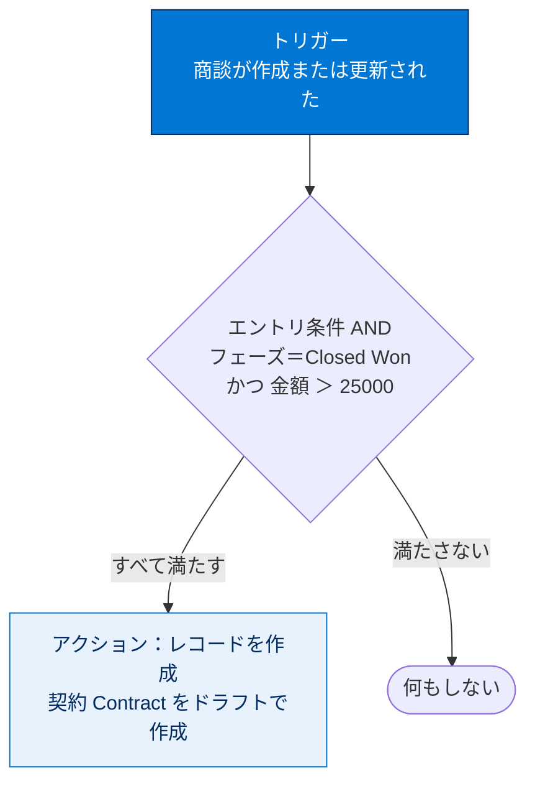
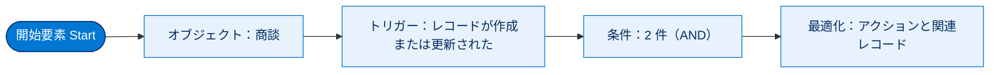
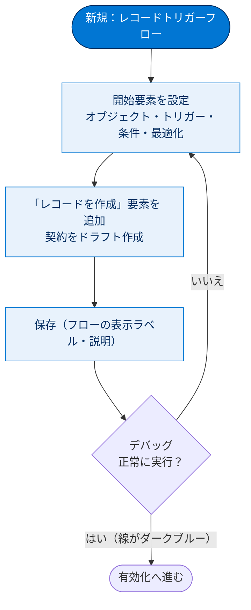

# レコードトリガーフローを構築する

## 学習の目的

この単元を完了すると、次のことができるようになります。

- レコードトリガーフローの要件を「トリガー・条件・アクション」に分解して整理する。
- 開始要素（オブジェクト・トリガー・エントリ条件）を設定する。
- レコードを作成するアクションを追加し、トリガー変数の値を新規レコードに引き継ぐ。
- 有効化前にデバッグで動作を検証する。

> [!ポイント] この単元のゴール
>
> レコードトリガーフローは **「いつ（トリガー）」「どんな条件で（条件）」「何をするか（アクション）」** の3点セットで設計します。本単元では「重要商談が成立したら、自動でドラフト契約を作成する」フローを題材に、開始要素の設定からレコード作成、デバッグまでを体験します。

---

## ビジネス要件

レコードトリガーフローは、要件を **トリガー・条件・アクション** の3つに分けて定義します。

> [!用語] レコードトリガーフロー（Record-Triggered Flow）
>
> レコードの**作成・更新・削除**をきっかけ（トリガー）に自動的に処理を実行するフロー。データの変更そのものが起動条件になります。Apex トリガーをコードで書く代わりに、ノーコードで同等の自動化を実現できます。

> [!例] ビジネス要件を3分割してみる
>
> 「重要商談が成立したら自動的に契約を作る」は次のように分解できます。
>
> | 要素 | 内容 |
> | --- | --- |
> | トリガー | 商談が作成または更新された |
> | 条件 | フェーズが「商談成立（Closed Won）」で、金額が25,000を超えている |
> | アクション | ドラフト契約（Draft Contract）を作成する |

---

## フローを計画して説明する

構築前に次の点を検討します。

- すぐ実行するのか、スケジュールに従って実行するのか?
- 別のレコードを作成するのか、レコードを更新するだけか?
- レコードが更新されるたびに実行するのか、条件を最初に満たしたときのみ実行するのか?

ビジネスプロセスを描き出し、フローの **[Description（説明）]** 項目に意図や設計を記録します。

> [!ポイント] 設計を「説明」項目に残す
>
> **[説明（Description）]** 項目は採点に影響しませんが、「なぜこのフローを作ったのか」を後から理解する手がかりになります。試験でも「保守性のためのベストプラクティス」として説明の記録が推奨されます。

これから作るフローの全体像は次のとおりです。

---

## 開始を設定する

オブジェクトを選択し、トリガーとエントリ条件を設定します。

> [!手順] フローの新規作成を開始する
>
> 1. **アプリケーションランチャー（App Launcher）** をクリックします。
> 2. 検索ボックスに `auto`（自動）と入力し、**[Automation（自動化）]** をクリックします。
> 3. **[Flows（フロー）]** パネルで **[New（新規）]** をクリックします。
> 4. **[Frequently Used（頻繁に使用）]** の下にある **[Record-Triggered Flow（レコードトリガーフロー）]** を選択します。

> [!用語] 開始要素（Start Element）
>
> フローの先頭に置かれ、「どのオブジェクトを」「いつ」「どんな条件で」監視するかをまとめて設定する要素。レコードトリガーフローではフロー全体の挙動を決める最重要ポイントです。

---

## トリガーを定義する

> [!手順] 開始要素を設定する
>
> 1. **[オブジェクト]** で **[商談]** を選択します。
> 2. **[Trigger the Flow When（フローをトリガーする条件）]** で **[A record is created or updated（レコードが作成または更新された）]** を選択します。
> 3. **[Condition Requirements（条件の要件）]** で **[All Conditions Are Met (AND)（すべての条件に一致 (AND)）]** を選択します。
> 4. 最初の条件：Field（項目）= **Stage（フェーズ）** / Operator（演算子）= **Equals（次の文字列と一致する）** / Value（値）= **Closed Won（商談成立）**
> 5. **[条件を追加]** をクリックします。
> 6. 2つ目の条件：Field（項目）= **金額** / Operator（演算子）= **Greater Than（次の値より大きい）** / 値 = **25000**
> 7. **[When to Run the Flow for Updated Records（更新されたレコードでフローを実行するタイミング）]** で **[Only when a record is updated to meet the condition requirements（条件の要件に一致するようにレコードを更新したときのみ）]** を選択します。
> 8. **[Optimize the Flow For（フローを最適化）]** で **[Actions and Related Records（アクションと関連レコード）]** を選択します。

> [!用語] エントリ条件（Entry Condition）／ Closed Won
>
> **エントリ条件**はフローを「実行してよいか」を判定する入口の条件。満たさないレコードにはアクションが実行されないため、ここで絞ることがパフォーマンスとガバナ制限対策の両面で重要。**Closed Won（商談成立）** は商談のフェーズ（Stage）の標準値で「受注確定」を表します（失注は Closed Lost）。

> [!注意] 「条件の要件に一致するように更新したときのみ」を選ぶ理由
>
> このオプションは、トリガーするレコードがエントリ条件を満たしていない状態から満たす状態に変わったときにのみ実行します。これにより契約が**一回だけ**作成されます。選択しないと、25000 超の Closed Won 商談を編集するたびに実行され、**契約が重複して作成されます**。

> [!ポイント] 「いつ実行するか」の2つの選択肢
>
> | 選択肢 | 挙動 |
> | --- | --- |
> | Every time a record is updated（更新されるたび） | 条件を満たす限り、更新のたびに毎回実行 |
> | Only when a record is updated to meet the condition requirements（条件に一致するように更新したときのみ） | 「満たさない→満たす」に変化した瞬間だけ実行 |
>
> 「一度だけ処理したい」「重複作成を避けたい」場合は後者を選びます。

> [!用語] アクションと関連レコード（Actions and Related Records）
>
> フローの最適化オプションの一つ。トリガー元だけでなく**任意のレコードを更新したり、別レコードを作成したり**できます（保存後トリガー）。本単元は「商談をトリガーに別オブジェクトの契約を作成する」ため、これを選びます。「自分自身を更新するだけ→保存前（高速項目更新）」「他のレコードを操作する→保存後（アクションと関連レコード）」と覚えます。

完成した開始要素には次の設定が表示されます。

| 設定項目 | 値 |
| --- | --- |
| オブジェクト | 商談 |
| トリガー | レコードが作成または更新された |
| 条件 | 2 |
| 最適化 | アクションと関連レコード |

---

## 新規レコードを作成する

フローの値を使って Salesforce レコードを作成します。

> [!手順] 「レコードを作成」要素を追加する
>
> 1. キャンバスで **[Start（開始）]** 要素の後のパス上で **[要素を追加]** をクリックします。
> 2. **[データ]** セクションまでスクロールして、**[レコードを作成]** をクリックします。
> 3. **[表示ラベル]** に `Create Draft Contract`（ドラフト契約の作成）と入力します。**[API Name（API 参照名）]** は自動的に `Create_Draft_Contract` になります。
> 4. **[Description（説明）]** に `Create a draft contract when an opportunity is won and is over 25,000` と入力します。
> 5. **[How to set record field values（レコードの項目値の設定方法）]** で **[Manually（手動）]** を選択します。
> 6. **[オブジェクト]** で **[契約]** を選択します。
> 7. **[契約の項目値を設定]** で、新しい契約を商談の取引先に関連付けます。
>    - Field（項目）: **Account ID（取引先 ID）**
>    - Value（値）: **[Triggering Opportunity（トリガー商談）] > [Account ID（取引先 ID）]**（行末に `>` がない [Account ID] を選択します）
> 8. **[項目を追加]** をクリックします。
> 9. 新しい契約の状況を設定します。Field = **状況** / 値 = **ドラフト**

> [!用語] レコードを作成要素（Create Records）／設定方法：Manually（手動）
>
> 新しいレコードを作成する要素。作成するオブジェクトを選び、各項目の値を指定します。**[Manually（手動）]** は複数ソースから選んだデータを手動入力する方法で、今回は簡単・効率的（**[From a Record Variable（レコード変数から）]** を選ぶ場合は先にレコード変数の作成が必要）。

> [!用語] Triggering（トリガー）変数 / トリガー商談（Triggering Opportunity）
>
> フローをトリガーしたレコードのデータは自動的に **トリガー変数** に格納されます。商談をトリガーにした場合、変数名は **[Triggering Opportunity（トリガー商談）]**。ここから `>` をたどってドリルダウンし、関連項目の値を挿入します。この例では新しい契約の取引先を、商談に関連付けられた取引先に一致させています。

> [!注意] 末尾の `>` がない項目を選ぶ
>
> **行末に `>` がない**項目は「その項目の値そのもの」を指します。`>` 付きは「さらに先の関連レコードへドリルダウンできる」ことを示します。値として使いたいのは前者（`>` なし）です。

---

## 保存してデバッグする

フローは頻繁に保存し、完了したらすぐデバッグするのがベストプラクティス。有効化前にデバッグすれば、データに影響を与えずさまざまなシナリオを試せます。

> [!用語] デバッグ（Debug）
>
> フローを**有効化する前**に実際のデータで試運転し、各要素が想定どおり動くか確認する機能。本番データを変更しない設定にもでき、安全に検証できます。

> [!手順] フローを保存してデバッグする
>
> 1. **[Save（保存）]** をクリックします。
> 2. **[フローの表示ラベル]** に `Closed Won Opportunities`（成立商談）と入力します。**[フローの API 参照名]** は自動的に `Closed_Won_Opportunities` になります。
> 3. **[説明]** に `If a high-value opportunity is closed and won, create a draft contract` と入力します。
> 4. **[Save（保存）]** をクリックします。
> 5. **[Debug（デバッグ）]** をクリックします。
> 6. **[デバッグオプション]** で **[開始条件の要件をスキップ]** を選択します。
> 7. **[レコードが次の場合にフローを実行]** で **[更新されたとき]** を選択します。
> 8. **[Opportunity（商談）]** で組織を検索して選択します（例：**[Grand Hotels Emergency Generator]**）。商談が成立し金額が25,000超であることを確認します。
> 9. 金額が25,000以下の場合は、25,000を超える金額を入力します。
> 10. **[実行]** をクリックします。正常に実行されると、要素を連結する線がダークブルーになります。
> 11. **[すべて展開]** で **[デバッグの詳細]** パネルに詳細が表示されます。
> 12. **[Back（戻る）]** をクリックして Flow Builder を終了します。

> [!ポイント] デバッグ時のチェックポイント
>
> - パスが複数ある場合は、**一度に1つのパスのみ**デバッグできます。
> - **[開始条件の要件をスキップ]** で、エントリ条件を満たさないレコードでも実行経路を確認できます。
> - 正常に実行されると、要素を連結する線が**ダークブルー**になります。

本単元で行う「開始要素の設定 → レコード作成 → デバッグ」の構築の流れは次のとおりです。

---

## 試験対策：押さえておきたい追加ポイント

> [!ポイント] レコードトリガーフローのよくある出題
>
> - トリガーの種別は **作成時／更新時／作成または更新時／削除時** の4パターン。
> - **保存前（高速項目更新）** は「トリガー元自身の項目更新」専用で高速・低コスト。**保存後（アクションと関連レコード）** は「他レコードの作成・更新」「メール送信」が可能。
> - **エントリ条件**で実行対象を絞ることが、ガバナ制限とパフォーマンスの両面でベストプラクティス。
> - 「条件に一致するように更新したときのみ」で繰り返し更新による**重複実行を防げる**。
> - **[説明]** の記録は保守性向上のための推奨事項。

> [!用語] ガバナ制限（Governor Limits）
>
> Salesforce はマルチテナント環境のため、1 処理が使えるリソース（クエリ数・DML 件数・CPU 時間など）に上限を設けています。フローにも適用されるため、エントリ条件で実行を絞り不要な処理を減らすことが重要です。

> [!まとめ] この単元の要点
>
> - レコードトリガーフローは **トリガー → 条件 → アクション** の3要素で設計する。
> - 開始要素で「オブジェクト・トリガー・エントリ条件・最適化」を設定する。
> - 別レコードを作成する場合は最適化に **[アクションと関連レコード]** を選ぶ。
> - 重複実行を防ぐには **[条件の要件に一致するように更新したときのみ]** を選ぶ。
> - 「レコードを作成」要素では **トリガー変数（Triggering Opportunity）** から値を引き継ぐ。
> - 有効化の前に必ず **デバッグ** で動作を検証する。

---

## リソース

- 開発者ガイド：トリガーと実行の順序
- アーキテクト意思決定ガイド：Record-Triggered Automation（レコードトリガー自動化）

---

## ハンズオン Challenge（+500 ポイント）

準備を始めましょう。この単元は各自のハンズオン組織で実行します。**[起動]** をクリックして開始するか、組織の名前をクリックして別の組織を選びます。

> [!まとめ] あなたの Challenge：レコードトリガーフローを作成する
>
> 交渉開始時に、重要商談所有者のための ToDo を作成するレコードトリガーフローを作成します。
>
> **フローの基本設定**
> - オブジェクト：商談
> - フローをトリガーする条件：レコードが作成または更新された
> - Condition Requirements（条件の要件）：**[All Conditions Are Met (AND)（すべての条件に一致 (AND)）]**
>
> **最初の条件**
> - Field（項目）：Stage（フェーズ）
> - Operator（演算子）：Equals（次の文字列と一致する）
> - Value（値）：最終交渉
>
> **2番目の条件**
> - Field（項目）：金額
> - Operator（演算子）：Greater Than（次の値より大きい）
> - 値：100000
>
> **その他の設定**
> - 更新されたレコードでフローを実行するタイミング：条件の要件に一致するようにレコードを更新したときのみ
> - Optimize the Flow for（フローを最適化）：レコードの作成を可能にするオプションを選択します。
>
> **[Record Create（レコードを作成）] 要素をフローに追加します。**
> - Label（表示ラベル）：`Create Email Task`（メールの ToDo の作成）
> - API Name（API 参照名）：`Create_Email_Task`
> - Description（説明）：`Create a task for the opportunity owner to send a follow email to the account owner today`（テキストの文言は採点の対象ではありません。）
> - How to set record field values（レコードの項目値の設定方法）：フローをトリガーしたレコード以外のレコードを参照できるオプションを選択します。
> - オブジェクト：ToDo
>
> **項目値**
> - Field（項目）：Subject（件名）、Value（値）：`Follow up with the account owner by email`（テキストの文言は採点の対象ではありません。）
> - Field（項目）：Due Date Only（期日のみ）、Value（値）：今日の日付を入力します（日付の入力の有無のみが採点の対象です。日付は任意でかまいません。）
> - Field（項目）：Assigned To ID（割り当て先 ID）、Value（値）：**[Triggering Opportunity（トリガー商談）] > [Owner ID（所有者 ID）]**（行末に `>` がない [Owner ID] を選択します）
> - Field（項目）：Related To ID（関連先 ID）、Value（値）：**[Triggering Opportunity（トリガー商談）] > [Account ID（取引先 ID）]**（行末に `>` がない [Account ID] を選択します。）
>
> **フローを保存します。**
> - Flow Label（フローの表示ラベル）：`Review Opportunity with Account Owner`（取引先所有者と商談を確認する）
> - Flow API Name（フローの API 参照名）：`Review_Opportunity_with_Account_Owner`
> - Description（説明）：`When a high-value opportunity is ready for negotiation and review, create a task for the owner to follow up with the account owner`（テキストの文言は採点の対象ではありません。）

> [!ポイント] Challenge 攻略のヒント
>
> - 本文の「商談成立で契約作成」フローと構造はほぼ同じ。違いは **条件（最終交渉・金額100000超）** と **アクション（契約ではなく ToDo を作成）**。
> - 「フローをトリガーしたレコード以外のレコードを参照できるオプション」「レコードの作成を可能にするオプション」はどちらも **[Actions and Related Records（アクションと関連レコード）]** を指します。

> [!注意] 日本語環境で受講する場合
>
> Challenge は日本語の Trailhead Playground で開始し、かっこ内の翻訳を参照しながら進めます。評価は**英語データ**を対象に行われるため、**英語の値のみ**をコピー&ペーストします。日本語組織で不合格だった場合は、(1) **[Locale（地域）]** を **[United States（米国）]** に、(2) **[Language（言語）]** を **[English（英語）]** に切り替えてから、(3) **[Check Challenge（Challenge を確認）]** をクリックしてください。
