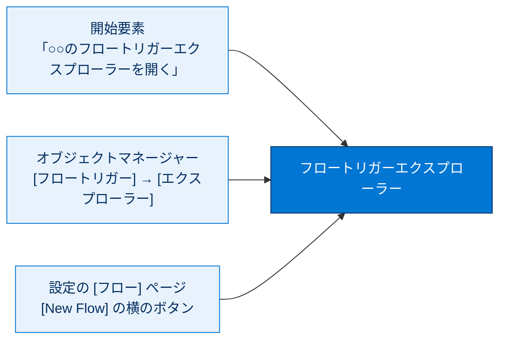
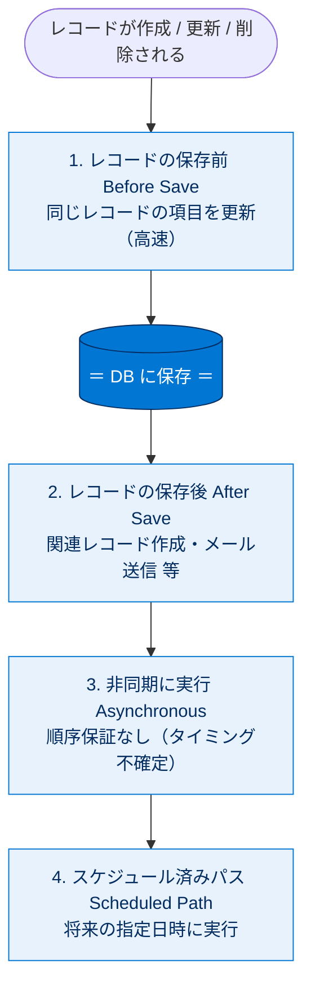
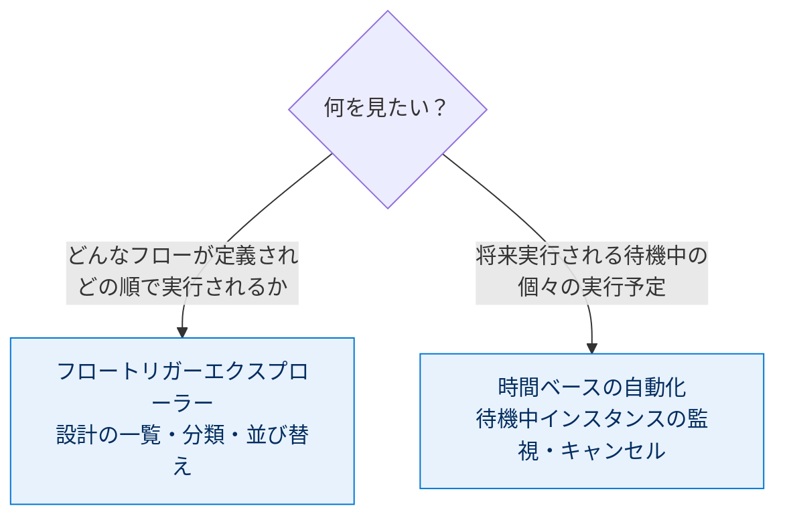
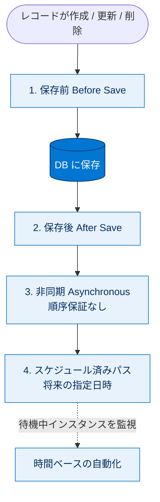

# フロートリガーエクスプローラーの概要

## 学習の目的

この単元を完了すると、次のことができるようになります。

- フロートリガーエクスプローラーを使用して、レコードトリガーフローを管理する。
- 同じ状況（作成・更新・削除）で実行されるフローを表示し、実行順序を変更する。
- 個々のフローの詳細やバージョンを確認する。
- **[Time-Based Automations（時間ベースの自動化）]** ページで、待機中のアクションを監視する。

> [!ポイント] この単元のゴール
>
> **フロートリガーエクスプローラー**は「複数のレコードトリガーフローを横断的に見渡し、実行順序をコントロールするツール」。どこからアクセスするか、フローがどう分類（保存前→保存後→非同期→スケジュール済み）されるか、実行順序の変え方、将来実行されるパスを **[時間ベースの自動化]** で監視する流れを押さえれば試験対策は十分です。

---

## フロートリガーエクスプローラーとは

フロートリガーエクスプローラーは、レコードトリガーフローを管理するツールです。標準の **[フロー]** リストビューよりインタラクティブで視覚性に優れ、オブジェクトを選んで「レコードが作成・更新・削除されたときに実行されるフロー」をすべて表示したり、実行順序を変更したりできます。個々のフローの詳細表示やバージョン管理も可能です。

> [!用語] フロートリガーエクスプローラー（Flow Trigger Explorer）
>
> 1つのオブジェクトに紐づくレコードトリガーフローを「一覧・分類・並び替え」できる管理画面。「商談が更新されたときに動くフローは何があって、どの順で実行されるか」をまとめて確認・編集できます。標準の [フロー] リストビューが「全フローの一覧表」なら、こちらは「特定オブジェクト・特定トリガーに絞った、順序まで見える専用ビュー」です。

> [!用語] レコードトリガーオーケストレーション（Record-Triggered Orchestration）
>
> 複数のフローやステップを段階的に組み合わせ、人の承認待ちなどを挟みながら順番に実行する「指揮」の仕組み。フロートリガーエクスプローラーで表示・並び替えできますが、**このバッジではレコードトリガーフローについて説明します**。

---

## フロートリガーエクスプローラーを開く

この例では、以前に作成した **[Closed Won Opportunities（成立商談）]** フローを活用します。

> [!手順] エクスプローラーをフローから開く
>
> 1. **[Closed Won Opportunities（成立商談）]** フローを開く。
> 2. 開始要素の下にある **[商談のフロートリガーエクスプローラーを開く]** をクリックする。トリガーが別オブジェクトの場合はそのオブジェクトが表示される。

> [!ポイント] エクスプローラーへの3つのアクセス方法
>
> 試験では「どこからアクセスできるか」が問われます。
>
> 1. **レコードトリガーフローの開始要素**から：[○○のフロートリガーエクスプローラーを開く] をクリック。
> 2. **オブジェクトマネージャー**から：オブジェクト → **[フロートリガー]** → **[フロートリガーエクスプローラー]**。
> 3. **[Setup（設定）] の [フロー] ページ**から：**[New Flow（新規フロー）]** ボタンの横の **[Flow Trigger Explorer]** をクリック。

---

## フロートリガーエクスプローラーを試す

カテゴリセクションのフロー行のドロップダウンから **[Flow Details and Versions（フローの詳細とバージョン）]** をクリックすると、詳細パネルが開きます。

> [!例] 画面の見方
>
> **[フロートリガーエクスプローラー]** 画面は、大きく3つのエリア (1)(2)(3) に分かれています。
>
> - **(1) オブジェクト/トリガーマネージャー**：どのオブジェクトの、どの変更（作成・更新・削除）のフローを見るかを切り替える。
> - **(2) 分類されたフロー**：該当フローが実行タイミング別にグループ化されて並ぶ。
> - **(3) 状況と詳細パネル**：選んだフローの詳細・バージョンを表示する。

### オブジェクト/トリガーマネージャー (1)

別オブジェクトは **[商談]** の横の下矢印で、別の種類のレコード変更は **[更新済み]** の横の下矢印で別トリガー（**[作成済み]**、**[更新済み]**、**[削除済み]**）を選択します。状況やプロセス種別で絞り込むには **[検索条件]** をクリックします。「どのオブジェクト × どのタイミング」で絞り込むのがこのマネージャーの役割です。

### 分類されたフロー (2)

選択したオブジェクト・トリガーに対して実行されるすべてのレコードトリガーフローがリストされます。フローは実行タイミングに応じて **保存前 / 保存後 / 非同期 / スケジュール済みパス** に分類され、グループ内では実行順に表示されます。

> [!用語] フローの分類（保存前 / 保存後 / 非同期 / スケジュール済みパス）
>
> - **レコードの保存前（Before Save）**：DB に保存される**直前**。同じレコードの項目を高速に書き換えるのに向く。
> - **レコードの保存後（After Save）**：保存された**直後**。関連レコードの作成・更新やメール送信など。
> - **非同期（Asynchronous）**：保存処理と切り離して**後から別プロセスで**実行。外部システム連携など重い処理向け。
> - **スケジュール済みパス（Scheduled Path）**：「商談完了の5日後」のように**将来の指定タイミング**で実行。

> [!用語] フローの実行順序（Flow Execution Order）
>
> 同じオブジェクト・同じトリガーに複数のフローがある場合、Salesforce は**上から順番に**実行します。エクスプローラーでは、この順番を（同じグループ内に限り）ドラッグ＆ドロップで変更できます。

レコードトリガーフローは、分類グループに従って次の順序で実行されます。

各グループの「内部」での順序は、エクスプローラーで並び替え可能です（ただし「非同期」グループは順序が保証されません）。

> [!注意] 非同期グループは順序が保証されない
>
> **[非同期に実行]** グループは、表示順序どおりに実行される保証がありません。非同期実行という性質上、実行タイミングを確定できないためです。「順番が重要な処理」を非同期グループの並び順に頼ってはいけません。

### 状況と詳細パネル (3)

**[フローの詳細]** には、**[フローを開く]** ボタン・名前と説明・バージョン番号・状況・最終更新者・プロセス種別・トリガーが表示されます。**[バージョン]** には全バージョンが表示され、**[開く]** と **[有効化]/[無効化]** が使えます。「いま有効な版はどれか」「最後に誰がいつ更新したか」を確認したり、旧版を有効化したりできます。

---

## フローの順序を変更する

同じトリガーから複数のフローが実行される場合、特定のフローを先に実行する必要があることがあります。エクスプローラーなら、各フローを開かずに実行順序を変更できます。

> [!手順] フローの実行順序を変更する
>
> 1. 順序を変更するセクションの **[順序を編集]** ボタンをクリックする。
> 2. フロー横の**ドラッグアンドドロップハンドル**を押したまま、目的の順序にドラッグする。
> 3. 順序を変えるフローごとに繰り返す。移動中のフローは強調表示される。
> 4. **[Update（更新）]** をクリックする。

> [!例] なぜ順序が重要なのか
>
> フロー A が「割引率」を計算して書き込み、フロー B がその「割引率」で「最終金額」を計算するとします。このとき **A を B より先に実行しないと**、B は古い（または空の）割引率で計算してしまいます。こうした依存関係があるとき、エクスプローラーで順序を明示します。

### キーボードショートカット

**[Edit Order（順序を編集）]** をクリック後、Tab キーで移動するフローへ移動し、スペースバーで選択、矢印キーで移動、再度スペースバーでドロップします。

| アクション | キーボードショートカット |
| --- | --- |
| フローを選択 | スペースキー |
| フローを移動 | 矢印キー |
| フローをドロップ | スペースキー |
| 順序の変更をキャンセル | Esc |

---

## レコードトリガーフローを監視する

将来実行されるパス（商談完了の5日後に実行されるパスなど）の個々のスケジュールされたインスタンスを確認するには、**[Time-Based Automations（時間ベースの自動化）]** ページを使います。

> [!用語] 時間ベースの自動化（Time-Based Automations）／待機中のアクション（Pending Action）
>
> **時間ベースの自動化**は、「○日後に実行する」のように**将来のタイミングで実行されるよう待機中になっているフローのインスタンス**を一覧・監視できる設定ページ。フロートリガーエクスプローラーが「どんなフローが定義されているか（設計の一覧）」を見るのに対し、こちらは「実際にいま待機している個々の実行予定」を見ます。**待機中のアクション**とは、まだ実行されず将来の実行を待っている処理で、ここで確認・キャンセル（削除）できます。

**[Closed Won Opportunities（成立商談）]** フローを有効にした場合、重要商談の完了から5日未満であれば、その自動化がここにリストされます。

> [!手順] 待機中のアクションを表示する
>
> 1. **[Setup（設定）]** の **[Quick Find（クイック検索）]** ボックスに `Time`（時間）と入力し、**[Time-Based Automations（時間ベースの自動化）]** を選択する。
> 2. **[検索]** をクリックすると、有効なフローのすべての待機中のアクションが表示される。
> 3. 絞り込むには検索条件（検索条件種別・演算子・値）を定義して **[検索]** をクリックする。

待機中のアクションを絞り込む際の検索条件種別は次のとおりです。

| 検索条件種別 | 説明 |
| --- | --- |
| ワークフロールール、フロー、またはプロセス名 | フローの名前を入力する。 |
| オブジェクト | フローをトリガーしたオブジェクト。オブジェクト名を**単数形**で入力する。 |
| 予定日 | 待機中のアクションの実行予定日。 |
| 作成日 | フローをトリガーしたレコードの作成日。 |
| 自動化タイプ | フローをトリガーした自動化のタイプ。 |
| 作成者 | フローをトリガーしたレコードを作成したユーザー。 |
| ユーザー ID | フローをトリガーしたレコードを作成したユーザーの ID。 |
| レコード名 | フローをトリガーしたレコードの名前。 |

> [!注意] 条件値の大文字・小文字
>
> 検索条件の値は**大文字と小文字を区別しません**。「Opportunity」と「opportunity」のどちらでも同じ結果になります。

> [!手順] 待機中のアクションをキャンセルする
>
> 1. キャンセルする待機中のアクションを選択する。
> 2. **[削除]** をクリックする。

---

## 試験対策：押さえておきたい追加ポイント

> [!ポイント] エクスプローラーのアクセス方法を覚える
>
> 入り口は **3つ**：(1) レコードトリガーフローの**開始要素**、(2) **オブジェクトマネージャー**（[フロートリガー] → [フロートリガーエクスプローラー]）、(3) **[Setup] の [フロー] ページ**（[New Flow] の横のボタン）。「A と C」「A と B」といった組み合わせ選択肢で問われやすいので区別して覚えましょう。

> [!ポイント] 「設計の一覧」と「実行の監視」を区別する
>
> - **フロートリガーエクスプローラー** … どんなレコードトリガーフローが定義され、どの順で実行されるかを**管理・並び替え**する。
> - **[時間ベースの自動化]** … 将来実行されるスケジュール済みパスの**待機中インスタンスを監視・キャンセル**する。
>
> 「商談完了の5日後に実行されるパスを表示したい」→ 答えは**時間ベースの自動化**（エクスプローラーではない）。この対比が頻出です。

> [!ポイント] 実行順序と非同期の扱い
>
> - レコードトリガーフローは、まず **保存前 → 保存後 → 非同期 → スケジュール済みパス** という**グループの順序**で実行され、その後で各グループ**内部**の並び順が適用される。エクスプローラーで変更できるのはグループ内部の順序で、グループ間の順序は固定。
> - **非同期グループは実行タイミングが不確定で、表示順どおりに動く保証がない**。「順序が重要な処理を非同期で並べる」のはアンチパターン。

> [!まとめ] この単元の要点
>
> - **フロートリガーエクスプローラー**は、特定オブジェクト×特定トリガーのレコードトリガーフローを一覧・分類・並び替えできる管理ツール。
> - フローは **保存前 → 保存後 → 非同期 → スケジュール済みパス** に分類され、この順に実行される。
> - **[順序を編集] → ドラッグ＆ドロップ → [Update]**（またはキーボードショートカット）でグループ内の実行順を変更できる。
> - 将来実行される待機中のパスは **[時間ベースの自動化]** ページで監視・キャンセルする。
> - 非同期グループは順序が保証されない。

---

## リソース

- Salesforce ヘルプ：レコードトリガーフローの管理
- ブログ投稿：Flow Trigger Explorer（フロートリガーエクスプローラー）
- 動画：Use Flow Trigger Explorer to Easily View All of Your Record-Triggered Flows

---

## テスト

この単元を完了するには、テストのすべての質問に正しく解答する必要があります。（+100 ポイント）

### 質問1

将来実行されるようにスケジュールされているフロー（商談完了の5日後に実行されるパスを持つフローなど）を表示するために使用するツールは何ですか?

- **A.** フロートリガーエクスプローラー
- **B.** オーケストレーション実行リスト
- **C.** [Time-Based Automations（時間ベースの自動化）] ページ
- **D.** Flow Builder

### 質問2

フロートリガーエクスプローラーにはどこからアクセスできますか?

- **A.** オブジェクトマネージャー
- **B.** 自動化アプリケーション
- **C.** レコードトリガーフローの開始要素
- **D.** A と B
- **E.** A と C

---

## 🎓 この単元のまとめ

この単元では、特定オブジェクト×特定トリガーのレコードトリガーフローを一覧・分類・並び替えできる**フロートリガーエクスプローラー**と、将来実行される待機中のパスを監視する**[時間ベースの自動化]**ページの役割を学びました。

次の表は、混同しやすい2つの管理画面の違いと、レコードトリガーフローの実行順序の要点をまとめたものです。

| 観点 | フロートリガーエクスプローラー | [時間ベースの自動化] |
| --- | --- | --- |
| 見るもの | どんなフローが定義され、どの順で動くか（設計の一覧） | 将来実行される待機中の個々の実行予定 |
| 主な操作 | 分類表示・グループ内の実行順を並び替え | 待機中アクションの監視・キャンセル（削除） |
| 典型的な問い | 「商談更新で動くフローと順序を見たい」 | 「商談完了の5日後に実行されるパスを見たい」 |

> [!まとめ] この単元の要点
>
> - **フロートリガーエクスプローラー**は、特定オブジェクト×特定トリガーのレコードトリガーフローを一覧・分類・並び替えできる管理ツール。
> - アクセス入口は **3つ**：開始要素／オブジェクトマネージャー／[設定] の [フロー] ページ。
> - フローは **保存前 → 保存後 → 非同期 → スケジュール済みパス** に分類され、この順に実行される。
> - 並び替えできるのは**グループ内部**の順序のみ。**グループ間の順序は固定**で、**非同期グループは順序が保証されない**。
> - 将来実行される待機中のパスは **[時間ベースの自動化]** ページで監視・キャンセルする。

> [!豆知識] [時間ベースの自動化] の検索はオブジェクト名を「単数形」で
>
> [時間ベースの自動化] ページで待機中アクションをオブジェクトで絞り込むとき、検索条件には API のオブジェクト名を**単数形**（`Opportunity`、`Account` など複数形の `Opportunities` ではない）で入力する必要があります。一方で条件**値**の大文字・小文字は区別されないため、`opportunity` でも `Opportunity` でも同じ結果になります。「単数形だが大小は問わない」という細かい挙動は、実務でフローが待機しているか確認するときにつまずきやすいポイントです。
