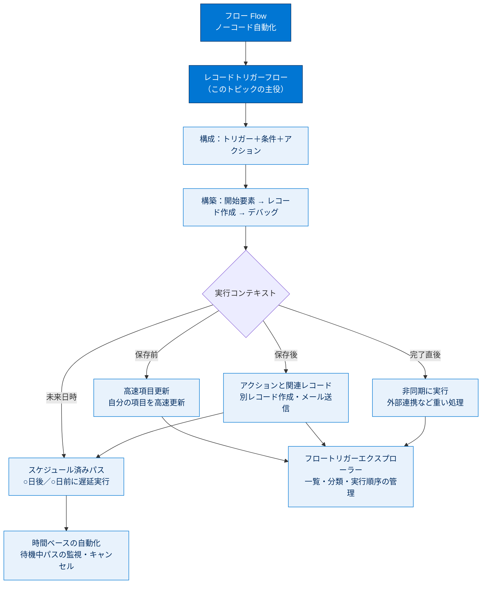

# レコードトリガーフロー 総まとめ

このトピックでは、ノーコード自動化ツール「**フロー**」の中で最も使用頻度が高い**レコードトリガーフロー**を、概念から実装・運用管理まで一気通貫で学びました。トリガーフローの「トリガー＋条件＋アクション」という構造を理解し、「重要商談が成立したらドラフト契約を自動作成する」フローを開始要素の設定からデバッグまで構築、さらに**スケジュール済みパス**で遅延実行を加え、最後に**フロートリガーエクスプローラー**で複数フローの実行順序を管理する、という流れを通しました。本ページはこのトピックを1枚で思い出すための総まとめです。

---

## 🗺️ トピック全体像

---

## 📚 ユニット横断 早見表

| ユニット | 学んだこと | キーワード | 一言要点 |
| --- | --- | --- | --- |
| 01 トリガーフロー入門 | フローの3種類とトリガーフローの構造・実行オプション | 画面/自動起動/トリガーフロー、トリガー＋条件＋アクション、4つの実行オプション | 「いつ・何をきっかけに・何を動かすか」を分類して捉える |
| 02 レコードトリガーフローを構築する | 開始要素の設定からレコード作成・デバッグまでの構築手順 | 開始要素、エントリ条件、アクションと関連レコード、Triggering 変数、デバッグ | トリガー→条件→アクションに分解して一から作る |
| 03 スケジュール済み ToDo を追加する | 変更の○日後に遅延実行するスケジュール済みパス | スケジュール済みパス、時間取得元・オフセット数・オフセットオプション、デフォルトのワークフローユーザー | 「いつを基準に・どれだけずらすか」で遅延を表す |
| 04 フロートリガーエクスプローラーの概要 | 複数フローの一覧・分類・実行順序管理と待機中パスの監視 | フロートリガーエクスプローラー、実行順序（保存前→保存後→非同期→スケジュール）、時間ベースの自動化 | 「設計の一覧」と「実行の監視」を区別する |

---

## 🎯 試験頻出ポイント

> [!ポイント] このトピックで狙われやすい論点
>
> - **フロー3種類の使い分け**：人の入力が必要→画面フロー／他から呼ばれる部品→自動起動フロー／きっかけに反応→トリガーフロー。
> - **トリガー種別 vs 実行オプションの混同**：トリガー種別は「スケジュール／プラットフォームイベント／レコード」。実行オプションは「高速項目更新／関連レコードとアクション／非同期に実行／スケジュール済みパス」。**選択肢に両方が混在**するので何を問われているか見極める。
> - **保存前 vs 保存後**：自分自身の項目だけ更新・速度重視→**保存前（高速項目更新）**／別レコード作成・更新やメール・Chatter→**保存後（アクションと関連レコード）**。
> - **重複実行の防止**：**[条件の要件に一致するように更新したときのみ]** を選ぶと「満たさない→満たす」に変化した瞬間だけ実行され、重複作成を防げる。
> - **スケジュール済みパスの前提**：**[アクションと関連レコード]** トリガーであること、**[デフォルトのワークフローユーザー]** が設定済みであること。遅延は **時間取得元＋オフセット数＋オフセットオプション** の3点セット。
> - **実行順序**：**保存前 → 保存後 → 非同期 → スケジュール済みパス** のグループ順は固定。並び替えできるのは**グループ内部**のみ。**非同期グループは順序が保証されない**。
> - **2つの管理画面の対比**：定義の一覧・並び替え→**フロートリガーエクスプローラー**／将来実行される待機中パスの監視→**[時間ベースの自動化]**。
> - **アクセス入口（3つ）**：エクスプローラーは(1)開始要素／(2)オブジェクトマネージャー／(3)[設定] の [フロー] ページ から開ける。
> - **数値**：レコードトリガーフローは旧プロセスビルダーの**最大10倍高速**。
> - **活動の関連付け**：人以外＝**Related To ID（WhatId）**／人＝**Name ID（WhoId）**。

---

## 📖 用語早見表

| 用語 | ひとことの意味 |
| --- | --- |
| フロー（Flow） | if/then のビジネスプロセスをノーコードで自動化する仕組み |
| Flow Builder | フローを図として描きながら作成・編集・デバッグする設計ツール |
| 画面フロー | UI を表示し人の操作を前提に進むフロー |
| 自動起動フロー | UI なしで他フロー/Apex/API から呼ばれて動くフロー |
| トリガーフロー | 時間・データ変更・イベントをきっかけに自動起動するフロー |
| レコードトリガーフロー | レコードの作成・更新・削除をきっかけに起動する最頻出のフロー |
| エントリ条件 | フローを実行してよいかを判定する入口の条件 |
| 高速項目更新 | 保存前にトリガー元自身の項目を高速・低コストで更新するオプション |
| アクションと関連レコード | 保存後に別レコード作成・更新やメール送信を行うオプション |
| 非同期に実行 | 保存処理と切り離し後から別プロセスで重い処理を実行するオプション |
| スケジュール済みパス | 変更の○日後／○日前など将来の日時に遅延実行するブランチ |
| 即時パス | トリガー条件を満たした瞬間に実行される既定のブランチ |
| 時間取得元/オフセット数/オフセットオプション | スケジュール済みパスの「いつ実行するか」を決める3点セット |
| デフォルトのワークフローユーザー | 時間ベースの自動化を実際に実行する主体ユーザー |
| Triggering 変数 | フローを起動したレコードのデータを自動格納する変数 |
| トランザクション | 一連の処理を1つの単位として扱い失敗時はロールバックする仕組み |
| ガバナ制限 | マルチテナント環境で1処理が使えるリソースの上限 |
| フロートリガーエクスプローラー | 特定オブジェクト×トリガーのフローを一覧・分類・並び替えする管理画面 |
| 時間ベースの自動化 | 将来実行される待機中のパスを監視・キャンセルする設定ページ |
| Related To ID（WhatId）/Name ID（WhoId） | 活動を人以外/人のレコードに紐づける項目 |

---

> [!豆知識] レコードトリガーフローは Apex トリガーの「ノーコード版」
>
> レコードトリガーフローの「保存前→保存後」という実行順序は、開発者が書く **Apex トリガー**の `before` / `after` コンテキストとまったく同じ思想です。保存前は同一レコードを追加 DML なしで書き換えられ、保存後は ID が確定済みで関連レコードを操作できる――この対応関係を知っておくと、Apex トリガーの学習にもそのまま橋渡しできます。

> [!豆知識] ワークフロールール・プロセスビルダーは「卒業済み」
>
> かつての自動化ツールであるワークフロールールとプロセスビルダーは段階的に廃止され、新規作成はできなくなりました。Salesforce は自動化を **Flow に集約**する方針を取っており、試験で「新しく自動化を作るなら何を使うか」と問われたら答えは常に **Flow（フロー）** です。「旧ツールの機能はすべてフローに統合された」と覚えておきましょう。

> [!豆知識] 非同期パスが「順序保証なし」な理由
>
> 非同期グループだけが実行順序を保証しないのは、非同期処理が初期トリガートランザクションとは別のタイミングでサーバー側の都合に合わせて実行されるためです。だからこそ外部システム連携など「多少遅れてもよい重い処理」に向いており、逆に「Aの後に必ずBを動かす」といった順序依存の処理を非同期グループの並び順に頼るのはアンチパターンになります。

---

## ✅ 理解度セルフチェック

> [!まとめ] 答えながら総点検（答えは各項目の末尾）
>
> 1. 新しく自動化を作るとき、まず選ぶべきツールは何か？ → **Flow Builder（フロー）**
> 2. トリガーフローの3つのトリガー種別は？ → **スケジュール／プラットフォームイベント／レコード**
> 3. トリガー元レコード「自身」の項目だけを高速に更新したい。どの実行オプション？ → **高速項目更新（保存前）**
> 4. 25,000超の成立商談を編集するたびに契約が重複作成された。どの設定で防ぐ？ → **[条件の要件に一致するように更新したときのみ]** を選ぶ
> 5. 穴埋め：スケジュール済みパスの遅延は「＿＿＿＿ ＋ オフセット数 ＋ オフセットオプション」で決まる。 → **時間取得元**
> 6. 「商談完了の5日後に実行される待機中パスを表示したい」。エクスプローラーと時間ベースの自動化、どちら？ → **[時間ベースの自動化]**（エクスプローラーではない）
> 7. Yes/No：フロートリガーエクスプローラーでは、保存前と保存後の「グループ間」の順序を入れ替えられる。 → **No**（並び替えできるのはグループ内部のみ。グループ間順序は固定）
