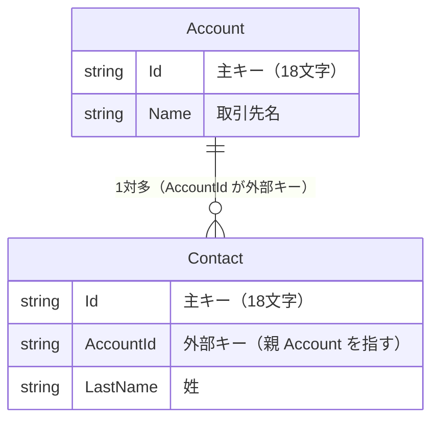
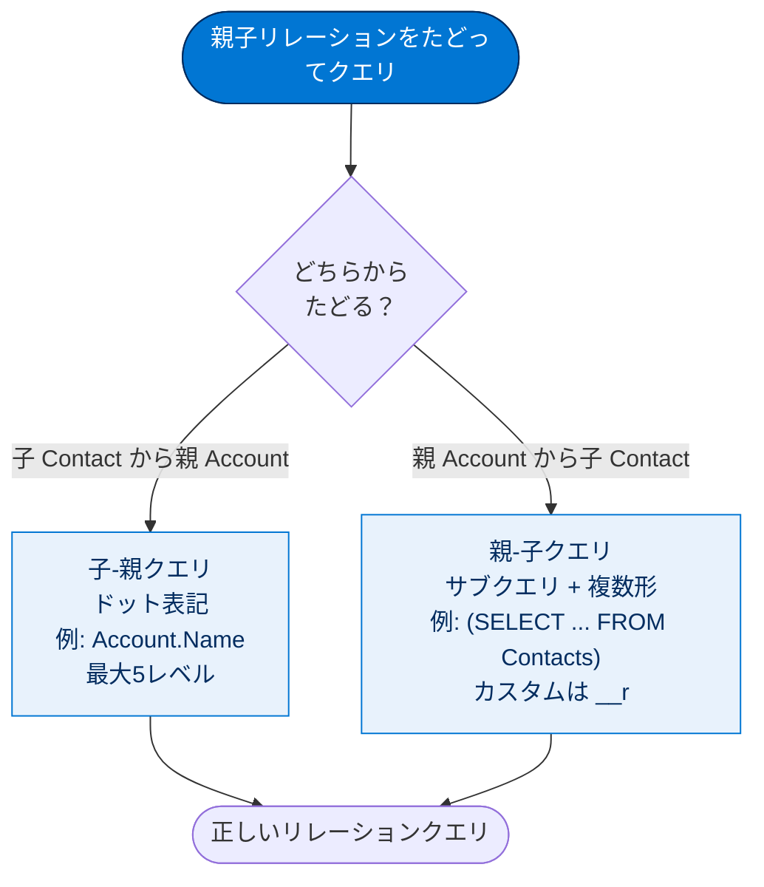
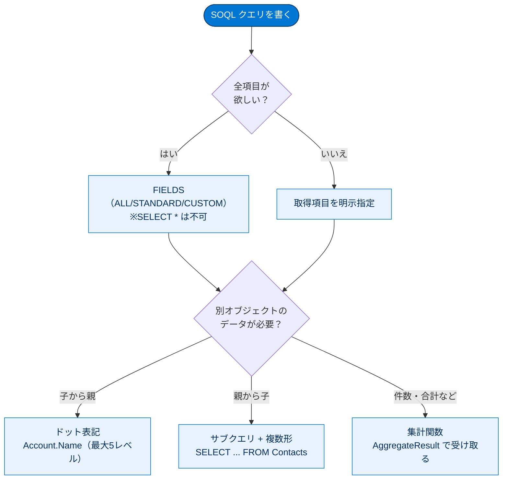

# SQL から SOQL への移行

## 学習の目的

この単元を完了すると、次のことができるようになります。

- Salesforce オブジェクトのメリットを理解する。
- SQL と SOQL の類似点と相違点を明らかにする。
- ワークベンチを使用して簡単な SOQL ステートメントを作成する。
- より複雑なリレーションクエリを作成する。
- 集計クエリを作成する。

> [!ポイント] この単元のゴール
>
> SQL に慣れた開発者が **SOQL（Salesforce Object Query Language）** へ移行するための単元。試験対策の4点。
> - SOQL は **SELECT 専用**（INSERT/UPDATE/DELETE は DML が担当）。
> - **`SELECT *` は使えない**。項目名を明示するか `FIELDS()` を使う。
> - **JOIN はない**。代わりに「リレーションクエリ（子-親 / 親-子）」を書く。
> - 集計関数は多くが **`AggregateResult` 型** で結果を返す。

---

## Salesforce オブジェクトを理解する

Salesforce のデータベースは**オブジェクト**でデータを格納します。オブジェクトはテーブルの機能に加え、UI・セキュリティ・入力規則などを標準装備し、**項目**（列）で構成され、データは**レコード**（行）に格納されます。

> [!用語] オブジェクト／項目／レコード
>
> **オブジェクト**はデータの入れ物で、リレーショナルDBの**テーブル**に相当（UI・セキュリティ・入力規則・履歴管理が標準装備）。**項目**は「列」、**レコード**は「行」。

| SQL（リレーショナルDB）の用語 | Salesforce の用語 | 補足 |
| --- | --- | --- |
| テーブル（Table） | オブジェクト（Object） | UI・セキュリティ等が標準装備 |
| 列（Column） | 項目（Field） | 型・入力規則などを持つ |
| 行（Row） | レコード（Record） | 1件のデータ |
| 主キー（Primary Key） | `Id` 項目 | 18文字の一意な ID が自動付与 |
| 外部キー（Foreign Key） | リレーション項目 | 親レコードへの参照を保持 |

オブジェクトには2種類あります。

- **標準オブジェクト** — Salesforce 組み込み。取引先・取引先責任者・商談・リードなど。
- **カスタムオブジェクト** — アプリ固有の情報を格納する自作オブジェクト（例: Merchandise、Orders、Invoices）。

> [!用語] 標準オブジェクト／カスタムオブジェクト
>
> **標準オブジェクト**は Salesforce 提供（Account、Contact、Opportunity など）。**カスタムオブジェクト**は自作で、API 名の末尾に `__c` が付きます。

オブジェクト同士は**リレーション項目**（主キー・外部キー相当）で関連付けます。標準機能だけで一覧・詳細・入力フォーム・API・検索が自動生成され、ORM や CRUD 用 UI の実装は不要です。属性はすべて**メタデータ**で記述されます。

> [!例] 「テーブルを作らなくていい」とは
>
> .NET + SQL Server では新データのたびに `CREATE TABLE`・主キー・外部キー・インデックス設計、CRUD の SQL や画面実装が必要です。Salesforce ではオブジェクトを1つ定義するだけで一覧・詳細・入力フォーム・API・検索が自動生成され、業務固有のロジックに集中できます。

---

## 似ているが同じではない

SOQL は SQL の `SELECT` 文に似ていますが、Salesforce 専用に設計され、できることが意図的に絞られています。

> [!用語] SOQL（Salesforce Object Query Language）
>
> 「ソークル」と読む。Salesforce オブジェクトにデータを**照会（検索・取得）**する言語。**`SELECT` クエリ専用**で、`INSERT`/`UPDATE`/`DELETE` に相当するものはなく、追加・更新・削除は **DML**（別単元）が担当します。

Salesforce データは**マルチテナント環境**にあり、ワイルドカード照会は他テナントに影響するため制限されます。アクセス権のある項目だけを取得するには `FIELDS()` を使います。

```sql
SELECT FIELDS(ALL) FROM Account
```

> [!用語] マルチテナント（Multitenant）
>
> 1つの基盤を多数の顧客（テナント）が共有するアーキテクチャ（集合住宅のイメージ）。誰かの重いクエリが全員に影響するため、Salesforce はワイルドカード照会を制限します。

> [!注意] `SELECT *` は SOQL では使えない
>
> 取得項目を**1つずつ明示指定**するのが原則。全項目が欲しい場合は `FIELDS(ALL)` / `FIELDS(STANDARD)` / `FIELDS(CUSTOM)` を使いますが、`FIELDS(ALL)` には**取得件数の上限（LIMIT 必須）**などの制約があります。

---

## 開発者コンソールでクエリを作成する

SOQL クエリの記述方法の1つが**開発者コンソール（Developer Console）**です。VS Code 拡張機能（Salesforce DX）でローカル開発もできますが、ここでは開発者コンソールに絞ります。

> [!用語] 開発者コンソール（Developer Console）
>
> ブラウザ上で動く Salesforce 標準の開発ツール。SOQL 実行（Query Editor）、Apex の匿名実行、デバッグログ確認ができます。インストール不要。

無料の Developer Edition（DE）組織にサインアップし、次の手順を実行します。

> [!手順] 開発者コンソールで最初のクエリを実行する
>
> 1. **[設定（Setup）]** → **[開発者コンソール（Developer Console）]** を開く。
> 2. 下部ペインの **[クエリエディター（Query Editor）]** タブで次を入力し **[実行（Execute）]** する。
>    ```sql
>    SELECT Id, Name, Type FROM Account
>    ```
> 3. 結果には3列（Id, Name, Type）が含まれる。

クエリはテーブルではなくオブジェクトから項目を取得します。このオブジェクトは **sObject** と呼ばれます。

> [!用語] sObject
>
> 「Salesforce Object」の略。Apex や SOQL から扱うオブジェクトの呼び名。`Account`・`Contact` のような標準 sObject と、`Merchandise__c` のようなカスタム sObject があります。

なお SOQL の日時項目には操作を容易にする**日付関数**があり、通貨項目（特に複数通貨組織）の処理もやや異なります。

---

## 結果の絞り込み

SOQL で必須の句は **`SELECT` と `FROM` の2つのみ**で、`WHERE` は省略可能ですが、返すデータを減らすためほぼ常に付けるのがよい習慣です。

> [!ポイント] SOQL の必須句
>
> 必須は **`SELECT`（取得項目）** と **`FROM`（対象オブジェクト）** だけ。`WHERE`・`ORDER BY`・`LIMIT` は任意ですが、大量データを返さないよう `WHERE` と `LIMIT` を付けるのがベストプラクティスです。

> [!手順] WHERE 句で結果を絞り込む
>
> **[クエリエディター]** で次を **[実行]**（組織のすべての取引先責任者を返す）。
> ```sql
> SELECT AccountId, Email, Id, LastName FROM Contact
> ```
> 続けて `WHERE` 句を追加して再度 **[実行]** する。
> ```sql
> SELECT AccountId, Email, Id, LastName FROM Contact WHERE Email LIKE '%.net%'
> ```

実際の組織では取引先責任者が数千件になることもあるため、常に `WHERE` で絞り込みます（Apex 内では特に重要）。`contains` ではなく `LIKE` を使い、テキスト値は一重引用符で囲み、`%` でワイルドカードを示します。

> [!例] SQL と SOQL の演算子の対応
>
> - 文字列部分一致は SQL・SOQL とも `LIKE '%abc%'`（`%` は0文字以上、`_` は任意1文字）。
> - `=`、`!=`、`<`、`>`、`IN`、`AND`、`OR` はほぼ同様。
> - テキスト値はシングルクォート `'...'` で囲む（ダブルクォート不可）。

> [!注意] 先頭ワイルドカードはパフォーマンスを落とす
>
> `LIKE '%.net%'` のように**先頭に `%`** を付ける検索はインデックスが効かず遅くなります。可能な限り避けてください（詳細は後の単元）。

`ORDER BY` で `LastName` 順に並べ替える例：

```sql
SELECT AccountId, Email, Id, LastName
FROM Contact
WHERE Email LIKE '%.net%'
ORDER BY LastName ASC NULLS FIRST
```

> [!用語] `NULLS FIRST` / `NULLS LAST`
>
> `ORDER BY` で値が空（null）のレコードを先頭（`NULLS FIRST`）か末尾（`NULLS LAST`）にまとめるオプション。`ASC`（昇順）/ `DESC`（降順）と組み合わせます。

結果の `Id` は主キー（そのレコード自身）、`AccountId` は外部キー（関連する取引先を指す）に相当し、いずれも**一意の18文字の文字列**です。

> [!ポイント] Id は18文字の一意な識別子
>
> すべてのレコードは作成時に **18文字のレコード ID** を自動付与され、主キーの役割を果たします。`◯◯Id`（例: `AccountId`）は外部キーで、別オブジェクトのレコードを指します。

> [!ポイント] SOQL に JOIN はない（頻出）
>
> SOQL に `JOIN` キーワードは**存在しません**。結合の代わりに「リレーションクエリ」を書きます。試験で「SOQL がサポートする結合の種類は?」と問われたら、答えは「JOIN キーワードはサポートされない」です。

---

## 別の種類の結合

Salesforce では `JOIN` の代わりに**リレーションクエリ**を記述し、**親子リレーション**で2つのオブジェクトを結合します。外部キーで関連付ける点は SQL と同じですが、行ではなくオブジェクトを使う構文です。

> [!用語] リレーションクエリ（Relationship Query）
>
> 親子関係をたどってデータを取得する SOQL の書き方（SQL の `JOIN` の代わり）。**子-親**（子から親をたどる）と**親-子**（親から子をたどる）の2方向があります。

取引先（Account）が**親**、取引先責任者（Contact）が**子**です。



---

## 子-親クエリの記述

**子-親クエリ**は**ドット表記**（`.` でリレーション名と項目名を区切る）で親のデータにアクセスします。

> [!手順] 子-親クエリを実行する
>
> **[クエリエディター]** で次を入力し **[実行]** する。
> ```sql
> SELECT FirstName, LastName, Account.Name FROM Contact
> ```

`Account.Name` のように「**リレーション名.項目名**」と書き、子（Contact）から親（Account）の項目をたどります。同じ結果を得る SQL は**右外部結合**が必要です。

```sql
SELECT c.FirstName, c.LastName, a.Name
FROM Account a
RIGHT JOIN Contact c ON (c.AccountId = a.Id)
```

SOQL は結合条件 `ON ...` が不要（自動で解決）で記述量が少ない点が SQL との違いです。

> [!ポイント] ドット表記は5レベルまでたどれる
>
> ドット表記では**最大5レベル**たどれます（例: `Contact.Account.Owner.Manager.Name`）。

---

## 親-子クエリの記述

**親-子クエリ**は**ネストされた選択クエリ（サブクエリ）**の中でリレーション名を使います。

> [!手順] 親-子クエリを実行する
>
> **[クエリエディター]** で次を入力し **[実行]** する。結果は2列で、`Contacts` 列に各取引先の取引先責任者が JSON 形式で表示される。
> ```sql
> SELECT Name, (SELECT FirstName, LastName FROM Contacts) FROM Account
> ```

リレーション名は `Contact` ではなく**複数形 `Contacts`** を使う点に注意します。

> [!ポイント] 親-子は「複数形」、カスタムは `__r`（頻出）
>
> - 標準オブジェクトの親-子リレーション名は**複数形**（`Contact` → `Contacts`）。
> - カスタムオブジェクトは複数形にし、**末尾に `__r`** を付けます（例: `My_Object__c` → `My_Objects__r`）。
>
> | オブジェクト種別 | 子-親（ドット表記） | 親-子（サブクエリ内のリレーション名） |
> | --- | --- | --- |
> | 標準 | `Account.Name` | `(SELECT ... FROM Contacts)` |
> | カスタム | `My_Object__r.Name` | `(SELECT ... FROM My_Objects__r)` |

同等の SQL は**左外部結合**になります（出力は JSON 形式ではない）。

```sql
SELECT a.Name, c.FirstName, c.LastName
FROM Account a
LEFT JOIN Contact c ON (a.Id = c.AccountId)
```

SOQL に `AS` キーワードはなく、項目名の別名指定は**集計クエリでのみ**使えます。

> [!注意] 子-親と親-子の向きを取り違えない
>
> - **子-親**：子（Contact）から親（Account）を見る → **ドット表記**（`Account.Name`）。
> - **親-子**：親（Account）から子（Contacts）を見る → **サブクエリ + 複数形リレーション名**（`(SELECT ... FROM Contacts)`）。
>
> 試験では正しいクエリを選ばせる問題が頻出。`Account['Name']` や `Contact JOIN Account` のような**SQL 風の誤り**に注意しましょう。

リレーションクエリの2方向と、それぞれの書き方を図で整理します。



---

## 集計について

SOQL の**集計機能**は SQL とほぼ同じ感覚で使えますが、ほとんどの関数で結果が **`AggregateResult` 型**で返ります。

> [!用語] 集計関数／`AggregateResult`
>
> **集計関数**は複数レコードをまとめて1つの値を計算する関数（合計・平均・件数など）。戻り値が **`AggregateResult` 型**になる点が SQL と異なります。`AggregateResult` は集計結果を入れる特別な sObject 型で、`ar.get('項目名')` / `ar.get('別名')` で値を取り出します（戻り値は `Object` 型なので必要に応じてキャスト。例: `(Integer)ar.get('total')`）。

| 関数 | 説明 |
| --- | --- |
| `AVG()` | 数値項目の平均値を返す。 |
| `COUNT()`、`COUNT(fieldName)`、`COUNT_DISTINCT()` | クエリ条件に一致する行数を返す。 |
| `MIN()` | 項目の最小値を返す。 |
| `MAX()` | 項目の最大値を返す。 |
| `SUM()` | 数値項目の合計を返す。 |

レコード件数の取得は、SQL の `SELECT COUNT(*) FROM Account` に対し SOQL は `SELECT COUNT() FROM Account` です。

> [!ポイント] COUNT() と COUNT(fieldName) の違い（頻出）
>
> | 関数 | 戻り値 | 似ている SQL |
> | --- | --- | --- |
> | `COUNT()` | 整数（Integer） | `COUNT(*)` |
> | `COUNT(fieldName)` | `AggregateResult` のリスト（null 以外の件数） | `COUNT(column)` |

> [!手順] COUNT の挙動の違いを確認する
>
> **[クエリエディター]** で `SELECT COUNT() FROM Account` を **[実行]**（合計行数と数字が表示）。次に `SELECT COUNT(Id) FROM Account` に変更して **[実行]**（1行のみ返り、レコード合計数の列が表示）。

集計データの処理には Apex を少し使います。

> [!手順] GROUP BY と AggregateResult を Apex で処理する
>
> 1. **[デバッグ（Debug）]** → **[実行匿名ウィンドウを開く（Open Execute Anonymous Window）]** を選択する。
> 2. 既存コードを削除し、次を挿入する。
>    ```apex
>    List<AggregateResult> results = [
>        SELECT Industry, COUNT(Id) total
>        FROM Account
>        GROUP BY Industry
>    ];
>    for (AggregateResult ar : results) {
>        System.debug('Industry: ' + ar.get('Industry'));
>        System.debug('Total Accounts: ' + ar.get('total'));
>    }
>    ```
> 3. **[Open Log（ログを開く）]** を確認し、**[実行（Execute）]** をクリックする。
> 4. **[Debug Only（デバッグのみ）]** を選択し、デバッグ文のみ表示する。

`total` という別名に注目。**SOQL で項目に別名を付けられるのは `GROUP BY` を伴う集計クエリのみ**です。

> [!例] このコードが出力するもの
>
> `GROUP BY Industry` で取引先を**業種ごと**にグループ化し、各件数を `COUNT(Id)` で数えます。出力例：
> ```text
> Industry: Banking      Total Accounts: 12
> Industry: Technology   Total Accounts: 8
> Industry: null         Total Accounts: 3
> ```

---

## もうひとこと...

SOQL には `GROUP BY ROLLUP`、`GROUP BY CUBE`、`GROUPING` などのグループ化句もあります（`GROUP BY CUBE` はグループ化項目の全組み合わせの小計を追加）。また `HAVING` 句で**集計後**の結果を絞り込めます（`WHERE` は集計**前**、`HAVING` は `GROUP BY` 集計**後**の絞り込み）。

---

## 試験対策：押さえておきたい追加ポイント

> [!まとめ] SQL と SOQL の主な違い（総まとめ）
>
> | 観点 | SQL | SOQL |
> | --- | --- | --- |
> | できる操作 | SELECT/INSERT/UPDATE/DELETE | **SELECT のみ**（更新系は DML） |
> | 全項目取得 | `SELECT *` | **不可**（`FIELDS()` か項目明示） |
> | 結合 | `JOIN` | **JOIN なし**（リレーションクエリ） |
> | 子→親 | JOIN + ON | **ドット表記**（`Account.Name`、最大5レベル） |
> | 親→子 | JOIN | **サブクエリ + 複数形/`__r`** |
> | 集計の戻り値 | スカラー値 / 行 | 多くが **`AggregateResult` 型** |
> | エイリアス | `AS` で自由に | `AS` なし。**集計クエリのみ**項目別名可 |
> | 対象 | テーブル・行 | オブジェクト・レコード（sObject） |

---

## リソース

- SOQL および SOSL リファレンス：SOQL SELECT の構文
- SOQL および SOSL リファレンス：Count および Count(fieldName)
- Apex 開発者ガイド：SOQL クエリと SOSL クエリ
- SOQL および SOSL リファレンス：GROUP BY

---

## テスト

この単元を完了するには、テストのすべての質問に正しく解答する必要があります。（+100 ポイント）

**1. SQL と SOQL の主な違いは?**

- A. SOQL は、SELECT ステートメントを使用してクエリを実行するためだけに使用する。
- B. SOQL はオブジェクトベースであり、SQL はレコードベースである。
- C. 「SELECT *」は SOQL でサポートされない。
- D. INSERT、UPDATE、DELETE の各ステートメントは、SOQL でサポートされない。
- E. 上記のすべて

**2. SOQL では、どの種類の結合がサポートされますか?**

- A. SOQL では、JOIN キーワードを使用した外部結合のみがサポートされる。
- B. SOQL では、JOIN キーワードを使用した内部結合のみがサポートされる。
- C. SOQL では、JOIN キーワードを使用した内部結合と外部結合が両方ともサポートされる。
- D. SOQL では JOIN キーワードがサポートされない。

**3. 取引先責任者の名、姓、取引先名を返す子-親クエリはどれですか?**

- A. `SELECT FirstName, LastName, Account['Name'] FROM Contact`
- B. `SELECT FirstName, LastName, (SELECT Name FROM Account) FROM Contact`
- C. `SELECT FirstName, LastName, Account.Name FROM Contact JOIN Account`
- D. `SELECT FirstName, LastName, Account.Name FROM Contact`

**4. 取引先の名前、およびすべての関連取引先責任者の名と姓を返す親-子クエリはどれですか?**

- A. `SELECT Name, (SELECT FirstName, LastName FROM Contacts) FROM Account`
- B. `SELECT Name, (SELECT FirstName, LastName FROM Contact) FROM Account`
- C. `SELECT Name, FirstName, LastName FROM Account JOIN Contacts`
- D. `SELECT Name, Contact.FirstName, Contact.LastName FROM Account`

**5. 多くの SOQL 集計関数は、一般的に何を返しますか?**

- A. ブール型の結果種別
- B. AggregateResult 型
- C. プリミティブデータ型のみ
- D. SOQL レコード

> [!注意] 日本語環境で受講する場合
>
> このテストは知識問題で、クエリ構文（ドット表記、親-子サブクエリの複数形リレーション名など）は**英語の API 名**で問われます。日本語 UI で学習している場合も、項目名・オブジェクト名の英語表記を併せて覚えましょう。

---

## 🎓 この単元のまとめ

この単元では、SQL に慣れた開発者が **SOQL（SELECT 専用の照会言語）** へ移行するための要点を学びました。`SELECT *` や `JOIN` が使えない代わりに、リレーションクエリで親子をたどり、集計は `AggregateResult` で受け取ります。

次の図は、SOQL クエリを組み立てるときの判断の流れを俯瞰したものです。



> [!まとめ] この単元の要点
>
> - SOQL は **`SELECT` 専用**で、追加・更新・削除は DML が担当する（`SELECT *` は不可）。
> - `JOIN` はなく、**リレーションクエリ**で結合する。子→親は**ドット表記**（最大5レベル）、親→子は**サブクエリ + 複数形**（カスタムは `__r`）。
> - 必須句は **`SELECT` と `FROM`** のみ。実務では `WHERE`・`LIMIT` で件数を絞るのが鉄則。
> - 集計関数は多くが **`AggregateResult` 型**を返し、**項目別名（エイリアス）は `GROUP BY` を伴う集計クエリでのみ**使える。
> - すべてのレコードは **18文字の一意な ID**（主キー相当）を持つ。

> [!豆知識] 「ソークル」と「シークェル」
>
> SOQL は「ソークル（so-cull）」、SQL は「シークェル（sequel）」と読むのが定番です。SQL が「Structured Query Language」の頭字語なのに対し、SOQL は「Salesforce Object Query Language」。名前が似ていて読みも近いので、社内会話では文脈で取り違えないよう注意したいところです。
