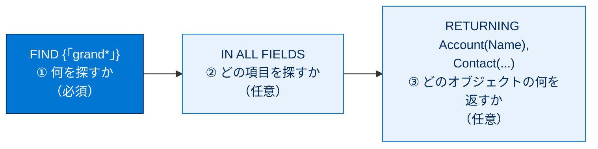
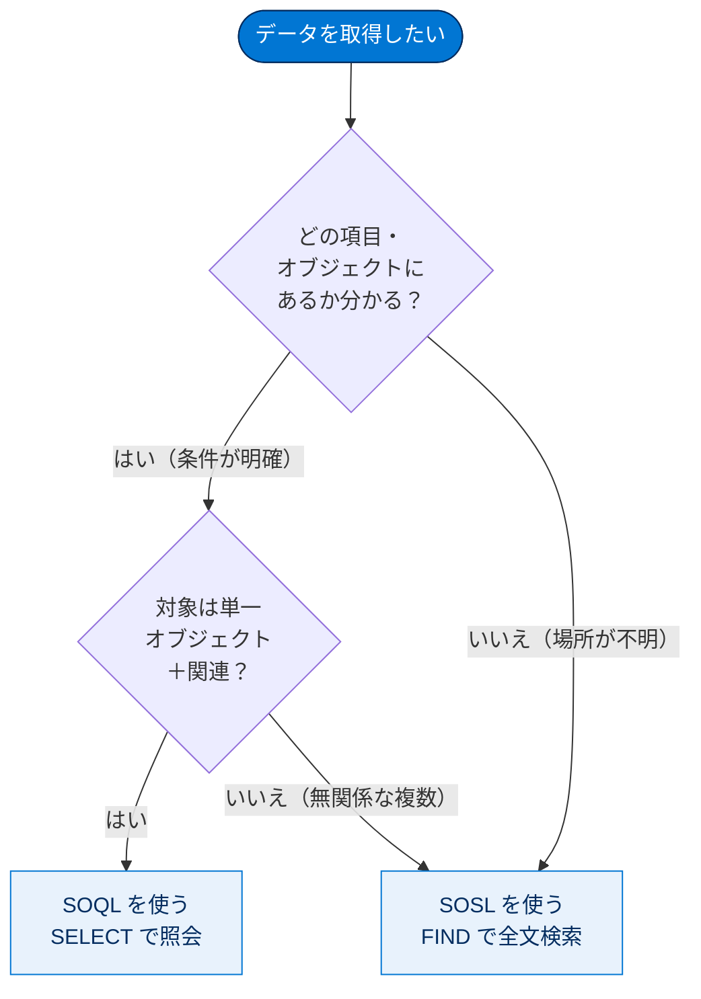
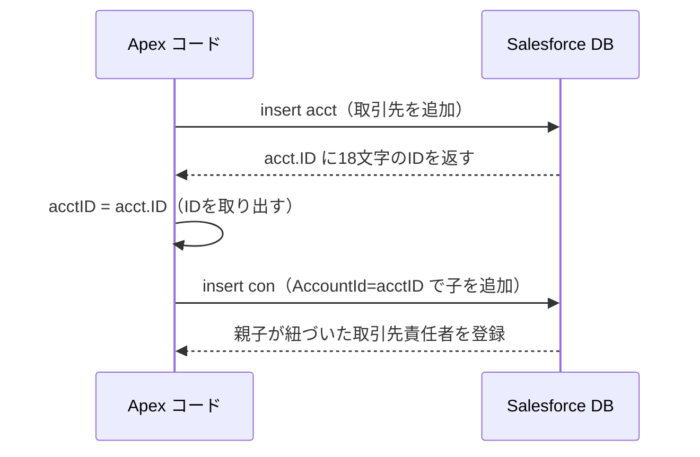

# SOSL クエリの作成

## 学習の目的

この単元を完了すると、次のことができるようになります。

- SOSL が他の全文検索とどのように異なるかを理解する。
- 基本的な SOSL 構文を特定する。
- SOSL と SOQL の相違点を説明する。
- 複数の sObject にわたって検索を行う SOSL クエリを作成する。

> [!ポイント] この単元のゴール
>
> **SOSL（Salesforce Object Search Language）** は「複数オブジェクトをまたいでテキストを全文検索する」言語です。試験対策の3点。
> - SOSL は **`FIND` キーワード**で始まる（SOQL は `SELECT`）。
> - 構文は **`FIND` → `IN` → `RETURNING`** の3部構成。
> - **複数オブジェクトの横断テキスト検索は SOSL**、条件が明確な単一オブジェクトの照会は SOQL。

---

## SOSL とは

複数の sObject にわたって**テキストベースのクエリ**を実行するには、全文検索オプションの **SOSL** を使います。

> [!用語] SOSL（Salesforce Object Search Language）
>
> 「ソッスル」と読む。複数オブジェクトを横断して**テキストを全文検索**する言語。SOQL が「特定オブジェクトの条件付き照会」なのに対し、SOSL は「この単語を含むレコードを探す」横断的なテキスト検索が得意です。

> [!用語] 全文検索（Full-Text Search）
>
> 文章から指定単語を高速に探す仕組み。単語ごとの「索引（インデックス）」をあらかじめ作り、大量テキストでも素早く検索します。

SOSL は MS FTS や Lucene.Net などの全文検索と異なり、**インデックスの設定・管理が不要**です。基盤にオープンソースの **Lucene** を使いますが、インストール・設定・インデックス管理はすべて Salesforce が自動で行います。

> [!ポイント] SOSL の検索インデックスは「全自動」（頻出）
>
> SOSL は **Lucene** ベースですが、**インストール・設定・インデックス管理はすべて Salesforce が自動**で行います。試験で「SOSL で全文検索するには何が必要か?」と問われたら、答えは「いずれも不要」です。

> [!注意] インデックス化は非同期
>
> SOSL のインデックス化は**非同期**です。レコードの追加・更新直後はインデックス未作成でヒットしないことがあるため、少し時間をおいて検索します。

---

## SOSL クエリの作成

SOSL は `SELECT` ではなく **`FIND` キーワード**を使います。基本構文：

```sql
FIND {"grand*"} IN ALL FIELDS RETURNING Account(Name), Contact(LastName, FirstName, Email)
```

このクエリは3つの部分に分けられます。



> [!ポイント] SOSL の3部構成（暗記）
>
> | 句 | 役割 | 必須? |
> | --- | --- | --- |
> | **`FIND`** | 検索語を指定する | 必須 |
> | **`IN`** | 検索する項目グループを指定する | 任意（既定はテキスト項目） |
> | **`RETURNING`** | 返すオブジェクトと項目を指定する | 任意 |

### FIND 句と検索語

`FIND` は必須で、後に検索語（単語または語句）を記述します。**ワイルドカード文字**も使えます。

| ワイルドカード | 意味 |
| --- | --- |
| `*` | 検索語の途中または末尾の **0 個以上**の文字と一致する。 |
| `?` | 検索語の途中または末尾の **1 文字のみ**と一致する。 |

ただしパフォーマンスへの影響が大きいため、過度なワイルドカードは非推奨です（詳細は次の単元）。

> [!例] ワイルドカードの違い
>
> 「Joseph」を探すとき、`jos*` は「jos」で始まる0文字以上の続き（Joseph, Joshua…）にヒット。`jo?` は「jo」＋ちょうど1文字（job, joy, joe…）にヒット。`*` は範囲が広く、`?` はちょうど1文字に限定。

### IN 句

`IN` 句で**検索グループ**（検索する項目）を指定します。`ALL FIELDS` でも全項目が検索されるとは限りません。返されるオブジェクトが**記事・ドキュメント・フィードコメント・フィード項目・ファイル・商品・ソリューション**なら全項目が検索されますが、その他のほとんどの標準・カスタムオブジェクトでは**名前・メール・電話番号・サイドバー項目のみ**が検索対象です（既定動作）。

> [!ポイント] 主な検索グループ（IN 句）
>
> | 検索グループ | 検索対象 |
> | --- | --- |
> | `ALL FIELDS` | 検索可能なすべてのテキスト項目 |
> | `NAME FIELDS` | 名前項目のみ |
> | `EMAIL FIELDS` | メール項目のみ |
> | `PHONE FIELDS` | 電話番号項目のみ |
> | `SIDEBAR FIELDS` | サイドバー検索の対象項目 |
>
> `IN` 句を省略すると既定で名前・メール・電話番号・サイドバーの項目が検索されます。

### RETURNING 句

`RETURNING` 句で**どのオブジェクトを検索し、どの項目を返すか**を指定します。**項目名を括弧内に指定しなかった場合**、そのオブジェクトの **`Id` のみ**が返ります。

> [!例] RETURNING の書き方
>
> - `RETURNING Account(Name), Contact(LastName, FirstName)` → 取引先は Name、取引先責任者は LastName と FirstName を返す。
> - `RETURNING Account` → 取引先で一致したレコードの **Id だけ**を返す。
> - 構文は **`オブジェクト名(項目, 項目, ...)`**。SOQL のドット表記（`Account.Name`）ではない。

あいまい一致では、`LIKE`・ワイルドカードに加え、ニックネームを探す**シノニム検索**が使えます。

> [!用語] シノニム検索（ニックネーム検索）
>
> **同義語・愛称**でヒットさせる仕組み（例: Joseph ⇄ Joey、Robert ⇄ Bob、William ⇄ Bill）。

> [!注意] ニックネーム検索が効くオブジェクトは限定的
>
> ニックネーム検索は **取引先・取引先責任者・リード・ユーザー**の**英語検索のみ**に適用されます。ドキュメントやカスタムオブジェクトには効きません。

---

## SOQL か SOSL か?

**単一オブジェクト**で**条件が正確にわかる**なら通常 SOQL を使います（クエリの大半は SOQL）。SOSL が役立つのは、**データがどの項目・オブジェクトにあるか不明で、複数の（関連していなくてもよい）オブジェクトを横断検索する場合**です（SOQL は関連オブジェクトにしか使えないため）。

> [!ポイント] SOQL と SOSL の使い分け（頻出）
>
> | 観点 | SOQL | SOSL |
> | --- | --- | --- |
> | 開始キーワード | `SELECT` | `FIND` |
> | 主な用途 | 条件が明確な照会 | テキストの全文検索 |
> | 対象オブジェクト数 | **1つ**（＋関連オブジェクト） | **複数**（関連していなくてもよい） |
> | 検索対象が分かっているか | 項目・条件が明確 | どの項目・オブジェクトか不明でもOK |
> | 戻り値 | レコードのリスト | オブジェクトごとのリストのリスト |
>
> 「複数の無関係なオブジェクトを横断してテキストを探す」→ **SOSL**。「特定オブジェクトを条件で絞り込む」→ **SOQL**。

判断の流れを図にすると次のとおりです。



---

## SOSL 検索の実行

ここでは開発者コンソールのクエリエディターを使います。

### 前提条件：サンプルデータの追加

> [!手順] サンプルドキュメントをアップロードする
>
> 1. テキストエディターでファイルを作成し、次のテキストを入力する。
>    ```text
>    First quarter figures were better than expected for new employee Joseph Smith.
>    （新しい従業員である Joseph Smith の第一四半期の数値は予想を上回った。）
>    ```
> 2. `TestDocument.txt` という名前でローカルに保存する。
> 3. Developer Edition 組織で **[ファイル]** タブの **[ファイルのアップロード]** をクリックする。
> 4. `TestDocument.txt` を選択し **[開く]** → **[完了]** をクリックする。

> [!注意] アップロード直後は検索に出ないことがある
>
> SOSL のインデックス化は**非同期**のため、変更後すぐは結果が表示されないことがあります。少し待って再実行します。

> [!手順] 取引先と取引先責任者のサンプルを Apex で追加する
>
> 1. **[設定（Setup）]** → **[開発者コンソール（Developer Console）]** を選択する。
> 2. **[デバッグ（Debug）]** → **[実行匿名ウィンドウを開く（Open Execute Anonymous Window）]** を選択する。
> 3. 既存コードを削除し、次を挿入する。
>    ```apex
>    // 取引先と関連する取引先責任者を追加する
>    Account acct = new Account(
>        Name='Test Account',
>        Phone='(225)555-8989',
>        NumberOfEmployees=10,
>        BillingCity='Baton Rouge');
>    insert acct;
>    // 挿入した取引先の Id を取得する
>    ID acctID = acct.ID;
>    // 取引先に取引先責任者を追加する
>    Contact con = new Contact(
>        FirstName='Joseph',
>        LastName='Wilson',
>        Phone='(225)555-8787',
>        Email='jsmith@testaccount.com',
>        AccountId=acctID);
>    insert con;
>    ```
> 4. **[実行（Execute）]** をクリックする。

> [!例] このコードがやっていること
>
> 取引先「Test Account」を作成して `insert` すると `acct.ID` に18文字のレコード ID が入ります。それを `acctID` に取り出し、その取引先 ID（`AccountId=acctID`）を持つ取引先責任者「Joseph Wilson」を作成して `insert`。これで親（取引先）と子（取引先責任者）が紐づきます。



### 開発者コンソールでの検索

> [!手順] ニックネーム検索を試す
>
> 1. **[クエリエディター（Query Editor）]** タブをクリックする。
> 2. 次のクエリを入力する。
>    ```sql
>    FIND {joey} IN ALL FIELDS RETURNING Account(Name), Contact(LastName, FirstName), ContentVersion(Title)
>    ```
> 3. **[実行]** をクリックする。
> 4. 挿入した取引先責任者が **[Contact（取引先責任者）]** タブに表示される。

検索語の囲みが一重引用符ではなく**中括弧 `{ }`** になっている点に注目。検索語「joey」は Joseph のニックネームです。

> [!注意] 検索語の囲み方は実行場所で異なる（頻出）
>
> - **クエリエディター（開発者コンソール）**：中括弧 `FIND {joey}`。
> - **Apex コード**：一重引用符 `FIND 'joey'`。

ニックネーム検索でヒットしましたが、アップロードした `TestDocument` は出ません（ニックネーム検索は取引先・取引先責任者・リード・ユーザーのみ）。ワイルドカードで全結果を得ます。

> [!手順] ワイルドカード検索ですべての結果を得る
>
> 1. 既存クエリを次に置き換える。
>    ```sql
>    FIND {jos*} IN ALL FIELDS RETURNING Account(Name), Contact(LastName, FirstName), ContentVersion(Title)
>    ```
> 2. **[実行（Execute）]** をクリックする。
> 3. 今回は **2 つのタブ**に表示され、**[Document（ドキュメント）]** タブにアップロードしたドキュメント名が表示される。

`jos*` の前方一致は、ニックネーム検索が効かないドキュメントの「Joseph」にもヒットします。

---

## もうひとこと...

マルチテナント環境のため SOSL 検索にも制限があります。次は検索クエリの最適化を学びます。

> [!ポイント] SOSL の制限
>
> - 1つの SOSL 検索文字列は最大 **20,000 文字**（超えるとシステムに負荷）。
> - マルチテナント保護のため、返される結果やヒット件数に上限があります（ガバナ制限）。
> - 効率的なクエリの作り方は次の単元で扱います。

---

## 試験対策：押さえておきたい追加ポイント

> [!まとめ] SOSL の要点整理
>
> - SOSL は **`FIND` で始まる全文検索言語**。SOQL（`SELECT`）とは別物。
> - 構文は **`FIND {検索語} IN 検索グループ RETURNING オブジェクト(項目)`**。
> - `FIND` は**必須**。`IN`・`RETURNING` は任意。
> - **Lucene** ベースだが、**インストール・設定・インデックス管理は不要**（全自動）。インデックス化は**非同期**。
> - 検索語の囲み：クエリエディターは **中括弧 `{}`**、Apex は **一重引用符 `''`**。
> - ワイルドカード：`*`（0文字以上）、`?`（ちょうど1文字）。先頭ワイルドカードは非推奨。
> - ニックネーム（シノニム）検索は **取引先・取引先責任者・リード・ユーザーの英語のみ**。
> - **複数の（関連していない）オブジェクトを横断してテキストを探す → SOSL**。条件が明確な単一オブジェクト → SOQL。

---

## テスト

この単元を完了するには、テストのすべての質問に正しく解答する必要があります。（+100 ポイント）

**1. SOSL を使用して、複数の sObject にわたってテキストベースのクエリを実行する場合は、何を行う必要がありますか?**

- A. Lucene をインストールして設定する。
- B. インデックスを管理する。
- C. ACL とロールを定義する。
- D. 上記のいずれでもない

**2. SOSL 構文の一部でないものはどれですか?**

- A. FIND 句
- B. IN 句
- C. RETURNING 句
- D. SANTA 句

**3. SOQL よりも SOSL を使用するのは、一般的にどのようなときですか?**

- A. 単一オブジェクトからデータが必要であり、そのオブジェクトの条件が分かっている場合
- B. データが挿入されたのが最近であり、インデックスがまだ付いていない場合
- C. 実行ガバナと制限に関係なく、すべてのレコードを返すとき
- D. データが存在する項目とオブジェクトが正確には分からない場合

**4. 特定のフィールドで「cloudy」を検索し、取引先責任者とリードのレコードを返すのは、次のうちどれですか?**

- A. `FIND {cloudy} IN NAME FIELDS RETURNING Contact(LastName, FirstName, Email), Lead(Name, Email)`
- B. `FIND {cloudy} IN NAME FIELDS RETURNING Contact.LastName, Contact.FirstName, Contact.Email, Lead.NameName, Lead.Email`
- C. `FIND {cloudy} IN TEXT FIELDS RETURNING Contact.LastName, Contact.FirstName, Contact.Email, Lead.NameName, Lead.Email`
- D. `FIND {cloudy} IN TEXT FIELDS RETURNING Contact(LastName, FirstName, Email), Lead(Name, Email)`

> [!注意] 日本語環境で受講する場合
>
> SOSL の構文（`FIND`・`IN`・`RETURNING`、検索グループ名、`オブジェクト(項目)` の書き方）は**英語の API 名**で問われます。ニックネーム検索が英語のみ対応する点も含め、英語表記で覚えましょう。
