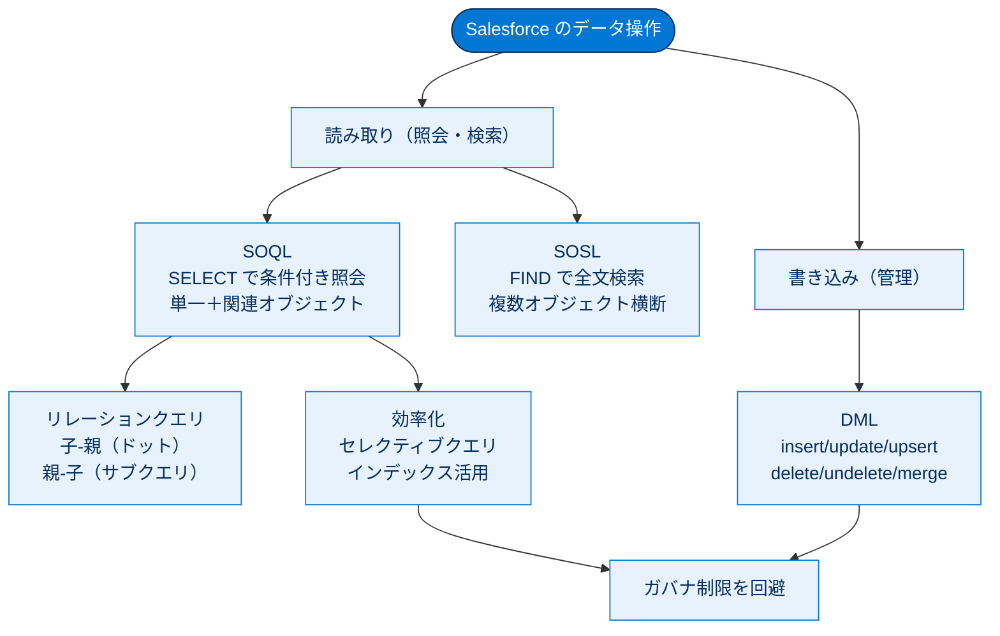

# データベースと .NET の基本 総まとめ

このトピックでは、.NET / SQL の知識を土台に、Salesforce のデータベース操作を一通り学びました。データの**読み取り**は照会言語の **SOQL**（条件付きの取得）と検索言語の **SOSL**（複数オブジェクトの全文検索）が担い、**書き込み**は **DML**（追加・更新・削除・復元）が担います。さらに、マルチテナント環境で速く安全に動かすための**効率的なクエリ（セレクティブクエリ）**の考え方を押さえました。SQL とよく似ていながら、JOIN がない・`SELECT *` が使えない・読み書きで言語が分かれるといった「Salesforce ならではの違い」を理解することが、このトピックの目的です。

---

## 全体像

次の図は、このトピックで登場した「読み取り（SOQL / SOSL）」と「書き込み（DML）」、そしてそれを支える「効率化（セレクティブクエリ）」の関係を1枚で俯瞰したものです。

---

## ユニット横断早見表

各ユニットで学んだことを1枚にまとめます。

| ユニット | 学んだこと | キーワード | 一言要点 |
| --- | --- | --- | --- |
| 01 SQL から SOQL への移行 | SOQL の基本構文・リレーションクエリ・集計 | `SELECT` / `FROM` / リレーションクエリ / `AggregateResult` | 読み取り専用。JOIN なし、`SELECT *` 不可。 |
| 02 SOSL クエリの作成 | 複数オブジェクト横断の全文検索 | `FIND` / `IN` / `RETURNING` / Lucene / ニックネーム検索 | 場所が不明な横断テキスト検索は SOSL。 |
| 03 効率的なクエリの作成 | セレクティブクエリとインデックス | インデックス / セレクティブ / TableScan / ガバナ制限 | `WHERE` でインデックス項目を使い全件走査を避ける。 |
| 04 DML を使用したレコードの変更 | データの書き込み操作 | `insert`〜`merge` / `allOrNone` / `Database.SaveResult` | 書き込みは DML。部分成功は Database メソッドのみ。 |

---

## 🎯 試験頻出ポイント

> [!ポイント] このトピックから狙われやすい論点
>
> - **SOQL は `SELECT` 専用**。`INSERT`/`UPDATE`/`DELETE` 相当は **DML** が担当。`SELECT *` は不可（`FIELDS()` か項目明示）。
> - **SOQL に JOIN はない**。子→親は**ドット表記**（`Account.Name`、最大5レベル）、親→子は**サブクエリ + 複数形**（カスタムは `__r`）。
> - SOQL の**必須句は `SELECT` と `FROM` のみ**。集計関数は多くが **`AggregateResult` 型**を返し、**別名は `GROUP BY` 集計クエリでのみ**使える。
> - **SOSL は `FIND` で始まる**全文検索。構文は **`FIND` → `IN` → `RETURNING`** の3部構成（`FIND` のみ必須）。Lucene ベースだが**インデックス管理は不要**（全自動・非同期）。検索語の囲みは**クエリエディター=`{}`／Apex=`''`**。
> - **使い分け**：無関係な複数オブジェクトの横断テキスト検索 → **SOSL**、条件が明確な単一照会 → **SOQL**。
> - **自動インデックス項目**：`Id` / `Name` / `OwnerId` / `CreatedDate` / `SystemModStamp` / `RecordType` / 主従・参照項目 / 一意項目 / 外部 ID 項目（`LastModifiedDate` は付かない）。
> - **セレクティブを壊す4つ**：null 照会・否定演算子（`!=`, `NOT LIKE`, `EXCLUDES`）・先頭ワイルドカード（`'%...'`）・テキスト項目への比較演算子。
> - **DML ステートメントは6種類**：`insert / update / upsert / delete / undelete / merge`（`unmerge` は存在しない）。
> - **部分的な成功を許可できるのは Database メソッドだけ**（`allOrNone=false`）。既定は `true`。

---

## 📖 用語早見表

| 用語 | ひとことの意味 |
| --- | --- |
| SOQL | Salesforce オブジェクトを照会する `SELECT` 専用言語（読み取り）。 |
| SOSL | `FIND` で複数オブジェクトを横断する全文検索言語。 |
| DML | レコードの追加・更新・削除・復元を行う書き込みの仕組み。 |
| sObject | Apex / SOQL から扱う Salesforce オブジェクトの呼び名。 |
| リレーションクエリ | JOIN の代わりに親子をたどる SOQL の書き方（子-親 / 親-子）。 |
| AggregateResult | 集計関数の戻り値を入れる特別な sObject 型。 |
| マルチテナント | 1つの基盤を多数の顧客が共有するアーキテクチャ。 |
| ガバナ制限 | 1ユーザーの過剰なリソース消費を防ぐ実行時の上限。 |
| インデックス | 項目の値から目的のレコードへ素早くたどる内部の索引。 |
| セレクティブクエリ | `WHERE` でインデックス項目を使い全件走査を避けるクエリ。 |
| クエリオプティマイザー | 最速の実行経路を自動判断する Salesforce 独自の仕組み。 |
| TableScan | インデックスを使わず先頭から全件調べる遅い方式。 |
| upsert | あれば更新・なければ追加（`Id` か外部 ID で照合）する DML。 |
| merge | 同じ種別の最大3件を1件に統合する DML。 |
| allOrNone | Database メソッドの第2引数。部分的な成功を許可するか制御する。 |
| Database.SaveResult | レコードごとの成功/失敗・エラーを保持する結果オブジェクト。 |

---

> [!豆知識] 読みと由来
>
> SOQL は「ソークル」、SOSL は「ソッスル」と読みます。SQL（シークェル）から派生した名前で、SOQL=Object **Query** Language（照会）、SOSL=Object **Search** Language（検索）。「Q=Query=照会＝SELECT 系」「S=Search=検索＝FIND 系」と頭文字で役割を覚えると混同しません。

> [!豆知識] LastModifiedDate には索引が付かない
>
> 「最終更新日で絞り込む」とき、直感的には `LastModifiedDate` を使いたくなりますが、この項目には**インデックスが付きません**。代わりに索引の効く `SystemModStamp`（こちらも最終更新日時を保持）を `WHERE` に使うのがベストプラクティスです。同じ「最終更新日時」でも、クエリ性能ではこの差が効いてきます。

> [!豆知識] DML は「全件成功 or 全件失敗」が既定
>
> `insert acct;` のような DML ステートメントは、リストの1件でも失敗すると**全件ロールバック**して例外を投げます。「成功した分だけ残したい」場合は `Database.insert(records, false)` のように Database メソッドで `allOrNone=false` を指定します。外部連携で一部のエラーを許容したいときに重宝するパターンです。

---

## ✅ 理解度セルフチェック

> [!まとめ] 答えながら総復習しよう（答えは各問の末尾）
>
> 1. SOQL でレコードを**更新**できる？（Yes / No）
>    → **No**。SOQL は読み取り（`SELECT`）専用で、更新は DML が担当。
> 2. SOQL の子→親クエリは「ドット表記」と「サブクエリ」のどちら？
>    → **ドット表記**（例: `Account.Name`、最大5レベル）。親→子がサブクエリ + 複数形。
> 3. SOSL の構文を3つの句で言うと？
>    → **`FIND` → `IN` → `RETURNING`**（必須は `FIND` のみ）。
> 4. 最終更新日で絞り込むとき、インデックスが効くのは `LastModifiedDate` と `SystemModStamp` のどちら？
>    → **`SystemModStamp`**。`LastModifiedDate` には索引が付かない。
> 5. DML ステートメントは6種類。`unmerge` は含まれる？（Yes / No）
>    → **No**。`insert/update/upsert/delete/undelete/merge` の6種類で、`unmerge` は存在しない。
> 6. 「一部失敗しても成功分はコミットしたい」とき使うのは？
>    → **Database メソッド**で `allOrNone=false` を指定する（DML ステートメントは不可）。
