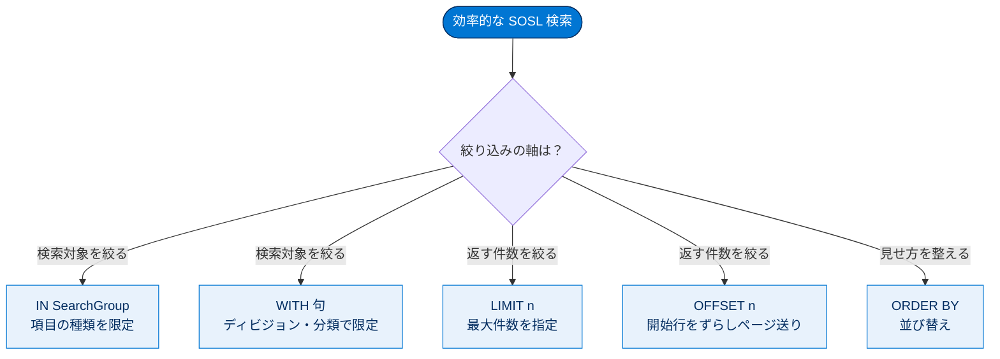
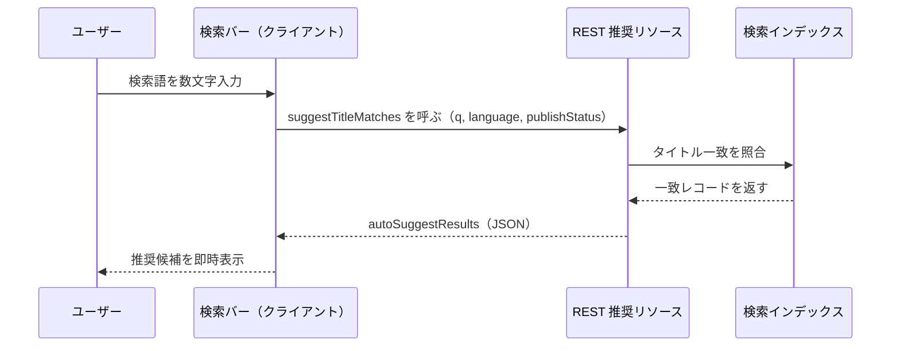

# 検索結果の最適化

## 学習の目的

この単元を完了すると、次のことができるようになります。

- `IN`・`RETURNING`・`ORDER BY`・`LIMIT`・`OFFSET`・`WITH` を使って SOSL 検索を絞り込む。
- 推奨結果（自動推奨）を取得する REST リソースを説明する。
- システム管理者と連携して、シノニムグループと昇格済み検索語で検索結果を強化する。

> [!ポイント] この単元のゴール
>
> 「**検索対象を絞り、返す件数を絞る**」のが効率的な検索の基本。SOSL の絞り込み句（`IN` / `RETURNING(...)` / `ORDER BY` / `LIMIT` / `OFFSET` / `WITH`）の役割を覚え、推奨 API と、管理者が行うシノニム・昇格済み検索語の設定を押さえれば完璧。

---

効率的な検索は「**検索対象を絞る**」と「**返す件数を絞る**」の 2 軸で組み立てます。SOSL の各句がどちらの役割を担うかを整理します。



## 検索対象の項目を制限する（IN SearchGroup）

検索対象のデータを制限するには **`IN SearchGroup`** を使います。

> [!用語] SearchGroup（検索グループ）
>
> SOSL で「**どの種類の項目を検索対象にするか**」を指定するキーワード。`IN` の後ろに書く。対象を絞ることで検索が速く・正確になる。

| SearchGroup | 検索対象 |
| --- | --- |
| `NAME FIELDS` | 名前項目 |
| `EMAIL FIELDS` | メール項目 |
| `PHONE FIELDS` | 電話番号項目 |
| `SIDEBAR FIELDS` | サイドバー検索の対象項目 |
| `ALL FIELDS` | すべての項目（デフォルト） |

メールのみを検索する例：

```sql
FIND {jsmith@cloudkicks.com} IN EMAIL FIELDS RETURNING Contact
```

> [!例] このクエリの読み方
>
> 「`jsmith@cloudkicks.com` を**メール項目だけ**を対象に検索し、結果は **Contact（取引先責任者）** を返す」。名前や説明に同じ文字列があっても拾わずノイズが減る。

---

## 返すデータを指定して絞り込む（RETURNING FieldSpec）

何千件もある場合は、結果を理解しやすいかたまりに分割します。返すデータの指定には **`RETURNING FieldSpec`** を使い、より高度な要素を加えられます。

> [!用語] RETURNING FieldSpec の構成要素
>
> - **`ObjectTypeName`** — 返すオブジェクト。
> - **`FieldList`** — 返す項目。
> - **`ORDER BY`** — 並び替え基準の項目（昇順・降順を指定可）。
> - **`LIMIT n`** — 返すレコードの**最大数**。
> - **`OFFSET n`** — 結果セットの**開始行オフセット**（何件目から返すか）。

> [!手順] RETURNING を 1 ステップずつ組み立てる
>
> 1. **返すオブジェクトを指定する。**
>    ```sql
>    FIND {Cloud Kicks} RETURNING Account
>    ```
> 2. **返す項目を指定する。**
>    ```sql
>    FIND {Cloud Kicks} RETURNING Account(Name, Industry)
>    ```
> 3. **結果を項目の昇順（デフォルト）で並び替える。**
>    ```sql
>    FIND {Cloud Kicks} RETURNING Account(Name, Industry ORDER BY Name)
>    ```
> 4. **返されるレコードの最大数を設定する。**
>    ```sql
>    FIND {Cloud Kicks} RETURNING Account(Name, Industry ORDER BY Name LIMIT 10)
>    ```
> 5. **結果への開始行オフセットを設定する。**
>    ```sql
>    FIND {Cloud Kicks} RETURNING Account(Name, Industry ORDER BY Name LIMIT 10 OFFSET 25)
>    ```

> [!例] LIMIT と OFFSET でページ送り
>
> `LIMIT 10 OFFSET 25` は「**26 件目から 10 件**を返す」。10 件ずつ表示したいとき `OFFSET` を 0 → 10 → 20… と増やせば「次のページ」を実現できる。

> [!注意] OFFSET は使いすぎ注意
>
> `OFFSET` には上限があり（一般に 2,000 件まで）、大きな値は非効率。深いページ送りが必要なら、絞り込み条件で結果そのものを減らすほうがよい。

---

## WITH 句でさらに絞り込む

**`WITH` ステートメント**で、定義済みの特定項目によりレコードを絞り込みます。結果が減り、パフォーマンスが向上します。

> [!用語] WITH 句
>
> SOSL で、ディビジョン・データカテゴリ・コミュニティ（ネットワーク）・価格表といった**定義済み属性**でさらに結果を絞り込む句。検索語に「条件」を上乗せするイメージ。

| WITH 条件 | 用途 |
| --- | --- |
| `WITH DIVISION` | ディビジョン（組織区分）で絞り込む |
| `WITH DATA CATEGORY` | データカテゴリ（ナレッジの分類）で絞り込む |
| `WITH NETWORK` | コミュニティ（ネットワーク）で絞り込む |
| `WITH PRICEBOOK` | 価格表で絞り込む |

```sql
FIND {Cloud Kicks} RETURNING Account (Name, Industry)
    WITH DIVISION = 'Global'
```

```sql
FIND {race} RETURNING KnowledgeArticleVersion
    (Id, Title WHERE PublishStatus='online' and language='en_US')
    WITH DATA CATEGORY Location__c AT America__c
```

```sql
FIND {first place} RETURNING User (Id, Name),
FeedItem (id, ParentId WHERE CreatedDate = THIS_YEAR Order by CreatedDate DESC)
WITH NETWORK = '00000000000001'
```

```sql
FIND {shoe} RETURNING Product2 WITH PricebookId = '01sxx0000002MffAAE'
```

> [!例] WITH DATA CATEGORY の意味
>
> 2 つ目の例は「`race` を検索し、**公開済み（online）かつ英語（en_US）** のナレッジ記事のうち、データカテゴリ **Location__c の America__c** に該当するものだけ」を返す。`WHERE` で項目条件、`WITH DATA CATEGORY` で分類条件を重ねがけしている。

---

## SOQL での絞り込みとの対比

SOQL でも `SELECT` を使って同等のことを類似構文で実現できます。

| 目的 | SOSL | SOQL |
| --- | --- | --- |
| 検索対象となるデータを制限する | `IN SearchGroup` | `WHERE` |
| 応答で返されるデータを指定する | `RETURNING FieldSpec` | `SELECT` |
| 結果を並び替える／件数を絞る | `ORDER BY` / `LIMIT` / `OFFSET` | `ORDER BY` / `LIMIT` / `OFFSET` |
| データカテゴリによって絞り込む | `WITH DATA CATEGORY` | `WITH DATA CATEGORY` |

> [!ポイント] SOSL と SOQL の句の対応
>
> - 対象の制限：SOSL は **`IN`**、SOQL は **`WHERE`**。
> - 返す項目の指定：SOSL は **`RETURNING`**、SOQL は **`SELECT`**。
> - `ORDER BY` / `LIMIT` / `OFFSET` と `WITH DATA CATEGORY` は**両方ほぼ共通**。

---

## 推奨結果の表示

API を使うと、ユーザーが検索バーに入力したときに**推奨**を表示できます。推奨は入力内容と**タイトルが一致するレコード**を返し、ユーザーを目的地へ素早く導きます。

ユーザーが文字を入力するたびに、クライアントが REST リソースを呼び、推奨レコードを受け取って即時に表示します。



利用する REST リソースは次のとおりです（構文・パラメーターは似ているので使用事例に最適なものを選ぶ）。

| REST リソース | 返すもの |
| --- | --- |
| **Search Suggested Records** | 検索文字列に**名前が一致**する推奨レコードのリスト |
| **Search Suggested Article Title Matches** | 検索クエリに**タイトルが一致**するナレッジ記事のリスト |
| **SObject Suggested Articles for Case** | **ケース**に対する推奨ナレッジ記事のリスト |

> [!用語] 推奨レコード／推奨記事（Suggested Records / Articles）
>
> 検索を最後まで実行する前に、関連しそうなレコード・記事へ**直接ジャンプできるショートカット**を提供する機能。先行入力（typeahead）の裏側で使われる。

**Search Suggested Article Title Matches** の基本構文（全パラメーターは API ドキュメント参照）：

```text
/vXX.X/search/suggestTitleMatches?q=search string&language=article language&publishStatus=article publication status
```

具体的な要求例：

```text
/vXX.X/search/suggestTitleMatches?q=race+tips&language=en_US&publishStatus=Online
```

> [!例] パラメーターの意味
>
> - `q=race+tips` … 検索文字列（スペースは `+`）。
> - `language=en_US` … 記事の言語。
> - `publishStatus=Online` … 公開状態（公開済みのみ）。

JSON 応答：

```json
{
  "autoSuggestResults" : [ {
    "attributes" : {
    "type" : "KnowledgeArticleVersion",
    "url" : "/services/data/v30.0/sobjects/KnowledgeArticleVersion/ka0D00000004CcQ"
    },
  "Id" : "ka0D00000004CcQ",
  "UrlName" : "tips-for-your-first-trail-race",
  "Title" : "race tips",
  "KnowledgeArticleId" : "kA0D00000004Cfz",
  "isMasterLanguage" : "1",
  } ],
  "hasMoreResults" : false
}
```

> [!用語] JSON 応答の主な項目
>
> - **`autoSuggestResults`** … 推奨結果の配列。1 件ずつ記事情報が入る。
> - **`Title`** … 記事のタイトル。
> - **`UrlName`** … 記事 URL に使われる名前。
> - **`hasMoreResults`** … まだ候補があるか（`false` ならこれで全件）。

---

## システム管理者との連携

検索結果の最適化には**システム管理者**の連係が役立ちます。

### ステップ 1：シノニムグループの設定

> [!用語] シノニムグループ（Synonym Group）
>
> 検索で**同等に扱う語句のまとまり**。グループ内のどれか 1 語で検索すると、グループ内のすべての語の結果が返る。商品名を変えずユーザーの「言い回しのゆれ」を吸収できる。

> [!例] シノニムグループの効果
>
> 「USB」「サムドライブ」「フラッシュスティック」「メモリスティック」を 1 グループにすると、「USB」検索だけで 4 語すべてに一致する結果が返る。

> [!手順] シノニムグループを作成する
>
> 1. **[設定（Setup）]** の **[クイック検索]** に「**シノニム**」と入力し **[シノニム]** を選択。
> 2. **[カスタムシノニムグループ]** で **[New（新規）]**、または既存グループ横の **[Edit（編集）]** をクリック。
> 3. グループごとに **2 ～ 6 個**のシノニム（語または句）を追加する。**特殊文字は使用不可**。

> [!注意] 標準シノニムと大量インポート
>
> - Salesforce 提供の**標準シノニムグループはデフォルトで有効**。
> - 膨大なシノニムをインポートする場合は**メタデータ API**を活用する（参考資料参照）。

### ステップ 2：ナレッジ記事の昇格済み検索語

> [!用語] 昇格済み検索語（Promoted Search Term）
>
> よく使う記事を、特定キーワード検索時に**検索結果の最上部に固定表示**するしくみ。管理者が記事の [昇格済み検索語] 関連リストにキーワードを追加すると、そのキーワード検索でその記事が一番上に出る。

> [!例] 昇格済み検索語の使い方
>
> 「サイズが合わない靴を返品する方法」の記事に「**返品**」「**サイズが合わない**」を昇格済み検索語として登録すると、ユーザーがその語を検索したとき記事が最上部に表示される。

> [!ポイント] 昇格済み検索語の調整のコツ
>
> - 1 語あたり**最大 100 文字**。各昇格済み用語は数個のキーワードに絞る。
> - **やりすぎない**。追加しすぎると関連性ランキングに悪影響を与える。
> - 組織で**最大 2,000 個**作成できる。
> - 用語内の全キーワードがユーザーの検索語に含まれれば**任意の順序**で一致するが、キーワードは**完全一致**が必要。

---

## まとめ

> [!まとめ] このモジュールで学んだこと
>
> - 検索の**バックグラウンド処理**（検索インデックスとトークン化）。
> - **SOSL と SOQL の使い分け**と、各 API プロトコル。
> - 一般的な**使用事例**への検索ソリューションの作り方。
> - `IN` / `RETURNING` / `ORDER BY` / `LIMIT` / `OFFSET` / `WITH` による**効率的なクエリ**。
> - **推奨 API** と、管理者による**シノニム・昇格済み検索語**での結果強化。

---

## 試験対策：押さえておきたい追加ポイント

> [!ポイント] 効率的な検索の原則
>
> 「効率的なテキスト検索の作り方」の答えは **検索の対象を制限し、結果数を制限する**こと。対象を絞る（`IN` / `WITH`）と件数を絞る（`LIMIT`）の 2 軸が基本。検索文字列を短くする・特定 API を使う、といった選択肢に惑わされない。

> [!ポイント] ランキングへの管理者の関与
>
> 「ランキングに影響を与えるため管理者は何ができるか」の答えは **シノニムグループと昇格済み検索語の設定**。レコード名の変更やセミナー開催は直接の手段ではない。

---

## リソース

- Salesforce Developers: Salesforce Object Query Language (SOQL)
- Salesforce Developers: Salesforce Object Search Language (SOSL)
- Salesforce Developers: Search for Suggested Records
- Salesforce Developers: Search Suggested Article Title Matches
- Salesforce Developers: SObject Suggested Articles for Case
- Salesforce Developers: SynonymDictionary
- Salesforce ヘルプ: 検索結果の記事の昇格

---

## テスト（+100 ポイント）

> [!まとめ] 理解度チェック
>
> **問 1：どのようにして効率的なテキスト検索を作成しますか。**
> - 検索の対象を制限し、結果数を制限する
> - 検索文字列を短くする
> - SOSL と REST を使用する
> - レコードの名前項目のみを検索する
>
> **問 2：検索結果のランキングに影響を及ぼすために、システム管理者は何ができますか。**
> - 検索のベストプラクティスについてのユーザー向け Web セミナーを開催する
> - レコードの名前を変更する
> - シノニムグループと昇格済み検索語を設定する
> - 何も行わない。検索ソリューションの向上を 1 人で行う

> [!ポイント] 解答の考え方
>
> - **問 1**：鍵は「対象を絞る・件数を絞る」。正解は **検索の対象を制限し、結果数を制限する**。
> - **問 2**：正解は **シノニムグループと昇格済み検索語を設定する**。

> [!注意] 日本語環境で受講する場合
>
> クエリ内の項目名・データカテゴリ名・言語コード（例：`en_US`）は**英語の API 値**。日本語の表示ラベルでなく API 値を使うため、SOSL/SOQL は英語表記をそのまま使用する。
