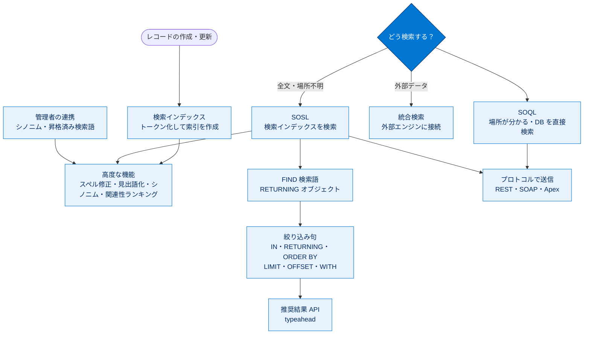

# 検索ソリューションの基礎 総まとめ

このトピックでは、Salesforce の検索のしくみ（検索インデックスとトークン化）から始め、カスタム検索ソリューションの要否判断、SOQL と SOSL の使い分け、それらを実行する API プロトコル（REST・SOAP・Apex）を学びました。さらに、SOSL を `FIND ... RETURNING ...` 構文で 1 オブジェクト／複数オブジェクト／カスタムオブジェクト向けに書く方法、絞り込み句（`IN` / `RETURNING` / `ORDER BY` / `LIMIT` / `OFFSET` / `WITH`）による効率化、推奨結果 API、そして管理者によるシノニム・昇格済み検索語での結果強化までを通して、「カスタム検索ソリューションを設計・実装・最適化する」流れを一気通貫で押さえました。

---

## 全体像

次の図は、このトピックで学んだ概念どうしの関係を 1 枚で俯瞰したものです。

---

## ユニット横断 早見表

| ユニット | 学んだこと | キーワード | 一言要点 |
| --- | --- | --- | --- |
| 01 適切な検索ソリューションの選択 | 検索インデックスのしくみ、SOQL/SOSL の違い、API プロトコル、その他の検索 API | トークン化・検索インデックス・SOQL・SOSL・REST/SOAP/Apex・統合検索 | **場所が分かれば SOQL、分からなければ SOSL** |
| 02 一般的な使用事例での検索の作成 | SOSL を 1 オブジェクト・複数・カスタムに対して書く方法と SOQL との使い分け | `FIND {} RETURNING`・カンマ区切り・`__c`・sObject | **基本形は `FIND {検索語} RETURNING オブジェクト`** |
| 03 検索結果の最適化 | SOSL の絞り込み句、推奨結果 API、管理者によるランキング強化 | `IN`・`RETURNING FieldSpec`・`LIMIT`/`OFFSET`・`WITH`・シノニム・昇格済み検索語 | **対象を絞り、件数を絞る。強化は管理者と連携** |

---

## 🎯 試験頻出ポイント

> [!ポイント] このトピックで狙われやすい論点
>
> - **SOQL と SOSL の違い**（最頻出）：①構文が異なる ②SOSL は組織 DB ではなく**検索インデックス**を検索する ③SOSL は**データがどのオブジェクトにあるか分からないとき**に効率的。「これらすべて」が正解になりやすい。
> - **使い分けの決め手**：場所（オブジェクト・項目）が分かる＋取得・集計・並べ替え → **SOQL**。場所不明・あいまい一致・無関係な複数オブジェクト横断 → **SOSL**。
> - **カスタム検索が適する場面**：標準 UI ではなく**カスタム UI を構築する場合**（外部知識ベース・顧客向けサイトなど）。
> - **プロトコルの対応**：SOQL → REST の **Query** / SOAP の **query()**、SOSL → REST の **Search** / SOAP の **search()**。Apex は**角括弧 `[ ]`** でインライン。SOSL を書きたくないときは **Parameterized Search**。
> - **SOSL 構文**：`FIND {検索語} RETURNING オブジェクト`。複数は**カンマ区切り**、カスタムは末尾 **`__c`**、`RETURNING` に書かないオブジェクトは返らない。
> - **効率的な検索**：**検索対象を制限し、結果数を制限する**（`IN` / `WITH` ＋ `LIMIT`）。
> - **ランキング強化（管理者）**：**シノニムグループ**と**昇格済み検索語**。`OFFSET` 上限は一般に 2,000、昇格済み検索語は最大 2,000 個。
> - **統合検索**：外部データ向けで**検索インデックスを使わない**ため、スペル修正・見出語化・関連性ランキングは効かない。

---

## 📖 用語早見表

| 用語 | ひとことの意味 |
| --- | --- |
| 検索インデックス | 検索しやすいよう加工・整理した索引。組織 DB とは別に作られる |
| トークン化 | 文章を検索しやすい最小単位（おもに単語）に分割する処理 |
| 見出語化（Lemmatization） | 活用形・変化形をまとめて同じ語として扱うしくみ |
| シノニムグループ | 同等に扱う語句のまとまり。1 語で検索すると全語の結果が返る |
| 関連性ランキング | 頻度・順序・アクセス権などで結果に順位を付けるしくみ |
| SOQL | Salesforce 版 SQL。組織 DB を直接検索する（場所が分かるとき） |
| SOSL | 検索インデックスにテキスト検索する言語（場所が分からないとき） |
| FIND / RETURNING | SOSL の基本構文。検索語を `{ }`、対象を `RETURNING` で指定 |
| sObject | Salesforce のオブジェクトをプログラム上で表す型 |
| `__c` サフィックス | カスタムオブジェクト・項目の API 名末尾に付く識別子 |
| API プロトコル | クエリを送って実行させる通信手段（REST・SOAP・Apex） |
| Parameterized Search | SOSL を書かず URL パラメーターで検索条件を指定する REST 検索 |
| 統合検索（Federated Search） | グローバル検索から外部検索エンジンを検索するしくみ |
| 推奨レコード（typeahead） | 入力途中で候補を即表示し目的地へ素早く導く機能 |
| 昇格済み検索語 | 特定キーワード検索時に記事を結果最上部へ固定するしくみ |
| SearchGroup | SOSL で検索対象の項目種類を指定するキーワード（`IN` の後ろ） |
| WITH 句 | ディビジョン・データカテゴリなど定義済み属性で絞り込む句 |

---

> [!豆知識] 「USA」で「米国」もヒットするカラクリ
>
> シノニムグループに「USA」「United States」「米国」を登録すると、どの 1 語で検索しても他の語のレコードまで一致します。ユーザーの「言い回しのゆれ」を、データ側を変えずに吸収できるのがミソ。検索体験の改善は、項目を作り直すより設定で吸収するほうがずっと手軽で安全です。

> [!豆知識] Apex の「角括弧」はインラインクエリの目印
>
> Apex では `[SELECT ...]` や `[FIND ...]` のように、SOQL/SOSL を角括弧 `[ ]` で囲んでコードに直接埋め込めます。文字列連結で動的に組み立てる方法（`Database.query()` / `Search.query()`）もありますが、まずは「角括弧＝インラインクエリ」と覚えると、コードを読んだとき検索処理がひと目で見分けられます。

> [!豆知識] 「索引を引く」発想は紙の本と同じ
>
> SOSL が高速なのは、本文を端から走査せず「検索インデックス（索引）」を引くから。紙の本の巻末索引で「この単語は何ページ」と一発で探すのと同じ発想です。だからこそスペル違いや語順違い、活用形にも強い。一方の SOQL は本文そのもの（データベース）を条件で直接引くため、完全一致が基本になる、という対比で覚えると忘れません。

---

## ✅ 理解度セルフチェック

> [!まとめ] 自分の言葉で答えてみよう（答えは各項目の末尾）
>
> 1. データがどのオブジェクト・項目にあるか分かっていて、件数を集計したい。SOQL と SOSL のどちら？ → **SOQL**
> 2. SOSL の基本構文を埋めよう：`FIND ___ RETURNING ___` → **`{検索語}` と `オブジェクト名`**（検索語は中かっこ、対象は RETURNING）
> 3. カスタムオブジェクトを SOSL で検索するとき、名前に付ける特別なサフィックスは？ → **`__c`**
> 4. SOQL を REST と SOAP で実行するときのリソース／メソッド名は？ → **REST は Query、SOAP は query()**（SOSL は Search / search()）
> 5. 効率的なテキスト検索を作る原則を一言で。 → **検索の対象を制限し、結果数を制限する**（`IN`/`WITH` ＋ `LIMIT`）
> 6. 検索結果のランキングを強化するために管理者ができることは？ → **シノニムグループと昇格済み検索語を設定する**
