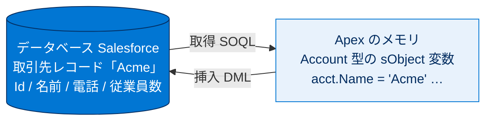
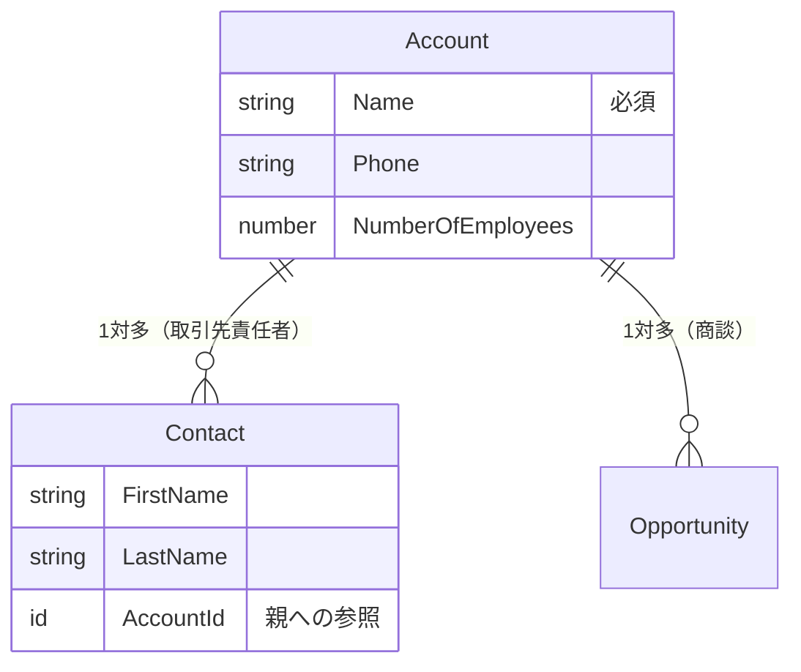
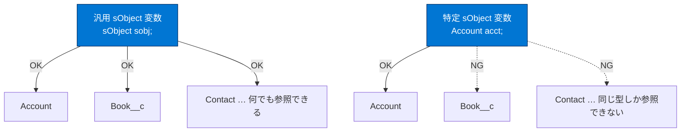

# sObject を使用する

## 学習の目的

この単元を完了すると、次のことができるようになります。

- sObject レコードと Salesforce レコード間のリレーションを説明する。
- 特定の sObject 変数を作成して使用する。
- 汎用 sObject を特定の sObject にキャストする。

> [!ポイント] この単元のゴール
>
> 「**Salesforce のレコード = Apex の sObject**」という対応関係が Apex でデータを扱う土台です。`new` でのインスタンス作成、コンストラクター／ドット表記での項目設定、API 参照名（`__c`/`__r`）、汎用 sObject とキャストの4つを押さえれば試験対策は十分です。

---

## sObject とは

Apex はデータベースと緊密に統合され、Salesforce レコードと項目に直接アクセスできます。すべてのレコードは Apex の **sObject** として表現されます。たとえば Acme 取引先レコードは Apex の Account sObject に対応し、UI で表示・変更できる項目を sObject でも読み書きできます。

> [!用語] sObject（エスオブジェクト / Salesforce Object）
>
> Salesforce の1件のレコードを Apex のメモリ内で表現したオブジェクト。データベース上の1行が Apex では1つの sObject 変数（例：`Account` 型）になり、各列（名前・電話・従業員数など）がそのまま項目として読み書きできます。標準・カスタムを問わず扱えます。

次の表は Acme 取引先サンプルレコードの一部項目です。

**表 1. 取得されたレコードの Account sObject**

| 取引先項目 | 値 |
| --- | --- |
| Id | 001D000000JlfXe |
| 名前 | Acme |
| 電話 | (415) 555-1212 |
| NumberOfEmployees | 100 |

各レコードは、挿入前は sObject として表され、取得後も sObject 変数として保存されます。



> [!ポイント] 挿入前と取得後
>
> - **挿入前**：`new` で作った sObject は、まだ保存されていない「メモリ上だけ」の存在。
> - **取得後**：SOQL で取り出したレコードも、Apex では sObject 変数として受け取る。
>
> どちらも Apex 側の入れ物は同じ「sObject」です。

---

## 標準オブジェクトとカスタムオブジェクトの sObject 型

標準・カスタムオブジェクトのレコードは、Apex ではその sObject 型に対応付けられます。よく使う標準オブジェクトの型名は次のとおりです。

- 取引先（Account）／取引先責任者（Contact）／リード（Lead）／商談（Opportunity）

カスタムオブジェクトは **API 参照名** を使います。たとえば Merchandise カスタムオブジェクトは `Merchandise__c` sObject に対応します。標準・カスタムを問わず、レコード間のリレーションも sObject の項目として表現されます。



> [!用語] API 参照名（API Reference Name）
>
> オブジェクトや項目を Apex・SOQL から参照するための内部的な正式名称。画面に表示される「表示ラベル」とは別物で、Apex では必ずこの API 参照名を使います。

> [!用語] 標準オブジェクト / カスタムオブジェクト
>
> **標準オブジェクト**は Salesforce が用意したもの（取引先・商談など）で型名にサフィックスは付きません（`Account`）。**カスタムオブジェクト**は利用者が作るもので型名は必ず `__c` で終わります（`Merchandise__c`）。

---

## sObject 変数を作成する

sObject を作成するには、sObject 型の変数を宣言して `new` で sObject インスタンスを割り当てます。次は Acme という名前で Account 型の sObject を作る例です。

```apex
Account acct = new Account(Name='Acme');
```

> [!用語] new 演算子 / インスタンス
>
> `new` は新しい実体（インスタンス）をメモリ上に作る演算子。`new Account(...)` は「Account 型の sObject を1つ作る」という意味で、作った実体を変数（`acct`）に入れて使います。

---

## sObject と項目名

Apex では、一意の API 参照名で sObject とその項目を参照します。API 参照名は表示ラベルと異なる場合があります。たとえば表示ラベル「Employees（従業員数）」の項目の API 参照名は `NumberOfEmployees` で、Apex ではこちらを使います。

> [!注意] 表示ラベルでは項目を参照できない
>
> コードに「従業員数」や「Employees」と書いてもコンパイルできません。必ず API 参照名（`NumberOfEmployees`）を使います。表示ラベルは画面表示・翻訳用です。

カスタムオブジェクト・項目の API 参照名のルール：

- カスタムオブジェクト・項目は `__c` で終わる。カスタムリレーション項目は `__r` で終わる。
- 表示ラベルのスペースはアンダースコアに置換される（例：Employee Seniority → `Employee_Seniority__c`）。

> [!用語] `__c` サフィックス / `__r` サフィックス
>
> - `__c`（custom）… カスタムオブジェクトやカスタム項目の末尾に付く（`Merchandise__c`、`Description__c`）。
> - `__r`（relationship）… カスタムの**リレーション**（関連先）を参照するときに使う（`Items__r`）。SOQL で親子をたどるときにも登場します。

| 種類 | 表示ラベルの例 | API 参照名の例 | ポイント |
| --- | --- | --- | --- |
| カスタムオブジェクト | Merchandise | `Merchandise__c` | `__c` で終わる |
| カスタム項目 | Description | `Description__c` | `__c` で終わる |
| カスタムリレーション項目 | Items | `Items__r` | `__r` で終わる |
| スペースを含む項目 | Employee Seniority | `Employee_Seniority__c` | スペースは `_` に置換 |
| 標準項目（参考） | Employees (従業員数) | `NumberOfEmployees` | サフィックスなし・ラベルと別名 |

> [!ポイント] サフィックスの判別が頻出
>
> 試験では「ある API 参照名がカスタムか標準か」「項目かリレーションか」を見分けさせます。**末尾が `__c` ならカスタム項目／オブジェクト、`__r` ならカスタムリレーション**、サフィックスがなければ標準、と即答できるようにしましょう。

### オブジェクトと項目名を確認する

標準オブジェクトは『Salesforce Platform のオブジェクトリファレンス』で確認できます。組織の API 参照名は次の手順で調べます。

> [!手順] 組織で API 参照名を調べる
>
> 1. **[設定（Setup）]** を開く。
> 2. **[オブジェクトマネージャー（Object Manager）]** タブをクリックする。
> 3. 目的のオブジェクト名をクリックし、項目一覧から API 参照名を確認する。

---

## sObject の作成と項目の追加を行う

レコードを挿入するには、事前にメモリ内に sObject を `new` で作成します。

```apex
Account acct = new Account();
```

API オブジェクト名（ここでは `Account`）が sObject 変数のデータ型になります。作成直後の `acct` は項目が空です。項目を追加するには**コンストラクター**と**ドット表記**の2つの方法があります。

> [!用語] コンストラクター / ドット表記
>
> - **コンストラクター**：`new Account(Name='Acme')` のように丸かっこ内で「項目名=値」を渡し、作成と同時に項目を埋める書き方。
> - **ドット表記**：`acct.Name = 'Acme';` のように変数名にドットと項目名をつなげて項目にアクセスする書き方。値の代入も取得もできる。

最も速いのはコンストラクターで名前-値ペアを指定する方法です。取引先の必須項目は名前のみで、次は電話番号と従業員数も追加する例です。

```apex
Account acct = new Account(Name='Acme', Phone='(415)555-1212', NumberOfEmployees=100);
```

ドット表記でも同等のことができます（行数は増えます）。

```apex
// 空の Account sObject を作成
Account acct = new Account();
// ドット表記で各項目に値を設定
acct.Name = 'Acme';
acct.Phone = '(415)555-1212';
acct.NumberOfEmployees = 100;
```

> [!例] 2つの書き方の使い分け
>
> 結果は同じ。**コンストラクター方式**は1行で簡潔（作成時にまとめて値を入れたいとき）、**ドット表記方式**は行数が増えるが作成後に条件に応じて項目を順次設定したいとき便利。

> [!ポイント] 必須項目は「名前」だけ
>
> 取引先（Account）の挿入に最低限必要なのは **名前（Name）項目** だけ、という点はよく問われます。他は任意です。

---

## 汎用 sObject データ型を操作する

通常は `Account` や `Book__c` など特定の sObject 型を使いますが、メソッドで処理する型が不明な場合は **汎用 sObject データ型** を使えます。汎用 sObject 変数は、標準・カスタムを問わず任意のレコードを参照できます。

> [!用語] 汎用 sObject（Generic sObject）
>
> 型を `sObject` で宣言した変数。特定の型に固定せず、**あらゆる種類のレコードを入れられる**汎用的な入れ物。どのオブジェクトが渡されるか事前に分からない汎用メソッドで使います。

```apex
sObject sobj1 = new Account(Name='Trailhead');
sObject sobj2 = new Book__c(Name='Workbook 1');
```

一方、特定の sObject 型の変数は、同じ型のレコードのみ参照できます。



> [!ポイント] 汎用 sObject と特定 sObject の参照可否
>
> - **汎用 sObject 変数**：標準・カスタムを問わず**どんなレコードでも**割り当て可。
> - **特定 sObject 変数**：宣言した型と**同じ型のレコードだけ**割り当て可。
>
> この参照可否は試験の頻出ポイントです。

---

## 汎用 sObject を特定の sObject 型にキャストする

汎用 sObject を処理するとき、特定の sObject 型へのキャストが必要になることがあります。利点は、汎用 sObject ではできない**ドット表記での項目アクセス**が可能になることです。sObject はすべての特定 sObject 型の親データ型なので、キャストできます。

```apex
// 汎用 sObject を Account にキャスト
Account acct = (Account)myGenericSObject;
// キャスト後はドット表記で Account の項目にアクセスできる
String name = acct.Name;
String phone = acct.Phone;
```

> [!用語] キャスト（Cast）
>
> ある型の変数を、別の（より具体的な）型として扱い直すこと。`(Account)myGenericSObject` のようにかっこで囲んだ型名を前に付けます。`sObject` は `Account` などすべての特定 sObject 型の親型なので、本来の具体型へ安全に戻せます。キャスト後は `acct.Name` のようにドット表記で項目を参照できます。

> [!注意] 汎用 sObject ではドット表記が使えない
>
> 汎用 sObject のままでは `sobj.Name` のようにドット表記で項目にアクセスできません（どんな項目を持つか型として分からないため）。特定の型へキャストして初めてドット表記が使えます。キャストしない場合は `get('項目名')`／`put('項目名', 値)` で読み書きします。

sObject を作成してもデータベースには保持されません。保存・操作には **DML**、取得には **SOQL** を使います（後の単元で学習）。

> [!用語] DML / SOQL（次の単元の予告）
>
> - **DML（Data Manipulation Language）**：sObject をデータベースに保存・更新・削除する言語（`insert`、`update`、`delete` など）。
> - **SOQL（Salesforce Object Query Language）**：データベースからレコードを取得する言語。SQL に似た構文を持つ。
>
> sObject は「メモリ上の入れ物」、DML/SOQL は「データベースとやり取りする手段」という関係です。

---

## 試験対策：押さえておきたい追加ポイント

> [!まとめ] この単元の要点
>
> - すべてのレコードは Apex では **sObject** として表現される。
> - sObject は `new` で作成し、**コンストラクター**または**ドット表記**で項目を設定する。
> - 項目参照には表示ラベルではなく **API 参照名** を使う（カスタムは `__c`、カスタムリレーションは `__r`）。
> - **汎用 sObject** は任意のレコードを参照でき、**特定 sObject** は同じ型のみ参照できる。
> - 汎用 sObject はキャストすればドット表記が使える。しない場合は `get()`/`put()`。

> [!ポイント] 試験でのひっかけに注意
>
> - 「sObject 項目名 = 表示ラベル」は**誤り**。正しくは **API 参照名**。
> - 「カスタムオブジェクトの API 参照名と表示ラベルは同じ」は**誤り**。`__c` が付くなど異なることが多い。
> - sObject は **`sObject.newInstance()` では作らない**。`new` 演算子で作る。
> - 汎用 sObject は **作成できる**（`new Account(...)` を `sObject` 型変数に代入できる）。「作成できない」は誤り。

---

## リソース

- Salesforce Platform のオブジェクトリファレンス: 標準オブジェクト
- Apex 開発者ガイド: sObject の操作
- Apex リファレンスガイド: sObject のメソッド

---

## テスト

この単元を完了するには、テストのすべての質問に正しく解答する必要があります。（+100 ポイント）

### 問題 1

sObject レコードと Salesforce レコード間のリレーションを説明する。

- **A.** Apex の sObject 項目の名前は、Salesforce の項目の表示ラベルである。
- **B.** カスタムオブジェクトの API 参照名と表示ラベルは同じである。
- **C.** Salesforce のすべてのレコードは、Apex の sObject としてネイティブに表現される。

### 問題 2

Account などの sObject インスタンスはどのように作成しますか?

- **A.** 変数を宣言し、新しい sObject インスタンスを割り当てる。
- **B.** `sObject.newInstance()` メソッドを使用する。
- **C.** SOQL を使用して、永続レコードを Salesforce に挿入する。

### 問題 3

汎用 sObject 変数について正しいのは次のうちどれですか?

- **A.** 汎用 sObject 変数は、別の汎用 sObject にのみ割り当てることができる。
- **B.** 汎用 sObjects を作成することはできない。
- **C.** 汎用 sObject 変数は、キャストを使用して、Account または Book__c などのあらゆる特定の標準またはカスタム sObject に割り当てることができる。
