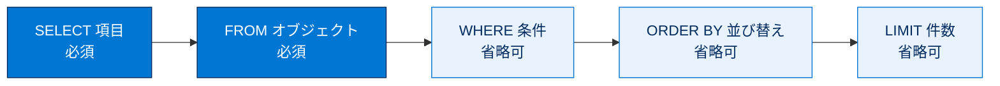
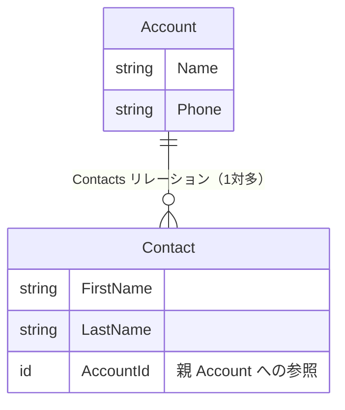
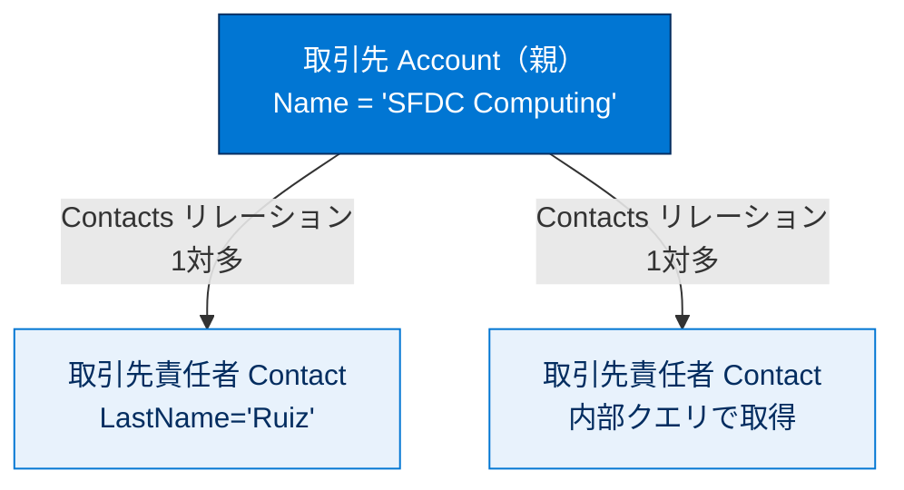

# SOQL クエリを作成する

## 学習の目的

この単元を完了すると、次のことができるようになります。

- Apex 内に SOQL クエリを記述する。
- 開発者コンソールのクエリエディターを使用して SOQL クエリを実行する。
- 匿名 Apex を使用して Apex に埋め込まれた SOQL クエリを実行する。
- 関連レコードを照会する。

> [!ポイント] この単元のゴール
>
> 「**Salesforce のデータベースから、欲しいレコードを欲しい条件で取り出す**」言語が SOQL です。`SELECT 項目 FROM オブジェクト WHERE 条件` という基本形を軸に、`ORDER BY`（並び替え）・`LIMIT`（件数制限）・バインド変数（`:変数`）・親子クエリの4点を押さえれば試験対策は十分です。

---

## SOQL 入門

Salesforce からレコードを読み込むには **Salesforce Object Query Language (SOQL)** でクエリを作成します。標準の SQL に似ていますが、Salesforce Platform 用にカスタマイズされています。

> [!用語] SOQL（ソークル：Salesforce Object Query Language）
>
> Salesforce のデータベースから**レコードを読み取る（検索する）ための専用言語**。SQL に似ていますが、Salesforce のオブジェクト（テーブルに相当）を対象にします。できるのは原則「読み取り（SELECT）」だけで、追加・更新・削除は DML が担当します。

SOQL は Apex に埋め込んで結果を取得でき、これを**インライン SOQL** と呼びます。SOQL ステートメントを角括弧でラップし、戻り値を sObject の配列に割り当てます。次は名前と電話の2項目を持つすべての取引先を取得する例です。

```apex
Account[] accts = [SELECT Name,Phone FROM Account];
```

> [!用語] インライン SOQL（inline SOQL）
>
> Apex コードの中に SOQL クエリを角括弧 `[ ... ]` で囲んで**そのまま埋め込んで**書く方法。Apex は実行時にそのクエリを発行し、結果を sObject の配列（例：`Account[] accts`）に代入します。実行後は `accts[0].Name` のようにローカル変数のようにアクセスできます。

---

## 前提条件：サンプルデータの作成

この単元の一部のクエリは、組織に取引先と取引先責任者があることを前提とします。クエリ実行前にサンプルデータを作成します。

> [!手順] サンプルデータを作成する
>
> 1. 開発者コンソールの **[Debug (デバッグ)]** メニューから **[Execute Anonymous (匿名実行)]** ウィンドウを開く。
> 2. 次のスニペットを入力し、**[Execute (実行)]** をクリックする。

```apex
// 取引先と関連する取引先責任者を追加する
Account acct = new Account(
    Name='SFDC Computing',
    Phone='(415)555-1212',
    NumberOfEmployees=50,
    BillingCity='San Francisco');
insert acct;
// 取引先が insert されると sObject に ID が自動設定される。それを取得する。
ID acctID = acct.ID;
// この取引先に取引先責任者を追加する。
Contact con = new Contact(
    FirstName='Carol',
    LastName='Ruiz',
    Phone='(415)555-1212',
    Department='Wingo',
    AccountId=acctID);
insert con;
// 取引先責任者を持たない取引先を追加する
Account acct2 = new Account(
    Name='The SFDC Query Man',
    Phone='(310)555-1213',
    NumberOfEmployees=50,
    BillingCity='Los Angeles',
    Description='Expert in wing technologies.');
insert acct2;
```

> [!注意] 取引先責任者の「名前」は複合項目
>
> 取引先責任者の名前項目は `FirstName`・`LastName`・`MiddleName`・`Suffix` を連結した**複合項目**です。オブジェクトマネージャーには複合項目のみがリストされますが、この単元のサンプルコードは個別の項目（`FirstName` や `LastName`）を参照します。

---

## クエリエディターを使用する

開発者コンソールのクエリエディターでは SOQL を実行して結果を表示でき、すばやくデータベースを調査できます。Apex に追加する前のテストに適しています。使うときは前後の Apex コードなしで **SOQL ステートメントのみ**を入力します。

> [!ポイント] クエリエディターと Apex の書き方の違い
>
> - **クエリエディター**：`SELECT Name,Phone FROM Account` のように純粋な SELECT 文だけ（角括弧もセミコロンも不要）。
> - **Apex コード内**：`Account[] a = [SELECT Name,Phone FROM Account];` のように角括弧で囲み変数に代入。
>
> 同じ SOQL でも「どこで使うか」で書き方が変わります。

> [!手順] クエリエディターでクエリを実行する
>
> 1. 開発者コンソールで **[Query Editor (クエリエディター)]** タブをクリックする。
> 2. 次のコードを下の最初のボックスに貼り付け、**[Execute (実行)]** をクリックする。

```sql
SELECT Name,Phone FROM Account
```

組織内のすべての取引先レコードが **[Query Results (クエリ結果)]** セクションに表示されます。

---

## 基本的な SOQL 構文

基本的な SOQL クエリの構文は次のとおりです。

```sql
SELECT fields FROM ObjectName [WHERE Condition]
```

角括弧 `[ ]` で囲まれた `WHERE` 句は省略可能です。次のクエリは取引先の名前項目と電話項目を取得します。

```sql
SELECT Name,Phone FROM Account
```

- **SELECT 句**：取得する項目を指定（複数はカンマ区切り、1 つならカンマ不要）。
- **FROM 句**：取得する標準/カスタムオブジェクトを指定。カスタムオブジェクトは API 参照名の末尾が `__c`（例：`Invoice_Statement__c`）。

SOQL の句は決まった順序で並びます。必須は `SELECT` と `FROM`、残りは省略可能で、書く場合はこの順序を守ります。



主な SOQL の句を整理すると次のとおりです。

| 句 | 役割 | 省略可否 | 例 |
| --- | --- | --- | --- |
| `SELECT` | 取得する項目を指定 | 必須 | `SELECT Name,Phone` |
| `FROM` | 対象オブジェクトを指定 | 必須 | `FROM Account` |
| `WHERE` | 取得条件で絞り込む | 省略可 | `WHERE Name='SFDC Computing'` |
| `ORDER BY` | 結果を並び替える | 省略可 | `ORDER BY Name DESC` |
| `LIMIT` | 取得件数を制限する | 省略可 | `LIMIT 10` |

### 高度な操作（項目の指定方法）

他の SQL と異なり `*` で全項目取得はできません。代わりに `FIELDS()` キーワードで、すべての標準項目 (`FIELDS(STANDARD)`)、すべてのカスタム項目 (`FIELDS(CUSTOM)`)、すべての項目 (`FIELDS(ALL)`) を取得できます。`SELECT` に指定していない項目へアクセスするとエラーになります。

`Id` 項目はクエリに指定しなくても、Apex クエリでは常に返されます（`SELECT Id,Phone FROM Account` と `SELECT Phone FROM Account` は同等）。ただし項目は最低 1 つリストが必要で、`Id` のみ取得する場合は指定します（`SELECT Id FROM Account`）。なお**クエリエディターでは `Id` を明示しないと表示されない**ことがあります（「Apex では Id は常に返る」は試験で問われます）。

> [!注意] SELECT * は使えない
>
> SOQL では `SELECT *` は**使えません**。必要な項目を明示するか `FIELDS(STANDARD)` などのキーワードを使います。不要な項目まで取得してガバナ制限を無駄に消費しないための設計です。

---

## 条件を指定してクエリ結果を絞り込む（WHERE 句）

返される取引先を特定の条件に制限するには `WHERE` 句を追加します。次は名前が SFDC Computing の取引先のみを取得します。文字列比較で大文字・小文字は区別されません。

```sql
SELECT Name,Phone FROM Account WHERE Name='SFDC Computing'
```

> [!用語] WHERE 句
>
> 「どのレコードを取り出すか」の**絞り込み条件**を書く部分。条件を書かなければ全件が返るため、件数が多い組織では `WHERE` で必要なレコードだけに絞るのが基本です。

`WHERE` 句には論理演算子 (`AND`、`OR`) と括弧でグループ化した複数条件を含められます。次は「すべての SFDC Computing 取引先」または「従業員数 25 超かつ請求先市区郡がロサンゼルスの取引先」を返します。

```sql
SELECT Name,Phone FROM Account
   WHERE (Name='SFDC Computing' OR (NumberOfEmployees>25 AND BillingCity='Los Angeles'))
```

WHERE 句でよく使う演算子を整理します。

| 演算子 | 意味 | 使用例 |
| --- | --- | --- |
| `=` | 等しい | `WHERE Name='SFDC Computing'` |
| `>` `<` `>=` `<=` | 大小比較 | `WHERE NumberOfEmployees>25` |
| `AND` | かつ（両方を満たす） | `WHERE A=1 AND B=2` |
| `OR` | または（どちらかを満たす） | `WHERE A=1 OR B=2` |
| `LIKE` | あいまい一致 | `WHERE Name LIKE 'SFDC%'` |
| `%` | 0 文字以上の任意の文字列 | `'SFDC%'` |
| `_` | 任意の 1 文字 | `'SFD_'` |
| `:` | バインド変数（Apex の変数を参照） | `WHERE Department=:targetDepartment` |

> [!例] ワイルドカードの違い（LIKE）
>
> - `'SFDC%'` → 「SFDC」で**始まる**もの（SFDC、SFDC Computing など）。
> - `'%Computing'` → 「Computing」で**終わる**もの。
> - `'SFD_'` → 「SFD」+ **任意の 1 文字**（SFDC、SFDA など。SFDCC は文字数が合わず不一致）。

---

## クエリ結果に順序を付ける（ORDER BY 句）

`ORDER BY` 句を追加しないと返るレコードの順序は保証されません。並び替え基準の項目を指定すると順序が決まります。デフォルトは昇順 (`ASC`) で、降順にするには `DESC` を使います。

```sql
SELECT Name,Phone FROM Account ORDER BY Name        -- 昇順（ASC と同等）
SELECT Name,Phone FROM Account ORDER BY Name DESC   -- 降順
```

> [!用語] ORDER BY 句
>
> 結果レコードを**指定した項目で並び替える**句。`ASC`（昇順）または `DESC`（降順）を指定でき、省略時は昇順。リッチテキストや複数選択リストなど一部の項目では並び替えできません。

---

## 返されるレコード数を制限する（LIMIT 句）

`LIMIT n` 句で返されるレコード数を任意の数に制限できます。次は最初の取引先 1 件のみ取得します。

```apex
Account oneAccountOnly = [SELECT Name,Phone FROM Account LIMIT 1];
```

> [!用語] LIMIT 句
>
> 取得するレコードの**最大件数**を指定する句。`LIMIT 10` なら最大 10 件で、件数を絞ってガバナ制限の消費を抑えたいときに有効です。`LIMIT 1` のように 1 件だけ返ることが確実なら、`Account[] a`（配列）ではなく `Account a`（単一の sObject）で受け取れます。

---

## 句を組み合わせる

省略可能な句は **`WHERE` → `ORDER BY` → `LIMIT`** の順序で組み合わせます。

```sql
SELECT Name,Phone FROM Account
                   WHERE (Name = 'SFDC Computing' AND NumberOfEmployees>25)
                   ORDER BY Name
                   LIMIT 10
```

> [!注意] 句の順序は固定
>
> 順序は **`SELECT` → `FROM` → `WHERE` → `ORDER BY` → `LIMIT`** で固定です。たとえば `LIMIT` を `ORDER BY` より前に書くとエラーになります。

次の Apex 内 SOQL を匿名実行ウィンドウで実行すると、1 件のサンプル取引先が返ります。

```apex
Account[] accts = [SELECT Name,Phone FROM Account
                   WHERE (Name='SFDC Computing' AND NumberOfEmployees>25)
                   ORDER BY Name
                   LIMIT 10];
System.debug(accts.size() + ' account(s) returned.');
// すべての取引先配列の情報をログに出力する
System.debug(accts);
```

---

## SOQL クエリの変数にアクセスする（バインド変数）

Apex の SOQL ステートメントは、前にコロン (`:`) を付けた Apex の変数や式を参照できます。これを**バインド**と呼びます。

> [!用語] バインド変数（bind variable：`:変数名`）
>
> SOQL の中で Apex の変数の値を使う仕組み。変数名の前にコロン `:` を付けます（例：`WHERE Department=:targetDepartment`）。実行時に変数の中身が差し込まれます。ユーザー入力値で検索するなど、条件を動的に変えたいときに必須です。

次は `WHERE` 句で `targetDepartment` 変数を使う例です。`targetDepartment` に `'Wingo'` が入っているので、実行時には `WHERE Department='Wingo'` が発行されます。

```apex
String targetDepartment = 'Wingo';
Contact[] techContacts = [SELECT FirstName,LastName
                          FROM Contact WHERE Department=:targetDepartment];
```

---

## 関連レコードを照会する

Salesforce 内のレコードはリレーション（参照関係または主従関係）でリンクでき、SOQL で関連レコードを照会できます。取引先と取引先責任者は1対多の関係で、親から子・子から親のどちらの方向にもたどれます。



### 親から子を取得する（内部クエリ）

親に関連する子を取得するには、子への**内部クエリ**を追加します。内部クエリの `FROM` 句は、オブジェクト名ではなく**リレーション名**に対して実行します。次は取引先ごとに関連する取引先責任者を取得する例で、`FROM` 句に `Contacts` リレーション（Account のデフォルト）を指定します。

> [!用語] 親子クエリ（内部クエリ／サブクエリ）
>
> 親のクエリの中に、子を取得する小さなクエリを `( )` で入れ子にする書き方。1 回で「親 + 関連する子」をまとめて取得できます。子側の `FROM` には、オブジェクト名ではなく**リレーション名**（標準なら `Contacts` など）を指定するのがポイントです。

```sql
SELECT Name, (SELECT LastName FROM Contacts) FROM Account WHERE Name = 'SFDC Computing'
```



次は内部クエリを Apex に埋め込み、`Contacts` リレーション名で子レコードを取得する例です。

```apex
Account[] acctsWithContacts = [SELECT Name, (SELECT FirstName,LastName FROM Contacts)
                               FROM Account
                               WHERE Name = 'SFDC Computing'];
// 子レコードを取得する
Contact[] cts = acctsWithContacts[0].Contacts;
System.debug('Name of first associated contact: '
             + cts[0].FirstName + ', ' + cts[0].LastName);
```

> [!用語] リレーション名（relationship name）
>
> 親から子をたどるときに使う「子の集合の呼び名」。取引先から見た取引先責任者の集合は `Contacts`。標準オブジェクト同士は決められた名前があり、カスタムリレーションは末尾が `__r` になります。

### 子から親をたどる（ドット表記）

ドット表記で子（取引先責任者）から親の項目（`Account.Name`）へ**トラバース**できます。次は名が Carol の取引先責任者から、関連する取引先名を取得する例です。

> [!用語] ドット表記でのトラバース（dot notation traversal）
>
> 子レコードから親の項目へドット `.` でたどる書き方。取引先責任者から親の取引先名は `Account.Name`。子側に親への参照が 1 つしかないため `.親.項目` で一意にたどれます。

```apex
Contact[] cts = [SELECT Account.Name FROM Contact
                 WHERE FirstName = 'Carol' AND LastName='Ruiz'];
Contact carol = cts[0];
String acctName = carol.Account.Name;
System.debug('Carol\'s account name is ' + acctName);
```

> [!ポイント] 親子クエリの方向で書き方が変わる
>
> - **親 → 子**（取引先から取引先責任者）：内部クエリ `(SELECT ... FROM Contacts)`。**リレーション名**を指定。
> - **子 → 親**（取引先責任者から取引先名）：ドット表記 `Account.Name`。**項目名**を `親.項目` でたどる。
>
> 「どちらからどちらをたどるか」で書き方が逆になる点が試験で問われます。なおカスタムリレーション名は `__r` で終わります（例：`Invoice_Statement__c` の `Line_Items__r`）。

---

## SOQL for ループを使用してレコードを一括で照会する

**SOQL for ループ**を使うと、`for` ループ内に SOQL クエリを追加し、結果を反復処理できます。レコードを効率よくチャンク分割して取得するため、**ヒープサイズ制限**への到達を回避できます。

> [!用語] SOQL for ループ
>
> SOQL クエリの結果を `for` ループで 1 件ずつ（または 200 件のバッチごとに）処理する構文。結果を一度に全てメモリへ展開せず少しずつ取り出すため、大量レコードでもメモリ（ヒープ）を使い切りにくいのが特徴です。

> [!用語] ヒープサイズ制限 / ガバナ制限（governor limits）
>
> Salesforce は 1 つのサーバーを共有するため、1 回の処理が使えるリソースに上限（**ガバナ制限**）があります。**ヒープサイズ制限**はその一種で、処理中にメモリ上に保持できるデータ量の上限です。大量レコードを一度に変数へ読み込むと超過するため、SOQL for ループで分割処理します。

SOQL for ループの構文は次のいずれかです。

```apex
for (variable : [soql_query]) {
    code_block
}
```

または

```apex
for (variable_list : [soql_query]) {
    code_block
}
```

`variable` および `variable_list` は `soql_query` で返される sObject と同じ型である必要があります。**sObject リスト形式**（`variable_list` 形式）はバッチ単位での DML 一括実行が可能になるため推奨されます。

```apex
insert new Account[]{new Account(Name = 'for loop 1'),
                     new Account(Name = 'for loop 2'),
                     new Account(Name = 'for loop 3')};
// sObject リスト形式は、返されたレコードのバッチごとに for ループを 1 回実行する
Integer i=0;
Integer j=0;
for (Account[] tmp : [SELECT Id FROM Account WHERE Name LIKE 'for loop _']) {
    j = tmp.size();
    i++;
}
System.assertEquals(3, j); // 'for loop 1〜3' の 3 件が含まれるはず
System.assertEquals(1, i); // 1 バッチは最大 200 件。3 件だけなのでループは 1 回
```

> [!ポイント] なぜ「リスト形式」が推奨されるのか
>
> 1 件ずつ処理する `for (Account a : [...])` 形式に対し、`for (Account[] tmp : [...])` 形式は **200 件単位のバッチ**でループします。バッチ単位でまとめて DML を実行できるため、ループ内で 1 件ずつ DML を呼んでガバナ制限に達するのを防げます。

---

## 試験対策：押さえておきたい追加ポイント

> [!ポイント] SOQL とガバナ制限・バルク化
>
> - 1 トランザクションで発行できる **SOQL クエリは 100 回まで**（同期実行）、返せる**行数は合計 50,000 行まで**。
> - 回避策は、ループの外でまとめてクエリする「**バルク化**」と、メモリ節約のための **SOQL for ループ**。
> - **バルク化**＝ループ内で 1 件ずつ SOQL/DML を呼ばず、ループの外でまとめて 1 回呼ぶ設計。トリガーやクラスは複数レコードが一度に処理される前提で書くのが Salesforce のベストプラクティス。

> [!ポイント] SOQL と SOSL の使い分け（予告）
>
> - **SOQL**：対象オブジェクトと条件が分かっているときに使う。1 つ（または関連する）オブジェクトを正確な条件で検索。
> - **SOSL**（Salesforce Object Search Language）：複数のオブジェクトを**横断してテキスト検索**したいときに使う（全文検索に近い）。
>
> 「対象が決まっている＝SOQL、横断テキスト検索＝SOSL」と覚えましょう。

> [!注意] バインド変数で SOQL インジェクションを防ぐ
>
> ユーザー入力値を文字列連結で動的 SOQL に埋め込むと、**SOQL インジェクション**（悪意ある入力でクエリを書き換えられる攻撃）のリスクがあります。可能な限り文字列連結ではなく**バインド変数（`:変数`）**を使うのが安全です。

---

## リソース

- SOQL および SOSL リファレンス

---

## ハンズオン Challenge（+500 ポイント）

> [!まとめ] あなたの Challenge：入力パラメーターに基づいて取引先責任者を返す Apex クラスを作成する
>
> 2 つの文字列を受け入れるメソッドを含むクラスを作成します。姓が最初の文字列と一致し、郵便番号が 2 つ目の文字列と一致する取引先責任者を検索し、その ID と名前を取得して返します。
>
> **要件**
> - この Apex クラスは **`ContactSearch`** という名前で、通用範囲を **public** にする。
> - **`searchForContacts`** という **public static** メソッドを含める。
> - **2 つの文字列**をパラメーターとして受け入れる。
> - 姓が最初の文字列と一致し、郵便番号（API 参照名：**`MailingPostalCode`**）が 2 つ目の文字列と一致する取引先責任者を検索する。
> - データ型が**リスト**で、**[ID] 項目**と **[Name (名前)] 項目**を含む取引先責任者のリストを返す。
>
> **準備**：各自のハンズオン組織で実行します。**[起動]** をクリックして開始します。

> [!注意] 日本語環境で受講する場合
>
> Challenge は日本語の Trailhead Playground で開始し、かっこ内の翻訳を参照しながら進めます。評価は英語データに対して行われるため、**英語の値のみ**をコピー&ペーストします。不合格の場合は、(1) [Locale (地域)] を [United States (米国)]、(2) [Language (言語)] を [English (英語)] に切り替えてから、(3) [Check Challenge (Challenge を確認)] をクリックすると通ることがあります。
