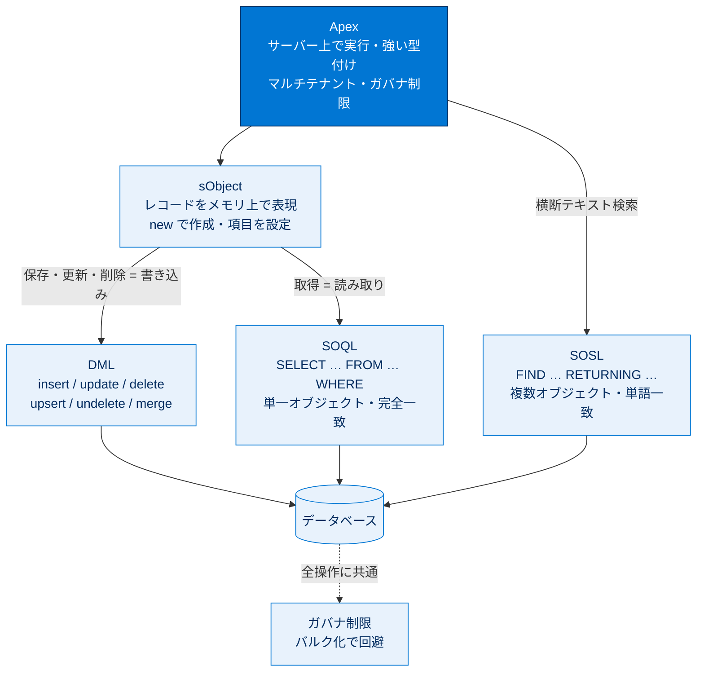

# Apex の基本とデータベース 総まとめ

このトピックでは、Salesforce 専用のプログラミング言語 **Apex** を起点に、データベースと対話するための4つの言語・手段——メモリ上でレコードを表す **sObject**、レコードを操作する **DML**、レコードを取得する **SOQL**、複数オブジェクトを横断検索する **SOSL**——を順に学びました。共通して流れるテーマは「**マルチテナント環境のガバナ制限を意識し、ループ内でクエリ／DML を呼ばないバルク化で書く**」ことです。Apex がサーバー上でどう動き、どの手段でデータをどう読み書きするのかを1枚で思い出せるよう、ここで全体を俯瞰します。

---

## 全体像：Apex とデータベースの関係

次の図は、このトピックで登場した概念がどう連携してデータベースと対話するかを表したものです。

---

## ユニット横断早見表

| ユニット | 学んだこと | キーワード | 一言要点 |
| --- | --- | --- | --- |
| **01 Apex 入門** | Apex の特徴とクラス／匿名 Apex／デバッグログ | Java 風・サーバー実行・強い型付け・マルチテナント・List/Set/Map・static | サーバー上で動く言語。保存＝コンパイル、匿名 Apex で実行、ログで確認 |
| **02 sObject を使用する** | レコードを Apex で表す型と項目設定 | sObject・new・コンストラクター／ドット表記・API 参照名・`__c`/`__r`・キャスト | レコード = sObject。表示ラベルでなく API 参照名で項目を扱う |
| **03 DML でレコードを操作** | レコードの作成・更新・削除と例外処理 | insert/update/delete/upsert/undelete/merge・DmlException・Database メソッド・トランザクション | 書き込みは DML。全件確実か部分完了かで使い分ける |
| **04 SOQL クエリ** | レコードの取得と関連レコード照会 | SELECT…FROM…WHERE・ORDER BY・LIMIT・バインド変数・親子クエリ | 読み取りは SOQL。単一オブジェクトを条件で取得、リレーションでたどる |
| **05 SOSL クエリ** | 複数オブジェクトの横断テキスト検索 | FIND…RETURNING・単語一致・List&lt;List&lt;sObject&gt;&gt;・SearchGroup | 横断検索は SOSL。単語一致で複数オブジェクトをまとめて探す |

---

## 🎯 試験頻出ポイント

> [!ポイント] このトピックで狙われやすい論点・暗記値
>
> - **Apex の特徴**：Java に似た構文・サーバー上で保存／コンパイル／実行・強い型付け・マルチテナント・大文字小文字を区別しない、はセットで暗記。
> - **コレクション**：List（順序付き・重複可）／ Set（重複なし）／ Map（キーと値）。リストのインデックスは **0 から**。
> - **API 参照名**：カスタム項目／オブジェクトは `__c`、カスタムリレーションは `__r`、標準はサフィックスなし。**項目は表示ラベルでなく API 参照名で参照**。
> - **DML 6 種**：`insert`/`update`/`delete`（一般）と `upsert`/`undelete`/`merge`（Salesforce 固有）。`merge` は4標準オブジェクトのみ最大3件、`delete` はごみ箱に15日。
> - **upsert のキー一致**：0 件→挿入／1 件→更新／**2 件以上→エラー**。
> - **DML ステートメント vs Database メソッド**：全件確実なら DML（all or none・DmlException）、部分完了なら Database メソッド（`allOrNone=false`・結果配列）。
> - **SOQL**：句順は `SELECT→FROM→WHERE→ORDER BY→LIMIT` 固定。`SELECT *` 不可。Apex では `Id` が常に返る。親→子は内部クエリ（リレーション名）、子→親はドット表記。
> - **SOSL**：`FIND` で開始、複数オブジェクト横断・単語一致、戻り値は `List<List<sObject>>`。**Apex は `' '`／エディターは `{ }`**。
> - **ガバナ制限（同期の目安）**：SOQL **100 クエリ・50,000 行**、DML **150 ステートメント・10,000 行**、SOSL **20 クエリ・2,000 行**、CPU **10,000 ms**。**ループ内でクエリ／DML を呼ばない＝バルク化**が最重要。本番デプロイは**コードカバー率 75% 以上**。

---

## 📖 用語早見表

| 用語 | ひとことの意味 |
| --- | --- |
| Apex | Salesforce サーバー上で動く Java 風のプログラミング言語 |
| マルチテナント | 多数の企業が1つのプラットフォームを共有する方式 |
| ガバナ制限 | 1組織が資源を独占しないよう課される実行時の上限値 |
| バルク化 | ループ内で1件ずつでなく、まとめて1回で処理する設計 |
| 匿名 Apex | 保存せずその場で1回だけ実行する Apex コード |
| static | インスタンスを作らずクラス名から直接呼べるメソッド |
| sObject | Salesforce のレコードを Apex のメモリ内で表す型 |
| API 参照名 | Apex／SOQL からオブジェクト・項目を参照する正式名称 |
| `__c` / `__r` | カスタム項目／オブジェクト（`__c`）・カスタムリレーション（`__r`）のサフィックス |
| キャスト | 汎用 sObject を特定の型として扱い直すこと |
| DML | レコードを作成・更新・削除する命令文 |
| upsert | 「あれば更新・なければ挿入」を1ステートメントで行う |
| DmlException | DML 操作の失敗時に投げられる例外 |
| トランザクション | 全部成功するか全部取り消すかを保証する処理単位 |
| SOQL | 単一オブジェクトをクエリ（取得）する言語 |
| SOSL | 複数オブジェクトを横断テキスト検索する言語 |
| バインド変数 | `:変数` で Apex の値を SOQL/SOSL に差し込む仕組み |
| 親子クエリ | 親のクエリに子の内部クエリを入れ子にする書き方 |

---

> [!豆知識] 4 文字略語の覚え方「DML・SOQL・SOSL」
>
> データ操作は **DML**（Data Manipulation Language＝操作）、読み取りは **SOQL**（Query＝問い合わせ）、横断検索は **SOSL**（Search＝検索）。「**書くなら DML、読むなら SOQL、探すなら SOSL**」と動詞で結びつけると混同しません。SOQL は「ソークル」、SOSL は「ソスル」と読みます。

> [!豆知識] ガバナ制限は「数より考え方」が問われる
>
> 試験では具体的な数値（SOQL 100・DML 150 など）も出ますが、それ以上に「**なぜループ内でクエリ／DML を呼んではいけないのか**」という設計思想が重視されます。200 件のレコードを1件ずつ処理すると一瞬で制限に達するため、Salesforce では「コードは常に複数レコードがまとめて来る前提（バルク）で書く」のがベストプラクティス。これは後のトリガーの単元でも繰り返し登場する最重要テーマです。

> [!豆知識] sObject 変数には保存前から ID 用の箱がある
>
> `new Account(Name='Acme')` で作った sObject は、まだ保存されていないので `Id` 項目は空です。しかし `insert acct;` を実行した瞬間、Salesforce が採番した ID が**同じ変数の `acct.Id` に自動で書き戻されます**。だから挿入直後にもう一度クエリし直さなくても、その変数を `update` や子レコードの外部キーにそのまま使えます。地味ですが実務で多用する便利な挙動です。

---

## ✅ 理解度セルフチェック

> [!まとめ] 理解度を確認しよう（答えは各項目の末尾）
>
> 1. Apex のコードはどこで保存・コンパイル・実行される？ → **Salesforce のサーバー上**
> 2. リストの最初の要素のインデックス番号は？ → **0**
> 3. カスタムリレーション項目の API 参照名の末尾に付くサフィックスは？ → **`__r`**
> 4. `upsert` の照合キーが **2 件以上**のレコードに一致したらどうなる？ → **エラー（挿入も更新もされない）**
> 5. 一部のレコードが失敗しても成功分はコミットしたい。DML ステートメントと Database メソッドのどちらを使う？ → **Database メソッド（`allOrNone=false`）**
> 6. 複数のオブジェクトを横断して単語でテキスト検索したいとき使う言語は？ → **SOSL**（単一オブジェクトの取得は SOQL）
