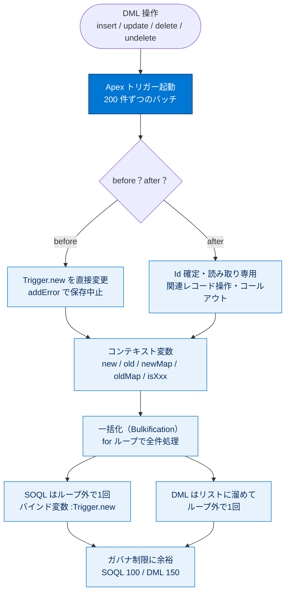

# Apex トリガー 総まとめ

このトピックでは、レコードの保存イベント（挿入・更新・削除・復元）の前後に Apex を自動実行する「Apex トリガー」の基礎と、それを大量レコードでも安全に動かす「一括化（Bulkification）」を学びました。トリガーの構文・before / after の使い分け・コンテキスト変数・`addError()` による保存制限・非同期コールアウトから、SOQL / DML をループの外でまとめるガバナ制限対策までが範囲です。「トリガーは常に複数件を想定して書く」という一貫した姿勢が、両ユニットを貫くいちばんの軸です。

---

## 全体像：Apex トリガーの世界

---

## ユニット横断 早見表

| ユニット | 学んだこと | キーワード | 一言要点 |
| --- | --- | --- | --- |
| 01 Apex トリガー入門 | トリガーの構文・種類・コンテキスト変数・`addError()`・コールアウト | `trigger ... on ...`、before / after、`Trigger.new`、`addError()`、`@future(callout=true)` | 保存の前後に Apex を自動実行。before は自レコード変更、after は Id 利用・関連操作。 |
| 02 一括 Apex トリガー | レコードセットを効率処理する一括化の設計パターン | Bulkification、`for` ループ、バインド変数、ループ外 SOQL / DML、ガバナ制限、`operationType` + `switch` | 常に複数件を想定。`for` で全件、SOQL / DML はループの外で1回だけ。 |

---

## 🎯 試験頻出ポイント

> [!ポイント] このトピックで狙われやすい論点
>
> - **before / after の使い分け**：自レコードの項目を補正・検証 → before（DML 不要で `Trigger.new` を直接変更）。確定した `Id` を使い関連レコードを操作 → after（読み取り専用）。
> - **コンテキスト変数の可用性**：`delete` では `Trigger.new` が使えない、`insert` では `Trigger.old` が使えない。Id で引くなら `newMap` / `oldMap`。
> - **保存の中止**：sObject の **`addError()`** で致命的エラーを出す。`before delete` なら `Trigger.oldMap.get(id).addError(...)`。
> - **コールアウト**：トリガーから直接（同期）呼ぶと `You have uncommitted work pending` エラー。**`@future(callout=true)`** で非同期にする。
> - **ガバナ制限の数値（暗記）**：SOQL 同期 100 / 非同期 200 回、DML 150 回、DML 対象 10,000 件、SOQL 取得 50,000 件（1トランザクション）。
> - **一括化の二大原則**：`for` ループで全件処理／SOQL・DML はループの外で1回。`Trigger.new[0]` だけ触るのは NG。
> - **バッチ単位**：トリガーは 200 件ずつのバッチで起動し、ガバナ制限はバッチごとにカウント。
> - **設計ベストプラクティス**：1オブジェクト1トリガー、ロジックはハンドラークラスへ委譲、再帰は静的変数フラグで防止。

---

## 📖 用語早見表

| 用語 | ひとことの意味 |
| --- | --- |
| Apex トリガー | レコードの保存イベント前後に自動実行される Apex コード。 |
| トリガーイベント | 起動タイミング。`before`/`after` × `insert`/`update`/`delete`/`undelete`。 |
| before トリガー | 保存前に起動。`Trigger.new` を直接変更可（DML 不要）。 |
| after トリガー | 保存後に起動。`Id` 確定済みでレコードは読み取り専用。 |
| コンテキスト変数 | トリガー実行中だけ使える `Trigger.xxx` 変数群。 |
| `Trigger.new` / `old` | 新／旧バージョンの sObject リスト。 |
| `Trigger.newMap` / `oldMap` | Id をキーにした新／旧 sObject のマップ。 |
| `addError()` | sObject に呼ぶと保存を中止する致命的エラーを生成。 |
| コールアウト | Apex から外部 Web サービスへの HTTP リクエスト。 |
| future メソッド | `@future` を付けて非同期実行するメソッド。 |
| 一括化（Bulkification） | 複数件をまとめて正しく・効率的に処理する書き方。 |
| ガバナ制限 | マルチテナント環境での処理リソース上限。 |
| バインド変数 | SOQL の `WHERE` に `:変数` で Apex 値を差し込む仕組み。 |
| SOQL for ループ | SOQL を `for` に直接書く簡潔な反復記法。 |
| `Trigger.operationType` | 現在の操作を表す列挙値。`switch` と組み合わせる。 |
| ハンドラークラス | トリガーから実ロジックを切り出した委譲先クラス。 |

---

> [!豆知識] 「1オブジェクト1トリガー」が鉄則な理由
>
> 同じオブジェクトに複数のトリガーを定義すると、それらの実行順序は Salesforce が保証してくれません。順序に依存したロジックを書くと「昨日は動いたのに今日は壊れた」という再現困難なバグになります。だから1つのトリガーにまとめ、内部の振り分けはハンドラークラスに任せるのが業界標準のベストプラクティスです。

> [!豆知識] `addError()` の部分的成功という落とし穴
>
> 同じ `addError()` でも、Apex の DML ステートメントで呼ぶと操作全体がロールバックされますが、Platform API の一括 DML コールではエラーのないレコードだけが保存される「部分的成功」になります。同じコードでも呼び出し経路によって挙動が変わるため、試験でも実務でも引っかかりやすいポイントです。

> [!豆知識] トリガーの保存順序（Order of Execution）
>
> 1件のレコード保存の裏側では、システム検証 → before トリガー → カスタム検証（入力規則）→ レコード保存 → after トリガー → 積み上げ集計 → ワークフロー → フロー → … という長い「実行順序」が決まっています。トリガーはこの大きな流れの一部であり、なぜ before で項目を直せて after で Id が使えるのかは、この順序を知ると腑に落ちます。

---

## ✅ 理解度セルフチェック

> [!まとめ] 答えながら理解度を確認しよう
>
> 1. **Q.** 同じレコードの項目を保存前に補正したい。before / after どちら？
>    **A.** before（`Trigger.new` を直接変更でき、DML も不要）。
> 2. **Q.** `delete` 操作のトリガーで `Trigger.new` は使える？
>    **A.** いいえ。削除では `Trigger.old` / `Trigger.oldMap` を使う。
> 3. **Q.** 特定条件のレコードを保存させたくない。どのメソッドを呼ぶ？
>    **A.** 対象 sObject の `addError()`。
> 4. **Q.** トリガーから外部 Web サービスへコールアウトするには？
>    **A.** `@future(callout=true)` メソッド（または Queueable）経由で非同期に行う。
> 5. **Q.** 一括化の二大原則を答えよ。
>    **A.** (1) `for` ループで全件処理、(2) SOQL / DML はループの外で1回だけ実行。
> 6. **Q.** トリガーは一度に何件ずつのバッチで起動し、ガバナ制限はどの単位でカウントされる？
>    **A.** 最大 200 件ずつのバッチで起動し、ガバナ制限はバッチ（起動）単位でカウントされる。
