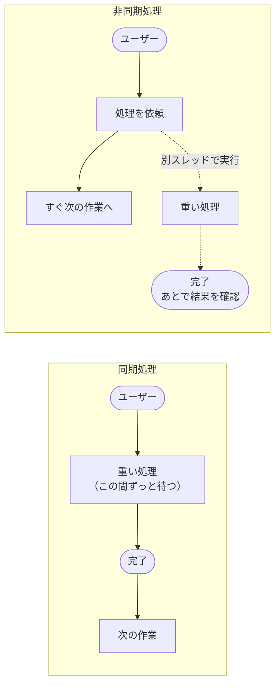
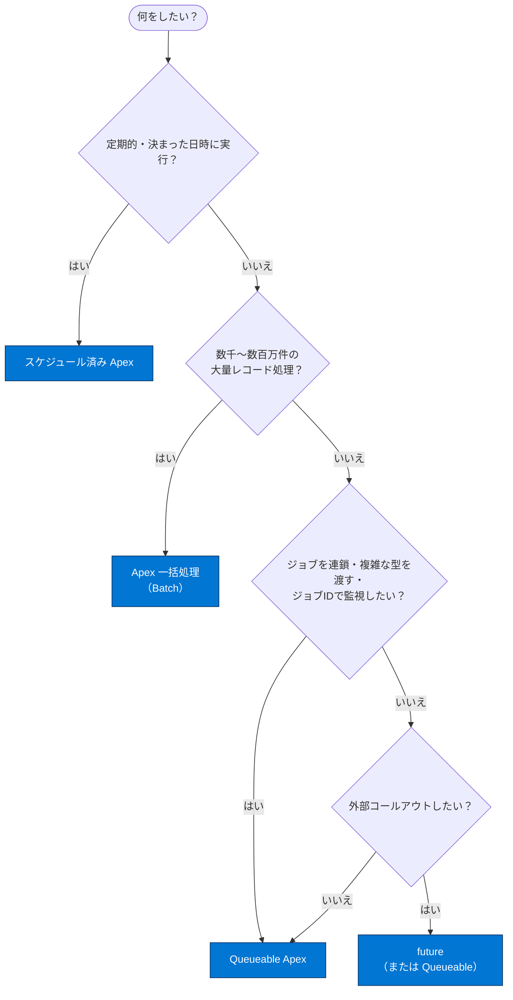
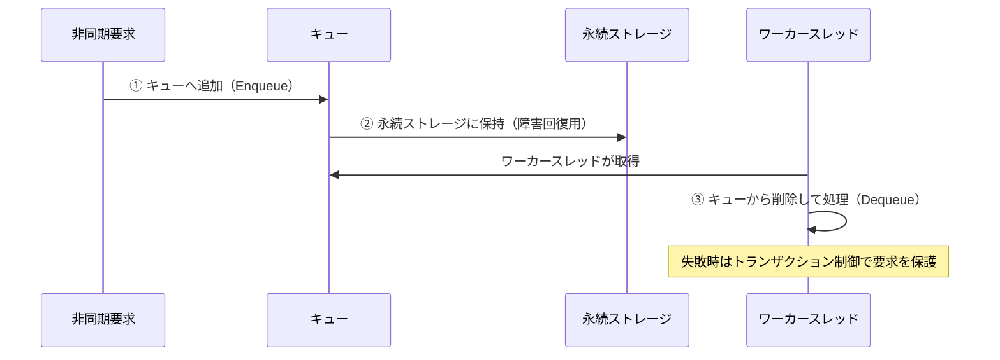
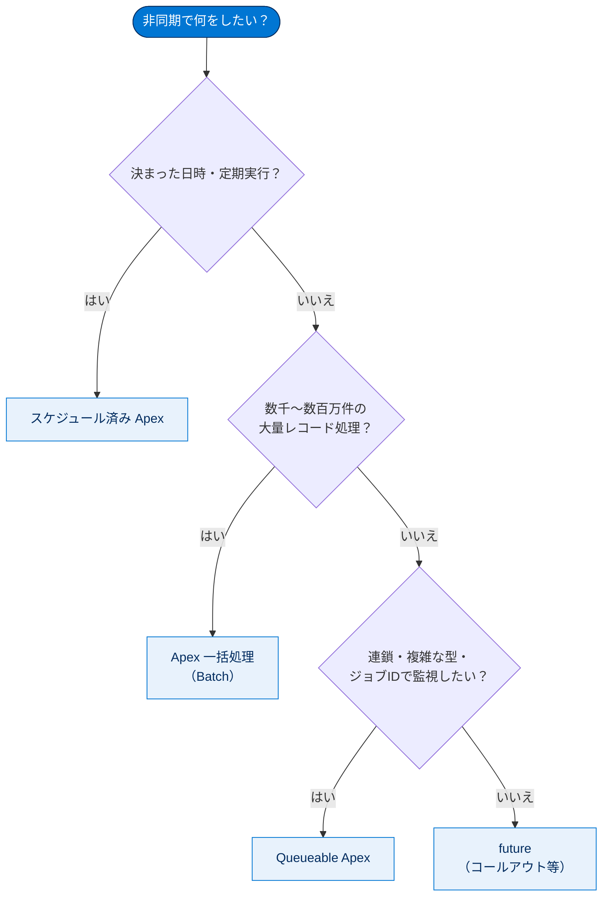

# 非同期 Apex の概要と種類の選択

## 学習の目的

この単元を完了すると、次のことができるようになります。

- 非同期 Apex とは何か、なぜ使うのかを説明する。
- 非同期処理によってガバナ制限と実行制限がどのように緩和されるかを理解する。
- 4 種類の非同期 Apex（future・Apex 一括処理・Queueable・スケジュール済み）を区別し、適切な種別を選択する。
- マルチテナント環境で非同期処理がどう管理されるか（キューベースのフレームワーク）を説明する。

> [!ポイント] この単元のゴール
>
> 「**時間のかかる処理をバックグラウンドに逃がし、ユーザーを待たせずに、ガバナ制限を緩めて実行する**」のが非同期 Apex。「同期と非同期の違い」「制限緩和のしくみ」「4 種別の使い分け」の 3 点が試験の土台。

---

## 非同期 Apex とは

**非同期 Apex** は、複数の処理を後で別個のスレッドで実行するために使う。ユーザーが終了まで待つことなく、タスクを「バックグラウンド」で実行する機能。

> [!用語] Apex（エイペックス）
>
> Salesforce プラットフォーム上で動く言語。Java に似た構文で DML（DB 操作）や SOQL（レコード検索）を直接書け、標準機能で実現できないカスタムロジックの実装に使う。

> [!用語] 同期処理・非同期処理（synchronous / asynchronous）
>
> - **同期処理**：処理が終わるまで次に進めない。ユーザーは結果が返るまで待つ。
> - **非同期処理**：処理をバックグラウンドに預け、ユーザーはすぐ次の作業に移れる。

> [!例] 車の修理にたとえると
>
> - **同期**：直るまで何もできず工場で待つ。
> - **非同期**：車を預け、直ったと連絡が来るまでに他の用事を済ませる。

---

## 非同期処理を使うべき場面とメリット

外部システムへのコールアウト、制限の緩和が必要な操作、特定時刻に実行するコードに最適。

| メリット | 内容 |
| --- | --- |
| **ユーザーの効率** | 重い計算を逃がし、ユーザーは作業を続行。結果は都合のよいときに確認。 |
| **拡張性** | リソースが空いた時点で実行でき、並行処理で多くのジョブを扱える。 |
| **制限の緩和** | ガバナ制限・実行制限が緩和された新スレッドで開始する。 |

> [!用語] コールアウト（callout）
>
> Salesforce から外部システム（Web API など）へ HTTP リクエストを送る処理。トリガーなど DML の途中からは直接コールアウトできないため、非同期に逃がすのが定石。

---

## 非同期 Apex の 4 種類

| 種別 | 概要 | 一般的なシナリオ |
| --- | --- | --- |
| **future メソッド** | 独自スレッドで実行され、リソースが空くまで開始しない。同用途では **Queueable が推奨**。 | Web サービスコールアウト。 |
| **Apex 一括処理（Batch）** | 通常の制限を超える大規模ジョブを、レコードのバッチ単位に分けて実行。 | データ整理やレコードのアーカイブ。 |
| **Queueable Apex** | future に似るが、ジョブのチェーニングが可能で複雑なデータ型を使える。 | 外部 Web サービスを使った逐次処理。 |
| **スケジュール済み Apex** | 特定の時間に実行されるようスケジュールする。 | 日次・週次タスク。 |

> [!ポイント] 種別選択の判断ポイント（頻出）
>
> - **コールアウトしたい** → future（または Queueable）。
> - **数千〜数百万件の大量レコードを処理** → Apex 一括処理（Batch）。
> - **ジョブを連鎖・複雑な型を渡す・ジョブ ID で監視** → Queueable。
> - **決まった日時／定期的に実行** → スケジュール済み Apex。

> [!例] 種別を組み合わせる
>
> **スケジュール済み Apex から Apex 一括処理を起動**できる（例：毎晩 0 時に大量レコードのクレンジングバッチを走らせる）。

---

## ガバナ制限と実行制限の緩和

非同期 Apex の主な利点はガバナ制限・実行制限の緩和。SOQL クエリ数は **100→200** へ倍増し、合計ヒープサイズや最大 CPU 時間も大きくなる。

> [!用語] ガバナ制限（Governor Limits）
>
> Salesforce は多数の顧客が同じインフラを共有する**マルチテナント環境**。1 組織が暴走して全体のリソースを食いつぶさないよう、「1 トランザクションの SOQL は最大 100 回」「DML 行数は最大 10,000 行」のように上限を設けたもの。

> [!ポイント] 同期 vs 非同期の主なガバナ制限
>
> | 制限項目 | 同期 | 非同期 |
> | --- | --- | --- |
> | SOQL クエリの発行回数 | 100 | **200** |
> | 合計ヒープサイズ | 6 MB | **12 MB** |
> | 最大 CPU 時間（おおよそ） | 10,000 ms | **60,000 ms** |
>
> 「**非同期にすると主要な制限が概ね倍**」と覚える。

非同期 Apex の制限は、最初に非同期要求をキューに追加した同期要求の制限とは**独立して適用**される。

> [!例] 制限が独立するとは
>
> 同期トランザクションで SOQL を 90 回使ってから非同期メソッドを呼び出すと、その非同期スレッドは**ゼロからカウントし直し**で改めて 200 回まで SOQL を使える。同期の 90 回は引き継がれない。

---

## 非同期処理のしくみ

マルチテナント環境の非同期処理には課題がある。

- **処理の公正さ**：すべての顧客が処理リソースを公正に利用できる。
- **耐障害性**：機器やソフトウェアの障害で非同期要求が失われない。

プラットフォームは**キューベースの非同期処理フレームワーク**で各インスタンス内の複数組織の要求を管理する。

> [!手順] 非同期要求のライフサイクル（3 ステップ）
>
> 1. **キューへの追加（Enqueue）**：適切なデータと共に要求をキューへ追加する。
> 2. **保持（Persistence）**：障害回復とトランザクション機能のため永続ストレージに保存する。
> 3. **キューからの削除（Dequeue）**：要求を削除して処理する。失敗時はトランザクション制御で保護する。

各要求は**ハンドラー**（要求種別ごとに機能を実行するコード）が処理し、ハンドラーは各アプリケーションサーバー上の限定数の**ワーカースレッド**で実行される。

---

## リソース保護

非同期処理はリアルタイム操作よりも**優先度が低い**。キューイングフレームワークはサーバーメモリや CPU 使用率を監視し、しきい値を上回ると非同期処理を減らす（**リソース保護**）。配分以上を使おうとすると通常のしきい値に戻るまで一時停止される。**処理時間は保証されないが、最終的にはすべて処理される**。

> [!注意] 「すぐ実行される」とは限らない
>
> 非同期ジョブは「リソースが空いたら実行」のため、**いつ実行されるかは保証されない**。即時性が必要な処理を非同期に任せてはいけない。多少遅れても問題ない重い処理こそ非同期向き。

---

## 試験対策：押さえておきたい追加ポイント

> [!ポイント] 非同期 Apex のよくある出題
>
> - 主なメリットは**ガバナ制限・実行制限の緩和**（SOQL 100→200、ヒープ 6MB→12MB）。「外部コールアウトが無制限」「共有設定を上書き」「ターボモード」は**誤り**。
> - **Apex 一括処理は大量レコード（数千〜数百万件）の処理に最適**。「組織のすべてのレコードを更新」が典型例。
> - future より **Queueable が推奨**（ジョブ ID 取得・非プリミティブ型・チェーニング）。
> - 非同期ジョブの実行タイミングは**保証されない**（リソースが空き次第）。

---

## リソース

- Apex 開発者ガイド：実行ガバナと制限
- Apex 開発者ガイド：Asynchronous Apex（非同期 Apex）
- Architecture Center：Asynchronous Processing（非同期処理）

---

## テスト

この単元を完了するには、テストのすべての質問に正しく解答する必要があります（+100 ポイント）。

**問 1. 非同期処理の主なメリットは何ですか？**

- A. ガバナ制限と実行制限が高くなる。
- B. 外部コールアウトの数が無制限になる。
- C. 組織の共有設定の共有が上書きされる。
- D. トランザクション処理のターボモードが有効になる。

**問 2. Apex の一括処理は一般的に、何を行うときに最適なタイプの非同期処理ですか？**

- A. ユーザーがレコードを更新するとき、Web サービスにコールアウトを実行する。
- B. ToDo を毎週実行するようにスケジュールする。
- C. 組織ですべてのレコードを更新する。
- D. 取引先責任者にメールを送信する。

> [!まとめ] 解答と解説
>
> - **問 1：A**。核心は「ガバナ制限・実行制限の緩和」。SOQL は 100→200、ヒープは 6MB→12MB に上がり、同期側とは独立してカウントされる。
> - **問 2：C**。Apex 一括処理は「数千〜数百万件」の分割処理が得意。A はコールアウトなので future/Queueable、B はスケジュール済み Apex、D は単発メール送信。

> [!注意] 日本語環境で受講する場合
>
> テストや Challenge は日本語 Playground で開始しても評価は英語データに対して行われる。Challenge では**英語の値のみ**をコピー＆ペーストする。不合格時は、(1) [地域] を [米国]、(2) [言語] を [英語] に切り替えてから、(3) [Check Challenge] をクリックすると通ることがある。

---

## 🎓 この単元のまとめ

この単元では、重い処理をバックグラウンドに逃がしてユーザーを待たせず、ガバナ制限も緩めて実行する「非同期 Apex」の全体像と、4 種別の使い分けを学びました。

次の図は、要件から非同期 Apex の種別を選ぶ判断の流れを俯瞰したものです。

> [!まとめ] この単元の要点
>
> - 非同期 Apex は重い処理を**別スレッドでバックグラウンド実行**し、ユーザーを待たせない。
> - 最大の利点は**ガバナ制限・実行制限の緩和**（SOQL 100→200、ヒープ 6MB→12MB、CPU 時間も拡大）。制限は同期側と**独立してカウント**される。
> - 4 種別は **future / Apex 一括処理（Batch）/ Queueable / スケジュール済み**。要件で使い分ける。
> - プラットフォームは**キューベースのフレームワーク**（Enqueue → 保持 → Dequeue）で公正性と耐障害性を確保する。
> - 非同期ジョブの**実行タイミングは保証されない**（リソースが空き次第。最終的には必ず処理される）。

> [!豆知識] 「200→倍」は覚え方の入口にすぎない
>
> 「非同期にすると主要な制限が概ね倍」は便利な目安ですが、すべての制限が 2 倍になるわけではありません。たとえば DML 行数（10,000 行）は同期・非同期で同じです。倍になるのは SOQL 発行回数・ヒープサイズなど一部で、「重い計算とクエリに効く」と理解しておくと実務での見積もりを誤りません。
