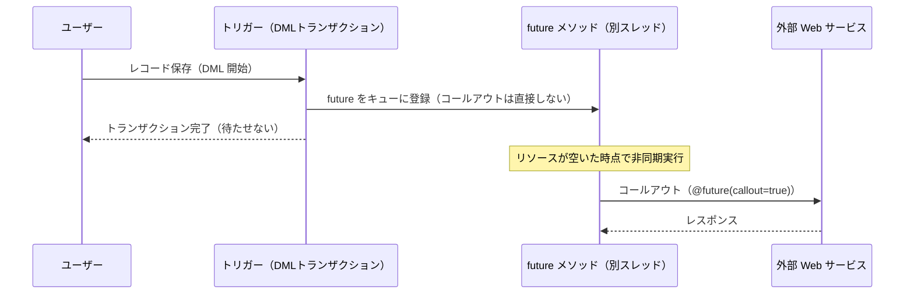
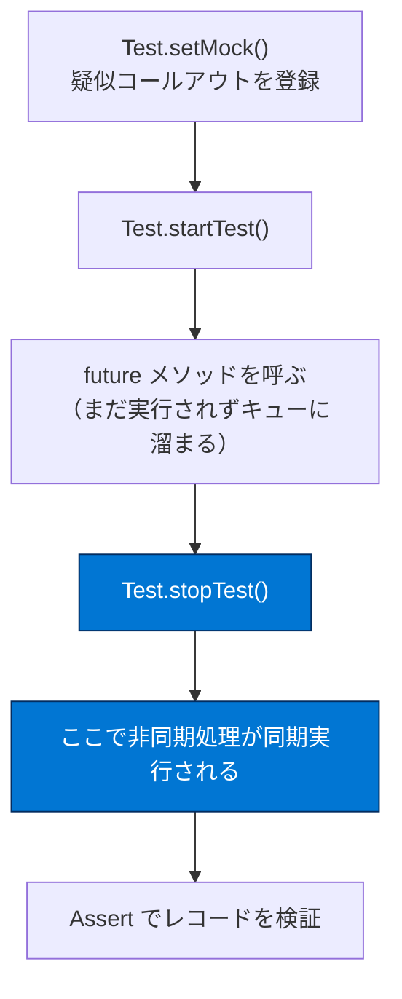

# future メソッドの使用

## 学習の目的

この単元を完了すると、次のことを理解できるようになります。

- future メソッドを使用するケース。
- future メソッドの構文と制約。
- future メソッドで Web サービスコールアウトを実行する方法。
- future メソッドのテスト方法とベストプラクティス。

> [!ポイント] この単元のゴール
>
> 「**`@future` を付けた static メソッドは、後でリソースが空いたときに別スレッドで非同期実行される**」のが future メソッド。**static / 戻り値 void / 引数はプリミティブ型のみ**の 3 つの構文制約と、「コールアウトには `@future(callout=true)`」を押さえれば対策はほぼ完了。

---

## future Apex

`@future` を付けた Apex メソッド（**future メソッド**）は、後でシステムリソースが空いた時点で別スレッドで非同期実行される。ユーザーはほかの操作を続けられ、ガバナ制限・実行制限も引き上げられる。

> [!用語] アノテーション（annotation）
>
> メソッドやクラスの直前に書く `@～` の目印で、特別な振る舞いを指示する。`@future` で「非同期実行」を意味する。ほかに `@IsTest`（テスト用）、`@TestSetup`（テスト前の共通データ作成）など。

> [!用語] static メソッド（静的メソッド）
>
> インスタンス（`new` で作るオブジェクト）を生成せず、クラス名から直接呼び出せるメソッド。future メソッドは必ず static で定義する。

> [!注意] future より Queueable が推奨
>
> 一般に future より **Queueable Apex** が推奨される。Queueable は同用途に対応しつつ、**ジョブ ID の取得・非プリミティブ型のサポート・ジョブのチェーニング**の利点がある。ただし試験では future の構文・制約も問われる。

---

## future メソッドを使う場面

- **外部 Web サービスへのコールアウト**。トリガーから、または DML 後にコールアウトするには future または `Queueable` が必要（トリガー内のコールアウトは DB 接続を開いたままにし、マルチテナント環境では高コスト）。
- 時間が許せば、独自スレッドで実行する操作（**大量のリソースを消費する計算やレコード処理**など）。
- **混合 DML エラーを回避**するため、DML 操作を別個の sObject 型に隔離する場合。

> [!用語] DML（Data Manipulation Language）
>
> レコードを挿入・更新・削除する操作（`insert` / `update` / `delete` / `upsert` など）の総称。

> [!用語] トリガー（Trigger）
>
> レコードの保存・更新・削除イベントの前後（before / after）に自動実行される Apex コード。中からは直接コールアウトできないため future に逃がすのが定番。

> [!例] なぜトリガーから直接コールアウトできないのか
>
> トリガーは DML トランザクションの真っ最中に動く。途中で外部 API へコールアウトすると、応答が返るまで DB ロックを握り続け、ほかのユーザーの処理を妨げる。そこで「コールアウトは future に移し、トランザクション完了後に非同期実行する」設計が必要。



---

## future メソッドの構文

- **static メソッド**である必要がある。
- **`void` 型のみ**を返す（戻り値を持てない）。
- パラメーターは**プリミティブ型またはそのコレクション**のみ。**sObject は取れない**。

> [!用語] プリミティブ型 / sObject
>
> - **プリミティブ型**：`Integer`、`String`、`Boolean`、`Id`、`Date` などの基本型。
> - **sObject**：`Account`、`Contact` など Salesforce のレコードを表すオブジェクト型。
>
> future には sObject を直接渡せないため、一般に**処理するレコード ID の `List` を渡す**。

```apex
public with sharing class SomeClass {
  @Future
  public static void someFutureMethod(List<Id> recordIds) {
    List<Account> accounts = [
      SELECT Id, Name
      FROM Account
      WHERE Id IN :recordIds
      WITH USER_MODE
    ];
    // 取引先レコードを処理して、目的の処理を実行する
  }
}
```

> [!注意] なぜ sObject を渡せないのか
>
> コールから実際の実行までの間にオブジェクトが変更される可能性があるため。実行時に古い値だと悪影響を及ぼす。**ID だけを渡し、実行時に SOQL で最新レコードを取り直す**のが正解。

> [!ポイント] 実行順序は保証されない
>
> **コールされた順序で実行される保証はない**。2 つが並行実行され同じレコードを更新して**ロックされ、ランタイムエラー**が発生することもある。

---

## サンプルコールアウトコード

外部サービスへの Web サービスコールアウトには `(callout=true)` を付けた future メソッドを使う。下記は非同期・同期の両方でコールアウトでき、同期コールでは状況追跡のためカスタムログオブジェクトにレコードを挿入する。

> [!注意] 次の例のクラスは仮定のもの
>
> `SmsMessage` クラスと `SMS_Log__c` sObject は仮定で、コールアウトパターンを示すためのもの。実在の API ではない。

```apex
public with sharing class SMSUtils {
    // トリガーなどコールアウトが許可されない場所から非同期でコールする
    @Future(callout=true)
    public static void sendSMSAsync(String fromNbr, String toNbr, String m) {
        String results = sendSMS(fromNbr, toNbr, m);
        System.debug(results);
    }
    // コントローラーなどから即時処理のためにコールする
    public static String sendSMS(String fromNbr, String toNbr, String m) {
        // 'send' を呼ぶとコールアウトが発生する
        String results = SmsMessage.send(fromNbr, toNbr, m);
        insert as user new SMS_Log__c(to__c=toNbr, from__c=fromNbr, msg__c=results);
        return results;
    }
}
```

> [!ポイント] `@future(callout=true)` を忘れない
>
> future メソッド内から外部へコールアウトする場合は必ず `@future(callout=true)` を指定する。これがないとコールアウト実行時点でエラーになる。

---

## テストクラス

future メソッドのテストは `Test.startTest()` と `Test.stopTest()` で囲む。`startTest()` 後に収集された非同期コールは `stopTest()` の実行時に**同期してまとめて実行**されるため、結果をその場で検証できる。

> [!用語] `Test.startTest()` / `Test.stopTest()`
>
> テスト内で「ここから本番処理」「ここで確定」を示すマーカー。この間に登録された非同期ジョブは `stopTest()` 直後に**同期的にまとめて実行**される。

> [!注意] テストでは実際のコールアウトはできない
>
> テストコードでは実際に外部システムへコールアウトできないため、カバー率のために**疑似コールアウト（モック）**を実行する。詳細は「Apex インテグレーションサービス」モジュール参照。

疑似コールアウトクラスの例。テストフレームワークは実際のコールアウトを行わず、この疑似応答を利用する。

```apex
@IsTest
public with sharing class SMSCalloutMock implements HttpCalloutMock {
    public HttpResponse respond(HttpRequest req) {
        // 疑似のレスポンスを作成する
        HttpResponse res = new HttpResponse();
        res.setHeader('Content-Type', 'application/json');
        res.setBody('{"status":"success"}');
        res.setStatusCode(200);
        return res;
    }
}
```

非同期メソッドが同期メソッドをコールする様子をテストする `testSendSms()`。

```apex
@IsTest
private with sharing class Test_SMSUtils {
  @IsTest
  private static void testSendSms() {
    Test.setMock(HttpCalloutMock.class, new SMSCalloutMock());
    Test.startTest();
      SMSUtils.sendSMSAsync('111', '222', 'Greetings!');
    Test.stopTest();
    // ここでコールアウトが実行され、結果を確認する
    List<SMS_Log__c> logs = [SELECT msg__c FROM SMS_Log__c WITH USER_MODE];
    Assert.areEqual(1, logs.size());
    Assert.areEqual('success', logs[0].msg__c);
  }
}
```

> [!手順] future メソッドのテストの流れ
>
> 1. `Test.setMock()` で疑似コールアウト（モック）を登録する。
> 2. `Test.startTest()` を呼ぶ。
> 3. future メソッド（`sendSMSAsync`）を呼ぶ。この時点ではまだ実行されずキューに溜まる。
> 4. `Test.stopTest()` を呼ぶ。ここで非同期処理が**同期的に実行**される。
> 5. `Assert` でレコードが期待どおり作成されたか検証する。



---

## ベストプラクティス

future を呼ぶたびに 1 要求が非同期キューに追加されるため、**短時間に多くの future 要求を追加する設計は避ける**。一度に 2000 以上を追加し得る場合、フロー制御により遅延することがある。

- future メソッドができるだけ速く実行されるようにする。
- コールアウトごとに別 future を使うのではなく、**同じ future からのコールアウトをまとめる**。
- **大規模に徹底したテスト**を行う。`@future` をキューに入れるトリガーが **200 件のレコード**を処理できることをテストする。
- 大量レコードの非同期処理には、future より **Apex 一括処理**を検討する（レコードごとに future を作るより効率的）。

> [!ポイント] 「200 件」を意識する
>
> トリガーは一度に最大 200 件をまとめて処理する（バルク処理）。「1 件につき future 1 回」だと 200 件更新で 200 回呼ばれ上限に達する。**ID のリストをまとめて 1 回の future に渡す**のが鉄則。

---

## 留意事項

| 留意事項 | 内容 |
| --- | --- |
| **static / void** | `@future` のあるメソッドは static で、`void` 型のみを返す。 |
| **引数はプリミティブのみ** | パラメーターはプリミティブ型またはそのコレクションのみ。sObject は取れない。 |
| **実行順序の非保証** | コールされた順序で実行されるとは限らない。並行実行で同じレコードを更新しロックが起きることもある。 |
| **Visualforce の制約** | コントローラーの `getMethodName()`、`setMethodName()`、コンストラクターでは使用できない。 |
| **future からの再帰禁止** | future から future をコールできない。再帰防止には `System.isFuture()` を使う。 |
| **PDF 系メソッド禁止** | `@future` 内で `getContent()` と `getContentAsPDF()` は使えない。 |
| **コール数の制限** | 呼び出しごとの future コール数は **50** に制限。さらに 24 時間内のコール数制限もある。 |

> [!用語] `System.isFuture()`
>
> 現在のコードが future メソッドの中から呼ばれていれば `true` を返す。「future の中ではさらに future を呼ばない」分岐を書け、再帰的な future 呼び出しエラーを防げる。

---

## 試験対策：押さえておきたい追加ポイント

> [!ポイント] future メソッドのよくある出題
>
> - 構文 3 点セット：**static / 戻り値 void / 引数はプリミティブ（またはその List）のみ**。
> - **sObject を引数に取れない** → ID を渡して中で SOQL し直す。
> - コールアウトには **`@future(callout=true)`**。
> - **future から future は呼べない**（チェーニング不可）。連鎖したいなら Queueable。
> - 実行順序・実行タイミングは**保証されない**。
> - テストは `Test.startTest()` / `Test.stopTest()` で囲み、コールアウトはモックする。

---

## リソース

- Apex 開発者ガイド：future メソッド
- Apex リファレンスガイド：`System.isFuture()` メソッド
- Apex 開発者ガイド：DML 操作で同時に使用できない sObject
- Apex 開発者ガイド：単体テストの組織データとテストデータの分離

---

## ハンズオン Challenge（+500 ポイント）

この単元は各自のハンズオン組織で実行します。[起動] をクリックして開始するか、組織の名前をクリックして別の組織を選びます。

> [!まとめ] あなたの Challenge：`@future` で取引先を更新する Apex クラスを作成する
>
> `@future` を使い、Account ID のリストを受け取って、各取引先に関連付けられた取引先責任者の数でカスタム項目を更新する future メソッドを含む Apex クラスを作成します。コードカバー率 **100%** の単体テストも作成します。
>
> **作成する項目（Account オブジェクト上）**
>
> | 設定 | 値 |
> | --- | --- |
> | 表示ラベル | `Number Of Contacts`（取引先責任者の数） |
> | 名前 | `Number_Of_Contacts` |
> | データ型 | 数値 |
> | 内容 | 取引先の取引先責任者の総数を保持する |
>
> **作成する Apex クラス**
>
> | 設定 | 値 |
> | --- | --- |
> | Name（名前） | `AccountProcessor` |
> | Method name（メソッド名） | `countContacts` |
>
> - メソッドは Account ID のリストを受け入れる必要がある。
> - メソッドは `@future` アノテーションを使用する必要がある。
> - 渡された各 Account ID に関連付けられた Contact レコード数を数え、`Number_Of_Contacts__c` 項目をこの値で更新する。
>
> **作成する Apex テストクラス**
>
> - 名前：`AccountProcessorTest`
> - 単体テストは `AccountProcessor` のすべてのコード行をカバーし、コードカバー率 100% になる必要がある。
> - 完了確認の前に、Developer Console の [Run All（すべて実行）] でテストクラスを少なくとも 1 回実行する。

> [!注意] 日本語環境で受講する場合
>
> Challenge は日本語 Playground で開始し、かっこ内の翻訳を参照しながら進める。評価は英語データに対して行われるため**英語の値のみ**をコピー＆ペーストする。不合格時は、(1) [地域] を [米国]、(2) [言語] を [英語] に切り替えてから、(3) [Check Challenge] をクリックすると通ることがある。

---

## 🎓 この単元のまとめ

この単元では、`@future` を付けた static メソッドを別スレッドで非同期実行する「future メソッド」の構文・制約と、コールアウトのパターン、テスト方法を学びました。

次の表は、future メソッドの「守るべき制約」と「その理由・対処」を一望できるようにまとめたものです。

| 制約・特徴 | 内容 | 理由・対処 |
| --- | --- | --- |
| **static / 戻り値 void** | `@future` メソッドは static で void 固定 | 別スレッドで独立実行するため値を返せない |
| **引数はプリミティブ型のみ** | sObject は渡せない（ID の List を渡す） | 実行までに値が変わる恐れ→中で SOQL し直す |
| **コールアウトは `(callout=true)`** | `@future(callout=true)` を付ける | これがないと実行時にコールアウトエラー |
| **future から future 不可** | チェーニングできない | 連鎖が必要なら Queueable を使う |
| **実行順序・時刻は非保証** | 呼んだ順に動く保証はない | 同一レコード並行更新でロックの恐れ |

> [!まとめ] この単元の要点
>
> - 構文 3 点セット：**static / 戻り値 void / 引数はプリミティブ（またはその List）のみ**。
> - **sObject は渡せない**ため、ID を渡して `execute` 内で最新レコードを SOQL で取り直す。
> - 外部コールアウトには **`@future(callout=true)`** を必ず指定する。
> - **future から future は呼べない**（チェーニング不可）。連鎖したいなら Queueable。
> - 同用途では **Queueable が推奨**（ジョブ ID 取得・非プリミティブ型・チェーニング）。
> - テストは `Test.startTest()` / `Test.stopTest()` で囲み、コールアウトは**モック**する。

> [!豆知識] future の「50 回」と「ID リスト」はトリガー設計の急所
>
> トリガーは一度に最大 200 件をバルク処理しますが、1 件ごとに future を呼ぶと 200 回呼び出しになり、呼び出しごとの future コール上限（50）にあっという間に達します。だから「ID のリストをまとめて 1 回の future に渡す」のが鉄則。この発想は Queueable や Batch でも共通する、非同期設計の基本作法です。
