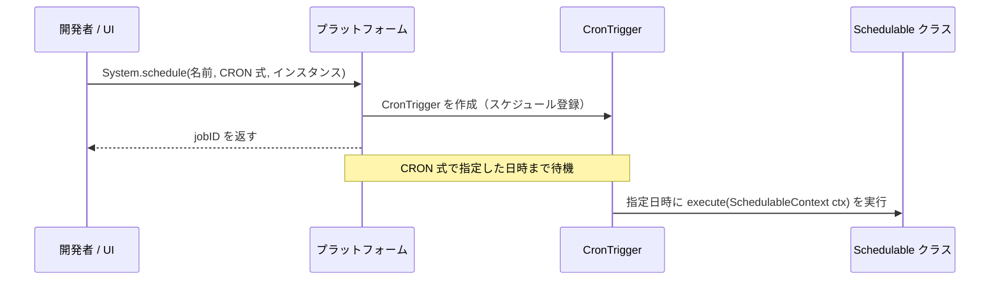
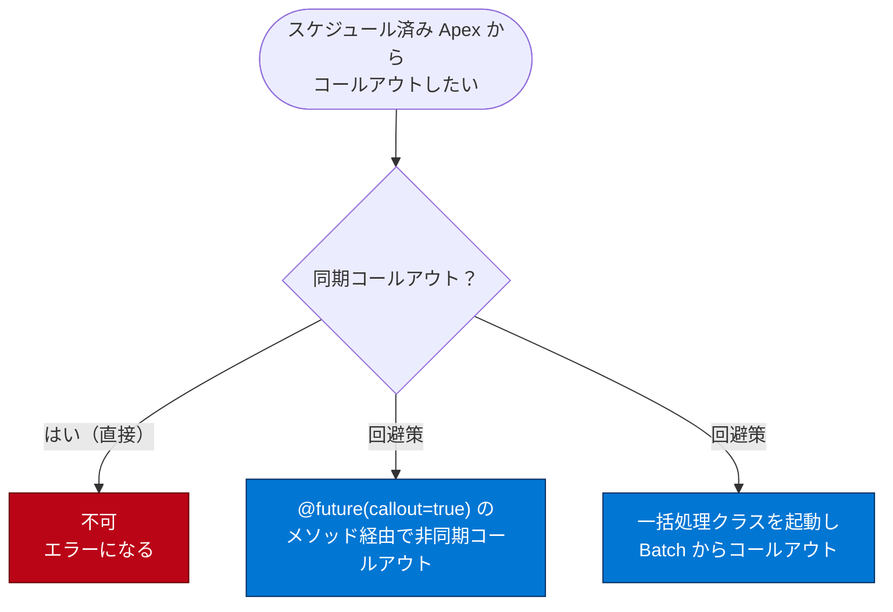

# Apex スケジューラーを使用したジョブのスケジュール

## 学習の目的

この単元を完了すると、次のことを理解できるようになります。

- スケジュール済み Apex を使用するケース。
- スケジュール済みジョブを監視する方法。
- スケジュール済み Apex の構文。
- scheduled メソッドのベストプラクティス。

> [!ポイント] この単元のゴール
>
> 「**`Schedulable` インターフェースを実装し、`System.schedule()` に CRON 式を渡して、指定した日時・周期で Apex を自動実行する**」のがスケジュール済み Apex。**`execute(SchedulableContext ctx)`**、**CRON 式の並び順**、「スケジュール済み Apex から同期コールアウトはできない」点が核心。

---

## スケジュール済みの Apex

**Apex スケジューラー**で、Apex クラスの実行を遅らせて指定した日時に実行できる。Apex 一括処理を使う**日次・週次のメンテナンス作業**に最適。`Schedulable` インターフェースを実装する Apex クラスを記述し、特定のスケジュールで実行されるようにスケジュールする。

> [!例] スケジュール済み Apex が向いている場面
>
> - 毎晩 0 時に、期限切れの商談を抽出して所有者に ToDo を作成する。
> - 毎週月曜の朝に、先週分のデータを集計して管理者にレポートメールを送る。
> - 毎日深夜に、古いレコードをアーカイブする一括処理を起動する。
>
> 「決まった時刻」「定期的」がキーワードなら、スケジュール済み Apex の出番。

---

## スケジュール済み Apex の構文

クラスに `Schedulable` インターフェースを実装し、`System.schedule()` で特定の時間に実行されるようにインスタンスをスケジュールする。

```apex
public with sharing class SomeClass implements Schedulable {
    public void execute(SchedulableContext ctx) {
        // ここに処理を書く
    }
}
```

このクラスは `Schedulable` インターフェースに含まれる `execute()` メソッドのみを実装する。

> [!用語] `SchedulableContext` / `CronTrigger` / `getTriggerId()`
>
> - **`SchedulableContext`**：`execute()` のパラメーター。スケジュール済みジョブの実行コンテキスト情報を持つ。
> - **`CronTrigger`**：クラスがスケジュールされると作成される、スケジュール済みジョブを表すオブジェクト。
> - **`getTriggerId()`**：`CronTrigger` API オブジェクトの ID を返す。`SchedulableContext` から呼び出せる。

---

## サンプルコード

次のクラスは、進行中の商談のうち現在の日付までにクローズされているはずのものを照会し、所有者に商談を更新するよう通知する ToDo を各商談に作成する。

```apex
public with sharing class RemindOpptyOwners implements Schedulable {
  public void execute(SchedulableContext ctx) {
    List<Opportunity> opptys = [
      SELECT Id, Name, OwnerId, CloseDate
      FROM Opportunity
      WHERE IsClosed = FALSE AND CloseDate < TODAY
      WITH USER_MODE
    ];
    // リスト内の商談ごとに ToDo を作成する
    List<Task> tasks = new List<Task>();
    for (Opportunity opp : opptys) {
      Task newTask = new Task(
        Subject = 'Update the Opportunity!',
        Priority = 'Normal',
        Status = 'Not Started',
        WhatId = opp.Id
      );
      tasks.add(newTask);
    }
    insert as user tasks;
  }
}
```

実行するクラスは、プログラムからでも Apex スケジューラー UI からでもスケジュールできる。



---

## System.Schedule メソッドの使用

`Schedulable` を実装したら、`System.schedule()` でクラスを実行する。このメソッドはすべてのスケジュールの基盤として**ユーザーのタイムゾーン**を使う。

> [!注意] トリガーからのスケジュールに注意
>
> クラスをトリガーからスケジュールする場合は、制限を超えるスケジュール済みジョブクラスをトリガーで追加しないよう細心の注意を払う。特に API の一括更新、インポートウィザード、UI を使ったレコードの一括変更など、複数レコードを一度に更新する処理に注意。

`System.schedule()` は次の **3 つの引数**を取る。

1. ジョブの名前。
2. ジョブの実行予定日時を表す **CRON 式**。
3. `Schedulable` インターフェースを実装するクラスのインスタンス。

```apex
RemindOpptyOwners reminder = new RemindOpptyOwners();
// Seconds Minutes Hours Day_of_month Month Day_of_week optional_year
String sch = '20 30 8 10 2 ?';
String jobID = System.schedule('Remind Opp Owners', sch, reminder);
```

> [!用語] CRON 式（クロン式）
>
> ジョブをいつ実行するかを表す文字列。スペース区切りで「秒 分 時 日 月 曜日 [年]」の順に並べる。`'20 30 8 10 2 ?'` は「2 月 10 日の 8 時 30 分 20 秒」。`?` は「曜日は指定しない（日付側で指定済み）」の意味。

```text
 秒  分  時  日  月  曜日 [年]
 20  30   8  10   2   ?
 │   │    │   │   │   └─ 曜日は指定しない
 │   │    │   │   └───── 2 月
 │   │    │   └───────── 10 日
 │   │    └───────────── 8 時
 │   └────────────────── 30 分
 └────────────────────── 20 秒
```

CRON 式の詳細は「Apex スケジューラー」の「System.Schedule メソッドの使用」を参照。

---

## UI からのジョブのスケジュール

ユーザーインターフェースからもクラスをスケジュールできる。

> [!手順] UI からスケジュール済みジョブを設定する
>
> 1. **[Setup（設定）]** で **[Quick Find（クイック検索）]** に `Jobs`（ジョブ）と入力し、**[Scheduled Jobs（スケジュール済みジョブ）]** を選択する。
> 2. **[Apex をスケジュール]** をクリックする。
> 3. ジョブ名に `Daily Oppty Reminder` などと入力する。
> 4. Apex クラス横のルックアップで検索語に `*` と入力し、スケジュール可能なクラス一覧から目的のクラス名をクリックする。
> 5. `Weekly`（毎週）または `Monthly`（毎月）の頻度を選択する。
> 6. 開始日・終了日・適切な開始時刻を選択する。
> 7. **[Save（保存）]** をクリックする。

---

## スケジュール済み Apex のテスト

ほかの非同期メソッドと同様、結果をテストする前にジョブの終了を確認する。`System.schedule()` の前後に `startTest()` / `stopTest()` を使い、処理の終了を確認する。

```apex
@IsTest
private with sharing class RemindOppyOwnersTest {
  // プレースホルダーの CRON 式：3 月 15 日の午前 0 時。
  // これはテストなので、ジョブは CRON 式で設定した時刻ではなく
  // Test.stopTest() の直後に実行される
  public static String CRON_EXP = '0 0 0 15 3 ? 2042';

  @IsTest
  static void testScheduledJob() {
    // 期限切れの商談レコードをいくつか作成する
    List<Opportunity> opptys = new List<Opportunity>();
    Date closeDate = Date.today().addDays(-7);
    for (Integer i = 0; i < 10; i++) {
      Opportunity o = new Opportunity(
        Name = 'Opportunity ' + i,
        CloseDate = closeDate,
        StageName = 'Prospecting'
      );
      opptys.add(o);
    }
    insert as user opptys;

    // 挿入した商談の ID を取得する
    Map<Id, Opportunity> opptyMap = new Map<Id, Opportunity>(opptys);
    List<Id> opptyIds = new List<Id>(opptyMap.keySet());
    Test.startTest();
    // テストジョブをスケジュールする
    String jobId = System.schedule(
      'ScheduledApexTest',
      CRON_EXP,
      new RemindOpptyOwners()
    );
    // スケジュール済みジョブがまだ実行されていないことを検証する
    List<Task> lt = [
      SELECT Id
      FROM Task
      WHERE WhatId IN :opptyIds
      WITH USER_MODE
    ];
    Assert.areEqual(0, lt.size(), 'Tasks exist before job has run');
    // テストを停止するとジョブが同期的に実行される
    Test.stopTest();
    // スケジュール済みジョブが実行されたので、ToDo が作成されたか確認する
    lt = [
      SELECT Id
      FROM Task
      WHERE WhatId IN :opptyIds
      WITH USER_MODE
    ];
    Assert.areEqual(opptyIds.size(), lt.size(), 'Tasks were not created');

    // スケジュールされた時刻を確認する
    List<CronTrigger> ct = [
      SELECT Id, TimesTriggered, NextFireTime
      FROM CronTrigger
      WHERE Id = :jobId
      WITH USER_MODE
    ];
    System.debug('Next Fire Time ' + ct[0].NextFireTime);
  }
}
```

> [!ポイント] テストでは CRON の時刻は無視される
>
> CRON 式に未来の日付（例：2042 年）を指定していても、テストでは**`Test.stopTest()` の直後に同期実行**される。だから「実行前は ToDo が 0 件」→「`stopTest()` 後は作成された」で検証できる。CRON 式は構文を満たすためのプレースホルダーにすぎない。

---

## 留意事項

| 留意事項 | 内容 |
| --- | --- |
| **スケジュール上限** | スケジュール済み Apex ジョブは**一度に 100 件**しか設定できない。24 時間あたりの最大実行数も制限あり。 |
| **トリガーからのスケジュール** | 制限を超えるスケジュール済みジョブをトリガーで追加しない。 |
| **同期コールアウト不可** | **同期 Web サービスコールアウトはスケジュール済み Apex からは実行できない**。 |

> [!注意] スケジュール済み Apex でコールアウトしたいとき
>
> 直接の同期コールアウトはできない。`@future(callout=true)` を付けたメソッドにコールアウトを配置し、それをスケジュール済み Apex から呼び出して**非同期コールアウト**を実行する。なお一括処理ジョブを実行する場合は、**一括処理クラスからコールアウト**できる。



---

## 試験対策：押さえておきたい追加ポイント

> [!ポイント] スケジュール済み Apex のよくある出題
>
> - 実装するのは **`Schedulable` インターフェース**、メソッドは **`execute(SchedulableContext ctx)`**、登録は **`System.schedule(名前, CRON 式, インスタンス)`**。
> - CRON 式の並び：**秒 分 時 日 月 曜日 [年]**。`?` は「日 / 曜日のどちらかを未指定」。
> - スケジュール済みジョブは**一度に最大 100 件**。
> - **同期コールアウト不可** → `@future(callout=true)` 経由か、Batch クラスからコールアウト。
> - `System.schedule()` は**ユーザーのタイムゾーン**を基準にする。
> - テストは `Test.startTest()` / `Test.stopTest()` で囲み、`stopTest()` 後に同期実行される。

---

## リソース

- Apex 開発者ガイド：Apex スケジューラー
- Apex 開発者ガイド：実行ガバナと制限

---

## ハンズオン Challenge（+500 ポイント）

この単元は各自のハンズオン組織で実行します。[起動] をクリックして開始するか、組織の名前をクリックして別の組織を選びます。

> [!まとめ] あなたの Challenge：スケジュール済み Apex でリードレコードを更新する
>
> `Schedulable` インターフェースを実装して、リードレコードを特定の LeadSource で更新する Apex クラスを作成します（Apex Batch の内容とよく似ています）。
>
> **作成する Apex クラス**
>
> | 設定 | 値 |
> | --- | --- |
> | 名前 | `DailyLeadProcessor` |
> | Interface（インターフェース） | `Schedulable` |
>
> - `execute` メソッドでは、LeadSource 項目が空白である Lead レコードの**最初の 200 件**を検出し、`Dreamforce` の LeadSource 値で更新する必要がある。
>
> **作成する Apex テストクラス**
>
> - 名前：`DailyLeadProcessorTest`
> - **200 件の Lead レコードを挿入**し、`DailyLeadProcessor` クラスをスケジュールして実行し、すべての Lead レコードが正しく更新されたことを検証する。
> - 単体テストは `DailyLeadProcessor` のすべてのコード行をカバーし、コードカバー率 **100%** になる必要がある。
> - 完了確認の前に、Developer Console の [Run All（すべて実行）] でテストクラスを少なくとも 1 回実行する。

> [!注意] 日本語環境で受講する場合
>
> Challenge は日本語 Playground で開始し、かっこ内の翻訳を参照しながら進める。評価は英語データに対して行われるため**英語の値のみ**をコピー＆ペーストする。不合格時は、(1) [地域] を [米国]、(2) [言語] を [英語] に切り替えてから、(3) [Check Challenge] をクリックすると通ることがある。
