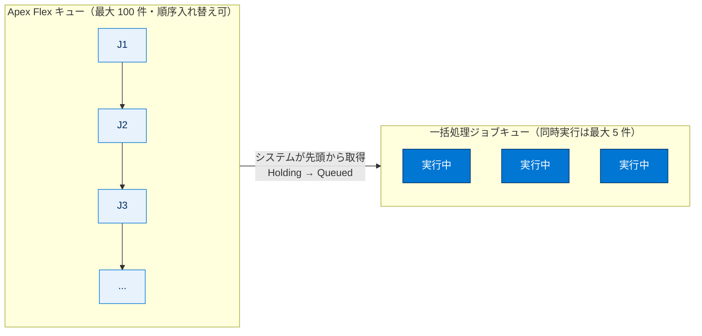
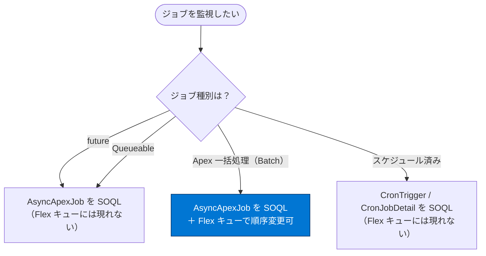

# 非同期 Apex の監視

## 学習の目的

この単元を完了すると、次のことを理解できるようになります。

- さまざまな種別のジョブを監視する方法。
- Flex キューの使用方法。

> [!ポイント] この単元のゴール
>
> 「**バックグラウンドで黙々と動く非同期ジョブをどう見張るか**」がテーマ。UI（[Apex Jobs] / [Apex Flex Queue]）と SOQL（`AsyncApexJob` / `CronTrigger` / `CronJobDetail`）の 2 系統で監視できること、**Flex キュー = 一括処理ジョブ専用**で順序を入れ替えられることが要点。

---

## 非同期ジョブの監視

非同期ジョブの利点も厄介な点も、バックグラウンドで黙々と処理することにある。幸い、処理中のジョブを監視する方法がいくつかある。

> [!ポイント] 監視方法は大きく 2 系統
>
> | 方法 | 手段 | 主に見るもの |
> | --- | --- | --- |
> | **UI（画面）** | [Apex Jobs] / [Apex Batch Jobs] / [Apex Flex Queue] ページ | 状況・順序の確認や入れ替え |
> | **SOQL（プログラム）** | `AsyncApexJob` / `CronTrigger` / `CronJobDetail` を照会 | 状況・エラー数・次回実行時刻など |

> [!手順] [Apex Jobs] ページを開く
>
> 1. **[Setup（設定）]** で **[Quick Find（クイック検索）]** に `Jobs`（ジョブ）と入力する。
> 2. **[Apex Jobs（Apex ジョブ）]** を選択する。

[Apex Jobs] ページには、すべての非同期 Apex ジョブが実行情報と共に表示される。

一括処理ジョブが多い場合は、[Apex Jobs] ページ上部のリンクから **[Apex Batch Jobs（Apex 一括処理ジョブ）]** ページを開き、一括処理ジョブのみを表示できる。スライダーで日付範囲を絞り込め、ジョブは一括処理クラスごとにグループ化される。クラス ID 横の **[詳細情報（More Info）]** で、そのクラスで実行されたジョブの詳細を参照できる。

また、**[Apex Flex Queue]** ページ（[Setup] → [Quick Find] に `Jobs` → [Apex Flex Queue]）で状況を監視し、最初に処理されるジョブの順序を変更できる。

---

## 実行予定ジョブの監視

実行予定ジョブ（スケジュール済みジョブ）も [Apex Jobs] ページに表示される。ただし現在、**実行予定ジョブは Flex キューには含まれない**。

> [!注意] 実行予定ジョブは ID が返らない
>
> `AsyncApexJob` を照会すれば実行予定ジョブを見つけられるが、**送信しても ID が返らない**ため、`MethodName` や `JobType` など、ほかの項目で絞り込む必要がある。

---

## SOQL を使用したキュー内のジョブの監視

送信したジョブの情報を照会するには、`System.enqueueJob()` が返したジョブ ID で絞り込んで `AsyncApexJob` に SOQL を実行する。

```sql
AsyncApexJob jobInfo = [
  SELECT Status, NumberOfErrors
  FROM AsyncApexJob
  WHERE Id = :jobID
  WITH USER_MODE
];
```

> [!例] 監視で見る主な項目
>
> - **`Status`**：ジョブの状況（Holding / Queued / Processing / Completed / Failed など）。
> - **`NumberOfErrors`**：発生したエラーの件数。
> - **`JobItemsProcessed` / `TotalJobItems`**：処理済みバッチ数／総バッチ数（進捗率の計算に使える）。

---

## Flex キューを使用したキュー内のジョブの監視

**Apex Flex キュー**には最大 **100 件**の一括処理ジョブを実行のために送信できる。送信されたジョブは**保留（Holding）**状況になり、Flex キューに配置される。

> [!用語] Apex Flex キュー（Flex Queue）
>
> 実行待ちの**一括処理（Batch）ジョブ**を最大 100 件まで並べておける待ち行列。最大の特徴は、**待っているジョブの順序を自由に入れ替えられる**こと。重要なジョブを先頭に動かしたり、優先度の低いジョブを後ろに回したりできる。

ジョブは**先入れ先出し（FIFO）**で処理されるが、保留中はキューの順序を入れ替えられる。システムリソースが空くと、システムが Flex キュー先頭のジョブを一括処理ジョブキューに移し、状況が **[Holding（保留）]** から **[Queued（キュー）]** に変わる。組織ごとに**最大 5 件**を同時処理でき、キュー内のジョブはシステムが処理可能になったときに実行される。[Apex Jobs] ページで監視できる。



> [!ポイント] Flex キューの数値を覚える
>
> - 保留にできる一括処理ジョブ：最大 **100 件**。
> - 同時に処理できるジョブ：組織ごとに最大 **5 件**。
> - 処理順序：**FIFO（先入れ先出し）**だが、保留中は順序を入れ替え可能。

---

## スケジュール済みジョブの監視

スケジュール後、`CronTrigger` に SOQL を実行するとジョブの詳細を取得できる。次の例はジョブの実行回数と次回実行予定日時を照会する（`System.schedule()` が返す `jobID` を使用）。

> [!用語] `CronTrigger` / `CronJobDetail`
>
> - **`CronTrigger`**：スケジュール済みジョブの「実行スケジュール」を表す。実行回数（`TimesTriggered`）や次回実行時刻（`NextFireTime`）を持つ。
> - **`CronJobDetail`**：そのジョブの「名前」と「種別（`JobType`）」を持つ。`CronTrigger` から関連付けてたどれる。

```sql
CronTrigger ct = [
  SELECT TimesTriggered, NextFireTime
  FROM CronTrigger
  WHERE Id = :jobID
  WITH USER_MODE
];
```

スケジュール可能クラスの `execute` 内で実行する場合は、`SchedulableContext` 引数に `getTriggerId()` をコールして現在のジョブ ID を取得できる。

```apex
public with sharing class DoAwesomeStuff implements Schedulable {
  public void execute(SchedulableContext sc) {
    // 何らかの処理
    CronTrigger ct = [
      SELECT TimesTriggered, NextFireTime
      FROM CronTrigger
      WHERE Id = :sc.getTriggerId()
      WITH USER_MODE
    ];
  }
}
```

`CronJobDetail` リレーションを使えば、`CronTrigger` の照会時にジョブの名前と種別も取得できる。

```sql
CronTrigger job = [
  SELECT Id, CronJobDetail.Id, CronJobDetail.Name, CronJobDetail.JobType
  FROM CronTrigger
  WITH USER_MODE
  ORDER BY CreatedDate DESC
  LIMIT 1
];
```

`CronJobDetail` を直接照会して、ジョブの名前と種別を取得することもできる。

```sql
CronJobDetail ctd = [
  SELECT Id, Name, JobType
  FROM CronJobDetail
  WHERE Id = :job.CronJobDetail.Id
  WITH USER_MODE
];
```

すべての Apex スケジュール済みジョブの合計件数を取得するには次を実行する。ジョブ種別「7」は Apex スケジュール済みジョブに対応する。

```sql
SELECT COUNT() FROM CronTrigger WHERE CronJobDetail.JobType = '7' WITH USER_MODE
```

> [!例] `JobType = '7'` の意味
>
> `CronJobDetail.JobType` の値「7」は **Apex スケジュール済みジョブ**を表す。この条件で件数を数えれば、スケジュール済み Apex ジョブだけを集計できる。

---

## 各ジョブ種別と監視方法の対応

> [!ポイント] どの種別がどこに現れるか（頻出）
>
> | ジョブ種別 | Flex キューに現れる？ | 主な監視オブジェクト |
> | --- | --- | --- |
> | future メソッド | いいえ | `AsyncApexJob` |
> | **Apex 一括処理（Batch）** | **はい** | `AsyncApexJob`（Flex キューで順序変更可） |
> | Queueable Apex | いいえ | `AsyncApexJob` |
> | スケジュール済み Apex | いいえ | `CronTrigger` / `CronJobDetail` |
>
> **Flex キューに現れるのは一括処理ジョブだけ**。future・Queueable・スケジュール済みは現れない。



---

## 試験対策：押さえておきたい追加ポイント

> [!ポイント] 非同期 Apex の監視のよくある出題
>
> - **Flex キューは一括処理ジョブ専用**。future / Queueable / スケジュール済みジョブは現れない。
> - Flex キューは**最大 100 件**保留可、同時実行は組織ごと**最大 5 件**、処理は **FIFO** で順序入れ替え可能。
> - ジョブの状況・エラー数は **`AsyncApexJob`** を SOQL で照会。
> - スケジュール済みジョブの実行回数・次回実行時刻は **`CronTrigger`**、ジョブ名・種別は **`CronJobDetail`** を照会。
> - スケジュール済みジョブ送信時は **ID が返らない**ため、`JobType` などで絞り込む必要がある。

---

## リソース

- オブジェクトリファレンス：CronJobDetail

---

## テスト

この単元を完了するには、テストのすべての質問に正しく解答する必要があります（+100 ポイント）。

**問 1. Apex Flex キューに現れないジョブのタイプはどれですか？**

- A. Future メソッドジョブ
- B. Apex ジョブの一括処理
- C. キュー可能 Apex ジョブ
- D. スケジュール済み Apex ジョブ

**問 2. Flex キューについて正しい記述はどれですか？**

- A. 200 個までの一括処理ジョブを送信して実行できる。
- B. ジョブは先入先出法で処理される。
- C. ジョブはタコスが安くなる火曜日中にのみスケジュールできる。
- D. ジョブはユーザーライセンスに応じて実行される。

> [!まとめ] 解答と解説
>
> - **問 1：A・C・D（Flex キューに現れるのは B の一括処理ジョブのみ）**。Flex キューは一括処理ジョブ専用の待ち行列なので、Future・Queueable・スケジュール済みは現れない。
> - **問 2：B**。Flex キューのジョブは **FIFO** で処理される。保留は最大 100 件で「200 個」は誤り（A）。C はジョーク。実行はシステムリソースの空き状況に依存するため D も誤り。

---

## 🎓 この単元のまとめ

この単元では、バックグラウンドで動く非同期ジョブを UI と SOQL の 2 系統で監視する方法と、一括処理ジョブ専用の Flex キューのしくみを学びました。

次の表は、ジョブ種別ごとに「Flex キューに現れるか」「どのオブジェクトで監視するか」を一望できるようにまとめたものです。

| ジョブ種別 | Flex キューに現れる？ | 主な監視オブジェクト |
| --- | --- | --- |
| future メソッド | いいえ | `AsyncApexJob` |
| **Apex 一括処理（Batch）** | **はい**（順序変更可） | `AsyncApexJob` |
| Queueable Apex | いいえ | `AsyncApexJob` |
| スケジュール済み Apex | いいえ | `CronTrigger` / `CronJobDetail` |

> [!まとめ] この単元の要点
>
> - 監視は **UI（[Apex Jobs] / [Apex Batch Jobs] / [Apex Flex Queue]）** と **SOQL** の 2 系統。
> - ジョブの状況・エラー数は **`AsyncApexJob`**（`Status` / `NumberOfErrors` / `JobItemsProcessed` など）を照会。
> - スケジュール済みジョブは **`CronTrigger`**（実行回数・次回実行時刻）と **`CronJobDetail`**（名前・種別）で監視。`JobType = '7'` が Apex スケジュール済みジョブ。
> - **Flex キューに現れるのは一括処理ジョブだけ**。最大 **100 件**保留、同時実行は組織ごと最大 **5 件**、処理は **FIFO**（保留中は順序入れ替え可）。
> - スケジュール済みジョブは送信しても **ID が返らない**ため、`JobType` などで絞り込む。

> [!豆知識] Flex キューの「順序入れ替え」は運用で効く隠れた強み
>
> Flex キューの本当の価値は「実行待ちの一括処理ジョブの順序を後から入れ替えられる」点にあります。夜間に大量のバッチが詰まっているときでも、緊急のデータ修正バッチを先頭に動かして先に流せます。future や Queueable にはこの仕組みがないため、「優先順位を運用でコントロールしたい大量処理」はあえて Batch を選ぶ、という設計判断につながります。
