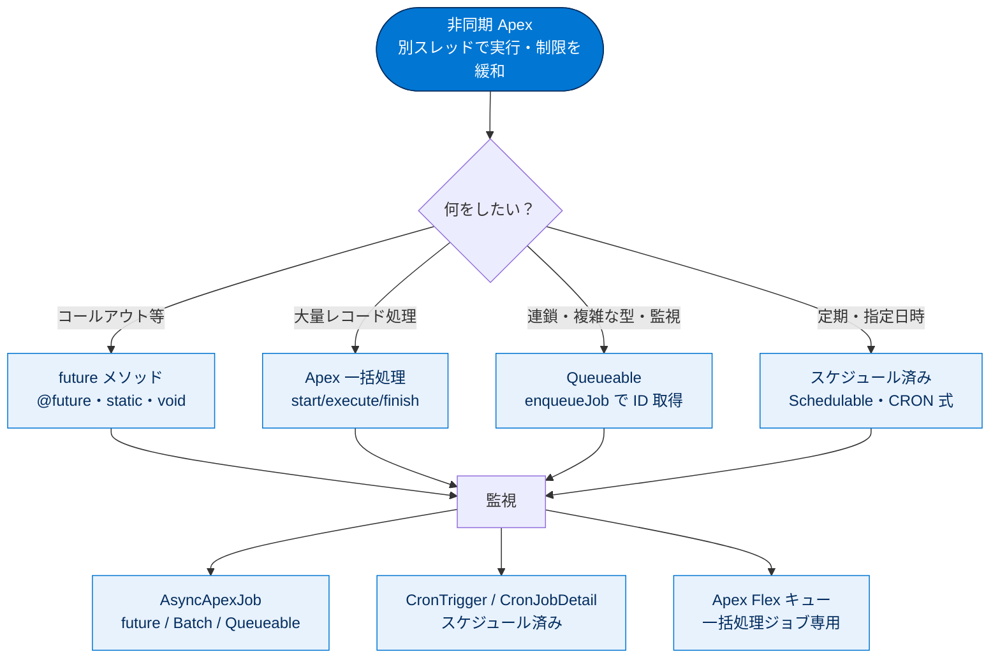

# 非同期 Apex 総まとめ

このトピックでは、重い処理をバックグラウンドの別スレッドに逃がし、ユーザーを待たせずにガバナ制限も緩めて実行する「非同期 Apex」を学びました。4 種別（future / Apex 一括処理 / Queueable / スケジュール済み）の構文・制約・使い分けと、それらをどう監視するか（[Apex Jobs] / Flex キュー / `AsyncApexJob` / `CronTrigger`）までを一通り押さえています。試験では「種別の選択」「各種別の構文」「ガバナ制限の数値」「監視オブジェクト」が頻出です。

---

## 全体像：非同期 Apex マップ

次の図は、このトピックの登場概念がどうつながっているかを 1 枚で俯瞰したものです。

---

## ユニット横断 早見表

| ユニット | 学んだこと | キーワード | 一言要点 |
| --- | --- | --- | --- |
| **01 非同期処理の基本** | 同期/非同期の違い・制限緩和・4 種別の選択・キューフレームワーク | ガバナ制限、SOQL 100→200、Enqueue/保持/Dequeue | 重い処理を別スレッドに逃がし、制限を緩めて実行する |
| **02 future メソッド** | `@future` の構文・制約・コールアウト・テスト | static / void / プリミティブのみ、`callout=true` | sObject は渡せず ID を渡す。連鎖不可・順序非保証 |
| **03 Apex 一括処理** | 3 メソッド構造・QueryLocator・Stateful・テスト | `Database.Batchable`、scope 200、5,000 万件 | 大量レコードを 200 件ずつ別トランザクションで安全処理 |
| **04 Queueable Apex** | future の上位互換・3 利点・チェーニング | `Queueable`、`enqueueJob()`、1 親→1 子 | sObject OK・ID 取得可・連鎖可。迷ったら Queueable |
| **05 スケジュール済み Apex** | `Schedulable`・CRON 式・UI スケジュール・テスト | `System.schedule()`、秒分時日月曜年、同期コールアウト不可 | 指定日時・周期で自動実行。タイムゾーンはユーザー基準 |
| **06 非同期 Apex の監視** | UI / SOQL 監視・Flex キュー | `AsyncApexJob`、`CronTrigger`、Flex キュー最大 100 / 同時 5 | Flex キューは一括処理専用。状況は SOQL で照会 |

---

## 🎯 試験頻出ポイント

> [!ポイント] このトピックで狙われる論点・暗記値
>
> - **非同期の主目的はガバナ制限・実行制限の緩和**。SOQL **100→200**、ヒープ **6MB→12MB**、最大 CPU 時間も拡大。同期側と**独立してカウント**。
> - **種別選択**：コールアウト→future、大量レコード→Batch、連鎖/複雑な型/監視→Queueable、定期/指定日時→スケジュール済み。
> - **future の構文 3 点**：static / 戻り値 void / 引数はプリミティブ（とその List）のみ。**sObject 不可・連鎖不可・順序非保証**。コールアウトは `@future(callout=true)`。
> - **Batch**：`Database.Batchable<sObject>` の **start / execute / finish**。`scope` 既定 **200**。**QueryLocator は最大 5,000 万件**。状態保持は **`Database.Stateful`**。テストは **1 バッチ分（200 件以下）**のみ。
> - **Queueable**：`Queueable` 実装＋`execute(QueueableContext)`、登録は `System.enqueueJob()`（**ID が返る**）。enqueue は 1 トランザクション **最大 50**、チェーニングは **1 親→1 子**、Developer Edition の深度は **5**。
> - **スケジュール済み**：`Schedulable`＋`execute(SchedulableContext)`、`System.schedule(名前, CRON, インスタンス)`。CRON は**秒 分 時 日 月 曜日 [年]**。**同期コールアウト不可**。一度に **100 件**まで。
> - **監視**：`AsyncApexJob`（future/Batch/Queueable）、`CronTrigger`・`CronJobDetail`（スケジュール済み、`JobType='7'`）。**Flex キューは一括処理ジョブ専用**（最大 100・同時 5・FIFO・順序入替可）。
> - **共通の鉄則**：非同期テストは `Test.startTest()` / `Test.stopTest()` で囲み、`stopTest()` 後に同期実行される。

---

## 📖 用語早見表

| 用語 | ひとことの意味 |
| --- | --- |
| **非同期 Apex** | 処理を別スレッドのバックグラウンドで実行し、制限を緩和するしくみ |
| **ガバナ制限** | マルチテナント環境で 1 組織のリソース暴走を防ぐ上限 |
| **コールアウト** | Salesforce から外部システムへ送る HTTP リクエスト |
| **`@future`** | メソッドを非同期実行にするアノテーション（static / void 限定） |
| **プリミティブ型** | `Integer` `String` `Id` など基本型。future の引数はこれのみ |
| **`Database.Batchable`** | 一括処理の契約。start / execute / finish を実装する |
| **`Database.QueryLocator`** | 対象レコードの範囲を表すオブジェクト。最大 5,000 万件 |
| **`Database.Stateful`** | バッチをまたいでインスタンス変数の値を保持する |
| **`Queueable`** | future の上位互換。ID 取得・複雑な型・チェーニング可 |
| **`System.enqueueJob()`** | Queueable ジョブをキューに登録し、ジョブ ID を返す |
| **チェーニング** | ジョブから次のジョブを起動し数珠つなぎに実行すること |
| **`Schedulable`** | スケジュール済み Apex の契約。execute を実装する |
| **CRON 式** | 実行日時を表す文字列。秒 分 時 日 月 曜日 [年] |
| **`AsyncApexJob`** | 非同期ジョブごとの記録。状況・エラー数などを保持 |
| **`CronTrigger` / `CronJobDetail`** | スケジュール済みジョブの実行スケジュール / 名前・種別 |
| **Apex Flex キュー** | 一括処理ジョブを最大 100 件並べ、順序入替できる待ち行列 |

---

## 豆知識コーナー

> [!豆知識] future は「歴史的経緯で残っている古株」
>
> future メソッドは Queueable よりも前から存在する古い仕組みです。Queueable が future の機能をすべて含む上位互換として登場したため、現在は公式に「Queueable 推奨」とされています。それでも future が試験で問われ続けるのは、既存コードに大量に残っており、保守の現場で読めなければならないからです。

> [!豆知識] 「Shazam!」はサンプルコードに潜むお遊び
>
> Apex 一括処理のサンプルコードでは `finish()` 内のデバッグ出力が `... records processed. Shazam!` となっています。これは Trailhead 教材に古くから残る遊び心のあるメッセージで、世界中の受講者が一度は目にする一文です。本番コードでは意味のあるログメッセージに置き換えましょう。

> [!豆知識] 非同期ジョブは「最終的には必ず処理される」が「いつ」は誰にも分からない
>
> 非同期処理はリアルタイム操作より優先度が低く、サーバーのリソースが空いたタイミングで実行されます。キューイングフレームワークは障害が起きても要求を永続ストレージに保持して再処理するため「いつかは必ず処理される」一方、「何秒後に実行されるか」は保証されません。だから「即時性が必要な処理」を非同期に任せてはいけない、というのが鉄則です。

---

## ✅ 理解度セルフチェック

> [!まとめ] 答えられるか確認しよう（答え併記）
>
> 1. **Q. 非同期 Apex の最大のメリットは「外部コールアウトが無制限になること」だ。○か×か？**
>    A. **×**。最大のメリットは**ガバナ制限・実行制限の緩和**（SOQL 100→200、ヒープ 6MB→12MB など）。
> 2. **Q. future メソッドの引数に `Account` などの sObject を直接渡せる？**
>    A. **渡せない**。プリミティブ型（とその List）のみ。ID を渡して中で SOQL し直す。
> 3. **Q. Apex 一括処理で実装する 3 つのメソッドは何？ scope 省略時のバッチサイズは？**
>    A. **`start()` / `execute()` / `finish()`**。省略時は **200**。
> 4. **Q. ジョブを連鎖（チェーニング）させたい。future と Queueable のどちらを使う？**
>    A. **Queueable**。future は future を呼べない（連鎖不可）。
> 5. **Q. CRON 式 `'0 0 13 * * ?'` のフィールドの並び順は？**
>    A. **秒 分 時 日 月 曜日 [年]**（この例は毎日 13 時 0 分 0 秒）。
> 6. **Q. Apex Flex キューに現れるジョブ種別はどれ？（future / Batch / Queueable / スケジュール済み）**
>    A. **Apex 一括処理（Batch）のみ**。最大 100 件保留・同時 5 件・FIFO で順序入替可。
