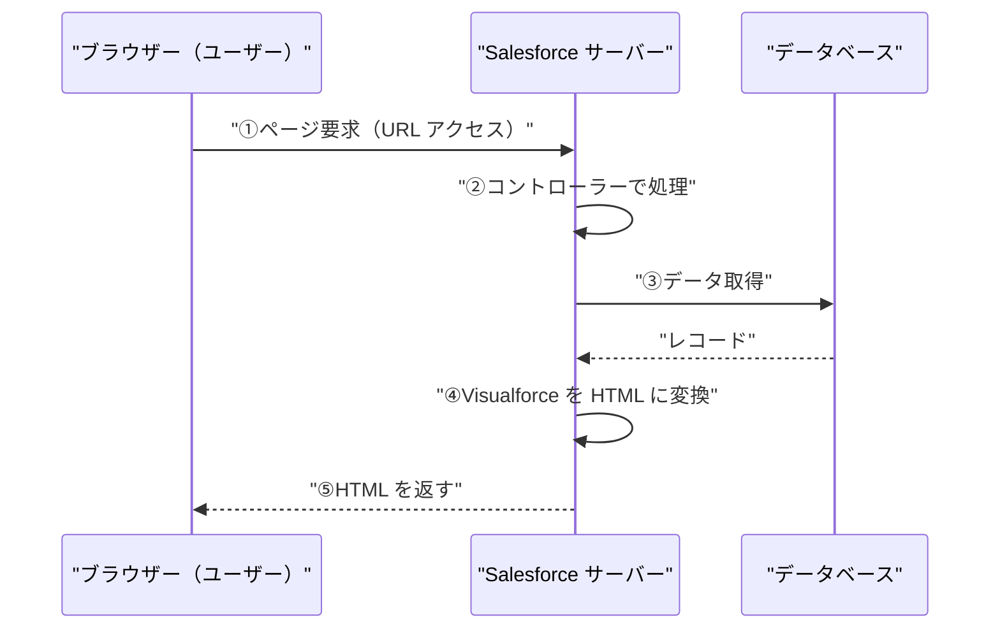
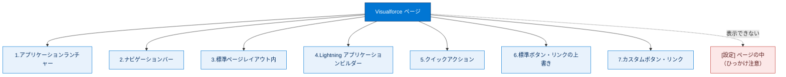

# Visualforce の使用開始

## 学習の目的

この単元を完了すると、次のことができるようになります。

- Visualforce とは何か、何に使用されるかを説明する。
- Visualforce を使用できる場所を 3 つ以上列挙する。

> [!ポイント] この単元のゴール
>
> Visualforce は「**Salesforce 上で独自の画面（UI）を作るための Web 開発フレームワーク**」です。**何ができるか**、**標準コントローラーで楽ができること**、**どこに表示できるか（7 つの場所）** を押さえれば試験対策は十分です。

---

## Visualforce の概要

**Visualforce（ビジュアルフォース）** は、Lightning Platform でモバイル/デスクトップ向けカスタム UI を作成できる Web 開発フレームワークです。Lightning Experience 準拠のアプリも、独自の完全カスタム UI も作成できます。標準コントローラーを使うか、**Apex** で独自ロジックを書き、**AppExchange** で販売するアプリも作れます。

> [!用語] Visualforce（ビジュアルフォース）
>
> Salesforce が提供する **画面（UI）を作るためのフレームワーク**。HTML に似た独自タグ（`<apex:page>` など）を書くと、サーバー側で処理され、HTML に変換されてブラウザーに表示されます。標準では作れない独自レイアウトに使います。

> [!用語] 標準コントローラー（Standard Controller）
>
> レコードの取得・保存・削除といった定型処理を、コードなしで利用できる組み込みの仕組み。URL で指定したレコードのデータが自動で読み込まれ、[保存] ボタンも標準で用意されます。

> [!用語] Apex（エイペックス）／AppExchange
>
> **Apex**：Salesforce 上で動く独自言語（Java に似た構文）。標準機能で実現できない複雑なロジックを書き、標準コントローラーの不足を補う。**AppExchange**：自作の Visualforce アプリを公開・販売・入手できる公式マーケットプレイス。

ページはコンポーネント・HTML・スタイル要素で作成し、任意の Web テクノロジーや JavaScript フレームワークと統合できます。各ページは一意の URL を持ち、アクセス時にサーバーでデータ処理が実行され、HTML に変換されてブラウザーに返されます。

> [!ポイント] Visualforce はサーバー側で動く
>
> 最大の特徴は **処理がサーバー（Salesforce 側）で実行される** 点です。アクセス時にデータ取得や計算がサーバーで行われ、**HTML に変換されてブラウザーに返ります**。この「サーバーで処理 → HTML を返す」流れは試験でも問われます。

### Visualforce の要求処理の流れ



> [!例] レストランにたとえると
>
> ブラウザーは「お客」、サーバーは「厨房」、Visualforce マークアップは「レシピ」。注文（URL アクセス）すると厨房がレシピに従って調理（データ処理）し、料理（HTML）を提供します。

---

## Visualforce ページの例

```html
<apex:page standardController="Contact">
    <apex:form>
        <apex:pageBlock title="Edit Contact">
            <apex:pageBlockSection columns="1">
                <apex:inputField value="{!Contact.FirstName}"/>
                <apex:inputField value="{!Contact.LastName}"/>
                <apex:inputField value="{!Contact.Email}"/>
                <apex:inputField value="{!Contact.Birthdate}"/>
            </apex:pageBlockSection>
            <apex:pageBlockButtons>
                <apex:commandButton action="{!save}" value="Save"/>
            </apex:pageBlockButtons>
        </apex:pageBlock>
    </apex:form>
</apex:page>
```

このページは取引先責任者の入力フォームを、わずか数十行で多数の処理付きで実現します。

| マークアップ | 何が起きるか |
| --- | --- |
| `standardController="Contact"` | 取引先責任者の **標準コントローラー** に接続し、データアクセス・標準アクションが使える |
| `<apex:inputField>` | 各項目の **入力欄を自動生成**。型に応じた入力支援が付く |
| `action="{!save}"` | 標準コントローラーの **save アクション** を呼び出して保存する |

- ID なしでアクセス → 空のフォーム、[Save] で新規作成。
- ID 付きでアクセス → そのレコードの編集フォーム、[Save] で変更を保存。
- 各項目は値の型に応じた表示・入力支援（メール形式チェック、日付ウィジェット等）を自動制御。

> [!ポイント] レコード ID の有無で動作が変わる
>
> 同じページでも URL に **レコード ID があるか** で動きが変わります。
> - **ID なし** → 空のフォーム（新規作成モード）
> - **ID あり** → そのレコードのデータが入った編集フォーム
>
> この「ID で取得対象が決まる」仕組みは標準コントローラーの基本動作です。保存処理やメール形式チェックを自分で書いていない点が「数十行で多機能」の理由です。

---

## Visualforce を使用できる場所

組織内で Visualforce を使う方法は多数あり、組み込み機能の拡張・置き換え・新規アプリ作成に利用できます。

> [!ポイント] Visualforce を表示できる場所の一覧（試験頻出）
>
> | # | 表示できる場所 | 概要 |
> | --- | --- | --- |
> | 1 | アプリケーションランチャー | タブとして登録すると一覧から開ける |
> | 2 | ナビゲーションバー | アプリケーションのタブとして表示 |
> | 3 | 標準ページレイアウト内 | レコード詳細にページを埋め込む |
> | 4 | Lightning アプリケーションビルダー | コンポーネントとしてページに追加 |
> | 5 | クイックアクション | グローバル/オブジェクトアクションとして起動 |
> | 6 | 標準ボタン・リンクの上書き | 標準画面を自作ページに置き換える |
> | 7 | カスタムボタン・リンク | 新しいアクションとして追加 |
>
> 逆に「**[設定] ページの中** には表示できない」点が、ひっかけ問題で狙われます。



### 1. アプリケーションランチャー

Visualforce のアプリやカスタムタブはランチャーから使用できます。表示するには **Visualforce タブを作成しアプリケーションに追加** する必要があります。

> [!注意] つまずきポイント
>
> ページを作っただけでは表示されません。ランチャー・ナビゲーションバーに出すには **タブ作成 → アプリへの追加** が必須です。

### 2. ナビゲーションバー

Visualforce タブをアプリケーションに追加し、項目として表示できます。

### 3. 標準ページレイアウト内

ページレイアウトに Visualforce ページを埋め込み、標準ページにカスタムコンテンツを表示できます。Lightning では [詳細] で確認します。

> [!例] ページレイアウトへの埋め込み
>
> 取引先の詳細ページに「関連する地図」や「外部システムの情報」を表示する小さな Visualforce ページを埋め込めば、標準画面のまま追加情報を確認できます。

### 4. Lightning アプリケーションビルダー

ビルダーで作るカスタムアプリページに、Visualforce コンポーネントとして追加できます。

> [!注意] Lightning で使うには設定が必要
>
> ページの **[Available for Lightning Experience, Lightning Communities, and the mobile app]** を有効にしないと部品一覧に出てきません。

### 5. クイックアクション

クイックアクションをページレイアウトのパブリッシャー領域に追加し、起動先に指定できます。

> [!用語] クイックアクション（Quick Action）
>
> ボタンから特定操作を素早く起動できる機能。「グローバルアクション」（どこからでも）と「オブジェクト固有アクション」（特定オブジェクト画面）があり、Visualforce ページを起動先に指定できます。

### 6. 標準ボタン・リンクの上書き

オブジェクトのアクションを Visualforce ページで上書きでき、クリックすると標準ページではなく自作ページが表示されます。

> [!例] [編集] ボタンの上書き
>
> 取引先責任者の標準 [編集] を自作ページに上書きすれば、[編集] でカスタム編集画面が開きます。

### 7. カスタムボタン・リンク

オブジェクトに新しいアクションをボタン/リンクとして作成できます。

> [!注意] Lightning では JavaScript ボタンが使えない
>
> Lightning Experience では Classic の **JavaScript ボタン/リンクがサポートされません**。代わりに **Visualforce（または URL）** で同等のボタンを作ります。試験で問われやすい変更点です。

---

## 試験対策：押さえておきたい追加ポイント

> [!ポイント] Visualforce と LWC の位置づけ・構成要素
>
> - 現在の UI 構築の **推奨は Lightning Web コンポーネント（LWC）** だが、Visualforce も引き続きサポートされ、既存資産の保守や特定用途（PDF 生成、メールテンプレート、ページレイアウト埋め込み）では現役。
> - 構成要素：**マークアップ**（`<apex:～>` タグ。HTML/CSS/JS を混在可）／**コントローラー**（標準はコード不要、複雑な処理は Apex のカスタムコントローラー）／**約 150 個の組み込みコンポーネント**（カスタムも作成可）。

---

## リソース

- Visualforce 開発者ガイド
- Dreamforce セッション: Visualforce の概要
- Trailhead: Lightning アプリケーションビルダー
- Trailhead: Lightning Experience での Visualforce の使用

---

## テスト

この単元を完了するには、テストのすべての質問に正しく解答する必要があります。

**+100 ポイント**

**問 1. Visualforce とは次のどれですか?**

- A. システム管理者や開発者が Force.com API を使用して Salesforce 組織とやりとりできるように設計された、Web ベースのツールセット。
- B. Lightning プラットフォームでホストできるアプリケーション用のカスタムユーザーインターフェースを、開発者が作成できるようにする Web 開発フレームワーク。
- C. Salesforce 組織のアプリケーションの作成、デバッグ、テストに使用できる一連のツールを備えた統合開発環境。
- D. Salesforce 組織のすべてのオブジェクトとリレーションをアプリケーションで表示・変更するための動的な環境。

**問 2. 次のうち、Visualforce ページを表示できない場所はどれですか?**

- A. 標準ボタンまたはリンクから
- B. 標準ページレイアウト内
- C. タブから
- D. 任意の [設定] ページ内
- E. Salesforce1 内

> [!まとめ] この単元の要点
>
> - **Visualforce** は Salesforce 上で **カスタム UI を作る Web 開発フレームワーク**。処理はサーバー側で実行され、HTML に変換されてブラウザーに返る。
> - **標準コントローラー** でコードなしのデータアクセス・保存ができ、複雑な処理は **Apex** で補える。
> - 表示できる場所は **ランチャー / ナビゲーションバー / ページレイアウト / Lightning アプリケーションビルダー / クイックアクション / ボタン・リンクの上書き / カスタムボタン・リンク** の 7 つ。**[設定] ページの中には表示できない**（ひっかけ注意）。

> [!注意] 日本語環境で受講する場合
>
> テスト・Challenge は日本語の Trailhead Playground で開始し、かっこ内の翻訳を参照しながら進めてください。評価は英語データに対して行われるため、**英語の値のみ** をコピー&ペーストします。不合格時は、(1) [Locale] を [United States]、(2) [Language] を [English] に切り替え、(3) [Check Challenge] をクリックすると通ることがあります。
