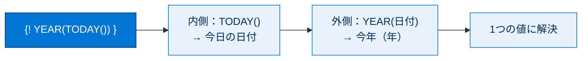
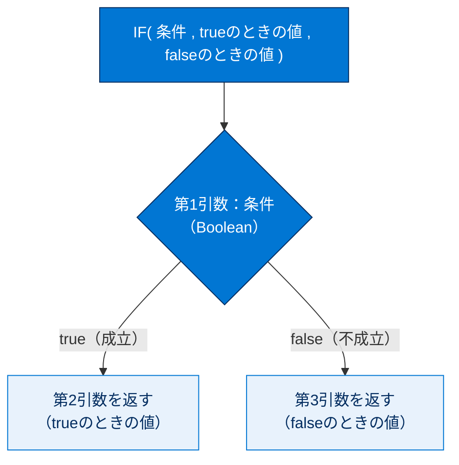
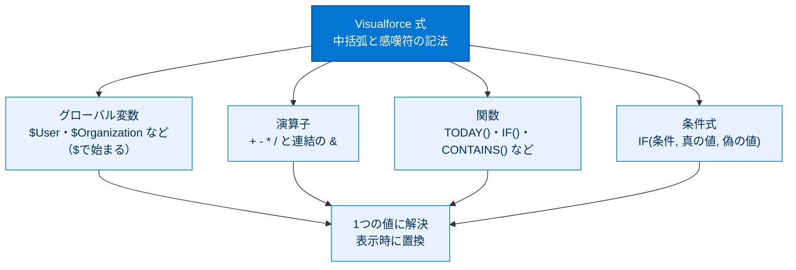

# 単純な変数と数式の使用

## 学習の目的

この単元を完了すると、次のことができるようになります。

- Visualforce 式とは何か、式はどこで使用されるかを説明する。
- Visualforce 式で使用できるグローバル変数を 3 つ以上列挙する。
- Visualforce 式を Visualforce ページに追加する。
- Visualforce 式で関数を使用する。

> [!ポイント] この単元のゴール
>
> Visualforce ページに **動的な値** を埋め込む仕組みが **Visualforce 式** `{! ... }` です。**式の構文**、**グローバル変数（`$User` など）**、**関数（`TODAY()` など）**、**条件式（`IF()`）** の 4 点を押さえれば試験対策は十分です。

---

## グローバル変数と Visualforce 式の概要

Visualforce ページはユーザーや表示内容に応じて動的データを表示できます。動的データには、グローバル変数・計算・コントローラーのプロパティをマークアップで使ってアクセスし、これらをまとめて **Visualforce 式** と呼びます。

> [!用語] Visualforce 式（Visualforce Expression）
>
> ページに **動的な値**（その時々で変わる値）を埋め込む記法。`{! ... }` の中に変数や計算を書くと、表示時に実際の値に置き換わります。例：`{! $User.FirstName }` はログイン中ユーザーの名。**動的** = 状況で変わる、**静的** = 常に同じ（`Hello World` は静的）。

式はリテラル値・変数・サブ式・演算子などで構成され、**1 つの値に解決されます**。構文は `{!expression }` で、表示時に区切り文字内が評価され置換されます（空白は無視）。評価結果はプリミティブ・Boolean・sObject などになります。

> [!注意] 式の中でメソッドは呼べない
>
> Visualforce 式では Apex の **メソッド（処理）を直接呼び出せません**。扱えるのは「最終的に 1 つの値になるもの」（変数・計算・関数）だけ。複雑な処理はコントローラー側で計算した結果（プロパティ）を式で参照します。

> [!用語] Boolean／プリミティブ／sObject
>
> - **Boolean** … `true`/`false` の 2 値だけをとる型。判定に使う。
> - **プリミティブ** … 整数・文字列・日付など最も基本的なデータ型。
> - **sObject** … Salesforce のオブジェクト（取引先など）のレコードを表す型。

> [!例] 式が「値に解決される」とは
>
> `{! 1 + 2 }` は `3`、`{! TODAY() }` は今日の日付、`{! $User.FirstName }` はあなたの名に置き換わります。どれも最終的に **1 つの値** になる、これが「式が値に解決される」という意味です。

---

## グローバル変数

> [!用語] グローバル変数（Global Variable）
>
> Salesforce があらかじめ用意した、システム全体で使える特別な変数。名前が **`$` で始まる**（例：`$User`、`$Organization`、`$Setup`）。ログインユーザー情報や組織設定など、よく使う値に簡単にアクセスできます。

ログインユーザーの情報は `$User` で提供されます。項目には `{!$GlobalName.fieldName }` 形式でアクセスします（他のグローバル変数も同様）。

> [!手順] $User グローバル変数を使った UserStatus ページを作る
>
> 1. 開発者コンソールで **[File] | [New] | [Visualforce Page]** をクリックし、ページ名に `UserStatus` と入力します。
> 2. `<apex:pageBlockSection>` タグの間に `{!$User.FirstName }` を追加すると [User Status] パネルに名が表示されます。さらに `$User` を使う式を追加し、次のようにします。
>
>     ```html
>     <apex:page>
>         <apex:pageBlock title="User Status">
>             <apex:pageBlockSection columns="1">
>                 {!$User.FirstName } {!$User.LastName }
>                ({! $User.Username })
>             </apex:pageBlockSection>
>         </apex:pageBlock>
>     </apex:page>
>     ```
>
> 3. **[Preview]** で確認します。

`{!...}` は中括弧内が式言語で記述された動的要素であることを示し、表示時に値が計算・代入されます。式は大文字小文字を区別せず、内部のスペースも無視されます。次は同じ値を出力します。

```text
{!$User.FirstName}
{!$USER.FIRSTNAME}
{!$user.firstname }
```

> [!ポイント] 式は大文字小文字を区別しない・空白は無視
>
> 上の 3 つは同じ結果です。ただし読みやすさのため、実務では正しい綴り（`$User.FirstName`）で書くのが推奨です。

> [!ポイント] 代表的なグローバル変数
>
> | グローバル変数 | 取得できる情報 |
> | --- | --- |
> | `$User` | ログインユーザーの名・姓・ユーザー名・有効状態など |
> | `$Organization` | 組織（会社）の詳細情報 |
> | `$Setup` | カスタム設定の値 |
> | `$ObjectType` | カスタムオブジェクトの詳細 |
> | `$Action` | オブジェクトで使用可能な標準アクション |
>
> Visualforce で使えるグローバル変数は **20 個前後** あります。

---

## 数式

グローバル変数以外の要素や、値を操作する数式も式言語で使用できます。

> [!用語] 演算子（operator）
>
> 値を計算・結合する記号。`+`（加算）、`-`（減算）などのほか、Visualforce 式では `&` が **文字列を連結する演算子** として使えます。

> [!手順] & 演算子で名前を連結する
>
> [UserStatus] ページで、名と姓の個別の式を次の数式に置き換えます（出力は変更前と同じ）。
>
> ```html
> {!$User.FirstName & ' ' & $User.LastName}
> ```

> [!例] & 演算子の動き
>
> `FirstName` が `Taro`、`LastName` が `Yamada` のとき、`{!$User.FirstName & ' ' & $User.LastName}` は `Taro Yamada` になります。間の `' '`（スペース 1 文字）で空白が入ります。

### 関数を使う

> [!用語] 関数（function）
>
> あらかじめ用意された「組み込みの計算」。`関数名(引数)` の形で書きます。`TODAY()` のように引数を取らないものも、`MAX(1,2,3)` のように複数取るものもあります。

ユーザー情報の下に次を追加します。

```html
<p> Next week it will be {! TODAY() + 7 } </p>
<p> Today's Date is {! TODAY() } </p>
```

1 つ目は現在日付に 7 日加算、2 つ目は現在日付を表示します。さらに次を追加します。

```html
<p>Tomorrow will be day number  {! DAY(TODAY() + 1) }</p>
<p>Let's find a maximum: {! MAX(1,2,3,4,5,6,5,4,3,2,1) } </p>
<p>The square root of 49 is {! SQRT(49) }</p>
<p>Is it true?  {! CONTAINS('salesforce.com', 'force.com') }</p>
<p>The year today is {! YEAR(TODAY()) }</p>
```

`TODAY()` は空括弧、`YEAR()` は `TODAY()` の日付を受け取り、`MAX()` は任意の数の引数を取ります。`CONTAINS()` は Boolean を返し、最初の引数に 2 番目が含まれれば `true`（上記は `force.com` が `salesforce.com` に含まれるため `true`）。

> [!ポイント] この単元で登場する主な関数
>
> | 関数 | 役割 | 例と結果 |
> | --- | --- | --- |
> | `TODAY()` | 今日の日付を返す | `TODAY()` → 今日の日付 |
> | `DAY()` | 日付から「日」を取り出す | `DAY(TODAY()+1)` → 明日の日 |
> | `MAX()` | 引数の最大値を返す | `MAX(1,2,3)` → `3` |
> | `SQRT()` | 平方根を返す | `SQRT(49)` → `7` |
> | `CONTAINS()` | 文字列に別の文字列が含まれるか判定 | `CONTAINS('salesforce.com','force.com')` → `true` |
> | `YEAR()` | 日付から「年」を取り出す | `YEAR(TODAY())` → 今年 |
> | `IF()` | 条件で表示を切り替える | 後述 |

> [!例] 関数のネスト（入れ子）
>
> `{! YEAR(TODAY()) }` は、まず内側の `TODAY()` で今日の日付を求め、その結果を外側の `YEAR()` に渡して「年」を取り出します。**内側から外側へ** 評価されます。



---

## 条件式

> [!用語] 条件式（conditional expression）
>
> 「条件を満たすか満たさないか」で表示内容を切り替える式。Visualforce では `IF()` 関数を使います。

`IF()` 式は次の 3 つの引数をとります。

1. **Boolean 値（true/false）**。たとえば `CONTAINS()` 関数など。
2. 最初の引数が **true のときに返される値**。
3. 最初の引数が **false のときに返される値**。

> [!ポイント] IF() の構文を図で理解する
>
> 「**条件、Yesなら、Noなら**」の 3 点セットと覚えると間違えにくいです。



> [!手順] IF() 条件式を試す
>
> [UserStatus] ページで、その他の式の下に次を追加して結果を予想してから保存します。
>
> ```html
> <p>{! IF( CONTAINS('salesforce.com','force.com'),
>      'Yep', 'Nope') }</p>
> <p>{! IF( DAY(TODAY()) < 15,
>      'Before the 15th', 'The 15th or after') }</p>
> ```

> [!例] IF() の評価の流れ
>
> `{! IF( DAY(TODAY()) < 15, 'Before the 15th', 'The 15th or after') }` を今日が 10 日として追うと、`TODAY()` → 今日の日付 → `DAY(...)` → `10` → `10 < 15` → `true` → 2 つ目の引数 `'Before the 15th'` が表示されます。

> [!手順] 条件式で UserStatus を仕上げる
>
> 1. テスト式を削除し、`$User` を使う行のみ残します。
> 2. `$User.Username` を含む行を次で置き換えます。
>
>     ```html
>     ({! IF($User.isActive, $User.Username, 'inactive') })
>     ```

`isActive` は `$User` で使える Boolean 項目で、有効なら true、無効なら false です。これで有効ならユーザー名、無効なら [inactive] と表示されます。

---

## もうひとこと...

グローバル変数は 20 個前後あり、組織の詳細（`$Organization`）、設定（`$Setup`）、カスタムオブジェクトの詳細（`$ObjectType`）、使用可能なアクション（`$Action`）などの取得に役立ちます。関数も数 10 個あり、通常は Visualforce コンポーネントの属性値の提供に使われます。

> [!ポイント] 数式項目の知識が流用できる
>
> Visualforce 式の関数は、**数式項目（Formula Field）の関数とよく似ています**（`TODAY()`、`IF()`、`CONTAINS()` など）。数式項目の知識の多くがそのまま使えますが、**完全に同一ではない** 点（一方にしかない関数がある）に注意しましょう。

---

## リソース

- Salesforce ヘルプ: グローバル変数
- Salesforce ヘルプ: 数式の要素
- Visualforce 開発者ガイド: Global Variables / Functions / Expression Operators
- Trailhead: 数式と入力規則

---

## ハンズオン Challenge（+500 ポイント）

この単元は各自のハンズオン組織で実行します。[起動] をクリックして開始するか、組織の名前をクリックして別の組織を選びます。

> [!まとめ] あなたの Challenge：ユーザ情報を表示する Visualforce ページを作成する
>
> 現在のログインユーザの名を表示する Visualforce ページを作成します。
>
> **Challenge の要件**
> 新しい Visualforce ページを作成する:
> - 表示ラベル：`DisplayUserInfo`
> - 名前：`DisplayUserInfo`
> - 表示されるユーザ情報は **ログインユーザから動的に生成** する

> [!ポイント] Challenge のヒント
>
> - ログインユーザーの名は **`$User` グローバル変数** から取得する。
> - 「動的に生成」とは、固定テキストではなく `{! $User.FirstName }` のような **式** を使う意味。
> - 表示ラベル・名前は半角英字で `DisplayUserInfo` と正確に入力する。

> [!注意] 日本語環境で受講する場合
>
> Challenge は日本語の Trailhead Playground で開始し、かっこ内の翻訳を参照しながら進めてください。評価は英語データに対して行われるため、**英語の値のみ** をコピー&ペーストします。不合格時は、(1) [Locale] を [United States]、(2) [Language] を [English] に切り替え、(3) [Check Challenge] をクリックすると通ることがあります。

---

## 🎓 この単元のまとめ

この単元では、Visualforce ページに動的な値を埋め込む **Visualforce 式 `{! ... }`** の仕組みと、その中で使うグローバル変数・演算子・関数・条件式を学びました。

次の図は、式の中身がどんな要素で構成され、どれも「最終的に 1 つの値に解決される」かを俯瞰したものです。



> [!まとめ] この単元の要点
>
> - **Visualforce 式** `{! ... }` は動的な値を埋め込む記法で、表示時に評価され **1 つの値に解決**される（**大文字小文字を区別せず・空白は無視**）。
> - **グローバル変数**は `$` で始まる（`$User` `$Organization` `$Setup` など、20 個前後）。
> - **演算子**は算術（`+ - * /`）のほか、文字列連結の **`&`** が使える。
> - **関数**（`TODAY()` `IF()` `CONTAINS()` など）はネストでき、**内側から外側へ**評価される。
> - **条件式 `IF(条件, 真の値, 偽の値)`** は「条件・Yesなら・Noなら」の 3 点セットで覚える。式の中で **Apex メソッドは直接呼べない**。

> [!豆知識] 数式項目の知識がそのまま効く
>
> Visualforce 式の関数群は、**数式項目（Formula Field）の関数とほぼ共通**です（`TODAY()` `IF()` `CONTAINS()` `YEAR()` など）。つまり「数式と入力規則」で覚えた関数の知識がここでもそのまま使えます。ただし完全に同一ではなく、**一方にしか無い関数**もあるので、移植時はリファレンスで対応を確認すると安心です。
