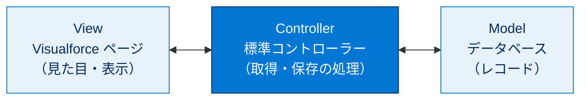
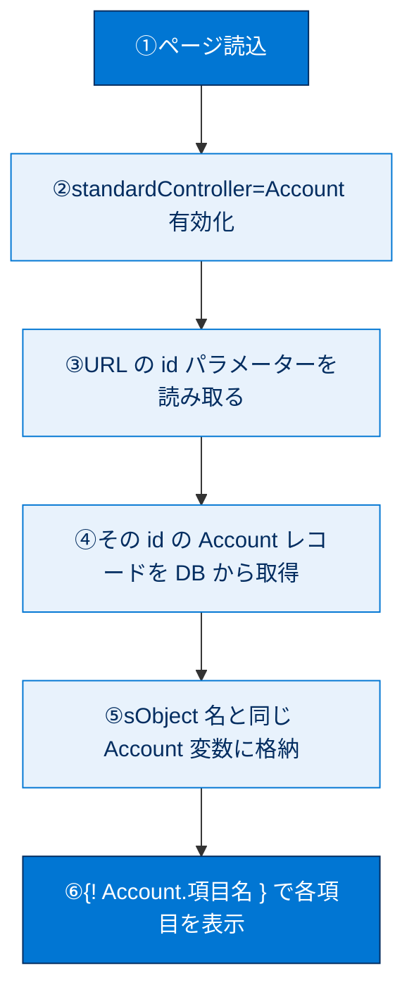
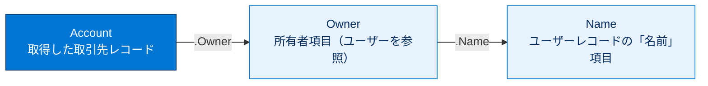
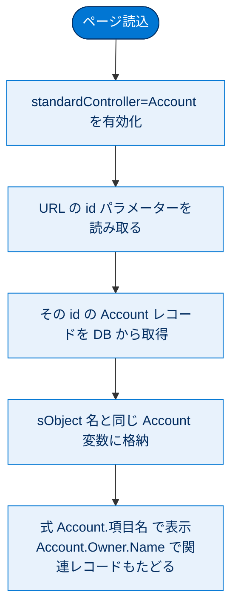

# 標準コントローラーの使用

## 学習の目的

この単元を完了すると、次のことができるようになります。

- Visualforce 標準コントローラーの概要とその主な属性について説明する。
- 標準コントローラーを Visualforce ページに追加する。
- ページの標準コントローラーで取得されたレコードのデータを表示する。
- ドット表記を使用して関連レコードの項目にアクセスする式を記述する。

> [!ポイント] この単元のゴール
>
> `standardController="Account"` の 1 行でレコード操作の土台ができる——これが **標準コントローラー** です。**MVC の考え方**、**URL の `id` パラメーターでレコードが読み込まれる仕組み**、**ドット表記（`Account.Owner.Name`）で関連レコードをたどる方法** の 3 点を押さえれば試験対策は十分です。

---

## Visualforce 標準コントローラーの概要

Visualforce は **MVC（Model–View–Controller）** を採用し、標準アクションとデータアクセスを処理する組み込みコントローラーが用意されています。これらを **標準コントローラー** と呼びます。

> [!用語] MVC（Model–View–Controller）
>
> アプリケーションを 3 つの役割に分けて整理する設計の考え方。
> - **Model** … データそのもの（Salesforce では **データベース**）
> - **View** … 見た目・表示（**Visualforce ページ**）
> - **Controller** … 両者をつなぐ処理（ボタン操作やデータ取得のロジック）
>
> 役割を分けることで、見た目とデータ・処理を **独立して変更しやすく** なります。

> [!用語] 標準コントローラー（Standard Controller）
>
> Salesforce があらかじめ用意している組み込みのコントローラー。**コードを書かなくても** レコードの取得・作成・編集・保存・削除が使えます。`<apex:page standardController="Account">` のように指定するだけで有効になります。



> [!ポイント] 標準コントローラーが使えるオブジェクト
>
> - **すべてのカスタムオブジェクト** には標準コントローラーがある。
> - **大部分の標準オブジェクト**（取引先・取引先責任者・商談など）にもある。
> - 標準で足りない場合は **Apex で拡張（拡張コントローラー）** したり、**カスタムコントローラー** を一から作ったりできる。

---

## レコード ID を検索して要求 URL に追加する

レコード ID を要求 URL のパラメーターとして追加し、標準コントローラーに渡します。

> [!用語] レコード ID（Record ID）
>
> 1 件 1 件のレコードを一意に識別する文字列（例：`001D000000JRBes`）。組織内のすべてのレコードで重複しない「背番号」のようなもの。標準コントローラーはこの ID を手がかりにレコードを取得します。

標準コントローラーは ID でレコードを取得します。本番では連携元ページから ID が自動で渡されますが、開発中のページは単体実行のため、要求 URL の **GET パラメーター** で ID を手動で渡します。

> [!用語] GET パラメーター
>
> URL の末尾に `?名前=値` の形でデータを付け足す仕組み。`?id=001D000000JRBes` のように書くと、ページに「この ID のレコードを見たい」と伝えられます。複数指定は `&` でつなぎます。

> [!手順] レコード ID を取得して AccountSummary ページに渡す
>
> 1. 開発者コンソールで **[File] | [New] | [Visualforce Page]** をクリックし、ページ名に `AccountSummary` と入力します。
> 2. マークアップを次のように置き換えます。
>
>     ```html
>     <apex:page>
>         <apex:pageBlock title="Account Summary">
>             <apex:pageBlockSection>
>             </apex:pageBlockSection>
>         </apex:pageBlock>
>     </apex:page>
>     ```
>
> 3. **[Preview]** でプレビューを開き、URL 項目を確認します。
> 4. 別ウィンドウで組織のホームから **[取引先]** タブを開きます（タブがなければアプリケーションメニューから **[セールス]** を選ぶ）。
> 5. ビューメニューに **[すべての取引先]** があることを確認し、取引先名をクリックします。
> 6. 詳細ページの URL（`.../lightning/r/Account/001D000000JRBes/view` のような形）の `001D000000JRBes` がレコード ID です（組織により異なる）。これをコピーします。
> 7. プレビューに戻り、URL 末尾に `&id=` と入力して ID を貼り付けます。URL は `.../apex/AccountSummary?core.apexpages.request.devconsole=1&id=001D000000JRBes` のようになります。
> 8. Enter で新しい URL でページを読み込みます。

見た目は変わりませんが、ID 追加によりレコードが読み込まれ、標準コントローラーが利用可能になっています。

> [!注意] 開発中はレコード ID を手で渡す
>
> 本番ではリンク元ページから ID が自動で渡されますが、**開発中の単体プレビューでは ID が渡らない** ため、URL 末尾に `&id=レコードID` を手動で付けます。「データが表示されない」ときは、まず URL に `id` が付いているか確認しましょう。

Lightning Experience のコンテキストで表示するには、詳細ページのウィンドウに戻り、JavaScript コンソールで次を実行します（`pageName` はページ名に置換）。末尾に ID を付けてプレビューもできます。

```javascript
$A.get("e.force:navigateToURL").setParams( {"url": "/apex/pageName"}).fire();
$A.get("e.force:navigateToURL").setParams(
    {"url": "/apex/pageName?id=00141000004jkU0AAI"}).fire();
```

---

## 単一レコードのデータを表示する

> [!手順] 標準コントローラーで取引先データを表示する
>
> 1. `<apex:page>` タグに `standardController="Account"` を追加します。これで取引先の標準コントローラーが有効になり、ページ読み込み時に URL の `id` を解析してレコードを取得します。
> 2. ページ本文に `Name: {! Account.name }` を追加すると、その ID の取引先名が表示されます。
> 3. この行を次で置き換えます。
>
>     ```html
>     Name: {! Account.Name } <br/>
>     Phone: {! Account.Phone } <br/>
>     Industry: {! Account.Industry } <br/>
>     Revenue: {! Account.AnnualRevenue } <br/>
>     ```

完全なコードは次のようになります。

```html
<apex:page standardController="Account">
    <apex:pageBlock title="Account Summary">
        <apex:pageBlockSection>
            Name: {! Account.Name } <br/>
            Phone: {! Account.Phone } <br/>
            Industry: {! Account.Industry } <br/>
            Revenue: {! Account.AnnualRevenue } <br/>
        </apex:pageBlockSection>
    </apex:pageBlock>
</apex:page>
```

標準コントローラーは次の処理を行っています。

1. ページ読み込みで `standardController="Account"` が有効化される。
2. URL の `id` パラメーターを読み取り、該当する取引先レコードを取得する。
3. 取得したレコードを、**sObject（Account）と同じ名前** の変数に代入してページで使用可能にする。
4. 4 つの式が **ドット表記** で各項目にアクセスする。

> [!ポイント] 標準コントローラーが裏でやってくれること
>
> 変数名は **コントローラーで指定した sObject 名と同じ**（ここでは `Account`）になる点が重要です。



> [!用語] ドット表記（dot notation）
>
> `Account.Name` のように `オブジェクト.項目` をドット（`.`）でつないでアクセスする書き方。`Account.Owner.Name` のようにドットを重ねると、関連レコードの項目まで「数珠つなぎ」でたどれます。

> [!注意] `{! Account.項目 }` は「未加工値」を出す
>
> 式で項目を直接書くと、値が **未加工（生データ）** のまま出力されます。たとえば年間売上は **科学的記数法**（`1.0E7` = 1.0 × 10 の 7 乗 = 10,000,000）で表示され、通貨記号も付きません。きれいな書式で出したいときは、後の単元で学ぶ **`<apex:outputField>` などのコンポーネント** を使います。

---

## リレーションが設定されたレコードの項目を表示する

取引先詳細ページの **[取引先 所有者]** 項目はデータ型 **[参照関係（ユーザー）]** で、ユーザーレコードとのリレーションを持ち、[項目名] は **[所有者（Owner）]** です。

> [!用語] 参照関係（Lookup Relationship）
>
> あるレコードから別のオブジェクトのレコードを「参照」してつなぐリレーション。ここでは取引先（Account）の「所有者」項目がユーザー（User）レコードを参照します。参照先のレコードの項目（ユーザー名など）を、ドット表記でたどって表示できます。

> [!手順] 取引先所有者の名前を表示する
>
> ページ本文の取引先名の前に次を追加します。
>
> ```html
> Account owner: {! Account.Owner.Name } <br/>
> ```

> [!例] ドット表記でリレーションをたどる
>
> 「取引先 → その所有者（ユーザー）→ そのユーザーの名前」と、ドットで 1 段ずつ関連レコードをたどるイメージです。



---

## もうひとこと...

標準コントローラーはデータ表示だけでなく、**作成・編集・保存・削除** などの **標準アクション** も提供します。ボタンやリンクから呼び出して使い、入力フォームやデータ保存の単元で詳しく学びます。

> [!ポイント] 標準コントローラーの標準アクション
>
> | アクション | 役割 |
> | --- | --- |
> | `save` | 変更をデータベースに保存 |
> | `edit` | 編集モードに切り替え |
> | `delete` | レコードを削除 |
> | `cancel` | 編集をキャンセル |
>
> ボタン（`<apex:commandButton action="{!save}">` など）から呼び出します。

カスタムオブジェクトの項目を参照するときは、**[設定]** の **[Object Manager] | <カスタムオブジェクト> | [Fields & Relationships]** で **[API 参照名]** を確認します（API 参照名が `Foo__c` なら `{!myobject__c.foo__c}`）。

> [!用語] API 参照名（API Name）と `__c` サフィックス
>
> カスタムオブジェクト・項目には、コードから参照する **API 参照名** が付き、カスタムであることを示す **`__c`**（アンダースコア 2 つ + c）が末尾に付きます。Visualforce 式では表示ラベルではなくこの API 参照名を使います。

> [!注意] 標準オブジェクトとカスタムオブジェクトの参照名の違い
>
> - **標準オブジェクト**：`{! Account.Name }` のようにそのまま書く。
> - **カスタムオブジェクト**：`{! MyObject__c.Foo__c }` のように **`__c` 付き** の API 参照名で書く。
>
> この違いを忘れて標準のつもりで書くとエラーになります。

---

## リソース

- Visualforce 開発者ガイド: Standard Controllers / Standard List Controllers
- Salesforce 開発者ブログ: Twitter Bootstrap and Visualforce in Minutes

---

## ハンズオン Challenge（+500 ポイント）

この単元は各自のハンズオン組織で実行します。[起動] をクリックして開始するか、組織の名前をクリックして別の組織を選びます。

> [!まとめ] あなたの Challenge：基本的な取引先責任者レコードを表示する Visualforce ページを作成する
>
> 取引先責任者標準コントローラを使用して、取引先責任者の名と姓、取引先責任者の所有者のメールアドレスを表示する Visualforce ページを作成します。
>
> **Challenge の要件**
> 新しい Visualforce ページを作成する:
> - 表示ラベル：`ContactView`
> - 名前：`ContactView`
> - 標準コントローラ：`Contact`
> - 標準コントローラを使用して次の取引先責任者レコードの情報を表示する **3 つのバインド変数** を含める
>   - 名
>   - 姓
>   - 所有者 メール

> [!ポイント] Challenge のヒント
>
> - `<apex:page standardController="Contact">` で取引先責任者の標準コントローラーを有効にする。
> - 名・姓はそれぞれ `{! Contact.FirstName }`、`{! Contact.LastName }`。
> - 「所有者のメール」は **リレーションをたどる** ので `{! Contact.Owner.Email }` のようにドット表記で書く。
> - 「バインド変数」とは `{! ... }` でレコード項目に結び付けた式のこと。

> [!注意] 日本語環境で受講する場合
>
> Challenge は日本語の Trailhead Playground で開始し、かっこ内の翻訳を参照しながら進めてください。評価は英語データに対して行われるため、**英語の値のみ** をコピー&ペーストします。不合格時は、(1) [Locale] を [United States]、(2) [Language] を [English] に切り替え、(3) [Check Challenge] をクリックすると通ることがあります。

---

## 🎓 この単元のまとめ

この単元では、`standardController="Account"` の 1 行でレコード操作の土台ができる **標準コントローラー**と、URL の `id` でレコードが読み込まれる仕組み、ドット表記で関連レコードをたどる方法を学びました。

次の図は、ページ読み込みから項目表示までの「標準コントローラーが裏でやってくれること」を俯瞰したものです。



> [!まとめ] この単元の要点
>
> - Visualforce は **MVC**（Model＝DB／View＝ページ／Controller＝処理）を採用し、**標準コントローラー**は組み込みの Controller。
> - `standardController="オブジェクト名"` でコードなしのデータアクセスと標準アクション（`save` `edit` `delete` `cancel`）が使える。
> - 取得対象は **URL の `id` パラメーター**で決まる。開発中の単体プレビューでは `&id=レコードID` を手動で付ける。
> - 取得したレコードは **sObject 名と同じ変数**（`Account`）に入り、**ドット表記** `{! Account.Owner.Name }` で関連レコードをたどれる。
> - 式で項目を直接書くと **未加工値**（年間売上が `1.0E7` など）になる。書式付き表示は後の単元の `<apex:outputField>` を使う。
> - **カスタムオブジェクトは `__c` 付き** の API 参照名で書く。

> [!豆知識] レコード ID の「15 桁」と「18 桁」
>
> レコード ID には大文字・小文字を区別する **15 桁**版と、末尾 3 文字のチェックサムを足した大文字小文字を区別しない **18 桁**版があります。URL に出るのは 15 桁が多い一方、API・SOQL の戻り値は 18 桁。先頭 3 文字は **オブジェクトの種類を示すプレフィックス**（取引先は `001`、取引先責任者は `003`、商談は `006`）で、ID を見ただけで何のレコードか見分けられます。
