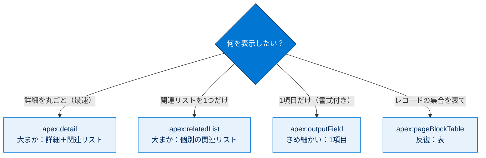
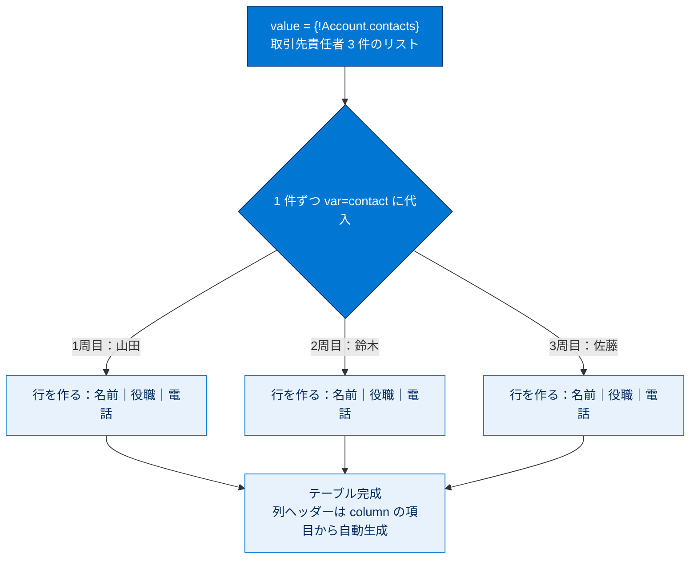

# レコード、項目、テーブルの表示

## 学習の目的

この単元を完了すると、次のことができるようになります。

- 大まかなコンポーネントときめの細かいコンポーネントの違いと、使い分けの理由を説明する。
- 反復コンポーネントとは何か、何に使用されるかを説明する。
- 大まかなコンポーネントでレコードの詳細と関連リストを表示する。
- きめの細かいコンポーネントで大まかなコンポーネントを置換・カスタマイズする。

> [!ポイント] この単元のゴール
>
> 出力コンポーネントには **大まかな（粗い）** ものと **きめの細かい** ものがあり、用途で使い分けます。`<apex:detail>` / `<apex:relatedList>` / `<apex:outputField>` / `<apex:pageBlockTable>` の **4 つの役割と粒度** を理解し、**反復コンポーネント** の `value`・`var` の仕組みを押さえれば試験対策は十分です。

---

## 出力コンポーネントの概要

Visualforce には約 150 個の組み込みコンポーネントがあり、要求時に HTML/CSS/JavaScript に変換されます。**大まかなコンポーネント** は 1 つで多くの機能を提供し、**きめの細かいコンポーネント** は焦点を絞り外観・動作を細かく設計できます。ここでは参照のみの UI を作る **出力コンポーネント** を扱います。

> [!用語] 大まかな（粗粒度）／きめの細かい（細粒度）コンポーネント
>
> - **大まか**：1 つで多くの機能をまとめて提供。少ない記述で画面が作れるが、細かいカスタマイズはしにくい（例：`<apex:detail>`）。
> - **きめ細かい**：1 つの小さな役割に絞る。組み合わせて細部まで設計できるが、マークアップは増える（例：`<apex:outputField>`）。

> [!例] 粒度の違いをたとえると
>
> 大まかは「定食セット」、きめの細かいは「単品メニュー」。セットは楽だが中身は固定、単品は手間がかかるが自分好みに組み立てられます。

> [!ポイント] この単元で扱う 4 つのコンポーネント
>
> | コンポーネント | 粒度 | 役割 |
> | --- | --- | --- |
> | `<apex:detail>` | 大まか | レコード詳細ページを丸ごと再現 |
> | `<apex:relatedList>` | 大まか（detail より下位） | 関連リストを 1 つずつ表示 |
> | `<apex:outputField>` | きめ細かい | 1 項目だけを表示（型に応じた書式付き） |
> | `<apex:pageBlockTable>` | 反復 | レコードの集合を表で表示 |



---

## 標準コントローラーを使用して Visualforce ページを作成する

多数の出力コンポーネントを試すため、まずほぼ空白のページを作成します。

> [!手順] AccountDetail ページの土台を作る
>
> 1. 開発者コンソールで **[File] | [New] | [Visualforce Page]** をクリックし、ページ名に `AccountDetail` と入力します。
> 2. マークアップを次に置き換えます。
>
>     ```html
>     <apex:page standardController="Account">
>         {! Account.Name }
>     </apex:page>
>     ```
>
> 3. **[Preview]** をクリックし、URL に `&id=取引先のID` を追加します（URL は `https://SalesforceInstance/apex/AccountDetail?core.apexpages.request.devconsole=1&id=001D000000JRBes` のような形）。本文に取引先名が表示されれば標準コントローラーが動作しています。

> [!注意] まず ID が効いているか確認
>
> 以降の手順はすべて URL に `&id=取引先のID` を付けてプレビューします。最初に `{! Account.Name }` で取引先名が出ることを確認しておくと、後で「ID の渡し忘れ」と「コンポーネントの書き方ミス」を切り分けられます。

---

## レコード詳細を表示する

> [!手順] apex:detail でレコード詳細を丸ごと表示する
>
> AccountDetail ページで `{!Account.Name }` を `<apex:detail />` に置き換え、保存してプレビュー（URL に `&id=` を付ける）します。
>
> ```html
> <apex:page standardController="Account">
>     <apex:detail />
> </apex:page>
> ```

`<apex:detail>` は 1 行で多数の項目・セクション・ボタンなどを追加する **大まかな出力コンポーネント** で、Salesforce Classic のスタイルが適用されます。外観をカスタマイズする属性も多数あります。

> [!例] `<apex:detail>` の威力
>
> `<apex:detail />` の 1 行だけで、項目・セクション・ボタン・関連リストまで含む「取引先の標準詳細画面」がまるごと再現されます。手早く詳細ページを作りたいときに最適な、典型的な大まかなコンポーネントです。

---

## 関連リストを表示する

> [!用語] 関連リスト（Related List）
>
> あるレコードに紐づく「子レコードの一覧」。たとえば取引先の詳細ページに表示される「取引先責任者」「商談」などの一覧です。

`<apex:detail>` は詳細に加え関連リストも表示します。情報が多すぎる場合は、関連リストを外し、`<apex:relatedList>` で必要なものだけ追加できます。

> [!手順] detail の関連リストを外し、relatedList で個別に表示する
>
> 1. `<apex:detail>` に `relatedList="false"` を追加して関連リストを除外します。
> 2. その下に次を追加し、保存してプレビュー（URL に `&id=` を付ける）します。
>
>     ```html
>     <apex:detail relatedList="false"/>
>     <apex:relatedList list="Opportunities" pageSize="5"/>
>     <apex:relatedList list="Contacts"/>
>     ```

`<apex:relatedList>` も大まかですが `<apex:detail>` より下位です。`<apex:detail>` は多くの関連リストを一度に表示し、`<apex:relatedList>` は 1 つずつ個別にカスタマイズできます。

> [!ポイント] detail と relatedList の使い分け
>
> | | `<apex:detail>` | `<apex:relatedList>` |
> | --- | --- | --- |
> | 表示するもの | 詳細＋すべての関連リスト | 関連リストを 1 つだけ |
> | 粒度 | より大まか（上位） | やや細かい（下位） |
> | 向いている場面 | とにかく素早く全部出す | 必要な関連リストだけ選んで個別に調整 |
>
> `relatedList="false"` で detail の関連リストを消し、`<apex:relatedList>` で必要なものだけ出す組み合わせがよく使われます。

---

## 個別の項目を表示する

> [!手順] outputField で個別の項目を表示する
>
> AccountDetail ページで `<apex:detail/>` 行を次に置き換えます。
>
> ```html
> <apex:outputField value="{! Account.Name }"/>
> <apex:outputField value="{! Account.Phone }"/>
> <apex:outputField value="{! Account.Industry }"/>
> <apex:outputField value="{! Account.AnnualRevenue }"/>
> ```

単独で並べると、表示ラベルや書式なしで値が 1 行に並びます。自動でスタイルが付く `<apex:detail>` や `<apex:relatedList>` と対照的です。

> [!用語] ラップする（wrap）
>
> あるコンポーネントを別のコンポーネントの内側に入れて「包む」こと。`<apex:outputField>` を `<apex:pageBlockSection>` で包むと、見た目が自動的に整えられます。

> [!注意] outputField は「枠」とセットで使う
>
> `<apex:outputField>` を単独で並べると、ラベルもなく値がベタ書きされます。**`<apex:pageBlock>` と `<apex:pageBlockSection>` で囲む** ことで、初めてラベル付き・2 列・整列されたレイアウトになります。

> [!手順] pageBlock / pageBlockSection でラップして整える
>
> `<apex:outputField>` 行を次のようにラップし、保存してプレビュー（URL に `&id=` を付ける）します。
>
> ```html
> <apex:pageBlock title="Account Details">
>     <apex:pageBlockSection>
>         <apex:outputField value="{! Account.Name }"/>
>         <apex:outputField value="{! Account.Phone }"/>
>         <apex:outputField value="{! Account.Industry }"/>
>         <apex:outputField value="{! Account.AnnualRevenue }"/>
>     </apex:pageBlockSection>
> </apex:pageBlock>
> ```

`<apex:pageBlockSection>` 内で `<apex:outputField>` を使うと **2 列のレイアウト** になり、表示ラベルが付いて整列・スタイル設定されます。

> [!ポイント] outputField はデータ型に自動適合
>
> 前の単元では `{! Account.AnnualRevenue }` を直接書くと科学的記数法の生値が出ました。`<apex:outputField value="{! Account.AnnualRevenue }"/>` を使うと **項目のデータ型（通貨）に合わせて自動で書式設定** されます。日付なら日付書式、選択リストなら選択肢の表示というように、型に応じて整えてくれます。

---

## テーブルを表示する

> [!用語] 反復コンポーネント（Iteration Component）
>
> 1 つの値ではなく、**レコードの集合（リスト）を繰り返し処理** してリストや表を作るコンポーネント。各レコードに同じマークアップを繰り返し適用します。`<apex:pageBlockTable>`、`<apex:dataTable>`、`<apex:repeat>` などが該当します。

反復コンポーネントは類似項目のコレクションと連動します。たとえば `{!Account.contacts}` は取引先の取引先責任者リストを評価する式で、反復コンポーネントと併用してリストや表を作成します。

> [!手順] pageBlockTable で取引先責任者の一覧テーブルを作る
>
> 2 つの `<apex:relatedList/>` 行を次に置き換え、保存してプレビュー（URL に `&id=` を付ける）します。
>
> ```html
> <apex:pageBlock title="Contacts">
>    <apex:pageBlockTable value="{!Account.contacts}" var="contact">
>       <apex:column value="{!contact.Name}"/>
>       <apex:column value="{!contact.Title}"/>
>       <apex:column value="{!contact.Phone}"/>
>    </apex:pageBlockTable>
> </apex:pageBlock>
> ```

`<apex:pageBlockTable>` は Classic スタイルのデータテーブルを生成する反復コンポーネントです。処理の流れは次のとおりです。

- `value` 属性に式 `{!Account.contacts}`（操作対象の **レコードのリスト**）を設定。
- リストの各レコードを `var` 属性の変数（ここでは `contact`）に 1 件ずつ割り当てる。
- 各レコードに対し、本体の `<apex:column>` 群で行を作成する。
- ループ外で、`<apex:column>` の項目の表示ラベルから列ヘッダーを作成する。

> [!ポイント] value と var の関係（反復の心臓部）
>
> | 属性 | 役割 |
> | --- | --- |
> | `value="{!Account.contacts}"` | 繰り返す対象の **リスト**（取引先責任者の集合）を指定 |
> | `var="contact"` | 1 件ずつ取り出した **現在のレコードを入れる変数名** を指定 |
>
> 「`value` のリストを 1 件ずつ取り出して `var` の名前で扱う」と覚えましょう。本体の `{!contact.Name}` の `contact` は、この `var` で決めた名前です。

> [!例] 反復の動きを図でイメージする



---

## もうひとこと...

`<apex:enhancedList>` と `<apex:listViews>` は `<apex:relatedList>` と併用・代替できる別の大まかなコンポーネントです。反復コンポーネントは次のように使い分けます。

> [!ポイント] 反復コンポーネントの使い分け
>
> | コンポーネント | スタイル | 用途 |
> | --- | --- | --- |
> | `<apex:pageBlockTable>` | Salesforce Classic スタイルあり | 標準的な見た目の表 |
> | `<apex:dataTable>` | スタイルなし | 自分で CSS を当てたい表 |
> | `<apex:dataList>` | スタイルなし | リスト形式 |
> | `<apex:repeat>` | スタイルなし（最も自由） | 任意の HTML を繰り返し生成 |

> [!注意] 手動テーブルにはボタン・リンクが付かない
>
> `<apex:pageBlockTable>` で自作した表には、`<apex:relatedList>` が自動で付ける [編集]/[削除] リンクや [新規] ボタンが **含まれません**。必要なら、フォームやアクションの知識を使って自分で追加します（後の単元で扱います）。

---

## リソース

- Visualforce 開発者ガイド: Displaying Field Values with Visualforce
- Visualforce 開発者ガイド: Using the Visualforce Component Library
- Visualforce 開発者ガイド: Displaying Related Lists for Custom Objects
- Visualforce 開発者ガイド: Building a Table of Data in a Page
- Visualforce 開発者ガイド: Standard Component Reference

---

## ハンズオン Challenge（+500 ポイント）

この単元は各自のハンズオン組織で実行します。[起動] をクリックして開始するか、組織の名前をクリックして別の組織を選びます。

> [!まとめ] あなたの Challenge：さまざまな出力項目を表示する Visualforce ページを作成する
>
> `apex:outputField` コンポーネントを使用して商談項目のサブセット（名前、金額、完了予定日、取引先名）を表示するページを作成します。
>
> **Challenge の要件**
> 新しい Visualforce ページを作成する:
> - 表示ラベル：`OppView`
> - 名前：`OppView`
> - 標準コントローラ：`Opportunity`
> - 次の商談項目にバインドされた **4 つの `apex:outputField` コンポーネント** がある
>   - 商談名
>   - 金額
>   - 完了予定日
>   - 取引先名

> [!ポイント] Challenge のヒント
>
> - `<apex:page standardController="Opportunity">` で商談の標準コントローラーを有効にする。
> - 各項目は `<apex:outputField value="{! Opportunity.項目名 }"/>` の形でバインド：
>   - 商談名 → `Opportunity.Name`
>   - 金額 → `Opportunity.Amount`
>   - 完了予定日 → `Opportunity.CloseDate`
>   - 取引先名 → `Opportunity.Account.Name`（リレーションをドット表記でたどる）
> - きれいに表示するには `<apex:pageBlock>` / `<apex:pageBlockSection>` でラップするのが推奨。

> [!注意] 日本語環境で受講する場合
>
> Challenge は日本語の Trailhead Playground で開始し、かっこ内の翻訳を参照しながら進めてください。評価は英語データに対して行われるため、**英語の値のみ** をコピー&ペーストします。不合格時は、(1) [Locale] を [United States]、(2) [Language] を [English] に切り替え、(3) [Check Challenge] をクリックすると通ることがあります。
