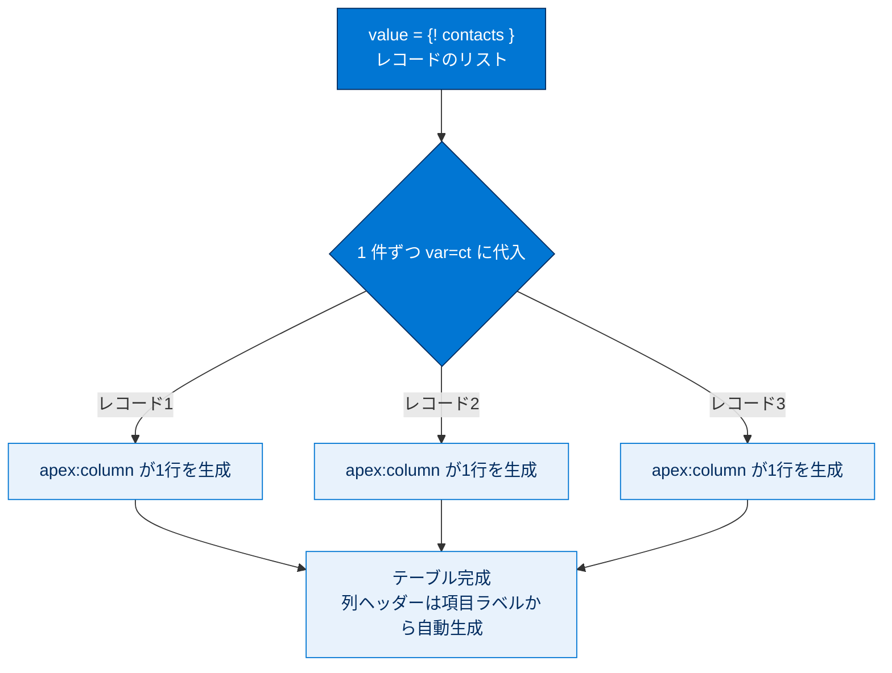
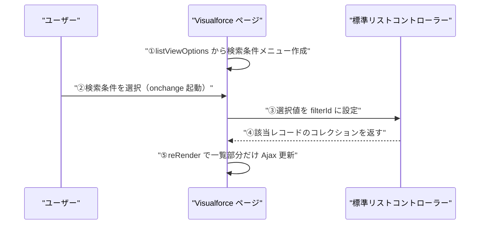

# 標準リストコントローラーの使用

## 学習の目的

この単元を完了すると、次のことができるようになります。

- Visualforce 標準リストコントローラーとは何か、標準 (レコード) コントローラーとの違いは何かを説明する。
- 標準リストコントローラーで提供される、標準コントローラーとは異なるアクションを 3 つ挙げる。
- Visualforce ページで標準リストコントローラーを使用して、レコードのリストを表示する。
- ページネーションを定義して Visualforce ページに追加する。

> [!ポイント] この単元のゴール
>
> 「標準（レコード）コントローラーが**1 件のレコード**を扱うのに対し、標準リストコントローラーは**レコードの集合（リスト）**を扱う」が核心。`recordSetVar` 属性、反復コンポーネント、リストビュー検索条件、ページネーション（`Next` / `Previous` / `First` / `Last`）を押さえれば試験対策は十分です。

> [!用語] 標準リストコントローラー（Standard List Controller）
>
> 同じ種類のレコードを**まとめて取得・表示**できる、Salesforce が自動で用意するコントローラー。1 件を扱う標準（レコード）コントローラーに対し、複数件のコレクションを扱い、絞り込み・ページネーションなどを**コードなし**で提供します。

---

## 標準リストコントローラーの概要

標準リストコントローラーを使うと、レコードセットを表示・操作する Visualforce ページをマークアップのみで作成できます。クエリ、コレクション変数への読み込み、結果の絞り込み、ページネーションを自動で備えます。標準（レコード）コントローラーと書き方は似ていますが、一度に多数のレコードを操作する点が異なります。

> [!例] 2 種類のコントローラーの違いを比べる
>
> | 比較項目 | 標準（レコード）コントローラー | 標準リストコントローラー |
> | --- | --- | --- |
> | 扱う件数 | 1 件のレコード | レコードの集合（リスト） |
> | ページ宣言 | `standardController="Contact"` | `standardController="Contact"` ＋ `recordSetVar="contacts"` |
> | 主な用途 | 1 件の表示・編集・保存 | 一覧表示・絞り込み・ページ送り |
> | 代表的なアクション | `save` / `edit` / `delete` / `cancel` | `next` / `previous` / `first` / `last` |

---

## レコードのリストを表示する

標準リストコントローラーはレコードのコレクションを変数に読み込むため、表示には反復コンポーネントが必要です。反復コンポーネントはコレクションをループし、各レコードに対してテンプレートに基づく出力を生成します。

> [!用語] 反復コンポーネント／`recordSetVar` 属性
>
> - **反復コンポーネント**：レコードのコレクションを**1 件ずつループ**し、同じテンプレートを繰り返し出力する（`<apex:pageBlockTable>`、`<apex:dataTable>`、`<apex:dataList>`、`<apex:repeat>`）。
> - **`recordSetVar`**：取得したコレクションを入れる**変数名**を指定する属性。`recordSetVar="contacts"` で `{! contacts }` としてリストを参照できる（命名は複数形が慣例）。

> [!手順] レコードのリストを表示するページを作成する
>
> 1. 開発者コンソールで **[File] | [New] | [Visualforce Page]** をクリックし、ページ名に `ContactList` と入力します。
> 2. マークアップを次のように置き換え、プレビューで取引先責任者のリストを確認します。
>
>     ```html
>     <apex:page standardController="Contact" recordSetVar="contacts">
>         <apex:pageBlock title="Contacts List">
>             <!-- Contacts List -->
>             <apex:pageBlockTable value="{! contacts }" var="ct">
>                 <apex:column value="{! ct.FirstName }"/>
>                 <apex:column value="{! ct.LastName }"/>
>                 <apex:column value="{! ct.Email }"/>
>                 <apex:column value="{! ct.Account.Name }"/>
>             </apex:pageBlockTable>
>         </apex:pageBlock>
>     </apex:page>
>     ```

`<apex:page>` で `standardController`（対象オブジェクト）と `recordSetVar`（コレクション変数名 `{! contacts }`）を設定します。`<apex:pageBlockTable>` の `value` にリスト変数を、`var` に 1 件ずつ取り出す変数（`ct`）を指定し、各レコードに `<apex:column>` の行を生成します。列ヘッダーは項目の表示ラベルから自動生成されます。

> [!例] `value` と `var` の関係を図でつかむ
>
> `value="{! contacts }"` が「ループ対象のリスト」、`var="ct"` が「1 件ずつ取り出した現在のレコード」を表します。



> [!ポイント] 代表的な反復コンポーネント
>
> | コンポーネント | 出力 |
> | --- | --- |
> | `<apex:pageBlockTable>` | プラットフォームスタイルの表 |
> | `<apex:dataTable>` | スタイルなしの素の HTML 表 |
> | `<apex:dataList>` | 箇条書きリスト |
> | `<apex:repeat>` | 任意の HTML / マークアップを繰り返す（最も自由度が高い） |

---

## リストにリストビューの検索条件を追加する

`{! listViewOptions }` でオブジェクトの利用可能なリストビュー検索条件を取得し、`{! filterId }` で結果に使う検索条件を設定します。リストビュー検索条件は宣言的（クリック）操作で作成でき、ページで利用できます。

> [!用語] リストビュー検索条件（List View Filter）
>
> Salesforce 上でクリック操作（宣言的）で作る「絞り込み条件」。たとえば「今月作成した取引先責任者だけ」のビューを定義し、`filterId` に設定すると、その条件に合うレコードだけが表示されます。

> [!手順] 検索条件メニューを追加する
>
> 1. `<apex:pageBlock>` 全体を `<apex:form>` でラップします（検索条件の変更にはサーバー送信が必要）。
> 2. `<apex:pageBlock>` に Ajax 用の `id="contacts_list"` を追加します。
> 3. `<apex:pageBlockTable>` の上に検索条件メニューを追加し、ページを次のようにします。
>
>     ```html
>     <apex:page standardController="Contact" recordSetVar="contacts">
>         <apex:form>
>             <apex:pageBlock title="Contacts List" id="contacts_list">
>                 Filter:
>                 <apex:selectList value="{! filterId }" size="1">
>                     <apex:selectOptions value="{! listViewOptions }"/>
>                     <apex:actionSupport event="onchange" reRender="contacts_list"/>
>                 </apex:selectList>
>                 <!-- Contacts List -->
>                 <apex:pageBlockTable value="{! contacts }" var="ct">
>                     <apex:column value="{! ct.FirstName }"/>
>                     <apex:column value="{! ct.LastName }"/>
>                     <apex:column value="{! ct.Email }"/>
>                     <apex:column value="{! ct.Account.Name }"/>
>                 </apex:pageBlockTable>
>             </apex:pageBlock>
>         </apex:form>
>     </apex:page>
>     ```

メニューで検索条件を変えると、ページ全体を再読み込みせずリストだけが更新されます。これは `<apex:actionSupport>` の `reRender="contacts_list"` によるもので、`id="contacts_list"` の `<apex:pageBlock>` のみ更新されます。

> [!用語] Ajax / `reRender` / `<apex:actionSupport>`
>
> - **Ajax / `reRender`**：ページ全体を再読み込みせず**一部分だけを更新**する仕組み。`reRender` に更新したい領域の `id` を指定すると、その領域だけ書き換わり画面がちらつかない。
> - **`<apex:actionSupport>`**：別のコンポーネントに「イベント発生時にアクションを実行する」機能を付け足す。`event="onchange"` で値が変わると自動でサーバー送信し `reRender` で領域を更新する。

この機能のライフサイクル：① `{! listViewOptions }` から検索条件メニューが作成される → ② 選択すると `onchange` が起動 → ③ 選択値が `filterId` に設定される → ④ 新しい該当レコードのコレクションが返る → ⑤ Ajax で一部分だけ更新される。



---

## ページネーションをリストに追加する

ページネーション機能で長いリストを 1「ページ」ずつ表示できます。標準リストコントローラーは既定で検索条件に一致する最初の 20 件のみを表示します。

> [!ポイント] 標準リストコントローラーの既定ページサイズは 20 件
>
> 何も指定しないと**最初の 20 件**だけを表示します（試験頻出の数値）。1 ページの件数は `PageSize` プロパティで変更できます。

> [!用語] ページネーション（Pagination）
>
> 大量のレコードを「ページ」単位に区切り、[次へ] / [前へ] などのリンクで少しずつ表示する仕組み。全件を一度に読み込むとパフォーマンスが悪化するため、必要な分だけ表示する標準的な UI パターンです。

> [!手順] ページネーションコントロールを追加する
>
> `</apex:pageBlockTable>` の下に、3 つのコントロールを収める HTML テーブルを置き、各コメント部を以下のマークアップで置き換えます。
>
> ```html
> <!-- Pagination -->
> <table style="width: 100%">
>     <tr>
>         <td>
>             Page: <apex:outputText value=" {!PageNumber} of {! CEILING(ResultSize / PageSize) }"/>
>         </td>
>         <td align="center">
>             <!-- Previous page: active / inactive -->
>             <apex:commandLink action="{! Previous }" value="« Previous"
>                  rendered="{! HasPrevious }"/>
>             <apex:outputText style="color: #ccc;" value="« Previous"
>                  rendered="{! NOT(HasPrevious) }"/>
>             <!-- Next page: active / inactive -->
>             <apex:commandLink action="{! Next }" value="Next »"
>                  rendered="{! HasNext }"/>
>             <apex:outputText style="color: #ccc;" value="Next »"
>                  rendered="{! NOT(HasNext) }"/>
>         </td>
>         <td align="right">
>             Records per page:
>             <apex:selectList value="{! PageSize }" size="1">
>                 <apex:selectOption itemValue="5" itemLabel="5"/>
>                 <apex:selectOption itemValue="20" itemLabel="20"/>
>                 <apex:actionSupport event="onchange" reRender="contacts_list"/>
>             </apex:selectList>
>         </td>
>     </tr>
> </table>
> ```

進行状況インジケーター（`Page X of Y`）は `PageNumber` / `ResultSize` / `PageSize` を使い、`CEILING()` で総ページ数を切り上げます。`<apex:commandLink>` は `Previous` / `Next` アクションを参照し、`rendered` に `HasPrevious` / `HasNext` を使うことで、その方向にレコードが無いときはグレー表示の `<apex:outputText>` になります。件数メニューは `<apex:selectList>` で `PageSize` を設定します。

> [!用語] 標準リストコントローラーの主なプロパティ
>
> `PageNumber`（現在のページ番号）、`ResultSize`（全件数）、`PageSize`（1 ページの件数）、`HasNext` / `HasPrevious`（その方向にまだレコードがあるかを示す Boolean）。`rendered` 属性はコンポーネントを**条件付きで表示／非表示**にします。

> [!例] `CEILING()` で総ページ数を出す理由
>
> 全 25 件・1 ページ 20 件のとき `25 ÷ 20 = 1.25` ページとなり意味が通りません。`CEILING(1.25)` で切り上げて **2** にすると、「全 2 ページ（20 件＋5 件）」という正しい総ページ数になります。

---

## もうひとこと...

`Previous` / `Next` に加え、リストの先頭・末尾に移動する `First` / `Last` アクションもあります。マークアップで操作する標準リストコントローラーは `StandardSetController` Apex クラスに基づきます。

> [!用語] `StandardSetController`（標準セットコントローラー）
>
> 標準リストコントローラーの実体となる Apex クラス。レコードの集合（セット）に対するクエリ、ページネーション、選択などの機能を提供します。カスタムコントローラーやコントローラー拡張から使うと、自前でリスト処理を組み立てられます。

なお、この例には並び替えの問題があります。Visualforce 単独で並び替え順を変更することはできず、クリック可能な列ヘッダーや並び替えには追加のマークアップと Apex のカスタムコードが必要です。

---

## 試験対策：押さえておきたい追加ポイント

> [!ポイント] 標準リストコントローラーの頻出ポイント
>
> - ページ宣言は `standardController="..."` ＋ **`recordSetVar="..."`**。`recordSetVar` を付けると単一レコードから「レコードの集合」に切り替わる。
> - **既定の表示件数は 20 件**。`PageSize` で変更可能。
> - リスト固有アクション：**`next` / `previous` / `first` / `last`**（標準コントローラーには無い）。
> - 主なプロパティ：`PageNumber` / `ResultSize` / `PageSize` / `HasNext` / `HasPrevious` / `filterId` / `listViewOptions`。
> - 並び替えは Visualforce 単独ではできず、**Apex（カスタムコード）が必要**。
> - リストの実体は **`StandardSetController`** クラス。

> [!注意] よくある落とし穴
>
> - `recordSetVar` を書き忘れると、リストではなく単一レコードのコントローラーになる。
> - 検索条件の切り替えやページ送りはサーバー送信を伴うため、コントロール類は **`<apex:form>` の内側**に置く必要がある。

---

## リソース

- Visualforce 開発者ガイド: Standard Controllers / Standard List Controllers
- Visualforce 開発者ガイド: Create a Custom List View in Salesforce Classic
- Visualforce 開発者ガイド: apex:outputLink / apex:repeat コンポーネント
- Apex リファレンスガイド: StandardController / StandardSetController クラス
- Salesforce 開発者ブログ: Twitter Bootstrap and Visualforce in Minutes

---

## ハンズオン Challenge（+500 ポイント）

> [!まとめ] あなたの Challenge：レコードページにリンクされた取引先のリストを表示する Visualforce ページを作成する
>
> それぞれのレコードページにリンクされた取引先名のリストを表示するには、標準リストコントローラーを使用してください。
>
> **Challenge の要件**
> 新しい Visualforce ページを作成する:
> - 表示ラベル：`AccountList`
> - 名前：`AccountList`
> - 標準コントローラー：`Account`
> - ページに値が `accounts` の `recordSetVar` 属性がある
> - 次の特性を持つ **1 つの Visualforce `apex:repeat` コンポーネント**がある
>   - `var` 属性を `a` に設定する。
>   - `<li>` リスト品目 HTML 要素を `apex:repeat` コンポーネントにネストする。
>   - `apex:outputLink` コンポーネントを `<li>` 要素にネストする。
>
> **ヒント**：レコード詳細ページの URL にリンクするには、`apex:outputLink` の `value` 属性を `/{!a.id}` に設定します。

> [!注意] 日本語環境で受講する場合
>
> Challenge は日本語の Trailhead Playground で開始し、かっこ内の翻訳を参照しながら進めてください。評価は英語データに対して行われるため、**英語の値のみ**をコピー&ペーストします。不合格時は、(1) [Locale] を [United States]、(2) [Language] を [English] に切り替え、(3) [Check Challenge] をクリックすると通ることがあります。

---

## 🎓 この単元のまとめ

この単元では、**レコードの集合（リスト）**を扱う標準リストコントローラーと、`recordSetVar`・反復コンポーネント・リストビュー検索条件・ページネーションを学びました。

次の表は、標準（レコード）コントローラーとの違いを軸に要点を凝縮したものです。

| 観点 | 標準（レコード）コントローラー | 標準リストコントローラー |
| --- | --- | --- |
| 扱う件数 | 1 件 | レコードの集合（リスト） |
| ページ宣言 | `standardController="..."` | ＋ **`recordSetVar="..."`** |
| 主なアクション | `save` `edit` `delete` `cancel` | **`next` `previous` `first` `last`** |
| 既定表示件数 | — | **20 件**（`PageSize` で変更） |
| 主なプロパティ | — | `PageNumber` `ResultSize` `HasNext` `HasPrevious` `filterId` |

> [!まとめ] この単元の要点
>
> - **`recordSetVar="..."`** を付けると単一レコードから「レコードの集合」に切り替わる（命名は複数形が慣例）。
> - リストの表示には **反復コンポーネント**（`<apex:pageBlockTable>` など）が必須。`value` にリスト、`var` に 1 件ずつの変数を指定。
> - リスト固有アクションは **`next` / `previous` / `first` / `last`**（標準コントローラーには無い）。
> - **既定の表示件数は 20 件**。`PageSize` で変更し、`HasNext` / `HasPrevious` でボタンの活性を制御、`CEILING(ResultSize/PageSize)` で総ページ数を出す。
> - **リストビュー検索条件**は `listViewOptions` / `filterId`、Ajax 更新は `<apex:actionSupport>` の `reRender`。
> - 並び替えは **Visualforce 単独では不可**（Apex が必要）。リストの実体は **`StandardSetController`**。

> [!豆知識] なぜ既定が「20 件」なのか
>
> 標準リストコントローラーが何も指定しないと **最初の 20 件**だけを返すのは、全件を一度に読み込んでブラウザーとサーバーに負荷をかけないための安全弁です。`PageSize` は最大 **10,000 件**まで設定できますが、件数を増やすほど表示は重くなります。大量データはページネーションで小分けにするのが定石、という設計思想が既定値に表れています。
